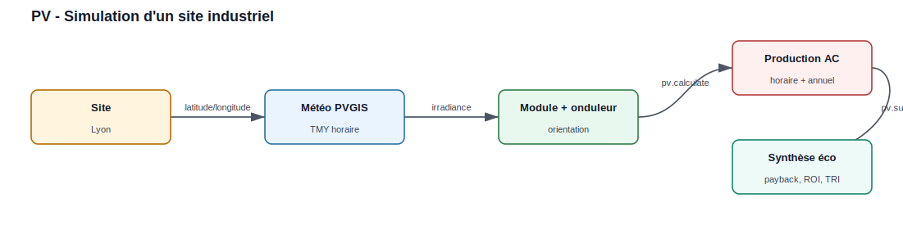
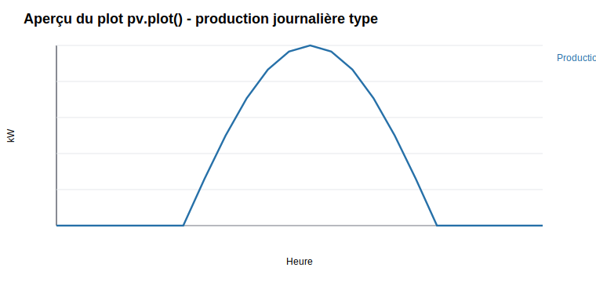
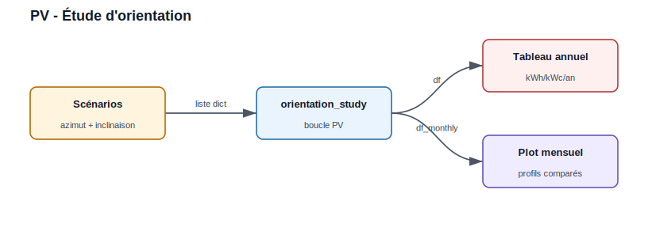
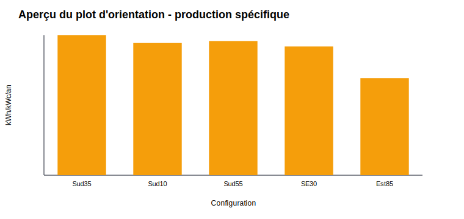

Production Photovoltaïque — Exemples
======================================

Exemple 1 : Simulation site industriel
----------------------------------------

   Le site fournit la localisation, PVGIS fournit la météo, puis pvlib calcule
   la production horaire et la synthèse économique.

.. code-block:: python

   from PV.ProductionElectriquePV import SolarSystem

   pv = SolarSystem(
       latitude=45.75, longitude=4.85,
       name='Lyon', altitude=200,
       timezone='Europe/Paris',
       azimut=180, inclinaison=35
   )

   pv.retrieve_module_inverter_data(
       module_name='Canadian_Solar_CS5P_220M___2009_',
       inverter_name='ABB__MICRO_0_25_I_OUTD_US_208__208V_',
       temperature_model='open_rack_glass_glass'
   )

   pv.calculate_solar_parameters()
   print(pv.df)

   # Synthese economique
   print(pv.summary(
       nb_modules=455, module_wc=220,
       capex_eur_m2=155, opex_eur_m2=2,
       tarif_elec_eur_mwh=120, duree_vie=25
   ))

   # Graphique production horaire + mensuelle
   pv.plot(nb_modules=455)

   # Export Excel
   pv.to_excel('Lyon_production.xlsx', nb_modules=455)

Résultats à afficher dans le rapport :

.. list-table::
   :widths: 45 35 20
   :header-rows: 1

   * - Indicateur
     - Exemple de valeur
     - Unité
   * - Puissance installée
     - 100
     - kWc
   * - Surface capteurs
     - environ 774
     - m2
   * - Production spécifique
     - environ 1 397
     - kWh/kWc/an
   * - Production annuelle
     - environ 140
     - MWh/an

Plots prévus par l'exemple :

* ``pv.plot(nb_modules=455)`` affiche la production horaire AC et le profil
  mensuel.
* ``pv.to_excel(...)`` exporte les données horaires, mensuelles et la synthèse.

   Aperçu de la forme attendue : puissance AC nulle la nuit, maximum autour du
   milieu de journée, puis cumul mensuel dans le plot généré par ``pv.plot``.

Exemple 2 : Étude paramétrique d'orientation
----------------------------------------------

   Chaque scénario d'orientation est simulé, puis comparé dans un tableau
   annuel et un graphe mensuel.

.. code-block:: python

   scenarios = [
       {'nom': 'Sud 35', 'azimut': 180, 'inclinaison': 35},
       {'nom': 'Sud 10', 'azimut': 180, 'inclinaison': 10},
       {'nom': 'Sud 55', 'azimut': 180, 'inclinaison': 55},
       {'nom': 'SE 30', 'azimut': 135, 'inclinaison': 30},
       {'nom': 'Est 85', 'azimut': 90, 'inclinaison': 85},
   ]

   df, df_monthly = SolarSystem.orientation_study(
       latitude=45.75, longitude=4.85,
       name='Lyon', altitude=200, timezone='Europe/Paris',
       scenarios=scenarios
   )
   print(df)

   # Graphique mensuel par orientation
   SolarSystem.plot_orientation_study(df, df_monthly, name='Lyon')

Résultat attendu :

.. list-table::
   :widths: 35 20 20 25
   :header-rows: 1

   * - Configuration
     - Azimut
     - Inclinaison
     - Résultat affiché
   * - Sud 35
     - 180 deg
     - 35 deg
     - scénario de référence
   * - Sud 10
     - 180 deg
     - 10 deg
     - comparaison toiture faible pente
   * - SE 30
     - 135 deg
     - 30 deg
     - perte liée à l'orientation
   * - Est 85
     - 90 deg
     - 85 deg
     - profil plus matinal

Plot prévu par l'exemple :

* ``SolarSystem.plot_orientation_study(...)`` affiche les profils mensuels par
  scénario, avec la production annuelle dans la légende.

   Aperçu de comparaison : le tableau ``df`` donne le classement annuel et le
   plot mensuel montre la saisonnalité de chaque orientation.
