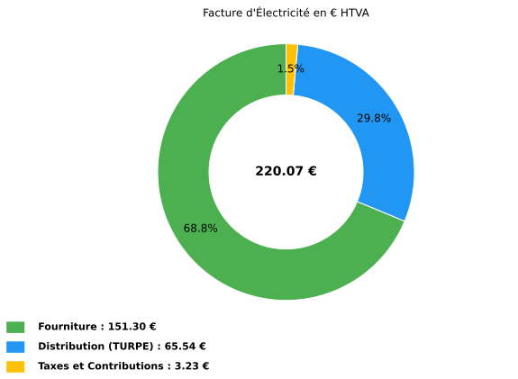
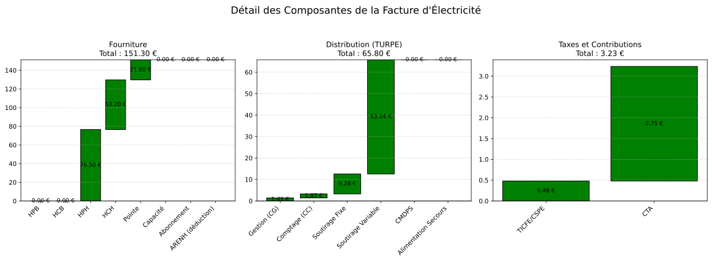

10.1.2.1. Exemple BT < 36 kVA -- CU4
--------------------------------------------

**Contexte** : Un petit commerce (boulangerie) raccorde en basse tension avec une
puissance souscrite de 12 kW. Facturation mensuelle de fevrier 2025.

.. code-block:: python

   from Facture.TURPE import input_Contrat, TurpeCalculator, input_Facture, input_Tarif

   # Contrat BT < 36 kVA, option CU4 (4 periodes)
   contrat = input_Contrat(
       domaine_tension="BT < 36 kVA",
       PS_pointe=12, PS_HPH=12, PS_HCH=12, PS_HPB=12, PS_HCB=12,
       version_utilisation="CU4",
       pourcentage_ENR=0,
   )

   # Tarifs fournisseur (prix unitaires en EUR/kWh)
   tarif = input_Tarif(
       c_euro_kWh_pointe=0.18,
       c_euro_kWh_HPH=0.17,
       c_euro_kWh_HCH=0.14,
       c_euro_kWh_HPB=0.16,
       c_euro_kWh_HCB=0.13,
   )

   # Consommations du mois (valeurs realistes pour une boulangerie)
   facture = input_Facture(
       start="2025-02-01",
       end="2025-02-28",
       kWh_pointe=120,      # Cuisson en pointe
       kWh_HPH=450,         # Heures pleines hiver
       kWh_HCH=380,         # Heures creuses hiver (nuit)
       kWh_HPB=0,           # Pas d'ete en fevrier
       kWh_HCB=0,
   )

   # Calcul
   calc = TurpeCalculator(contrat, tarif, facture)
   calc.calculate_turpe()

   # Resultats synthetiques
   print(calc.df_totaux)

   # Graphiques
   calc.plot()           # Repartition Fourniture / TURPE / Taxes
   calc.plot_detail()    # Cascades detaillees

**Sortie réelle (df_totaux)** :

.. code-block:: text

                        Ligne                    Formule Entrée(s) Coefficient  Résultat
                   Fourniture                                                    151.30
         Acheminement (TURPE)                                                     65.54
       Taxes et contributions                                                      3.23
                 = Total HTVA Fourniture + TURPE + Taxes                          220.07
                      TVA 20%           Total_HTVA x 20%                           44.01
                  = Total TTC                 HTVA + TVA                          264.08
          Coût HTVA (EUR/MWh)           Total_HTVA / MWh  0.95 MWh                231.65
    Coût fourniture (EUR/MWh)           Fourniture / MWh                          159.26
  Coût distribution (EUR/MWh)                TURPE / MWh                           68.99
         Coût taxes (EUR/MWh)                Taxes / MWh                            3.40

Les valeurs dépendent de la grille TURPE en vigueur pour la période facturée.

Plots générés par l'exemple
~~~~~~~~~~~~~~~~~~~~~~~~~~~

Les figures ci-dessous sont les sorties réelles de ``calc.plot()`` et
``calc.plot_detail()`` pour les données de l'exemple.

   Répartition HTVA entre fourniture, acheminement TURPE et taxes.

   Cascades détaillées par composante de fourniture, distribution et taxes.
