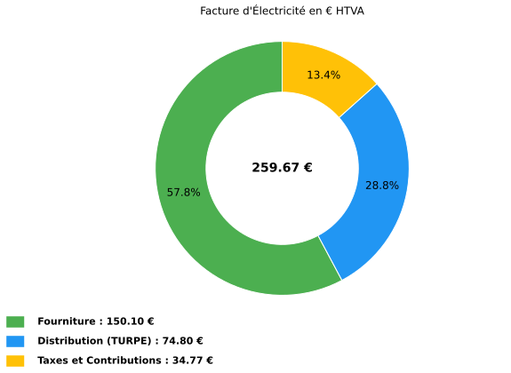
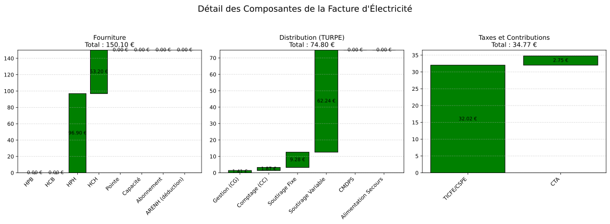

Exemple BT < 36 kVA — CU4
-------------------------

**Contexte** : une boulangerie raccordée en basse tension, puissance souscrite
12 kVA, option **CU4** (courte utilisation, quatre postes horosaisonniers).
On reconstitue sa facture de février 2025 : fourniture, acheminement TURPE,
taxes.

.. code-block:: python

   from Facture.TURPE import input_Contrat, TurpeCalculator, input_Facture, input_Tarif

   # Contrat BT < 36 kVA, option CU4
   contrat = input_Contrat(
       domaine_tension="BT < 36 kVA",
       PS_pointe=12, PS_HPH=12, PS_HCH=12, PS_HPB=12, PS_HCB=12,   # kVA
       version_utilisation="CU4",
       pourcentage_ENR=0,
   )

   # Prix du fournisseur (EUR/kWh HTVA)
   tarif = input_Tarif(
       c_euro_kWh_pointe=0.18,
       c_euro_kWh_HPH=0.17,
       c_euro_kWh_HCH=0.14,
       c_euro_kWh_HPB=0.16,
       c_euro_kWh_HCB=0.13,
   )

   # Consommations relevées sur le mois (kWh)
   facture = input_Facture(
       start="2025-02-01",
       end="2025-02-28",
       kWh_pointe=120,      # voir le piège n° 1 : CU4 n'a pas de poste pointe
       kWh_HPH=450,         # heures pleines hiver
       kWh_HCH=380,         # heures creuses hiver
       kWh_HPB=0,           # pas de saison basse en février
       kWh_HCB=0,
   )

   calc = TurpeCalculator(contrat, tarif, facture)
   calc.calculate_turpe()

   print(calc.df_totaux.to_string(index=False))

   calc.plot()           # répartition fourniture / TURPE / taxes
   calc.plot_detail()    # cascades détaillées

Sortie réelle :

.. code-block:: text

                         Ligne                    Formule Entrée(s) Coefficient  Résultat Annuel
                    Fourniture                                                     151.30
          Acheminement (TURPE)                                                      65.54
        Taxes et contributions                                                       3.23
                  = Total HTVA Fourniture + TURPE + Taxes                          220.07
                       TVA 20%           Total_HTVA x 20%                           44.01
                   = Total TTC                 HTVA + TVA                          264.08
           Coût HTVA (EUR/MWh)           Total_HTVA / MWh  0.95 MWh                231.65
     Coût fourniture (EUR/MWh)           Fourniture / MWh                          159.26
   Coût distribution (EUR/MWh)                TURPE / MWh                           68.99
          Coût taxes (EUR/MWh)                Taxes / MWh                            3.40

Le site paie 231,65 EUR HTVA par MWh, dont 69 EUR/MWh d'acheminement : sur un
petit site, la part réseau pèse près d'un tiers de la facture HTVA.

Figures produites par l'exemple
~~~~~~~~~~~~~~~~~~~~~~~~~~~~~~~

Les figures ci-dessous sont les tracés de ``calc.plot()`` et
``calc.plot_detail()`` pour les données de l'exemple.

   Répartition HTVA entre fourniture, acheminement TURPE et taxes.

   Cascades détaillées par composante de fourniture, distribution et taxes.

Paramètres à personnaliser
~~~~~~~~~~~~~~~~~~~~~~~~~~

.. list-table::
   :widths: 25 45 30
   :header-rows: 1

   * - Entrée
     - Effet
     - Plage usuelle
   * - ``PS_HPH`` … ``PS_HCB``
     - Puissance souscrite (kVA) : fixe la part fixe CS (b × PS)
     - 3 à 36 kVA
   * - ``version_utilisation``
     - ``"CU4"`` (4 postes) ou ``"CU"`` (sans différenciation) — seules grilles BT < 36 kVA livrées
     - ``"CU4"``, ``"CU"``
   * - ``c_euro_kWh_<poste>``
     - Prix de fourniture du contrat, par poste
     - 0,10 à 0,25 EUR/kWh
   * - ``kWh_HPH``, ``kWh_HCH``, ``kWh_HPB``, ``kWh_HCB``
     - Consommations relevées ; saison haute = novembre à mars
     - selon la facture
   * - ``c_euro_kwh_CSPE_TICFE``
     - Accise sur l'électricité ; ``None`` = taux de la grille (voir piège n° 2)
     - taux légal en vigueur
   * - ``start``, ``end``
     - Période facturée ; doit tomber entière dans une grille livrée
     - 2025-02-01 à 2025-12-31 pour cette option

Variante : reporter la pointe sur les heures pleines
~~~~~~~~~~~~~~~~~~~~~~~~~~~~~~~~~~~~~~~~~~~~~~~~~~~~

La grille CU4 n'a que quatre postes : les 120 kWh saisis en « pointe » sont
facturés en fourniture mais **ignorés par le TURPE**. On les reporte sur les
heures pleines d'hiver, tout le reste identique.

.. code-block:: python

   # variante : 4 postes seulement — la pointe est reportée en HPH
   facture_4p = input_Facture(
       start="2025-02-01", end="2025-02-28",
       kWh_pointe=0, kWh_HPH=450 + 120, kWh_HCH=380,
   )
   calc_4p = TurpeCalculator(contrat, tarif, facture_4p)
   calc_4p.calculate_turpe()

   for nom, c in (("pointe saisie", calc), ("pointe reportée en HPH", calc_4p)):
       print(f"{nom:24s} fourniture {c.euro_fourniture:7.2f}  "
             f"TURPE {c.euro_TURPE:6.2f}  HTVA {c.euro_total:7.2f} EUR")

Sortie réelle :

.. code-block:: text

   pointe saisie            fourniture  151.30  TURPE  65.54  HTVA  220.07 EUR
   pointe reportée en HPH   fourniture  150.10  TURPE  74.54  HTVA  227.87 EUR

Les 120 kWh passent au coefficient HPH de la composante de soutirage
(0,075 EUR/kWh) : **+9,00 EUR de TURPE** que la première saisie oubliait.

Pièges
~~~~~~

1. **Pas de poste pointe en BT < 36 kVA.** Les grilles BT n'ont que quatre
   coefficients ; ``kWh_pointe`` y est payé au fournisseur mais pas au réseau.
   Dans ``calc.df_acheminement``, les libellés des lignes « CS Variable » sont
   alors décalés d'un poste (défaut consigné dans ``BUGS_LIB.md``) : fiez-vous
   aux montants, pas aux libellés.
2. **Accise.** Sans ``c_euro_kwh_CSPE_TICFE``, le taux porté par la grille
   s'applique (0,0005 EUR/kWh ici) : comparez-le à la ligne accise de votre
   facture et saisissez le bon. Le total HTVA applique alors le taux saisi,
   mais la ligne « Taxes et contributions » garde celui de la grille (défaut
   consigné dans ``BUGS_LIB.md``).
3. **Période hors grille.** Une facture de 2026 ou à cheval sur deux grilles
   lève ``AttributeError: 'NoneType' object has no attribute 'get'`` : aucune
   grille ne couvre la période entière.

Voir aussi : :doc:`../contrat_electricite` (toutes les entrées et les grilles
livrées), :doc:`exemple_bt_p36_cu`.
