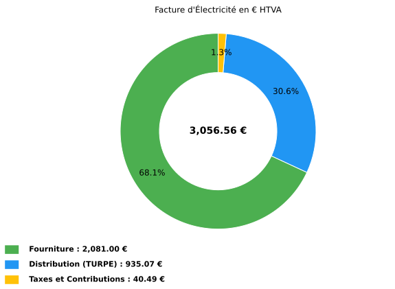
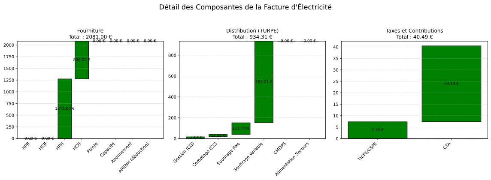

10.1.2.2. Exemple BT > 36 kVA -- CU
--------------------------------------------

**Contexte** : Un supermarche de taille moyenne raccorde en basse tension avec une
puissance souscrite de 80 kW. Facturation mensuelle de janvier 2025.

.. code-block:: python

   from Facture.TURPE import input_Contrat, TurpeCalculator, input_Facture, input_Tarif

   # Contrat BT > 36 kVA, option CU (Courte Utilisation)
   contrat = input_Contrat(
       domaine_tension="BT > 36 kVA",
       PS_pointe=0,          # Pas de pointe en BT > 36
       PS_HPH=80, PS_HCH=80, PS_HPB=80, PS_HCB=80,
       version_utilisation="CU",
       pourcentage_ENR=0,
   )

   # Tarifs fournisseur
   tarif = input_Tarif(
       c_euro_kWh_HPH=0.15,
       c_euro_kWh_HCH=0.13,
       c_euro_kWh_HPB=0.14,
       c_euro_kWh_HCB=0.12,
   )

   # Consommations realistes pour un supermarche (froid, eclairage, climatisation)
   facture = input_Facture(
       start="2025-01-01",
       end="2025-01-31",
       kWh_HPH=8500,        # Heures pleines hiver
       kWh_HCH=6200,        # Heures creuses hiver
       kWh_HPB=0,            # Pas d'ete en janvier
       kWh_HCB=0,
   )

   calc = TurpeCalculator(contrat, tarif, facture)
   calc.calculate_turpe()

   # Resultats
   print(calc.df_totaux)

   calc.plot()
   calc.plot_detail()

**Sortie réelle (df_totaux)** :

.. code-block:: text

                        Ligne                    Formule Entrée(s) Coefficient  Résultat
                   Fourniture                                                   2081.00
         Acheminement (TURPE)                                                    935.07
       Taxes et contributions                                                     40.49
                 = Total HTVA Fourniture + TURPE + Taxes                        3056.56
                      TVA 20%           Total_HTVA x 20%                         611.31
                  = Total TTC                 HTVA + TVA                        3667.87
          Coût HTVA (EUR/MWh)           Total_HTVA / MWh 14.70 MWh               207.93
    Coût fourniture (EUR/MWh)           Fourniture / MWh                         141.56
  Coût distribution (EUR/MWh)                TURPE / MWh                          63.61
         Coût taxes (EUR/MWh)                Taxes / MWh                           2.75

Plots générés par l'exemple
~~~~~~~~~~~~~~~~~~~~~~~~~~~

Les figures ci-dessous sont les sorties réelles de ``calc.plot()`` et
``calc.plot_detail()`` pour les données de l'exemple.

   Répartition HTVA entre fourniture, acheminement TURPE et taxes.

   Cascades détaillées par composante de fourniture, distribution et taxes.
