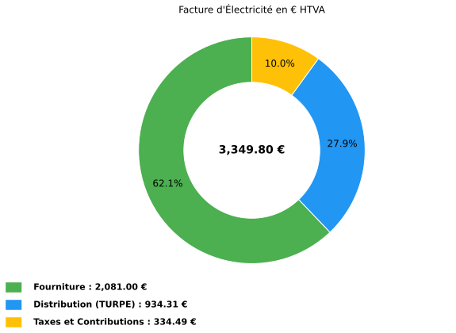
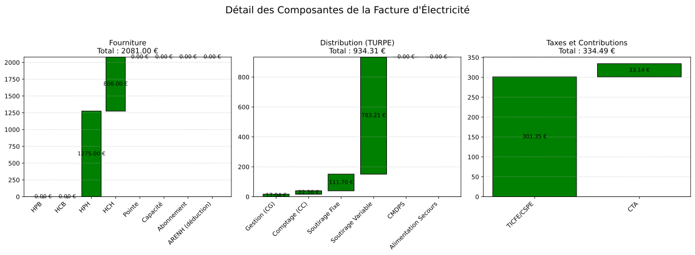

Exemple BT > 36 kVA — CU
------------------------

**Contexte** : un supermarché de taille moyenne raccordé en basse tension,
puissance souscrite 80 kVA, option **CU** (courte utilisation). On reconstitue
sa facture de janvier 2025.

.. code-block:: python

   from Facture.TURPE import input_Contrat, TurpeCalculator, input_Facture, input_Tarif

   # Contrat BT > 36 kVA, option CU
   contrat = input_Contrat(
       domaine_tension="BT > 36 kVA",
       PS_pointe=0,          # pas de poste pointe en BT > 36 kVA
       PS_HPH=80, PS_HCH=80, PS_HPB=80, PS_HCB=80,   # kVA
       version_utilisation="CU",
       pourcentage_ENR=0,
   )

   # Prix du fournisseur (EUR/kWh HTVA)
   tarif = input_Tarif(
       c_euro_kWh_HPH=0.15,
       c_euro_kWh_HCH=0.13,
       c_euro_kWh_HPB=0.14,
       c_euro_kWh_HCB=0.12,
   )

   # Consommations du mois (froid, éclairage, climatisation)
   facture = input_Facture(
       start="2025-01-01",
       end="2025-01-31",
       kWh_HPH=8500,         # heures pleines hiver
       kWh_HCH=6200,         # heures creuses hiver
       kWh_HPB=0,            # pas de saison basse en janvier
       kWh_HCB=0,
   )

   calc = TurpeCalculator(contrat, tarif, facture)
   calc.calculate_turpe()

   print(calc.df_totaux.to_string(index=False))

   calc.plot()
   calc.plot_detail()

Sortie réelle :

.. code-block:: text

                         Ligne                    Formule Entrée(s) Coefficient  Résultat Annuel
                    Fourniture                                                    2081.00
          Acheminement (TURPE)                                                     935.07
        Taxes et contributions                                                      40.49
                  = Total HTVA Fourniture + TURPE + Taxes                         3056.56
                       TVA 20%           Total_HTVA x 20%                          611.31
                   = Total TTC                 HTVA + TVA                         3667.87
           Coût HTVA (EUR/MWh)           Total_HTVA / MWh 14.70 MWh                207.93
     Coût fourniture (EUR/MWh)           Fourniture / MWh                          141.56
   Coût distribution (EUR/MWh)                TURPE / MWh                           63.61
          Coût taxes (EUR/MWh)                Taxes / MWh                            2.75

Figures produites par l'exemple
~~~~~~~~~~~~~~~~~~~~~~~~~~~~~~~

Les figures ci-dessous sont les tracés de ``calc.plot()`` et
``calc.plot_detail()`` pour les données de l'exemple.

   Répartition HTVA entre fourniture, acheminement TURPE et taxes.

   Cascades détaillées par composante de fourniture, distribution et taxes.

Paramètres à personnaliser
~~~~~~~~~~~~~~~~~~~~~~~~~~

.. list-table::
   :widths: 25 45 30
   :header-rows: 1

   * - Entrée
     - Effet
     - Plage usuelle
   * - ``PS_HPH`` … ``PS_HCB``
     - Puissances souscrites par poste, **croissantes** (HPH ≤ HCH ≤ HPB ≤ HCB)
     - 36 à 250 kVA
   * - ``version_utilisation``
     - ``"CU"`` (courte utilisation) ou ``"LU"`` (longue utilisation)
     - ``"CU"``, ``"LU"``
   * - ``heures_depassement``
     - Heures de dépassement de la puissance souscrite (composante CMDPS)
     - 0 à quelques dizaines
   * - ``c_euro_kWh_<poste>``
     - Prix de fourniture du contrat
     - 0,10 à 0,25 EUR/kWh
   * - ``start``, ``end``
     - Période facturée, entière dans une grille livrée
     - 2014-01-01 à 2029-07-31

Variante : même site en longue utilisation (LU)
~~~~~~~~~~~~~~~~~~~~~~~~~~~~~~~~~~~~~~~~~~~~~~~

La version LU échange une part puissance plus chère contre une part énergie
moins chère. On compare les deux options sur le même mois.

.. code-block:: python

   # variante : option LU au lieu de CU, consommations identiques
   contrat_lu = input_Contrat(
       domaine_tension="BT > 36 kVA",
       PS_pointe=0, PS_HPH=80, PS_HCH=80, PS_HPB=80, PS_HCB=80,
       version_utilisation="LU",
   )
   calc_lu = TurpeCalculator(contrat_lu, tarif, facture)
   calc_lu.calculate_turpe()

   for nom, c in (("CU", calc), ("LU", calc_lu)):
       print(f"{nom}: CS fixe annuel {c.euro_an_CS_fixe:8.2f} EUR/an  "
             f"CS variable {c.euro_CS_variable:7.2f}  TURPE du mois {c.euro_TURPE:7.2f} EUR")

Sortie réelle :

.. code-block:: text

   CU: CS fixe annuel  1315.20 EUR/an  CS variable  783.21  TURPE du mois  935.07 EUR
   LU: CS fixe annuel  2148.00 EUR/an  CS variable  663.56  TURPE du mois  886.15 EUR

En janvier, LU coûte 48,92 EUR de moins : la part énergie baisse de 119,65 EUR,
la part fixe monte de 832,80 EUR/an (70,73 EUR sur 31 jours). Le choix se fait
**sur douze mois de relevés**, pas sur un seul : relancez la comparaison avec
vos consommations d'été, où la part énergie pèse moins.

Pièges
~~~~~~

1. **Puissances croissantes.** Le calcul applique ``b1 × (PS_HCH − PS_HPH)`` :
   une puissance souscrite plus faible sur un poste suivant donne une part fixe
   négative, sans avertissement.
2. **Accise.** Sans ``c_euro_kwh_CSPE_TICFE``, le taux porté par la grille
   s'applique (0,0005 EUR/kWh ici) : comparez-le à la ligne accise de votre
   facture et saisissez le bon. Le total HTVA applique alors le taux saisi,
   mais la ligne « Taxes et contributions » garde celui de la grille (défaut
   consigné dans ``BUGS_LIB.md``).
3. **Période hors grille.** Une facture à cheval sur deux grilles (par exemple
   du 15 janvier au 14 février 2025) n'est couverte par aucune et lève
   ``AttributeError`` : découpez-la.

Voir aussi : :doc:`../contrat_electricite`, :doc:`exemple_bt_m36_cu4`.
