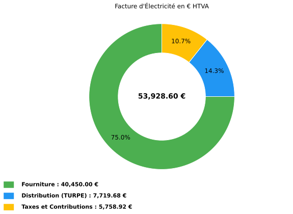
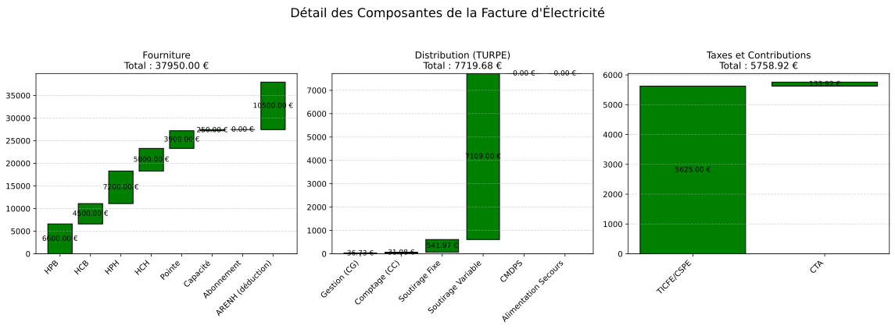

Exemple HTA — CU à pointe fixe
------------------------------

**Contexte** : un site industriel agroalimentaire raccordé en HTA (20 kV),
option **CU_pf** (courte utilisation, pointe fixe), puissance souscrite 500 kW
sur les cinq postes. Facture de février 2025, fourniture sur un contrat de
marché avec capacité, garantie d'origine et part ARENH.

.. code-block:: python

   from Facture.TURPE import input_Contrat, TurpeCalculator, input_Facture, input_Tarif

   # Contrat HTA CU_pf — 500 kW sur les cinq postes
   contrat = input_Contrat(
       domaine_tension="HTA",
       PS_pointe=500, PS_HPH=500, PS_HCH=500, PS_HPB=500, PS_HCB=500,   # kW
       version_utilisation="CU_pf",
       pourcentage_ENR=100,      # garanties d'origine sur toute la consommation
   )

   # Prix du fournisseur (EUR/kWh HTVA)
   tarif = input_Tarif(
       c_euro_kWh_pointe=0.13,
       c_euro_kWh_HPH=0.12,
       c_euro_kWh_HCH=0.10,
       c_euro_kWh_HPB=0.11,
       c_euro_kWh_HCB=0.09,
       c_euro_kWh_certif_capacite_pointe=0.001,
       c_euro_kWh_certif_capacite_HPH=0.001,
       c_euro_kWh_certif_capacite_HCH=0.001,
       c_euro_kWh_certif_capacite_HPB=0.001,
       c_euro_kWh_certif_capacite_HCB=0.001,
       c_euro_kWh_ENR=0.01,       # appliqué à pourcentage_ENR % des kWh
       c_euro_kWh_ARENH=0.042,    # appliqué à tous les kWh
       c_euro_kwh_CSPE_TICFE=0.02250,   # accise « haute puissance » (> 250 kVA), 02/2025
   )

   # Consommations (kWh) — les cinq postes sont renseignés pour exercer
   # toute la grille, même si HPB/HCB relèvent de la saison basse
   facture = input_Facture(
       start="2025-02-01",
       end="2025-02-28",
       kWh_pointe=30000,
       kWh_HPH=60000,
       kWh_HCH=50000,
       kWh_HPB=60000,
       kWh_HCB=50000,
   )

   calc = TurpeCalculator(contrat, tarif, facture)
   calc.calculate_turpe()

   print(calc.df_totaux.to_string(index=False))

   calc.plot()
   calc.plot_detail()

Sortie réelle (le calcul imprime d'abord ses étapes intermédiaires, lignes
``euro_…``, résumées par « … ») :

.. code-block:: text

   …
                         Ligne                    Formule  Entrée(s) Coefficient  Résultat Annuel
                    Fourniture                                                    40450.00
          Acheminement (TURPE)                                                     7719.68
        Taxes et contributions                                                     5758.92
                  = Total HTVA Fourniture + TURPE + Taxes                         53928.60
                       TVA 20%           Total_HTVA x 20%                         10785.72
                   = Total TTC                 HTVA + TVA                         64714.32
           Coût HTVA (EUR/MWh)           Total_HTVA / MWh 250.00 MWh                215.71
     Coût fourniture (EUR/MWh)           Fourniture / MWh                           161.80
   Coût distribution (EUR/MWh)                TURPE / MWh                            30.88
          Coût taxes (EUR/MWh)                Taxes / MWh                            23.04

Figures produites par l'exemple
~~~~~~~~~~~~~~~~~~~~~~~~~~~~~~~

Les figures ci-dessous sont les tracés de ``calc.plot()`` et
``calc.plot_detail()`` pour les données de l'exemple.

   Répartition HTVA entre fourniture, acheminement TURPE et taxes.

   Cascades détaillées par composante de fourniture, distribution et taxes.

Paramètres à personnaliser
~~~~~~~~~~~~~~~~~~~~~~~~~~

.. list-table::
   :widths: 28 44 28
   :header-rows: 1

   * - Entrée
     - Effet
     - Plage usuelle
   * - ``PS_pointe`` … ``PS_HCB``
     - Puissances souscrites (kW), croissantes de la pointe vers HCB
     - 250 kW à 12 MW
   * - ``version_utilisation``
     - ``"CU_pf"``, ``"CU_pm"``, ``"LU_pf"``, ``"LU_pm"`` (pointe fixe ou mobile)
     - selon le contrat
   * - ``cadre_contractuel``
     - ``"contrat unique"`` (défaut) ; ``"CARD"`` et ``"injection"`` n'existent que pour LU_pf
     - ``"contrat unique"``
   * - ``c_euro_kWh_certif_capacite_<poste>``
     - Coût de l'obligation de capacité, par poste
     - 0 à 0,005 EUR/kWh
   * - ``c_euro_kWh_ENR``, ``c_euro_kWh_ARENH``
     - Compléments de prix appliqués à **tous** les kWh consommés
     - selon le contrat
   * - ``depassement_PS_<poste>``
     - Somme des carrés des dépassements 10 minutes du mois (kW²) : composante CMDPS
     - 0 si la souscription couvre l'appel

Variante : même site en longue utilisation (LU_pf)
~~~~~~~~~~~~~~~~~~~~~~~~~~~~~~~~~~~~~~~~~~~~~~~~~~

.. code-block:: python

   # variante : option LU_pf au lieu de CU_pf, tout le reste identique
   contrat_lu = input_Contrat(
       domaine_tension="HTA",
       PS_pointe=500, PS_HPH=500, PS_HCH=500, PS_HPB=500, PS_HCB=500,
       version_utilisation="LU_pf",
   )
   calc_lu = TurpeCalculator(contrat_lu, tarif, facture)
   calc_lu.calculate_turpe()

   for nom, c in (("CU_pf", calc), ("LU_pf", calc_lu)):
       print(f"{nom}: CS fixe annuel {c.euro_an_CS_fixe:9.2f} EUR/an  "
             f"CS variable {c.euro_CS_variable:8.2f}  TURPE du mois {c.euro_TURPE:8.2f} EUR")

Sortie réelle (étapes intermédiaires résumées par « … ») :

.. code-block:: text

   …
   CU_pf: CS fixe annuel   7065.00 EUR/an  CS variable  7109.00  TURPE du mois  7719.68 EUR
   LU_pf: CS fixe annuel  17240.00 EUR/an  CS variable  3994.00  TURPE du mois  5385.23 EUR

À 250 MWh par mois sous 500 kW (environ 6 000 heures d'utilisation par an), la
longue utilisation économise **2 334,45 EUR d'acheminement** sur le mois : la
part énergie baisse de 3 115 EUR, la part fixe n'augmente que de 781 EUR sur
28 jours. Un site qui consomme peu pour sa puissance ferait le calcul inverse.

Pièges
~~~~~~

1. **Grilles qui se chevauchent.** Quand plusieurs grilles couvrent la
   période, la plus récente l'emporte (une décision tarifaire remplace la
   précédente à sa date d'effet) ; deux grilles de même date d'effet lèvent
   ``GrilleTURPEAmbigueError``. Avant le 28/09/2026 la bibliothèque prenait la
   première du fichier : une grille « TURPE 5 » plate (b = 6,44, c = 0,0369)
   masquait ainsi la TURPE 6 CU_pf d'août 2021 à janvier 2025 ; elle est
   retirée. Vérifiez toujours la ligne « Grille tarifaire » de
   ``calc.df_contrat``.
2. **Accise.** Saisissez le taux de votre facture : ici 0,02250 EUR/kWh,
   tarif normal de la catégorie « haute puissance » au 1er février 2025
   (impots.gouv.fr). Sans ``c_euro_kwh_CSPE_TICFE``, le taux de la grille
   s'applique et ``AcciseNonVerifieeWarning`` le signale.
3. **ENR et pourcentage.** ``c_euro_kWh_ENR`` s'applique à
   ``pourcentage_ENR`` % des kWh ; ``pourcentage_ENR=None`` (défaut) vaut
   100 %. Avant le 28/09/2026 le pourcentage était ignoré.

Voir aussi : :doc:`../contrat_electricite`, :doc:`exemple_hta_cu_pm`,
:doc:`exemple_hta_lu_pf`.
