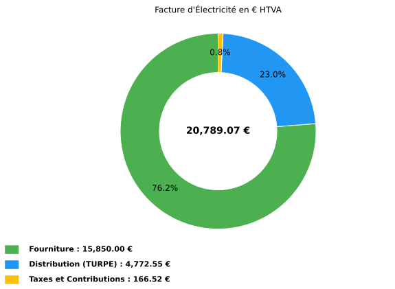
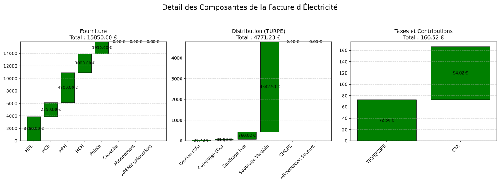

10.1.2.4. Exemple HTA -- CU_pm
--------------------------------------------

**Contexte** : Un centre logistique raccorde en HTA (20 kV), option Courte
Utilisation pointe mobile. Puissance souscrite 300 kW, consommation hiver
et ete equilibree. Facturation de mars 2025.

.. code-block:: python

   from Facture.TURPE import input_Contrat, TurpeCalculator, input_Facture, input_Tarif

   # Contrat HTA CU_pm — centre logistique 300 kW
   contrat = input_Contrat(
       domaine_tension="HTA",
       PS_pointe=300, PS_HPH=300, PS_HCH=300, PS_HPB=300, PS_HCB=300,
       version_utilisation="CU_pm",
       pourcentage_ENR=0,
   )

   tarif = input_Tarif(
       c_euro_kWh_pointe=0.13,
       c_euro_kWh_HPH=0.12,
       c_euro_kWh_HCH=0.10,
       c_euro_kWh_HPB=0.11,
       c_euro_kWh_HCB=0.09,
   )

   # Consommation realiste (~150 MWh/mois)
   facture = input_Facture(
       start="2025-03-01",
       end="2025-03-31",
       kWh_pointe=15000,
       kWh_HPH=40000,
       kWh_HCH=30000,
       kWh_HPB=35000,
       kWh_HCB=25000,
   )

   calc = TurpeCalculator(contrat, tarif, facture)
   calc.calculate_turpe()

   print(calc.df_totaux)

   calc.plot()

**Sortie réelle (df_totaux)** :

.. code-block:: text

                        Ligne                    Formule  Entrée(s) Coefficient  Résultat
                   Fourniture                                                    15850.00
         Acheminement (TURPE)                                                     4772.55
       Taxes et contributions                                                      166.52
                 = Total HTVA Fourniture + TURPE + Taxes                         20789.07
                      TVA 20%           Total_HTVA x 20%                          4157.81
                  = Total TTC                 HTVA + TVA                         24946.88
          Coût HTVA (EUR/MWh)           Total_HTVA / MWh 145.00 MWh                143.37
    Coût fourniture (EUR/MWh)           Fourniture / MWh                           109.31
  Coût distribution (EUR/MWh)                TURPE / MWh                            32.91
         Coût taxes (EUR/MWh)                Taxes / MWh                             1.15

Plots générés par l'exemple
~~~~~~~~~~~~~~~~~~~~~~~~~~~

Les figures ci-dessous sont les sorties réelles de ``calc.plot()`` et
``calc.plot_detail()`` pour les données de l'exemple.

   Répartition HTVA entre fourniture, acheminement TURPE et taxes.

   Cascades détaillées par composante de fourniture, distribution et taxes.
