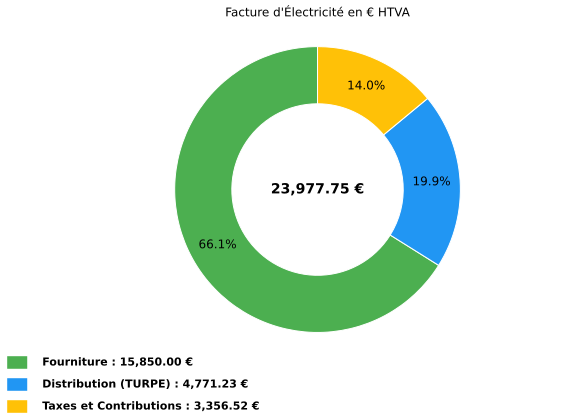
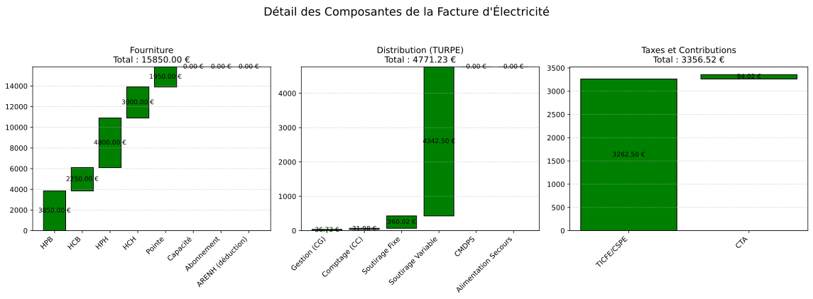

Exemple HTA — CU à pointe mobile
--------------------------------

**Contexte** : un centre logistique raccordé en HTA (20 kV), option **CU_pm**
(courte utilisation, pointe mobile), puissance souscrite 300 kW. Facture de
mars 2025, environ 145 MWh.

.. code-block:: python

   from Facture.TURPE import input_Contrat, TurpeCalculator, input_Facture, input_Tarif

   # Contrat HTA CU_pm — centre logistique 300 kW
   contrat = input_Contrat(
       domaine_tension="HTA",
       PS_pointe=300, PS_HPH=300, PS_HCH=300, PS_HPB=300, PS_HCB=300,   # kW
       version_utilisation="CU_pm",
       pourcentage_ENR=0,
   )

   tarif = input_Tarif(
       c_euro_kWh_pointe=0.13,
       c_euro_kWh_HPH=0.12,
       c_euro_kWh_HCH=0.10,
       c_euro_kWh_HPB=0.11,
       c_euro_kWh_HCB=0.09,
       c_euro_kwh_CSPE_TICFE=0.02250,   # accise « haute puissance » (> 250 kVA), 02/2025
   )

   # Consommations du mois (kWh)
   facture = input_Facture(
       start="2025-03-01",
       end="2025-03-31",
       kWh_pointe=15000,
       kWh_HPH=40000,
       kWh_HCH=30000,
       kWh_HPB=35000,
       kWh_HCB=25000,
   )

   calc = TurpeCalculator(contrat, tarif, facture)
   calc.calculate_turpe()

   print(calc.df_totaux.to_string(index=False))

   calc.plot()
   calc.plot_detail()

Sortie réelle (étapes intermédiaires ``euro_…`` résumées par « … ») :

.. code-block:: text

   …
                         Ligne                    Formule  Entrée(s) Coefficient  Résultat Annuel
                    Fourniture                                                    15850.00
          Acheminement (TURPE)                                                     4771.23
        Taxes et contributions                                                     3356.52
                  = Total HTVA Fourniture + TURPE + Taxes                         23977.75
                       TVA 20%           Total_HTVA x 20%                          4795.55
                   = Total TTC                 HTVA + TVA                         28773.30
           Coût HTVA (EUR/MWh)           Total_HTVA / MWh 145.00 MWh                165.36
     Coût fourniture (EUR/MWh)           Fourniture / MWh                           109.31
   Coût distribution (EUR/MWh)                TURPE / MWh                            32.91
          Coût taxes (EUR/MWh)                Taxes / MWh                            23.15

L'accise (145 000 kWh × 0,0225 = 3 262,50 EUR) représente 97 % des taxes ; la
CTA en ajoute 94,02.

Figures produites par l'exemple
~~~~~~~~~~~~~~~~~~~~~~~~~~~~~~~

Les figures ci-dessous sont les tracés de ``calc.plot()`` et
``calc.plot_detail()`` pour les données de l'exemple.

   Répartition HTVA entre fourniture, acheminement TURPE et taxes.

   Cascades détaillées par composante de fourniture, distribution et taxes.

Paramètres à personnaliser
~~~~~~~~~~~~~~~~~~~~~~~~~~

.. list-table::
   :widths: 28 44 28
   :header-rows: 1

   * - Entrée
     - Effet
     - Plage usuelle
   * - ``PS_pointe`` … ``PS_HCB``
     - Puissances souscrites (kW) : levier principal de la part fixe
     - 250 kW à 12 MW
   * - ``depassement_PS_<poste>``
     - Somme des carrés des dépassements 10 minutes (kW²) : pénalité CMDPS si la puissance est trop basse
     - 0 si la souscription couvre l'appel
   * - ``kWh_<poste>``
     - Consommations relevées par poste
     - selon la facture
   * - ``start``, ``end``
     - Période entière dans une grille CU_pm livrée
     - 2017-08-01 à 2025-07-31

Variante : réduire la puissance souscrite
~~~~~~~~~~~~~~~~~~~~~~~~~~~~~~~~~~~~~~~~~

Si la courbe de charge montre que l'appel ne dépasse jamais 250 kW, on peut
baisser la souscription. On compare la part fixe du TURPE.

.. code-block:: python

   # variante : 250 kW souscrits au lieu de 300 kW, consommations identiques
   contrat_250 = input_Contrat(
       domaine_tension="HTA",
       PS_pointe=250, PS_HPH=250, PS_HCH=250, PS_HPB=250, PS_HCB=250,
       version_utilisation="CU_pm",
   )
   calc_250 = TurpeCalculator(contrat_250, tarif, facture)
   calc_250.calculate_turpe()

   for nom, c in (("300 kW", calc), ("250 kW", calc_250)):
       print(f"{nom}: CS fixe annuel {c.euro_an_CS_fixe:8.2f} EUR/an  "
             f"TURPE du mois {c.euro_TURPE:8.2f} EUR")
   gain = calc.euro_an_CS_fixe - calc_250.euro_an_CS_fixe
   print(f"Économie sur la part fixe : {gain:.2f} EUR/an")

Sortie réelle (étapes intermédiaires résumées par « … ») :

.. code-block:: text

   …
   300 kW: CS fixe annuel  4239.00 EUR/an  TURPE du mois  4771.23 EUR
   250 kW: CS fixe annuel  3532.50 EUR/an  TURPE du mois  4711.23 EUR
   Économie sur la part fixe : 706.50 EUR/an

La baisse ne vaut que si aucun dépassement n'apparaît ensuite : renseignez les
``depassement_PS_<poste>`` mesurés pour chiffrer la pénalité CMDPS avant de
décider.

Pièges
~~~~~~

1. **Grille limitée au 31 juillet 2025.** Le TURPE 7 HTA-BT est entré en
   vigueur le 1er août 2025 (délibération CRE n° 2025-78) et aucune grille
   TURPE 7 CU_pm n'est livrée : une facture postérieure lève
   ``GrilleTURPEIntrouvableError``, qui liste les grilles disponibles. La
   grille TURPE 6 courait jusqu'au 31 décembre 2025 avant le 28/09/2026.
2. **Accise.** Saisissez le taux de votre facture (ici 0,02250 EUR/kWh, tarif
   « haute puissance » au 1er février 2025, impots.gouv.fr). Sans
   ``c_euro_kwh_CSPE_TICFE``, le taux de la grille (0,0005 EUR/kWh) s'applique
   et ``AcciseNonVerifieeWarning`` le signale.

Voir aussi : :doc:`../contrat_electricite`, :doc:`exemple_hta_cu_pf`,
:doc:`exemple_hta_lu_pm`.
