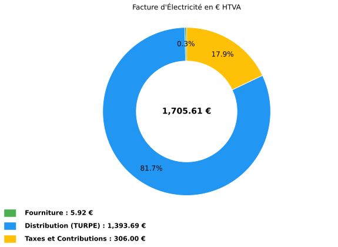
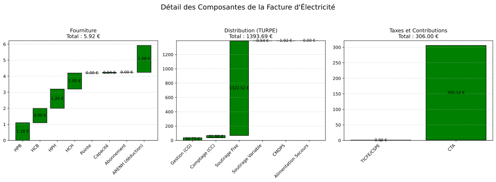

Exemple HTA — LU à pointe fixe
------------------------------

**Contexte** : un poste HTA souscrit en **LU_pf** (longue utilisation, pointe
fixe) à 500 kW, presque à l'arrêt en février 2025 (10 kWh par poste) et qui a
légèrement dépassé sa puissance souscrite en heures pleines de saison basse. Le
cas isole ce que coûte un raccordement **qui ne consomme pas** : la part fixe
du TURPE et la pénalité de dépassement.

.. code-block:: python

   from Facture.TURPE import input_Contrat, TurpeCalculator, input_Facture, input_Tarif

   contrat = input_Contrat(
       domaine_tension="HTA",
       PS_pointe=500, PS_HPH=500, PS_HCH=500, PS_HPB=500, PS_HCB=500,   # kW
       version_utilisation="LU_pf",
       pourcentage_ENR=0,
   )
   tarif = input_Tarif(
       c_euro_kWh_pointe=0.13,
       c_euro_kWh_HPB=0.11,
       c_euro_kWh_HCB=0.09,
       c_euro_kWh_HPH=0.12,
       c_euro_kWh_HCH=0.10,
       c_euro_kwh_CSPE_TICFE=0.02250,        # accise saisie (remplace celle de la grille)
       c_euro_kWh_certif_capacite_pointe=0.001,
       c_euro_kWh_certif_capacite_HPH=0.001,
       c_euro_kWh_certif_capacite_HCH=0.001,
       c_euro_kWh_certif_capacite_HPB=0.001,
       c_euro_kWh_certif_capacite_HCB=0.001,
       c_euro_kWh_ENR=0.01,
       c_euro_kWh_ARENH=0.042,
   )
   facture = input_Facture(
       start="2025-02-01",
       end="2025-02-28",
       heures_depassement=0,
       depassement_PS_HPB=10,     # somme des carrés des dépassements 10 min en HPB (kW²)
       kWh_pointe=0,
       kWh_HPH=10,
       kWh_HCH=10,
       kWh_HPB=10,
       kWh_HCB=10,
   )
   turpe_calculator = TurpeCalculator(contrat, tarif, facture)
   turpe_calculator.calculate_turpe()
   print(turpe_calculator.df_totaux.to_string(index=False))

   turpe_calculator.plot()          # répartition fourniture / TURPE / taxes
   turpe_calculator.plot_detail()   # cascades détaillées

Sortie réelle (étapes intermédiaires ``euro_…`` résumées par « … ») :

.. code-block:: text

   …
                         Ligne                    Formule Entrée(s) Coefficient  Résultat Annuel
                    Fourniture                                                       5.92
          Acheminement (TURPE)                                                    1393.69
        Taxes et contributions                                                     306.00
                  = Total HTVA Fourniture + TURPE + Taxes                         1705.61
                       TVA 20%           Total_HTVA x 20%                          341.12
                   = Total TTC                 HTVA + TVA                         2046.73
           Coût HTVA (EUR/MWh)           Total_HTVA / MWh  0.04 MWh              42640.25
     Coût fourniture (EUR/MWh)           Fourniture / MWh                          148.00
   Coût distribution (EUR/MWh)                TURPE / MWh                        34842.25
          Coût taxes (EUR/MWh)                Taxes / MWh                         7650.00

Les trois sections se somment au total HTVA : 5,92 + 1 393,69 + 306,00 =
1 705,61 EUR. La fourniture n'inclut pas d'ENR : ``pourcentage_ENR=0``, le prix
``c_euro_kWh_ENR`` ne s'applique à aucun kWh.

Avec 40 kWh consommés, la facture est presque entièrement fixe : le coût
unitaire en EUR/MWh n'a pas de sens ici. Pour un site en activité, voir
:doc:`exemple_hta_lu_pm`.

Figures produites par l'exemple
~~~~~~~~~~~~~~~~~~~~~~~~~~~~~~~

Les figures ci-dessous sont les tracés de ``turpe_calculator.plot()``
et ``turpe_calculator.plot_detail()`` pour les données de l'exemple.

   Répartition HTVA entre fourniture, acheminement TURPE et taxes.

   Cascades détaillées par composante de fourniture, distribution et taxes.

Paramètres à personnaliser
~~~~~~~~~~~~~~~~~~~~~~~~~~

.. list-table::
   :widths: 28 44 28
   :header-rows: 1

   * - Entrée
     - Effet
     - Plage usuelle
   * - ``depassement_PS_pointe`` … ``depassement_PS_HCB``
     - **Somme des carrés** des dépassements 10 minutes du mois (kW²) ; le calcul en prend la racine : CMDPS = Σ 0,04 × b × √(entrée)
     - 0 si la souscription couvre l'appel
   * - ``c_euro_kwh_CSPE_TICFE``
     - Accise saisie ; prioritaire sur le taux de la grille
     - taux légal en vigueur
   * - ``cadre_contractuel``
     - ``"contrat unique"``, ``"CARD"`` ou ``"injection"`` (LU_pf seulement)
     - ``"contrat unique"``
   * - ``nb_cellules_secours``, ``km_secours_aerien``, ``km_secours_souterrain``
     - Alimentation de secours (composante CACS) ; prix à 0 dans les grilles livrées
     - 0

Variante : sans dépassement
~~~~~~~~~~~~~~~~~~~~~~~~~~~

.. code-block:: python

   # variante : même mois, sans dépassement de puissance
   facture_ok = input_Facture(
       start="2025-02-01", end="2025-02-28",
       kWh_HPH=10, kWh_HCH=10, kWh_HPB=10, kWh_HCB=10,
   )
   calc_ok = TurpeCalculator(contrat, tarif, facture_ok)
   calc_ok.calculate_turpe()

   print(f"CMDPS avec 10 kW de dépassement : {turpe_calculator.euro_mois_CMDPS:.2f} EUR")
   print(f"CMDPS sans dépassement          : {calc_ok.euro_mois_CMDPS:.2f} EUR")
   print(f"TURPE du mois : {turpe_calculator.euro_TURPE:.2f} -> {calc_ok.euro_TURPE:.2f} EUR")

Sortie réelle (étapes intermédiaires résumées par « … ») :

.. code-block:: text

   …
   CMDPS avec 10 kW de dépassement : 1.92 EUR
   CMDPS sans dépassement          : 0.00 EUR
   TURPE du mois : 1393.69 -> 1391.77 EUR

Une somme de carrés de 10 kW² (par exemple un seul pas de 10 minutes à
3,2 kW au-dessus de la souscription) coûte 0,04 × 15,18 × √10 = 1,92 EUR.

Pièges
~~~~~~

1. **Grilles qui se chevauchent.** Quand plusieurs grilles couvrent la
   période, la plus récente l'emporte ; deux grilles de même date d'effet
   lèvent ``GrilleTURPEAmbigueError``. Avant le 28/09/2026 la première du
   fichier l'emportait : d'août à décembre 2025, une facture LU_pf recevait la
   grille TURPE 6 au lieu du TURPE 7 (en vigueur le 1er août 2025,
   délibération CRE n° 2025-78). Contrôlez la ligne « Grille tarifaire » de
   ``turpe_calculator.df_contrat``.
2. **Dépassements HTA en kW², pas en kW ni en heures.** ``depassement_PS_<poste>``
   attend la somme des carrés des dépassements relevés au pas de 10 minutes ;
   saisir un dépassement en kW sous-estime la pénalité. ``heures_depassement``
   ne sert qu'en BT > 36 kVA.
3. **Accise saisie.** ``c_euro_kwh_CSPE_TICFE=0.02250`` s'applique à la ligne
   accise de ``df_taxes`` **et** au total des taxes (40 kWh × 0,0225 =
   0,90 EUR). Jusqu'au 28/09/2026, la ligne « Taxes et contributions » gardait
   le taux de la grille et les sections ne se sommaient pas au total HTVA.
4. **Gestion et comptage au douzième.** Sur une facture de 28 à 31 jours, CG
   et CC valent le douzième de l'annuel, et le total TURPE est la somme des
   lignes de ``df_acheminement``.

Voir aussi : :doc:`../contrat_electricite`, :doc:`exemple_hta_cu_pf`.
