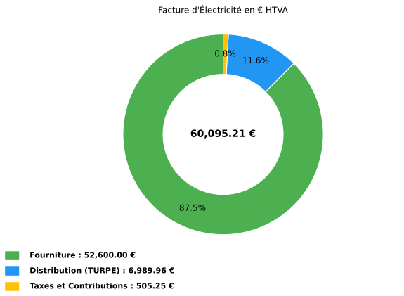
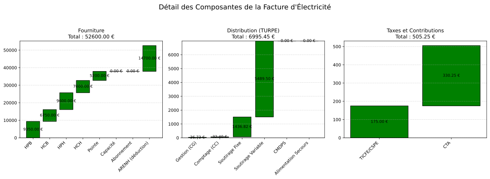

10.1.2.6. Exemple HTA -- LU_pm
--------------------------------------------

**Contexte** : Une usine chimique raccordee en HTA (20 kV), option Longue
Utilisation pointe mobile. Fonctionnement continu 24h/24, puissance souscrite
500 kW. Facturation de fevrier 2025.

La version LU (Longue Utilisation) est adaptee aux sites qui fonctionnent
plus de 3 000 heures par an a puissance significative. Les coefficients b
(part puissance) sont plus eleves, mais les coefficients c (part energie)
sont plus faibles que la version CU.

.. code-block:: python

   from Facture.TURPE import input_Contrat, TurpeCalculator, input_Facture, input_Tarif

   # Contrat HTA LU_pm — usine chimique 500 kW, fonctionnement continu
   contrat = input_Contrat(
       domaine_tension="HTA",
       PS_pointe=500, PS_HPH=500, PS_HCH=500, PS_HPB=500, PS_HCB=500,
       version_utilisation="LU_pm",
       pourcentage_ENR=0,
   )

   tarif = input_Tarif(
       c_euro_kWh_pointe=0.13,
       c_euro_kWh_HPH=0.12,
       c_euro_kWh_HCH=0.10,
       c_euro_kWh_HPB=0.11,
       c_euro_kWh_HCB=0.09,
       c_euro_kWh_ARENH=0.042,
   )

   # Consommation elevee (fonctionnement continu ~350 MWh/mois)
   facture = input_Facture(
       start="2025-02-01",
       end="2025-02-28",
       kWh_pointe=40000,     # Forte consommation en pointe
       kWh_HPH=80000,        # Heures pleines hiver
       kWh_HCH=70000,        # Heures creuses hiver
       kWh_HPB=85000,        # Heures pleines ete
       kWh_HCB=75000,        # Heures creuses ete
   )

   calc = TurpeCalculator(contrat, tarif, facture)
   calc.calculate_turpe()

   print(calc.df_totaux)

   calc.plot()
   calc.plot_detail()

**Sortie réelle (df_totaux)** :

.. code-block:: text

                        Ligne                    Formule  Entrée(s) Coefficient  Résultat
                   Fourniture                                                    52600.00
         Acheminement (TURPE)                                                     6989.96
       Taxes et contributions                                                      505.25
                 = Total HTVA Fourniture + TURPE + Taxes                         60095.21
                      TVA 20%           Total_HTVA x 20%                         12019.04
                  = Total TTC                 HTVA + TVA                         72114.25
          Coût HTVA (EUR/MWh)           Total_HTVA / MWh 350.00 MWh                171.70
    Coût fourniture (EUR/MWh)           Fourniture / MWh                           150.29
  Coût distribution (EUR/MWh)                TURPE / MWh                            19.97
         Coût taxes (EUR/MWh)                Taxes / MWh                             1.44

Plots générés par l'exemple
~~~~~~~~~~~~~~~~~~~~~~~~~~~

Les figures ci-dessous sont les sorties réelles de ``calc.plot()`` et
``calc.plot_detail()`` pour les données de l'exemple.

   Répartition HTVA entre fourniture, acheminement TURPE et taxes.

   Cascades détaillées par composante de fourniture, distribution et taxes.
