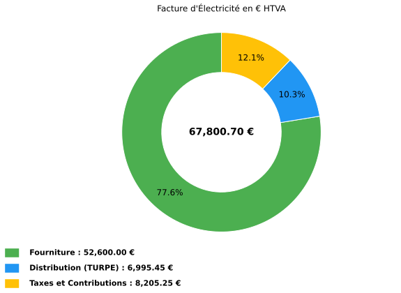
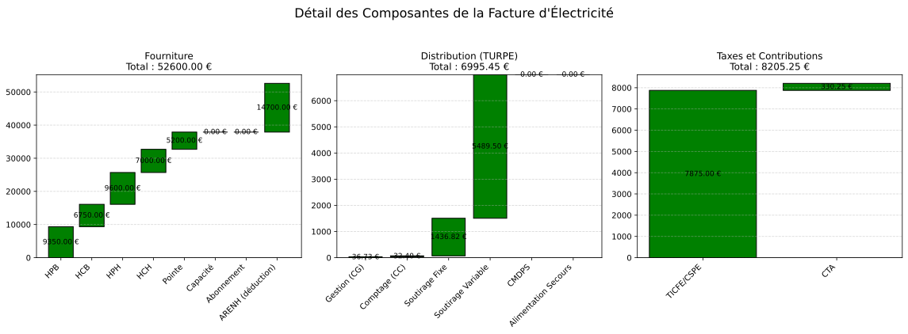

Exemple HTA — LU à pointe mobile
--------------------------------

**Contexte** : une usine chimique raccordée en HTA (20 kV), en fonctionnement
continu, option **LU_pm** (longue utilisation, pointe mobile), puissance
souscrite 500 kW. Facture de février 2025, 350 MWh.

La version LU (longue utilisation) convient aux sites qui appellent leur
puissance une grande partie de l'année : la part puissance (coefficients *b*)
est plus chère, la part énergie (coefficients *c*) moins chère qu'en CU.

.. code-block:: python

   from Facture.TURPE import input_Contrat, TurpeCalculator, input_Facture, input_Tarif

   # Contrat HTA LU_pm — usine chimique 500 kW, fonctionnement continu
   contrat = input_Contrat(
       domaine_tension="HTA",
       PS_pointe=500, PS_HPH=500, PS_HCH=500, PS_HPB=500, PS_HCB=500,   # kW
       version_utilisation="LU_pm",
       pourcentage_ENR=0,
   )

   tarif = input_Tarif(
       c_euro_kWh_pointe=0.13,
       c_euro_kWh_HPH=0.12,
       c_euro_kWh_HCH=0.10,
       c_euro_kWh_HPB=0.11,
       c_euro_kWh_HCB=0.09,
       c_euro_kWh_ARENH=0.042,
   )

   # Consommations du mois (kWh)
   facture = input_Facture(
       start="2025-02-01",
       end="2025-02-28",
       kWh_pointe=40000,
       kWh_HPH=80000,
       kWh_HCH=70000,
       kWh_HPB=85000,
       kWh_HCB=75000,
   )

   calc = TurpeCalculator(contrat, tarif, facture)
   calc.calculate_turpe()

   print(calc.df_totaux.to_string(index=False))

   calc.plot()
   calc.plot_detail()

Sortie réelle (étapes intermédiaires ``euro_…`` résumées par « … ») :

.. code-block:: text

   …
                         Ligne                    Formule  Entrée(s) Coefficient  Résultat Annuel
                    Fourniture                                                    52600.00
          Acheminement (TURPE)                                                     6989.96
        Taxes et contributions                                                      505.25
                  = Total HTVA Fourniture + TURPE + Taxes                         60095.21
                       TVA 20%           Total_HTVA x 20%                         12019.04
                   = Total TTC                 HTVA + TVA                         72114.25
           Coût HTVA (EUR/MWh)           Total_HTVA / MWh 350.00 MWh                171.70
     Coût fourniture (EUR/MWh)           Fourniture / MWh                           150.29
   Coût distribution (EUR/MWh)                TURPE / MWh                            19.97
          Coût taxes (EUR/MWh)                Taxes / MWh                             1.44

Figures produites par l'exemple
~~~~~~~~~~~~~~~~~~~~~~~~~~~~~~~

Les figures ci-dessous sont les tracés de ``calc.plot()`` et
``calc.plot_detail()`` pour les données de l'exemple.

   Répartition HTVA entre fourniture, acheminement TURPE et taxes.

   Cascades détaillées par composante de fourniture, distribution et taxes.

Paramètres à personnaliser
~~~~~~~~~~~~~~~~~~~~~~~~~~

.. list-table::
   :widths: 28 44 28
   :header-rows: 1

   * - Entrée
     - Effet
     - Plage usuelle
   * - ``version_utilisation``
     - ``"LU_pm"`` ou ``"CU_pm"`` : arbitrage part puissance / part énergie
     - selon la durée d'utilisation
   * - ``PS_pointe`` … ``PS_HCB``
     - Puissances souscrites (kW)
     - 250 kW à 12 MW
   * - ``c_euro_kWh_ARENH``
     - Complément de prix appliqué à tous les kWh
     - selon le contrat
   * - ``start``, ``end``
     - Période entière dans une grille LU_pm livrée
     - 2017-08-01 à 2021-07-31, 2025-02-01 à 2025-12-31

Variante : comparer avec la courte utilisation (CU_pm)
~~~~~~~~~~~~~~~~~~~~~~~~~~~~~~~~~~~~~~~~~~~~~~~~~~~~~~

.. code-block:: python

   # variante : même usine en CU_pm
   contrat_cu = input_Contrat(
       domaine_tension="HTA",
       PS_pointe=500, PS_HPH=500, PS_HCH=500, PS_HPB=500, PS_HCB=500,
       version_utilisation="CU_pm",
   )
   calc_cu = TurpeCalculator(contrat_cu, tarif, facture)
   calc_cu.calculate_turpe()

   for nom, c in (("LU_pm", calc), ("CU_pm", calc_cu)):
       print(f"{nom}: TURPE du mois {c.euro_TURPE:8.2f} EUR  "
             f"soit {1000 * c.euro_TURPE / c.kWh_Total:5.2f} EUR/MWh")

Sortie réelle (étapes intermédiaires résumées par « … ») :

.. code-block:: text

   …
   LU_pm: TURPE du mois  6989.96 EUR  soit 19.97 EUR/MWh
   CU_pm: TURPE du mois 10636.22 EUR  soit 30.39 EUR/MWh

À 350 MWh par mois sous 500 kW (environ 8 400 heures d'utilisation par an), la
longue utilisation économise **3 646,26 EUR d'acheminement** sur le mois, soit
un tiers du TURPE : c'est l'option naturelle d'un site en continu.

Pièges
~~~~~~

1. **Aucune grille LU_pm entre août 2021 et janvier 2025.** Une facture de
   2023 en LU_pm lève ``AttributeError`` : la bibliothèque n'en livre pas.
2. **Accise.** Sans ``c_euro_kwh_CSPE_TICFE``, le taux porté par la grille
   s'applique (0,0005 EUR/kWh ici) : comparez-le à la ligne accise de votre
   facture et saisissez le bon. Le total HTVA applique alors le taux saisi,
   mais la ligne « Taxes et contributions » garde celui de la grille (défaut
   consigné dans ``BUGS_LIB.md``).

Voir aussi : :doc:`../contrat_electricite`, :doc:`exemple_hta_cu_pm`.
