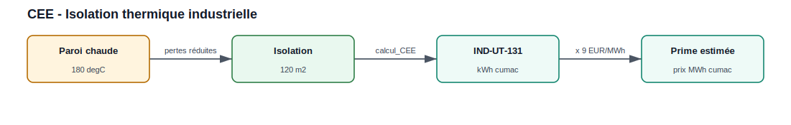
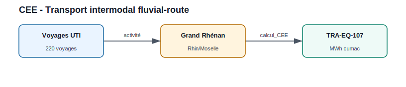

Certificats d'Économies d'Énergie
===================================

Cette page présente un exemple par **fiche d'opération standardisée** réellement
supportée par le module ``CEE``, rangé par secteur. Seules les fiches **en
vigueur** au catalogue officiel sont documentées (voir la note sur les fiches
obsolètes en fin de page).

Lister les fiches disponibles
-----------------------------

.. code-block:: python

   from CEE.CEE import list_fiches

   print(list_fiches())

Résultat réel :

.. code-block:: text

   ['IND-UT-103', 'IND-UT-130', 'IND-UT-131', 'IND-UT-134',
    'IND-UT-135', 'TRA-EQ-101', 'TRA-EQ-107']

Le prix interne du MWh cumac (``euro_MWhcumac``, **5 €/MWh cumac** par défaut) est
utilisé pour la valorisation ; il est modifiable (``CEE.euro_MWhcumac = 9``).
``calcul_CEE(..., return_details=True)`` renvoie un dictionnaire
(``kWh_cumac``, ``MWh_cumac``, ``euro``, ``titre``).

Secteur Industrie
=================

IND-UT-103 — Récupération de chaleur sur un compresseur d'air
-------------------------------------------------------------

.. figure:: ../images/012_chaleur_fatale_compresseur_cee.svg
   :alt: Récupération de chaleur sur compresseur d'air (IND-UT-103)
   :align: center

   La chaleur du compresseur est récupérée pour un usage (chauffage, ECS ou
   procédé) et valorisée en CEE.

.. code-block:: python

   from CEE.CEE import calcul_CEE

   d = calcul_CEE(
       fiche="IND-UT-103",
       return_details=True,
       fonctionnement="2*8h",
       Department=69,                  # zone climatique H1
       Heat_Use="procédé industriel",  # ou "chauffage de locaux" / "ECS"
       puissance_nominale=90,          # kW
   )
   print(f"{d['MWh_cumac']:.0f} MWh cumac — {d['euro']:.0f} EUR")

Résultat réel : **2 304 MWh cumac** — 11 520 EUR (à 5 €/MWh cumac).

IND-UT-130 — Condenseur sur les effluents gazeux d'une chaudière vapeur
-----------------------------------------------------------------------

.. code-block:: python

   from CEE.CEE import calcul_CEE

   d = calcul_CEE(
       fiche="IND-UT-130",
       return_details=True,
       fonctionnement="3*8h_sansArrWE",
       puissance_nominale=1500,        # kW (<= 20 000)
   )
   print(f"{d['MWh_cumac']:.0f} MWh cumac — {d['euro']:.0f} EUR")

Résultat réel : **2 100 MWh cumac** — 10 500 EUR.

IND-UT-131 — Isolation thermique de parois industrielles
--------------------------------------------------------

   La fiche s'applique à une paroi plane (surface ``S``) ou cylindrique
   (diamètre ``D``, longueur ``L``) selon sa température de service.

.. code-block:: python

   from CEE.CEE import calcul_CEE

   d = calcul_CEE(
       fiche="IND-UT-131",
       return_details=True,
       fonctionnement="3*8h_sansArrWE",
       Temperature=180,     # °C
       Geometry="plan",     # "plan" (S) ou "cylindre" (D, L)
       S=120,               # m²
   )
   print(f"{d['MWh_cumac']:.2f} MWh cumac — {d['euro']:.2f} EUR")

Résultat réel : **246,96 MWh cumac** — 1 234,80 EUR.

IND-UT-134 — Système de mesurage d'indicateurs de performance énergétique
-------------------------------------------------------------------------

.. code-block:: python

   from CEE.CEE import calcul_CEE

   d = calcul_CEE(
       fiche="IND-UT-134",
       return_details=True,
       fonctionnement="2*8h",
       duree_contrat=3.0,          # années
       puissance_nominale=800,     # kW
   )
   print(f"{d['MWh_cumac']:.2f} MWh cumac — {d['euro']:.2f} EUR")

Résultat réel : **149,54 MWh cumac** — 747,70 EUR.

IND-UT-135 — Freecooling par eau de refroidissement (substitution groupe froid)
-------------------------------------------------------------------------------

.. code-block:: python

   from CEE.CEE import calcul_CEE

   d = calcul_CEE(
       fiche="IND-UT-135",
       return_details=True,
       fonctionnement="2*8h",
       Department=69,              # zone climatique H1
       Supply_Temperature=16,      # °C (12 <= T <= 21)
       puissance_nominale=200,     # kW
   )
   print(f"{d['MWh_cumac']:.0f} MWh cumac — {d['euro']:.0f} EUR")

Résultat réel : **4 356 MWh cumac** — 21 780 EUR.

Secteur Transport
=================

TRA-EQ-101 — Unité de transport intermodal rail-route
-----------------------------------------------------

   Le volume CEE dépend du nombre d'unités de transport et de voyages annuels.

.. code-block:: python

   from CEE.CEE import calcul_CEE

   d = calcul_CEE(
       fiche="TRA-EQ-101",
       return_details=True,
       longueur_uti="UTIsup9",     # "UTIinf9" ou "UTIsup9"
       nb_voyage_an=200,
       nb_uti=10,
   )
   print(f"{d['MWh_cumac']:.0f} MWh cumac — {d['euro']:.0f} EUR")

Résultat réel : **37 000 MWh cumac** — 185 000 EUR.

TRA-EQ-107 — Unité de transport intermodal fluvial-route
--------------------------------------------------------

.. code-block:: python

   from CEE.CEE import calcul_CEE

   d = calcul_CEE(
       fiche="TRA-EQ-107",
       return_details=True,
       type_bateau="Bateau Grand Rhénan (2 500 t)",
       bassin_navigation="Rhin/Moselle",
       nb_voyage_uti=220,
   )
   print(f"{d['MWh_cumac']:.0f} MWh cumac — {d['euro']:.0f} EUR")

Résultat réel : **902 MWh cumac** — 4 510 EUR.

Projet multi-opérations
=======================

.. figure:: ../images/011_cee_projet_multi_operations.svg
   :alt: Projet CEE multi-opérations
   :align: center

   Chaque opération produit une ligne de résultat ; le rapport agrège ensuite
   les volumes et les primes.

.. code-block:: python

   from CEE.CEE import calcul_CEE
   import pandas as pd

   operations = [
       {"fiche": "IND-UT-131", "fonctionnement": "3*8h_sansArrWE",
        "Temperature": 180, "Geometry": "plan", "S": 120},
       {"fiche": "IND-UT-134", "fonctionnement": "2*8h",
        "duree_contrat": 3.0, "puissance_nominale": 800},
       {"fiche": "IND-UT-130", "fonctionnement": "3*8h_sansArrWE",
        "puissance_nominale": 1500},
   ]

   prix_mwh = 9.0                      # hypothèse de prix externe
   lignes, total_kwh = [], 0
   for op in operations:
       kwh = calcul_CEE(**op)          # sans return_details -> kWh cumac
       total_kwh += kwh
       lignes.append({"Fiche": op["fiche"], "kWh_cumac": kwh,
                      "Prime_EUR": kwh * prix_mwh / 1000})

   df = pd.DataFrame(lignes)
   print(df)
   print(f"Total : {total_kwh:.0f} kWh cumac — {total_kwh * prix_mwh / 1000:.0f} EUR")

Résultat réel (prime à 9 €/MWh cumac) :

.. list-table::
   :widths: 25 30 30
   :header-rows: 1

   * - Fiche
     - kWh cumac
     - Prime à 9 €/MWh
   * - IND-UT-131
     - 246 960
     - 2 222,64 EUR
   * - IND-UT-134
     - 149 540
     - 1 345,86 EUR
   * - IND-UT-130
     - 2 100 000
     - 18 900,00 EUR
   * - **Total**
     - **2 496 500**
     - **22 468,50 EUR**

Fiches obsolètes (non éligibles)
================================

Certaines fiches restent dans le registre du code pour l'historique mais sont
**exclues de** ``list_fiches()`` et refusées par ``calcul_CEE`` (``ValueError``) :

* **IND-UT-136** — Systèmes moto-régulés : **abrogée** par arrêté du 18/08/2025.
* **TRA-EQ-108** — Wagon d'autoroute ferroviaire : opération **close au 31/03/2020**.

.. code-block:: python

   from CEE.CEE import list_fiches
   print(list_fiches(include_deprecated=True))
   # {'available': [... 7 fiches ...],
   #  'deprecated': ['IND-UT-136', 'TRA-EQ-108']}

Conseils d'utilisation
======================

* Utiliser les noms exacts des paramètres attendus par chaque fiche.
* Lancer ``calcul_CEE(..., return_details=True)`` pour un dictionnaire
  exploitable dans un rapport (``kWh_cumac``, ``MWh_cumac``, ``euro``, ``titre``).
* Ajuster ``CEE.euro_MWhcumac`` (défaut 5) ou appliquer un prix externe.
* Vérifier l'éligibilité réglementaire sur les fiches officielles avant toute
  décision d'investissement (catalogue ADEME/ATEE).
