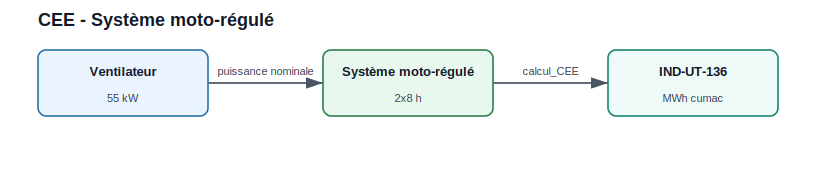

Certificats d'Économies d'Énergie
===================================

Cette page présente des exemples directement compatibles avec les fiches
actuellement disponibles dans le module ``CEE``.

Lister les fiches disponibles
-----------------------------

.. code-block:: python

   from CEE.CEE import list_fiches

   print(list_fiches())

Résultat attendu :

.. code-block:: text

   ['IND-UT-103', 'IND-UT-130', 'IND-UT-131', 'IND-UT-134',
    'IND-UT-135', 'IND-UT-136', 'TRA-EQ-101', 'TRA-EQ-107', 'TRA-EQ-108']

Exemple 1 : isolation thermique industrielle
--------------------------------------------

.. figure:: ../images/011_cee_isolation_industrielle.svg
   :alt: Schéma CEE pour isolation thermique industrielle
   :align: center

   Le calcul part de la paroi isolée, applique la fiche ``IND-UT-131`` et
   transforme les kWh cumac en prime estimée.

.. code-block:: python

   from CEE.CEE import calcul_CEE

   # IND-UT-131 : isolation thermique de parois industrielles.
   kwh_cumac = calcul_CEE(
       fiche="IND-UT-131",
       fonctionnement="3*8h_sansArrWE",
       Temperature=180,
       Geometry="plan",
       S=120,
   )

   prix_mwh_cumac = 9.0
   prime_cee = kwh_cumac * prix_mwh_cumac / 1000

   print(f"Volume : {kwh_cumac:.0f} kWh cumac")
   print(f"Prime : {prime_cee:.0f} EUR")

Résultat attendu :

.. list-table::
   :widths: 45 30 25
   :header-rows: 1

   * - Indicateur
     - Valeur
     - Unité
   * - Volume CEE
     - 246 960
     - kWh cumac
   * - Prime avec 9 EUR/MWh cumac
     - 2 223
     - EUR

Exemple 2 : système moto-régulé
-------------------------------

Un utilisateur qui souhaite estimer l'intérêt d'un variateur ou d'un système
moto-régulé sur un ventilateur peut utiliser ``IND-UT-136``.

   Le nœud équipement fournit la puissance nominale, la fiche calcule ensuite
   le volume cumac.

.. code-block:: python

   from CEE.CEE import calcul_CEE

   details = calcul_CEE(
       fiche="IND-UT-136",
       return_details=True,
       fonctionnement="2*8h",
       Equipement_type="fan",
       puissance_nominale=55,
   )

   print(details["titre"])
   print(f"{details['MWh_cumac']:.1f} MWh cumac")
   print(f"{details['euro']:.0f} EUR avec le prix interne du module")

Résultat attendu :

.. list-table::
   :widths: 45 30 25
   :header-rows: 1

   * - Indicateur
     - Valeur
     - Unité
   * - Volume CEE
     - 940,5
     - MWh cumac
   * - Valorisation interne du module
     - 4 703
     - EUR

Exemple 3 : récupération de chaleur sur compresseur d'air
---------------------------------------------------------

.. figure:: ../images/012_chaleur_fatale_compresseur_cee.svg
   :alt: Schéma CEE pour récupération de chaleur sur compresseur d'air
   :align: center

   La récupération thermique du compresseur alimente un usage et peut être
   valorisée via ``IND-UT-103``.

.. code-block:: python

   from CEE.CEE import calcul_CEE

   kwh_cumac = calcul_CEE(
       fiche="IND-UT-103",
       fonctionnement="3*8h_ArrWE",
       Department=59,
       Heat_Use="procédé industriel",
       puissance_nominale=75,
   )

   print(f"CEE récupération compresseur : {kwh_cumac/1000:.1f} MWh cumac")

Résultat attendu :

.. list-table::
   :widths: 45 30 25
   :header-rows: 1

   * - Indicateur
     - Valeur
     - Unité
   * - Volume CEE
     - 2 385,0
     - MWh cumac
   * - Prime avec 9 EUR/MWh cumac
     - 21 465
     - EUR

Exemple 4 : transport intermodal
--------------------------------

.. figure:: ../images/011_cee_transport_intermodal.svg
   :alt: Schéma CEE pour transport intermodal fluvial-route
   :align: center

   Le nombre de voyages et le type de bateau alimentent la fiche
   ``TRA-EQ-107``.

.. code-block:: python

   from CEE.CEE import calcul_CEE

   details = calcul_CEE(
       fiche="TRA-EQ-107",
       return_details=True,
       type_bateau="Bateau Grand Rhénan (2 500 t)",
       bassin_navigation="Rhin/Moselle",
       nb_voyage_uti=220,
   )

   print(details)

Résultat attendu :

.. list-table::
   :widths: 45 30 25
   :header-rows: 1

   * - Indicateur
     - Valeur
     - Unité
   * - Volume CEE
     - 902,0
     - MWh cumac
   * - Valorisation interne du module
     - 4 510
     - EUR

Projet multi-opérations
------------------------

.. figure:: ../images/011_cee_projet_multi_operations.svg
   :alt: Schéma CEE pour projet multi-opérations
   :align: center

   Chaque opération produit une ligne de résultat ; le rapport agrège ensuite
   les volumes et les primes.

.. code-block:: python

   from CEE.CEE import calcul_CEE
   import pandas as pd

   operations = [
       {
           "fiche": "IND-UT-131",
           "fonctionnement": "3*8h_sansArrWE",
           "Temperature": 180,
           "Geometry": "plan",
           "S": 120,
       },
       {
           "fiche": "IND-UT-136",
           "fonctionnement": "2*8h",
           "Equipement_type": "fan",
           "puissance_nominale": 55,
       },
       {
           "fiche": "IND-UT-134",
           "fonctionnement": "2*8h",
           "duree_contrat": 3.0,
           "puissance_nominale": 800,
       },
   ]

   total_kwh_cumac = 0
   details = []

   for op in operations:
       kwh_cumac = calcul_CEE(**op)
       total_kwh_cumac += kwh_cumac
       details.append({
           "Fiche": op["fiche"],
           "kWh_cumac": kwh_cumac,
           "Prime_EUR": kwh_cumac * 9.0 / 1000,
       })

   df_rapport = pd.DataFrame(details)
   print(df_rapport)
   print(f"Total : {total_kwh_cumac:.0f} kWh cumac")
   print(f"Prime totale : {total_kwh_cumac * 9.0 / 1000:.0f} EUR")

   df_rapport.to_excel("rapport_CEE.xlsx", index=False)

Résultat attendu :

.. list-table::
   :widths: 25 30 30
   :header-rows: 1

   * - Fiche
     - kWh cumac
     - Prime à 9 EUR/MWh
   * - IND-UT-131
     - 246 960
     - 2 222,64 EUR
   * - IND-UT-136
     - 940 500
     - 8 464,50 EUR
   * - IND-UT-134
     - 149 540
     - 1 345,86 EUR
   * - **Total**
     - **1 337 000**
     - **12 033,00 EUR**

Conseils d'utilisation
----------------------

* Utiliser les noms exacts des paramètres attendus par chaque fiche.
* Lancer ``calcul_CEE(..., return_details=True)`` pour obtenir un dictionnaire
  exploitable dans un rapport.
* Conserver l'hypothèse de prix du MWh cumac dans les exports.
* Vérifier l'éligibilité réglementaire sur les fiches officielles avant toute
  décision d'investissement.
