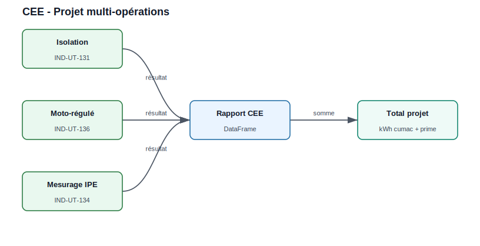

Certificats d'Économies d'Énergie
===================================

Le module ``CEE`` calcule le volume de certificats (kWh cumac) d'une opération
standardisée via le dispatcher ``calcul_CEE(fiche, **params)``. Cette page donne
**un exemple par fiche en vigueur**, rangé par secteur. Seules les fiches
présentes au catalogue officiel sont documentées (voir la note sur les fiches
obsolètes en fin de page).

Principe
--------

.. code-block:: python

   from CEE.CEE import calcul_CEE, list_fiches

   print(list_fiches())          # 33 fiches actives

   # kWh cumac seul, ou dict complet avec return_details=True
   kwh = calcul_CEE("IND-UT-131", fonctionnement="3*8h_sansArrWE",
                    Temperature=180, Geometry="plan", S=120)
   d = calcul_CEE("IND-UT-131", return_details=True, fonctionnement="3*8h_sansArrWE",
                  Temperature=180, Geometry="plan", S=120)
   print(d["MWh_cumac"], d["euro"], d["titre"])

Le prix interne ``CEE.euro_MWhcumac`` vaut **5 €/MWh cumac** par défaut (modifiable).
Les montants ``euro`` ci-dessous sont calculés à ce prix ; les paramètres de
fonctionnement usuels sont ``"1*8h"``, ``"2*8h"``, ``"3*8h_ArrWE"``,
``"3*8h_sansArrWE"``.

Secteur Industrie — Utilités (IND-UT)
=====================================

Moteurs et entraînements
------------------------

.. code-block:: python

   # IND-UT-102 — Variation électronique de vitesse sur moteur asynchrone
   calcul_CEE("IND-UT-102", application="pompage", puissance_nominale=100)
   #   -> 1240 MWh cumac (6 200 EUR).  applications : pompage/ventilation/
   #      "compresseur d'air"/"compresseur frigorifique"/autres

   # IND-UT-114 — Moto-variateur synchrone (aimants permanents / réluctance)
   calcul_CEE("IND-UT-114", application="pompage", puissance_nominale=100)
   #   -> 1780 MWh cumac (8 900 EUR)

   # IND-UT-127 — Système de transmission performant
   calcul_CEE("IND-UT-127", type_transmission="transmission_directe", puissance_nominale=100)
   #   -> 190 MWh cumac (950 EUR).  ou "poulie_courroie_synchrone"

   # IND-UT-132 — Moteur asynchrone de classe IE4  (affine par morceaux)
   calcul_CEE("IND-UT-132", puissance_utile=10)
   #   -> 19 MWh cumac (95 EUR)

   # IND-UT-133 — Pilotage électronique d'un moteur avec récupération d'énergie
   calcul_CEE("IND-UT-133", heures_fonctionnement=6000, taux_freinage=0.05, puissance_utile=100)
   #   -> 277,5 MWh cumac (1 388 EUR)

Chaudières, fours et récupération de chaleur
--------------------------------------------

.. code-block:: python

   # IND-UT-103 — Récupération de chaleur sur un compresseur d'air
   calcul_CEE("IND-UT-103", fonctionnement="2*8h", Department=69,
              Heat_Use="procédé industriel", puissance_nominale=90)
   #   -> 2304 MWh cumac (11 520 EUR).  Heat_Use : "chauffage de locaux"/"ECS"/
   #      "procédé industriel"

   # IND-UT-104 — Économiseur sur effluents gazeux d'une chaudière vapeur
   calcul_CEE("IND-UT-104", fonctionnement="2*8h", puissance_nominale=1000)
   #   -> 720 MWh cumac (3 600 EUR)

   # IND-UT-105 — Brûleur micro-modulant sur chaudière industrielle
   calcul_CEE("IND-UT-105", fonctionnement="2*8h", puissance_nominale=1000)
   #   -> 1200 MWh cumac (6 000 EUR)

   # IND-UT-118 — Brûleur avec récupération de chaleur sur four industriel
   calcul_CEE("IND-UT-118", nature="auto_recuperateur", fonctionnement="2*8h",
              puissance_nominale=100, temperature_fumees=800)
   #   -> 550 MWh cumac (2 750 EUR).  nature : auto_recuperateur/regeneratif/
   #      recuperateur_fumees

   # IND-UT-125 — Traitement d'eau performant sur chaudière vapeur
   calcul_CEE("IND-UT-125", fonctionnement="2*8h", puissance_nominale=100, zone="C")
   #   -> 100 MWh cumac (500 EUR).  zone A/B/C/D (ou Department)

   # IND-UT-130 — Condenseur sur effluents gazeux d'une chaudière vapeur
   calcul_CEE("IND-UT-130", fonctionnement="3*8h_sansArrWE", puissance_nominale=1500)
   #   -> 2100 MWh cumac (10 500 EUR)

Froid industriel
----------------

.. code-block:: python

   # IND-UT-113 — Condensation frigorifique à haute efficacité
   calcul_CEE("IND-UT-113", type_condensation="air_sec", delta_T=6.5,
              fonctionnement="1*8h", puissance_nominale=100)
   #   -> 240 MWh cumac (1 200 EUR).  type_condensation : eau/air_sec/air_humide

   # IND-UT-115 — Régulation groupe froid : basse pression flottante
   calcul_CEE("IND-UT-115", puissance_nominale=50)
   #   -> 75 MWh cumac (375 EUR)

   # IND-UT-116 — Régulation groupe froid : haute pression flottante
   calcul_CEE("IND-UT-116", type_condensation="atmosphere", puissance_nominale=100, zone="H1")
   #   -> 1430 MWh cumac (7 150 EUR).  type_condensation : atmosphere/eau

   # IND-UT-135 — Freecooling par eau en substitution d'un groupe froid
   calcul_CEE("IND-UT-135", fonctionnement="2*8h", Department=69,
              Supply_Temperature=16, puissance_nominale=200)
   #   -> 4356 MWh cumac (21 780 EUR)

Air comprimé
------------

.. code-block:: python

   # IND-UT-120 — Compresseur d'air basse pression à vis ou centrifuge
   calcul_CEE("IND-UT-120", puissance_nominale=100)
   #   -> 1930 MWh cumac (9 650 EUR)  (P < 400 kW)

   # IND-UT-122 — Sécheur d'air comprimé à adsorption à régénération calorifique
   calcul_CEE("IND-UT-122", fonctionnement="2*8h", puissance_nominale=100)
   #   -> 500 MWh cumac (2 500 EUR)

   # IND-UT-124 — Séquenceur électronique de centrale d'air comprimé
   calcul_CEE("IND-UT-124", nb_compresseurs=4, type_sequenceur="avec", puissance_nominale=100)
   #   -> 360 MWh cumac (1 800 EUR).  type_sequenceur : sans/avec

   # IND-UT-140 — Mise en veille automatique d'une machine à air comprimé
   calcul_CEE("IND-UT-140", fonctionnement="2*8h", debit_air=2000)
   #   -> 114 MWh cumac (570 EUR).  debit_air en L/min ANR

Chaleur fatale
--------------

.. code-block:: python

   # IND-UT-137 — PAC en rehausse de température de chaleur fatale récupérée
   calcul_CEE("IND-UT-137", Q=1_000_000, Eelec=200_000)
   #   -> 8788,8 MWh cumac (43 944 EUR).  version "vA65-2" (défaut) ou "vA62-1"

   # IND-UT-138 — Conversion de chaleur fatale en électricité ou air comprimé
   calcul_CEE("IND-UT-138", D=6000, Precup=500, rendement=0.15, Pconso=20)
   #   -> 4664,2 MWh cumac (23 321 EUR)

   # IND-UT-139 — Système de stockage de chaleur fatale
   calcul_CEE("IND-UT-139", rendement=0.9, capacite_stockage=1000, nb_cycles=250)
   #   -> 3180,2 MWh cumac (15 901 EUR)

Presse à injecter
-----------------

.. code-block:: python

   # IND-UT-129 — Presse à injecter tout électrique ou hybride
   calcul_CEE("IND-UT-129", nature="electrique_neuve", fonctionnement="1*8h", puissance_nominale=10)
   #   -> 120 MWh cumac (600 EUR).  nature : electrique_neuve / hybride1_neuve /
   #      hybride2_neuve / transfo_hybride1 / transfo_hybride2

Isolation et mesurage
---------------------

.. code-block:: python

   # IND-UT-131 — Isolation thermique de parois planes/cylindriques industrielles
   calcul_CEE("IND-UT-131", fonctionnement="3*8h_sansArrWE",
              Temperature=180, Geometry="plan", S=120)
   #   -> 247 MWh cumac (1 235 EUR).  Geometry "plan" (S) ou "cylindre" (D, L)

   # IND-UT-134 — Système de mesurage d'indicateurs de performance énergétique
   calcul_CEE("IND-UT-134", fonctionnement="2*8h", duree_contrat=3.0, puissance_nominale=800)
   #   -> 149,5 MWh cumac (748 EUR)

Secteur Industrie — Bâtiment (IND-BA)
=====================================

.. code-block:: python

   # IND-BA-110 — Système de déstratification d'air (local >= 5 m)
   calcul_CEE("IND-BA-110", type_chauffage="convectif", fonctionnement="2*8h",
              hauteur=8, puissance_nominale=100, zone="H1")
   #   -> 270 MWh cumac (1 350 EUR).  type_chauffage : convectif/radiatif

   # IND-BA-113 — Lanterneaux d'éclairage zénithal (métropole)
   calcul_CEE("IND-BA-113", surface=200, zone="H3")
   #   -> 1280 MWh cumac (6 400 EUR).  zone H1/H2/H3 (ou Department)

   # IND-BA-114 — Conduits de lumière naturelle
   calcul_CEE("IND-BA-114", surface=20, zone_geographique="metropole")
   #   -> 342 MWh cumac (1 710 EUR).  zone_geographique : metropole/outremer

   # IND-BA-117 — Chauffage décentralisé performant
   calcul_CEE("IND-BA-117", type_appareil="aerotherme_modulant",
              fonctionnement="1*8h", puissance_nominale=100, zone="H1")
   #   -> 210 MWh cumac (1 050 EUR)

Secteur Industrie — Enveloppe outre-mer (IND-EN)
================================================

.. code-block:: python

   # IND-EN-101 — Isolation des murs (France d'outre-mer)
   calcul_CEE("IND-EN-101", type_construction="existant", surface=200)
   #   -> 54 MWh cumac (270 EUR).  type_construction : existant/neuf

   # IND-EN-102 — Isolation de combles/toitures (France d'outre-mer)
   calcul_CEE("IND-EN-102", type_construction="existant", surface=200)
   #   -> 320 MWh cumac (1 600 EUR).  (fiche abrogée à compter du 01/05/2027)

Secteur Transport (TRA-EQ)
==========================

.. code-block:: python

   # TRA-EQ-101 — Unité de transport intermodal rail-route
   calcul_CEE("TRA-EQ-101", longueur_uti="UTIsup9", nb_voyage_an=200, nb_uti=10)
   #   -> 37 000 MWh cumac (185 000 EUR).  longueur_uti : UTIinf9/UTIsup9

   # TRA-EQ-107 — Unité de transport intermodal fluvial-route
   calcul_CEE("TRA-EQ-107", type_bateau="Bateau Grand Rhénan (2 500 t)",
              bassin_navigation="Rhin/Moselle", nb_voyage_uti=220)
   #   -> 902 MWh cumac (4 510 EUR)

Projet multi-opérations
=======================

   Chaque opération produit une ligne de résultat ; le rapport agrège ensuite
   les volumes et les primes.

.. code-block:: python

   from CEE.CEE import calcul_CEE
   import pandas as pd

   operations = [
       {"fiche": "IND-UT-131", "fonctionnement": "3*8h_sansArrWE",
        "Temperature": 180, "Geometry": "plan", "S": 120},
       {"fiche": "IND-UT-134", "fonctionnement": "2*8h",
        "duree_contrat": 3.0, "puissance_nominale": 800},
       {"fiche": "IND-UT-130", "fonctionnement": "3*8h_sansArrWE",
        "puissance_nominale": 1500},
   ]

   prix_mwh = 9.0                       # hypothèse de prix externe
   lignes, total_kwh = [], 0
   for op in operations:
       kwh = calcul_CEE(**op)           # sans return_details -> kWh cumac
       total_kwh += kwh
       lignes.append({"Fiche": op["fiche"], "kWh_cumac": kwh,
                      "Prime_EUR": kwh * prix_mwh / 1000})

   print(pd.DataFrame(lignes))
   print(f"Total : {total_kwh:.0f} kWh cumac — {total_kwh * prix_mwh / 1000:.0f} EUR")

Résultat réel (prime à 9 €/MWh cumac) :

.. list-table::
   :widths: 25 30 30
   :header-rows: 1

   * - Fiche
     - kWh cumac
     - Prime à 9 €/MWh
   * - IND-UT-131
     - 246 960
     - 2 222,64 EUR
   * - IND-UT-134
     - 149 540
     - 1 345,86 EUR
   * - IND-UT-130
     - 2 100 000
     - 18 900,00 EUR
   * - **Total**
     - **2 496 500**
     - **22 468,50 EUR**

Fiches obsolètes (non éligibles)
================================

Certaines fiches restent dans le registre du code pour l'historique mais sont
**exclues de** ``list_fiches()`` et refusées par ``calcul_CEE`` (``ValueError``) :

* **IND-UT-136** — Systèmes moto-régulés : **abrogée** par arrêté du 18/08/2025.
* **TRA-EQ-108** — Wagon d'autoroute ferroviaire : opération **close au 31/03/2020**.

.. code-block:: python

   from CEE.CEE import list_fiches
   print(list_fiches(include_deprecated=True))
   # {'available': [... 33 fiches ...],
   #  'deprecated': ['IND-UT-136', 'TRA-EQ-108']}

Conseils d'utilisation
======================

* Utiliser les noms exacts des paramètres attendus par chaque fiche (une valeur
  d'énumération invalide lève une ``ValueError`` explicite listant les valeurs
  attendues).
* ``calcul_CEE(..., return_details=True)`` renvoie un dictionnaire
  (``kWh_cumac``, ``MWh_cumac``, ``euro``, ``titre``).
* Ajuster ``CEE.euro_MWhcumac`` (défaut 5) ou appliquer un prix externe.
* Vérifier l'éligibilité réglementaire sur les fiches officielles avant toute
  décision d'investissement (catalogue ADEME/ATEE).
