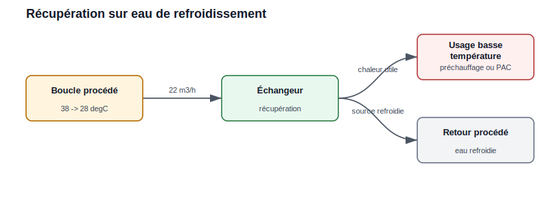
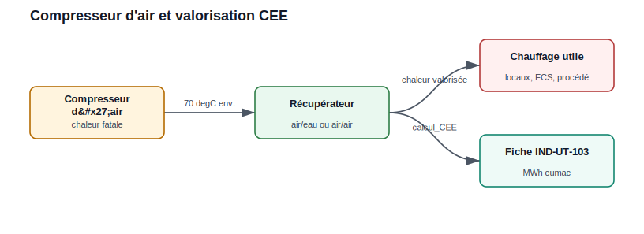
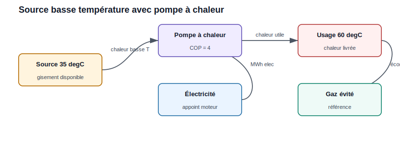
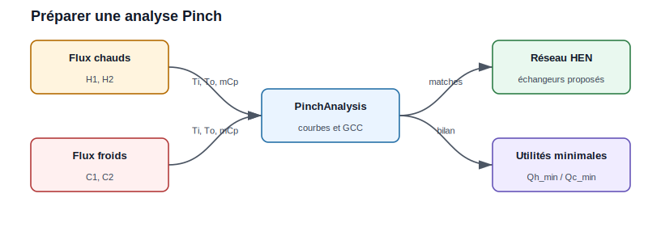

Exemples utilisateur
====================

Exemple 1 : récupération sur eau de refroidissement
---------------------------------------------------

Une boucle d'eau sort d'un procédé à ``38 degC`` et peut être refroidie jusqu'à
``28 degC`` avant retour. Le débit est de ``22 m3/h`` et le site fonctionne
``6 500 h/an``.

   La source basse température est séparée de l'usage par un échangeur.

.. code-block:: python

   debit_m3_h = 22
   rho = 1000
   cp = 4.18
   t_source = 38
   t_retour = 28
   heures = 6500

   debit_kg_s = debit_m3_h * rho / 3600
   puissance_kw = debit_kg_s * cp * (t_source - t_retour)
   energie_mwh = puissance_kw * heures / 1000

   print(f"Puissance récupérable : {puissance_kw:.1f} kW")
   print(f"Energie annuelle : {energie_mwh:.0f} MWh/an")

Lecture pour l'utilisateur :

* le gisement est basse température ;
* il peut alimenter un préchauffage ou l'évaporateur d'une pompe à chaleur ;
* la valeur dépend fortement de la simultanéité avec le besoin.

Exemple 2 : récupération sur compresseur d'air et CEE
-----------------------------------------------------

La chaleur d'un compresseur peut être récupérée pour le chauffage de locaux,
l'eau chaude sanitaire ou un procédé. Le module ``CEE`` permet d'estimer un
volume de CEE pour une fiche industrielle supportée.

   Le récupérateur transforme un rejet thermique en chaleur utile et en volume
   CEE estimable.

.. code-block:: python

   from CEE.CEE import calcul_CEE

   details = calcul_CEE(
       fiche="IND-UT-103",
       return_details=True,
       fonctionnement="2*8h",
       Department=69,
       Heat_Use="chauffage de locaux",
       puissance_nominale=90,
   )

   print(details["titre"])
   print(f"{details['MWh_cumac']:.1f} MWh cumac")

À expliquer dans le rapport :

* la puissance nominale représente le gisement pris en compte par la fiche ;
* le département influence la zone climatique pour les usages bâtiment ;
* le résultat CEE ne remplace pas la validation réglementaire du dossier.

Exemple 3 : comparer récupération directe et pompe à chaleur
------------------------------------------------------------

Une source à ``35 degC`` ne peut pas alimenter directement un usage à
``60 degC``. On compare alors la récupération directe utilisable à basse
température avec une pompe à chaleur.

   La pompe à chaleur relève le niveau de température au prix d'une
   consommation électrique.

.. code-block:: python

   puissance_source_kw = 180
   heures = 5000
   cop_pac = 4.0
   prix_elec_eur_mwh = 120
   prix_gaz_eur_mwh = 55

   chaleur_livree_mwh = puissance_source_kw * heures / 1000
   electricite_pac_mwh = chaleur_livree_mwh / cop_pac
   gaz_evite_mwh = chaleur_livree_mwh

   cout_pac = electricite_pac_mwh * prix_elec_eur_mwh
   gain_gaz = gaz_evite_mwh * prix_gaz_eur_mwh
   gain_net = gain_gaz - cout_pac

   print(f"Chaleur livrée : {chaleur_livree_mwh:.0f} MWh/an")
   print(f"Electricité PAC : {electricite_pac_mwh:.0f} MWh/an")
   print(f"Gain net énergie : {gain_net:.0f} EUR/an")

Interprétation :

* si le gain net est négatif, la pompe à chaleur n'est pas pertinente avec ces
  hypothèses de prix ;
* si le gaz évité est cher ou carboné, l'intérêt augmente ;
* le COP réel doit être recalculé avec les températures source et usage.

Exemple 4 : préparer une analyse Pinch
--------------------------------------

Lorsque plusieurs flux chauds et froids existent, l'analyse Pinch permet
d'identifier la récupération maximale théorique avant de dessiner les
échangeurs.

   Les flux chauds et froids alimentent l'analyse, qui fournit les utilités
   minimales et les appariements d'échange.

.. code-block:: python

   import pandas as pd
   from PinchAnalysis import PinchAnalysis

   df = pd.DataFrame({
       "Ti": [180, 95, 25, 45],
       "To": [70, 45, 120, 140],
       "mCp": [2.4, 3.1, 2.0, 1.8],
       "dTmin2": [5, 5, 5, 5],
       "integration": [True, True, True, True],
   })

   pinch = PinchAnalysis.Object(df)

   print(f"Pinch : {pinch.T_pinch} degC")
   print(f"Utilité chaude minimale : {pinch.Qh_min:.1f} kW")
   print(f"Utilité froide minimale : {pinch.Qc_min:.1f} kW")

   pinch.plot_composites_curves()
   pinch.plot_GCC()

Ce cas est à utiliser quand l'utilisateur veut passer d'un simple inventaire à
une stratégie d'intégration thermique complète.
