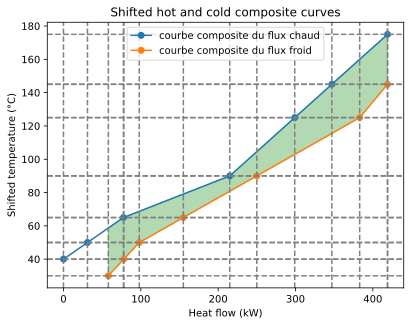
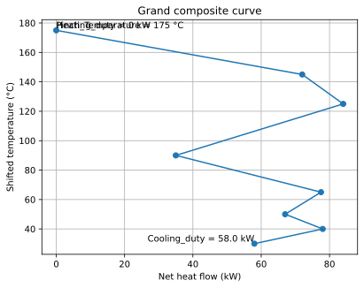

12. Chaleur fatale et rejets
============================

La chaleur fatale, ce sont les rejets thermiques d'un site (fumées, air
extrait, eau de refroidissement, condensats, compresseurs…) qu'on peut
récupérer au lieu de les perdre. Quand plusieurs flux chauds et froids
coexistent, l'analyse Pinch identifie la **récupération maximale théorique** et
les utilités qui restent réellement nécessaires. Cette page déroule **un seul
cas de bout en bout** avec le module ``PinchAnalysis`` : le code, ses sorties
réelles, puis leur interprétation.

Le problème
-----------

.. figure:: ../images/012_chaleur_fatale_pinch.svg
   :alt: Schéma de préparation d'une analyse Pinch
   :align: center

   Les flux chauds (rejets à valoriser) et froids (besoins à couvrir)
   alimentent l'analyse, qui fournit les utilités minimales et les appariements
   d'échange.

On considère deux rejets chauds (H1, H2) et deux besoins froids (C1, C2), avec
``ΔTmin = 10 °C`` (soit ``dTmin2 = 5 K``) :

.. list-table::
   :widths: 12 12 14 14 14 34
   :header-rows: 1

   * - Flux
     - Type
     - Ti [°C]
     - To [°C]
     - mCp [kW/K]
     - Rôle
   * - H1
     - chaud
     - 180
     - 70
     - 2,4
     - rejet chaud à refroidir
   * - H2
     - chaud
     - 95
     - 45
     - 3,1
     - rejet chaud à refroidir
   * - C1
     - froid
     - 25
     - 120
     - 2,0
     - besoin à chauffer
   * - C2
     - froid
     - 45
     - 140
     - 1,8
     - besoin à chauffer

Le code
-------

.. code-block:: python

   import pandas as pd
   from PinchAnalysis import PinchAnalysis

   # id, name requis ; Ti/To en °C ; mCp en kW/K ; dTmin2 = ΔTmin/2
   df = pd.DataFrame({
       "id": [1, 2, 3, 4],
       "name": ["H1", "H2", "C1", "C2"],
       "Ti": [180, 95, 25, 45],
       "To": [70, 45, 120, 140],
       "mCp": [2.4, 3.1, 2.0, 1.8],
       "dTmin2": [5, 5, 5, 5],
       "integration": [True, True, True, True],
   })

   pinch = PinchAnalysis.Object(df)

   print(f"Pincement                : {pinch.Pinch_Temperature} °C")
   print(f"Utilité chaude minimale  : {pinch.Heating_duty} kW")
   print(f"Utilité froide minimale  : {pinch.Cooling_duty} kW")
   print(f"Chaleur récupérable      : {pinch.heat_recovery} kW")

   pinch.plot_composites_curves()
   pinch.plot_GCC()

Les résultats
-------------

**Indicateurs de synthèse** (sortie console) :

.. code-block:: text

   Pincement                : 175 °C
   Utilité chaude minimale  : 0 kW
   Utilité froide minimale  : 58.0 kW
   Chaleur récupérable      : 361.0 kW

**Courbes composites** — ``pinch.plot_composites_curves()`` :

   Composites chaude et froide en températures décalées ; le recouvrement
   horizontal correspond aux 361 kW récupérables.

**Grande courbe composite (GCC)** — ``pinch.plot_GCC()`` :

   La GCC ne s'ouvre que vers le bas : l'utilité chaude est nulle et il ne reste
   qu'une utilité froide résiduelle de 58 kW.

Les explications
----------------

Ici l'**utilité chaude minimale est nulle** : par intégration, les rejets
chauds fournissent la totalité du besoin de chauffe des flux froids. Il ne reste
qu'une utilité froide de **58 kW** à évacuer, pour **361 kW récupérés** entre les
flux. Autrement dit, aucun appoint de vapeur ou de gaz n'est nécessaire pour
chauffer C1 et C2 — seul un refroidissement d'appoint subsiste.

Ce cas est typique d'un site où la chaleur fatale est *sur-abondante* par
rapport aux besoins : la priorité n'est plus de trouver une source de chaleur,
mais d'utiliser au mieux le surplus (préchauffage, réseau de chaleur, ou pompe à
chaleur si les niveaux de température ne coïncident pas).

.. note:: **Valorisation en CEE**

   La récupération de chaleur sur un rejet thermique (compresseur d'air, fumées…)
   peut être valorisée en Certificats d'Économies d'Énergie via la fiche
   ``IND-UT-103``. Le calcul CEE est traité au chapitre dédié :
   voir :doc:`../011-cee/module_cee` (« Exemple 3 : récupération de chaleur sur
   compresseur d'air »).
