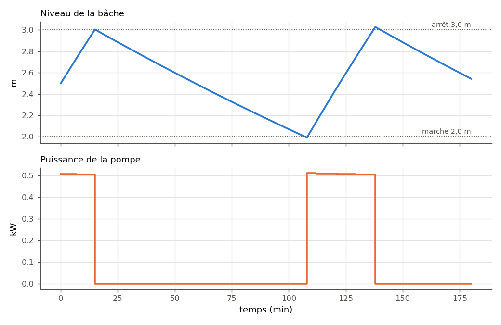

.. _bache_niveau:

Bâche et niveau
===============

Une **bâche** (réservoir à surface libre) a une mémoire : son niveau monte
quand il entre plus d'eau qu'il n'en sort, et baisse dans le cas contraire. Le
nœud **Bâche (niveau variable)** de PyqtSimulator et le bouton
:doc:`Simulation temporelle <simulation_temporelle>` suivent ce niveau dans le
temps, avec une pompe qui démarre et s'arrête sur des seuils de niveau.

Le modèle appliqué à chaque pas :

.. math::

   A\,\frac{dh}{dt} = Q_\text{entrant} - Q_\text{sortant},
   \qquad p_\text{fond} = P_\text{ciel} + \rho\,g\,h

La pression au fond, qui dépend du niveau, est imposée au réseau ; les débits
qui en résultent font évoluer le niveau au pas suivant.

.. figure:: ../images/scene_bache_niveau.svg
   :alt: Scène PyqtSimulator « Remplissage regule par niveau »
   :align: center
   :width: 100%

   L'exemple livré **3 - Hydraulique › Baches › Remplissage regule par
   niveau** : réserve → pompe de remplissage → clapet → refoulement DN32 →
   bâche de 3 m² → départ DN50 → vanne d'usage (Kv 4) → rejet. Deux capteurs
   mesurent le débit de remplissage et le débit d'usage.

----

Les champs à connaître
----------------------

Sur le nœud **Bâche (niveau variable)** :

.. list-table::
   :header-rows: 1
   :widths: 34 14 52

   * - Champ
     - Exemple
     - Rôle
   * - Section de la bâche (m²)
     - 3,0
     - Surface libre : 1 m³ entré fait monter le niveau de 1/3 m.
   * - Niveau initial (m)
     - 2,5
     - État de départ ; jamais modifié par la simulation.
   * - Niveau bas d'alarme (m)
     - 0,2
     - Franchi : la simulation **s'arrête** (« bâche vide »).
   * - Niveau haut d'alarme (m)
     - 4,0
     - Franchi : la simulation **s'arrête** (« déborde »).
   * - Pression du ciel (bar abs)
     - 1,01325
     - Bâche à l'atmosphère, ou sous pression.

Sur le nœud **Pompe**, trois champs régulent sur le niveau :

- **Bâche pilote** : le **titre** exact du nœud bâche (« Bâche de stockage ») ;
- **Niveau de marche (m)** et **Niveau d'arrêt (m)** : si marche < arrêt, c'est
  une pompe de **remplissage** (elle démarre quand le niveau descend sous 2,0 m
  et s'arrête à 3,0 m) ; dans l'autre sens, une pompe de **vidange**.

----

Exemple : trois heures de fonctionnement
----------------------------------------

Le bouton lance ``simulate_scene`` ; la même chose en Python, avec les valeurs
proposées par l'IHM pour une scène sans PID (pas de 60 s) :

.. code-block:: python

   import json
   from pathlib import Path

   import PyqtSimulator
   from energysystemmodels import adapters      # passerelle scène IHM -> calcul

   legacy_scene_to_model = adapters.legacy_scene_to_model
   simulate_scene = adapters.nodal_network.simulate_scene

   EXEMPLES = Path(PyqtSimulator.__file__).parent / "json"
   fichier = EXEMPLES / "3 - Hydraulique" / "Baches" / "Remplissage regule par niveau.json"
   scene = json.loads(fichier.read_text(encoding="utf-8"))

   def simuler(scene, duree_h=3.0, pas_s=60.0):
       sim, tr = simulate_scene(legacy_scene_to_model(scene).model, duree_h * 3600.0, pas_s)
       (niveaux,) = sim.levels.values()                 # une seule bâche
       (puissance,) = sim.pump_power_W.values()         # une seule pompe
       (energie,) = sim.pump_energy_kWh.values()
       demarrages = sum(1 for a, b in zip(puissance, puissance[1:]) if a == 0 and b > 0)
       print(f"{sim.steps} pas, terminée : {sim.completed}")
       print(f"Énergie de la pompe : {energie:.3f} kWh, démarrages : {demarrages}")
       for t, texte in sim.events:
           print(f"Événement à {t / 60:.0f} min : {texte}")
       return sim, niveaux, puissance

   sim, niveaux, puissance = simuler(scene)
   for k in range(0, len(sim.times), 15):
       etat = "marche" if puissance[k] > 0 else "arrêt"
       print(f"{sim.times[k] / 60:4.0f} min  niveau {niveaux[k]:.3f} m  pompe {etat}")

Sortie réelle :

.. code-block:: text

   180 pas, terminée : True
   Énergie de la pompe : 0.376 kWh, démarrages : 1
      0 min  niveau 2.500 m  pompe marche
     15 min  niveau 3.005 m  pompe arrêt
     30 min  niveau 2.827 m  pompe arrêt
     45 min  niveau 2.656 m  pompe arrêt
     60 min  niveau 2.489 m  pompe arrêt
     75 min  niveau 2.328 m  pompe arrêt
     90 min  niveau 2.172 m  pompe arrêt
    105 min  niveau 2.022 m  pompe arrêt
    120 min  niveau 2.421 m  pompe marche
    135 min  niveau 2.930 m  pompe marche
    150 min  niveau 2.885 m  pompe arrêt
    165 min  niveau 2.712 m  pompe arrêt
    180 min  niveau 2.543 m  pompe arrêt

   Niveau de la bâche (en haut) et puissance de la pompe (en bas), tels que
   les trace la fenêtre « Simulation temporelle ».

Lecture :

- la pompe (≈ 8,2 m³/h) remplit plus vite que l'usage (≈ 2,0 m³/h) ne vide :
  le niveau monte de 2,5 à 3,0 m en moins d'un quart d'heure, et la pompe
  s'arrête ;
- à l'arrêt, l'usage vide la bâche à ≈ 0,67 m/h (2 m³/h sur 3 m²) : il faut
  1 h 30 pour redescendre à 2,0 m, où la pompe redémarre ;
- sur 3 h, la pompe a tourné environ 45 min (≈ 0,5 kW) pour **0,376 kWh**. La bande
  d'hystérésis (1 m ici) fixe le nombre de démarrages par heure : c'est le
  réglage qui ménage le moteur.

----

Paramètres à personnaliser
--------------------------

.. list-table::
   :header-rows: 1
   :widths: 32 20 48

   * - Paramètre
     - Où
     - Effet
   * - Section de la bâche
     - nœud Bâche (``area``)
     - Double la section : le niveau varie deux fois moins vite, la pompe
       démarre deux fois moins souvent.
   * - Niveau de marche / d'arrêt
     - nœud Pompe (``ctrl_on`` / ``ctrl_off``)
     - Bande d'hystérésis : plus large, moins de démarrages. Deux valeurs égales
       sont refusées.
   * - Bâche pilote
     - nœud Pompe (``ctrl_tank``)
     - Titre de la bâche ; vide = pompe non régulée (voir la variante).
   * - Kv de la vanne d'usage
     - nœud Vanne (``kvs``)
     - Débit d'usage, donc vitesse de vidange.
   * - Durée, pas
     - boîtes de dialogue
     - 360 min et 60 s proposés ; en Python, ``simulate_scene(model, durée_s,
       pas_s)``.

Variante : la même installation sans régulation de niveau
---------------------------------------------------------

On vide le champ « Bâche pilote » de la pompe : elle tourne en permanence.

.. code-block:: python

   # variante : pompe sans régulation de niveau (champ « Bâche pilote » vide)
   import copy

   scene_sans_regulation = copy.deepcopy(scene)
   for noeud in scene_sans_regulation["nodes"]:
       if noeud["title"] == "Pompe de remplissage":
           noeud["content"]["ctrl_tank"] = ""

   sim2, niveaux2, _ = simuler(scene_sans_regulation)
   print(f"Dernier niveau calculé : {niveaux2[-1]:.3f} m à {sim2.times[-1] / 60:.0f} min")

Sortie réelle :

.. code-block:: text

   47 pas, terminée : False
   Énergie de la pompe : 0.393 kWh, démarrages : 0
   Événement à 48 min : bache tank:2183062111968 DEBORDE : niveau 4.0257 m > maximum 4.0000 m
   Dernier niveau calculé : 3.996 m à 47 min

Sans régulation, la bâche **déborde au bout de 48 min** : la simulation s'arrête
sur l'alarme haute (« INTERROMPUE » dans la fenêtre de l'IHM) au lieu d'écrêter
le niveau. C'est voulu : un débordement est un défaut de conception, pas un
régime.

----

Pièges
------

- Les niveaux d'alarme **arrêtent** la simulation ; ce ne sont pas des butées.
  Un niveau initial hors de [bas ; haut] est refusé dès le départ.
- La **Bâche pilote** se désigne par son **titre** : renommer la bâche sans
  mettre à jour la pompe fait échouer la simulation (« bache pilote …
  introuvable ou ambigue »). Deux bâches du même titre aussi.
- Le message d'alarme désigne la bâche par son identifiant interne
  (« bache tank:2183062111968 ») et non par son titre.
- Le calcul permanent (**Simuler**) ne fait pas bouger le niveau : il impose la
  pression du fond au niveau initial.
- Le réseau est **isotherme** : la température de l'eau de la bâche ne varie
  pas. Pour un stockage chaud, voir :doc:`ballon_stratifie_temps`.
- Trois heures au pas de 60 s demandent environ une minute de calcul :
  commencez par une durée courte.

Voir aussi
----------

- :doc:`simulation_temporelle` — le bouton, les résultats, l'historique ;
- :doc:`../004-hydraulic/resolution_circuit` — le calcul du réseau à chaque
  pas ;
- :doc:`../002-thermodynamic_cycles/pompe` — la pompe et sa courbe.
