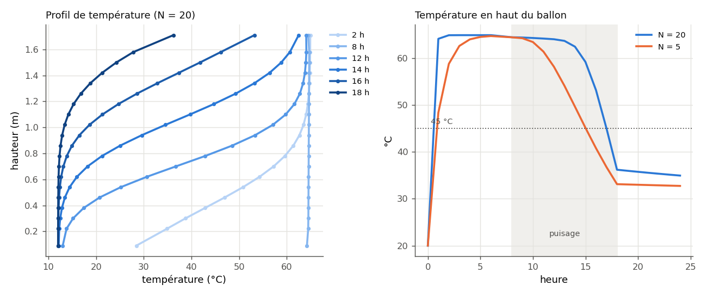
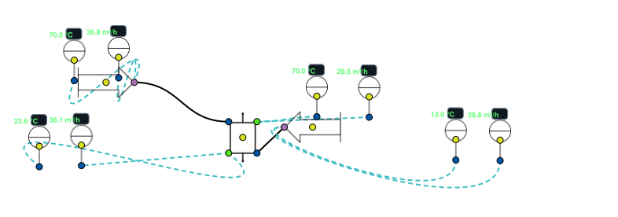

.. _ballon_stratifie_temps:

Ballon stratifié dans le temps
==============================

Un ballon d'eau chaude **stratifié** garde l'eau chaude en haut et l'eau froide
en bas, séparées par une zone de transition : la **thermocline**. Tant que la
thermocline n'atteint pas le piquage de puisage, l'eau sort chaude ; quand elle
l'atteint, la température de sortie chute en quelques heures. Savoir **quand**
demande une simulation dans le temps.

Le modèle ``ThermodynamicCycles.Tank.StratifiedStorageTank`` (fiche détaillée :
:doc:`../002-thermodynamic_cycles/ballon_stratifie`) découpe le ballon en ``N``
couches et avance de ``t`` secondes à chaque ``calculate()``. **C'est vous qui
tenez l'horloge** : une boucle Python, ou le nœud de l'IHM.

   Journée type de l'exemple ci-dessous : à gauche, le profil de température
   (hauteur en ordonnée) à différentes heures — la thermocline monte pendant le
   puisage ; à droite, la température en haut du ballon selon le nombre de
   couches ``N``.

----

Exemple : une journée de charge et de puisage
---------------------------------------------

Ballon de 900 L (1,8 m × Ø 0,8 m), 20 couches, isolé (U = 0,5 W/m²/K), local à
15 °C, initialement à 20 °C. Programme horaire :

- **0 h – 6 h, charge** : 0,1 kg/s d'eau à 65 °C entre en haut (``port_hot_a``) ;
  la même quantité ressort en bas vers le générateur (``port_cold_b``) ;
- **8 h – 18 h, puisage** : 0,025 kg/s (90 L/h) d'eau de ville à 12 °C entre en
  bas (``port_cold_a``) et chasse l'eau chaude par le haut (``port_hot_b``) ;
- le reste du temps, repos (seules les pertes et la conduction agissent).

.. code-block:: python

   from ThermodynamicCycles.Tank import StratifiedStorageTank
   from ThermodynamicCycles.FluidPort.FluidPort import ThermoPropsSI

   P = 3e5                                             # Pa
   h65 = ThermoPropsSI("H", "P", P, "T", 65 + 273.15, "water")
   h12 = ThermoPropsSI("H", "P", P, "T", 12 + 273.15, "water")

   def journee(N=20, afficher=True):
       ballon = StratifiedStorageTank.Object()
       ballon.Hball, ballon.Dball, ballon.N = 1.8, 0.8, N    # m, m, couches
       ballon.U, ballon.Tamb_degC, ballon.Tinit_degC = 0.5, 15.0, 20.0
       ballon.t = 3600                                       # un pas = 1 h
       for port, h in ((ballon.port_hot_a, h65), (ballon.port_cold_a, h12)):
           port.fluid, port.P, port.h = "water", P, h
       T_haut = []
       for heure in range(24):
           ballon.port_hot_a.F = 0.1 if heure < 6 else 0.0          # charge
           ballon.port_cold_a.F = 0.025 if 8 <= heure < 18 else 0.0  # puisage
           ballon.Timestamp = heure * 3600.0
           ballon.calculate()
           T_haut.append(ballon.T_degC[0])
           if afficher and (heure + 1) % 2 == 0:
               print(f"{heure + 1:2d} h  haut {ballon.T_degC[0]:5.1f} °C  "
                     f"bas {ballon.T_degC[-1]:5.1f} °C  "
                     f"stock {ballon.cumul_Qstr_kWh:6.2f} kWh")
       return ballon, T_haut

   ballon, T_haut = journee()
   print(f"Volume {ballon.V * 1000:.0f} L, sous-pas d'intégration {ballon.effective_substeps}")
   print("Heures de puisage à plus de 45 °C :",
         sum(1 for h in range(8, 18) if T_haut[h] >= 45.0))

Sortie réelle :

.. code-block:: text

    2 h  haut  64.9 °C  bas  28.4 °C  stock  36.78 kWh
    4 h  haut  64.9 °C  bas  64.1 °C  stock  47.15 kWh
    6 h  haut  64.9 °C  bas  64.7 °C  stock  47.23 kWh
    8 h  haut  64.5 °C  bas  64.2 °C  stock  46.95 kWh
   10 h  haut  64.3 °C  bas  19.1 °C  stock  35.69 kWh
   12 h  haut  64.1 °C  bas  13.0 °C  stock  24.56 kWh
   14 h  haut  62.5 °C  bas  12.1 °C  stock  13.62 kWh
   16 h  haut  53.2 °C  bas  12.0 °C  stock   3.75 kWh
   18 h  haut  36.2 °C  bas  12.0 °C  stock  -3.16 kWh
   20 h  haut  35.8 °C  bas  12.0 °C  stock  -3.14 kWh
   22 h  haut  35.3 °C  bas  12.1 °C  stock  -3.13 kWh
   24 h  haut  35.0 °C  bas  12.1 °C  stock  -3.12 kWh
   Volume 905 L, sous-pas d'intégration 100
   Heures de puisage à plus de 45 °C : 9

Comment lire la journée :

- **la charge est faite en 4 h** : 47 kWh stockés, soit 905 kg portés de 20 à
  65 °C ; les deux dernières heures de charge n'apportent plus rien (l'eau
  ressort en bas à 64,7 °C, elle retourne au générateur sans avoir cédé sa
  chaleur) ;
- **pendant le puisage**, le bas se refroidit tout de suite (12 °C à 12 h) mais
  le haut reste au-dessus de 62 °C jusqu'à 14 h : c'est la stratification ;
- **la thermocline atteint le haut vers 15 h** : la température de sortie tombe
  de 62,5 à 36,2 °C en 4 h. Sur 10 h de puisage, 9 h se terminent avec une
  eau de sortie à plus de 45 °C ;
- le stock passe **sous zéro** (−3,1 kWh) : il est compté par rapport à l'état
  initial à 20 °C, et le bas du ballon est maintenant à 12 °C.

Ce que fait le nœud « Ballon stratifie » de l'IHM
-------------------------------------------------

   L'exemple livré **4 - Composants et utilites › Ballon stratifie** : deux
   sources (70 °C en haut à gauche, 12 °C en bas à droite), le ballon, et des
   capteurs de débit et de température sur chaque piquage.

Le nœud n'utilise **pas** le bouton « Simulation temporelle » : il a sa propre
horloge. À l'ouverture de la scène, il calcule un **premier pas** de la durée
saisie dans « Pas initial du modele (s) » (3600 s dans l'exemple), puis, si
« Evolution automatique » vaut « Oui », il avance de **1 s de temps simulé par
seconde réelle**. Les résultats « Pas physiques calcules » et « Temps simule
(s) » comptent ces pas ; les courbes « Profil de température » et « Énergie
stockée/déstockée » se mettent à jour en direct. Modifier la géométrie, le
nombre de couches ou la température initiale **repart de zéro** ; modifier le pas
initial relance seulement un grand pas.

La même séquence, en Python, avec les valeurs de la scène livrée :

.. code-block:: python

   # suite : le nœud de l'IHM, champ par champ
   scene = StratifiedStorageTank.Object()
   scene.Hball, scene.Dball, scene.N = 1.0, 1.78412396043743, 30   # Hauteur, Diametre, couches
   scene.U, scene.Tamb_degC, scene.Tinit_degC = 1.0, 20.0, 50.0     # Pertes U, ambiante, initiale
   scene.n_substeps = 20                                           # Sous-pas integration
   rho70 = ThermoPropsSI("D", "P", 101325, "T", 70 + 273.15, "water")
   rho12 = ThermoPropsSI("D", "P", 101325, "T", 12 + 273.15, "water")
   for port, T, debit_m3h, rho in ((scene.port_hot_a, 70.0, 10.0, rho70),
                                   (scene.port_cold_a, 12.0, 8.0, rho12)):
       port.fluid, port.P = "water", 101325.0
       port.h = ThermoPropsSI("H", "P", 101325.0, "T", T + 273.15, "water")
       port.F = debit_m3h * rho / 3600.0                            # m³/h -> kg/s

   scene.t = 3600.0                  # « Pas initial du modele (s) »
   scene.calculate()
   print(f"Après le pas initial : haut {scene.T_degC[0]:.2f} °C, bas {scene.T_degC[-1]:.2f} °C, "
         f"énergie cumulée {scene.cumul_Qstr_kWh:.2f} kWh, sous-pas {scene.effective_substeps}")

   scene.t = 1.0                     # puis 1 s par seconde réelle
   for _ in range(60):
       scene.calculate()
   print(f"Une minute plus tard : haut {scene.T_degC[0]:.2f} °C, bas {scene.T_degC[-1]:.2f} °C")
   print(f"Sorties : haut {scene.port_hot_b.F:.3f} kg/s, bas {scene.port_cold_b.F:.3f} kg/s")

Sortie réelle :

.. code-block:: text

   Après le pas initial : haut 69.99 °C, bas 19.34 °C, énergie cumulée 37.91 kWh, sous-pas 613
   Une minute plus tard : haut 69.99 °C, bas 19.41 °C
   Sorties : haut 2.221 kg/s, bas 2.716 kg/s

Dans la scène, les deux entrées débitent **en même temps** : 10 m³/h à 70 °C par
le haut, 8 m³/h à 12 °C par le bas. Ce qui entre à gauche ressort à gauche
(haut → bas, 2,72 kg/s), ce qui entre à droite ressort à droite (bas → haut,
2,22 kg/s) : c'est la convention du nœud, celle d'un ballon traversé en
contre-courant. Le ballon de 2,5 m³ voit passer 18 m³/h : dès le pas initial,
il a atteint son régime — 70 °C en haut, 19,3 °C en bas — et une minute de plus
ne change presque rien. Le nombre de sous-pas est monté seul de 20 à 613 : le
débit est grand devant le volume d'une couche (critère de stabilité).

----

Paramètres à personnaliser
--------------------------

.. list-table::
   :header-rows: 1
   :widths: 20 24 18 38

   * - Attribut
     - Champ du nœud
     - Plage usuelle
     - Effet
   * - ``Hball``, ``Dball``
     - Hauteur, Diametre ballon (m)
     - 1–3 m ; H/D ≥ 2
     - Volume, et surtout élancement : un ballon haut et mince stratifie mieux.
   * - ``N``
     - Nombre de couches
     - **5** à 50
     - Finesse de la thermocline ; trop peu de couches la « bave » (variante).
       En dessous de 5, la géométrie devient fausse (voir les pièges).
   * - ``U``
     - Pertes U (W/m²/K)
     - 0,3 (bien isolé) à 2
     - Pertes vers le local, surtout sensibles au repos.
   * - ``Tamb_degC``, ``Tinit_degC``
     - Temperature ambiante, initiale
     - —
     - Local, et état de départ uniforme ; l'énergie stockée est comptée
       depuis ``Tinit_degC``.
   * - ``t``
     - Pas initial du modele (s)
     - 60 à 3600 s
     - Durée d'un ``calculate()``. Le nombre de sous-pas se relève tout seul
       si le débit l'exige (``effective_substeps``).
   * - ``n_substeps``
     - Sous-pas integration
     - 20 à 100
     - Minimum de sous-pas d'Euler par pas.
   * - ``port_*.F``, ``port_*.h``
     - débit et température des sources
     - —
     - Programme de charge et de puisage : c'est votre boucle qui le fixe à
       chaque pas.

Variante : le même ballon découpé en 5 couches
----------------------------------------------

.. code-block:: python

   # variante : 5 couches au lieu de 20, même journée
   ballon5, T_haut5 = journee(N=5, afficher=False)
   for h in (10, 12, 14, 16):
       print(f"{h} h  haut : N=20 {T_haut[h - 1]:5.1f} °C   N=5 {T_haut5[h - 1]:5.1f} °C")
   print("Heures de puisage à plus de 45 °C, N=5 :",
         sum(1 for h in range(8, 18) if T_haut5[h] >= 45.0))

Sortie réelle :

.. code-block:: text

   10 h  haut : N=20  64.3 °C   N=5  63.5 °C
   12 h  haut : N=20  64.1 °C   N=5  58.2 °C
   14 h  haut : N=20  62.5 °C   N=5  49.7 °C
   16 h  haut : N=20  53.2 °C   N=5  40.8 °C
   Heures de puisage à plus de 45 °C, N=5 : 7

Avec 5 couches, le modèle **mélange artificiellement** le ballon : la
température de sortie baisse dès 10 h et le puisage n'est plus servi à 45 °C
que 7 h au lieu de 9. Pour dimensionner une autonomie, gardez 20 couches ou
plus ; le calcul reste instantané (moins d'une seconde pour la journée).

----

Pièges
------

.. warning::
   **Ne descendez pas sous 5 couches.** Les couches du haut et du bas ont une
   épaisseur ``2·Hball/N`` : avec ``N = 4`` elles occupent tout le ballon et le
   calcul s'arrête sur ``ZeroDivisionError`` ; avec ``N = 3`` elles dépassent sa
   hauteur, la couche du milieu a un **volume négatif** et le modèle rend des
   températures sans message. Le modèle n'exige que ``N >= 3`` (défaut consigné
   dans ``BUGS_LIB.md``).

- Le bilan de masse est automatique : ``port_hot_b.F = port_cold_a.F`` et
  ``port_cold_b.F = port_hot_a.F``. On ne règle que les **entrées**.
- Les températures d'entrée se donnent par l'**enthalpie** du port
  (``ThermoPropsSI("H", "P", P, "T", T, "water")``), en J/kg.
- ``cumul_Qstr_kWh`` part de ``Tinit_degC`` : il devient négatif si le ballon
  finit plus froid qu'au départ.
- Le nœud de l'IHM ne rejoue pas l'histoire : un pas initial de 3600 s suivi de
  1 s par seconde n'équivaut pas à un programme horaire. Pour un programme,
  écrivez la boucle Python ci-dessus.

Voir aussi
----------

- :doc:`../002-thermodynamic_cycles/ballon_stratifie` — équations, ports et
  sorties du modèle ;
- :doc:`simulation_temporelle` — le bouton de simulation des réseaux
  hydrauliques (isothermes) ;
- :doc:`regulation_pid` — piloter la charge par un régulateur.
