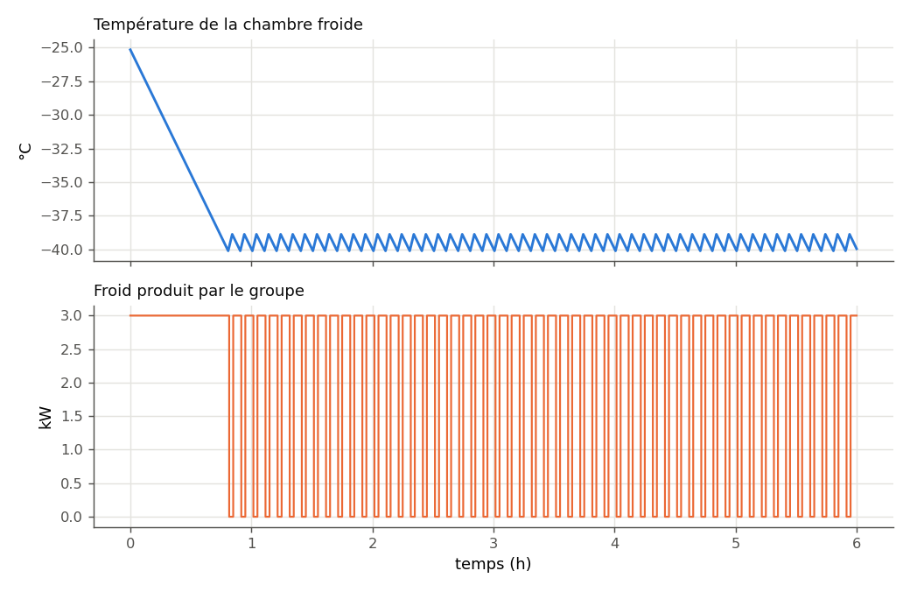

.. _chambre_froide_bang_bang:

Chambre froide tout-ou-rien
===========================

La régulation la plus répandue en froid n'est pas un PID : c'est le
**tout-ou-rien** (*bang-bang*). Le groupe démarre quand la température remonte
au seuil haut, s'arrête quand elle descend au seuil bas ; entre les deux, il
garde son état (**hystérésis**). Le nœud **Chambre froide bang-bang** de
PyqtSimulator simule cette boucle sur une durée donnée, à partir de deux
modèles :

- ``ThermodynamicCycles.Refrigeration.ColdStorageTank`` — la masse refroidie,
  en un seul bloc : :math:`m\,c_p\,\dfrac{dT}{dt} = Q_\text{air} - Q_f` ;
- ``ThermodynamicCycles.Refrigeration.RefrigerationBangBang`` — le groupe et son
  thermostat.

Le nœud n'a ni entrée ni sortie : il n'utilise pas le bouton « Simulation
temporelle », il calcule toute la durée demandée à chaque évaluation.

----

Exemple : six heures avec les valeurs du nœud
---------------------------------------------

La fonction ci-dessous refait, ligne pour ligne, la boucle du nœud
(``nodes/cold_storage_bang_bang.py``) ; ses arguments portent les champs du
nœud et leurs valeurs par défaut.

.. code-block:: python

   from ThermodynamicCycles.Refrigeration.ColdStorageTank import Object as ColdStorageTank
   from ThermodynamicCycles.Refrigeration.RefrigerationBangBang import Object as RefrigerationBangBang

   def chambre_froide(volume=0.06, rho=1060.0, cp=3060.0, q_air=2000.0, p_cold=3000.0,
                      demarrage=-39.0, arret=-40.0, initiale=-25.0, pas=30.0, duree_h=6.0):
       tank = ColdStorageTank()
       tank.V, tank.rho, tank.Cp = volume, rho, cp        # masse thermique équivalente
       tank.Q_air = q_air                                 # apports, W
       tank.t = pas                                       # s
       tank.T = 273.15 + initiale                         # K
       groupe = RefrigerationBangBang()
       groupe.T_opening = 273.15 + demarrage              # K
       groupe.T_closing = 273.15 + arret
       groupe.P_f_opening = p_cold                        # W froid quand il tourne
       groupe.is_on = tank.T >= groupe.T_opening
       temperatures, energie, bascules, avant = [], 0.0, 0, groupe.is_on
       for k in range(int(duree_h * 3600 / pas) + 1):
           groupe.Timestamp = tank.Timestamp = k * pas
           groupe.T_measured = tank.T
           groupe.calculate()
           bascules += int(groupe.is_on != avant)
           avant = groupe.is_on
           tank.Q_f_in = groupe.P_f_out
           tank.calculate()
           energie += groupe.P_f_out * pas / 3.6e6       # kWh de froid
           temperatures.append(tank.T - 273.15)
       return temperatures, energie, bascules, groupe.is_on

   T, E, n, marche = chambre_froide()
   print(f"Température finale {T[-1]:.2f} °C  (min {min(T):.2f}, max {max(T):.2f})")
   print(f"Froid produit {E:.3f} kWh, bascules marche/arrêt {n}, "
         f"groupe {'ON' if marche else 'OFF'}")
   t_cible = next(k for k, x in enumerate(T) if x <= -40.0) * 30 / 60
   print(f"-40 °C atteint après {t_cible:.1f} min")

Sortie réelle :

.. code-block:: text

   Température finale -39.95 °C  (min -40.11, max -25.15)
   Froid produit 12.825 kWh, bascules marche/arrêt 104, groupe ON
   -40 °C atteint après 48.5 min

Ce sont les six résultats du nœud : « Temperature finale », « minimale »,
« maximale », « Energie frigorifique (kWh) », « Transitions ON/OFF » et « Etat
final groupe ».

   Température (en haut) et puissance froid du groupe (en bas) : descente
   initiale, puis cycles entre −40 et −39 °C.

Lecture :

- partant de −25 °C, la masse (64 kg de saumure, soit 195 kJ/K) descend à
  −40 °C en 48,5 min : le groupe fournit 3 kW contre 2 kW d'apports, il ne
  reste que 1 kW pour la mise en froid ;
- ensuite, chaque cycle dure environ 5 min : un peu plus de 3 min de marche pour
  reprendre 1 K (1 kW net), puis 1 min 40 d'arrêt pendant que les 2 kW
  d'apports le rendent. D'où **104 bascules** (52 démarrages) en 6 h ;
- le froid produit, 12,8 kWh, correspond aux apports (2 kW × 6 h = 12 kWh)
  plus la mise en froid (15 K × 195 kJ/K = 0,8 kWh).

----

Paramètres à personnaliser
--------------------------

.. list-table::
   :header-rows: 1
   :widths: 28 22 14 36

   * - Champ du nœud
     - Attribut du modèle
     - Défaut
     - Effet
   * - Volume thermique (m3)
     - ``ColdStorageTank.V``
     - 0,06
     - Avec la masse volumique et la capacité : l'**inertie**. Plus grande,
       cycles plus longs et moins nombreux.
   * - Masse volumique, Capacite thermique
     - ``rho``, ``Cp``
     - 1060, 3060
     - Saumure par défaut ; 1000 et 4186 pour de l'eau.
   * - Apport thermique (W)
     - ``Q_air``
     - 2000
     - Apports (parois, ouvertures, produits). Au-delà de la puissance du
       groupe, la consigne n'est jamais tenue.
   * - Puissance frigorifique ON (W)
     - ``P_f_opening``
     - 3000
     - Froid produit quand le groupe tourne.
   * - Temperature demarrage / arret (degC)
     - ``T_opening`` / ``T_closing``
     - −39 / −40
     - Bande d'hystérésis ; le démarrage doit être au-dessus de l'arrêt.
   * - Temperature initiale (degC)
     - ``ColdStorageTank.T``
     - −25
     - État de départ (mise en froid).
   * - Pas de temps (s), Duree simulee (h)
     - ``ColdStorageTank.t``
     - 30, 6
     - Finesse et durée de la simulation.

Variante : élargir l'hystérésis à 3 K
-------------------------------------

.. code-block:: python

   # variante : démarrage -38 °C, arrêt -41 °C (bande de 3 K au lieu de 1 K)
   T3, E3, n3, _ = chambre_froide(demarrage=-38.0, arret=-41.0)
   print(f"Bande 1 K : {n} bascules, min {min(T):.2f} °C, max après 1 h {max(T[120:]):.2f} °C")
   print(f"Bande 3 K : {n3} bascules, min {min(T3):.2f} °C, max après 1 h {max(T3[120:]):.2f} °C")
   print(f"Froid produit : {E:.3f} -> {E3:.3f} kWh")

Sortie réelle :

.. code-block:: text

   Bande 1 K : 104 bascules, min -40.11 °C, max après 1 h -38.87 °C
   Bande 3 K : 42 bascules, min -41.03 °C, max après 1 h -37.95 °C
   Froid produit : 12.825 -> 12.775 kWh

Une bande trois fois plus large divise par 2,5 le nombre de démarrages (21 au
lieu de 52 en 6 h), pour la même énergie : c'est le compresseur qu'on ménage.
En contrepartie, la chambre oscille entre −41 et −38 °C au lieu de −40 et
−39 °C : à régler selon la tolérance des produits stockés.

----

Pièges
------

- Le thermostat n'agit qu'une fois par pas : la température **dépasse** les
  seuils d'au plus un pas de variation (−40,11 °C pour un arrêt à −40 °C, au pas
  de 30 s). Avec une petite inertie ou un grand pas, le dépassement grandit et
  le nombre de bascules est faussé : gardez un pas bien inférieur à la durée
  d'un cycle.
- « Transitions ON/OFF » compte les changements d'état, marche **et** arrêt :
  le nombre de démarrages en est la moitié.

- Le démarrage doit être **supérieur** à l'arrêt, sinon le nœud refuse : « La
  temperature de demarrage doit etre superieure a celle d arret ».
- Le « Volume thermique » est une **masse équivalente**, pas le volume de la
  chambre : 0,06 m³ de saumure, c'est l'inertie d'une petite cellule ou d'un
  bac, pas celle d'un entrepôt.
- Les deux modèles, leurs équations et leur couplage en Python sont décrits
  dans :doc:`../002-thermodynamic_cycles/refrigeration`.

Voir aussi
----------

- :doc:`../002-thermodynamic_cycles/refrigeration` — les modèles
  ``ColdStorageTank`` et ``RefrigerationBangBang`` ;
- :doc:`regulation_pid` — la régulation continue, pour comparaison ;
- :doc:`simulation_temporelle` — les autres simulations dans le temps.
