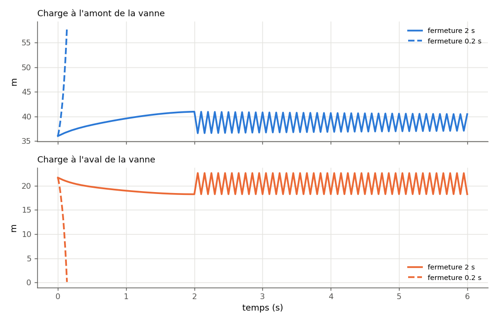

.. _coup_de_belier_ihm:

Coup de bélier
==============

Fermer une vanne arrête une colonne d'eau en mouvement. Si la fermeture est
**lente** devant le temps d'aller-retour d'une onde de pression dans la conduite
(:math:`2L/c`), la pression monte doucement ; si elle est **rapide**, une onde
de surpression remonte la conduite et une dépression s'ouvre à l'aval — jusqu'à
vaporiser l'eau (**cavitation**, rupture de colonne).

Le bouton **Coup de bélier** de PyqtSimulator calcule ce régime transitoire sur
n'importe quelle scène hydraulique : il part du **régime permanent** de la scène
(solveur nodal), ferme la vanne choisie, et propage les ondes par la **méthode
des caractéristiques** (validée contre Frelin, *Techniques de l'Ingénieur*
BM 4 176). Le modèle de calcul lui-même est décrit dans
:doc:`../004-hydraulic/coups_de_belier`.

.. figure:: ../images/schema_coup_de_belier.svg
   :alt: Principe du coup de bélier
   :align: center
   :width: 100%

   Fermer la vanne arrête la colonne : l'onde de surpression remonte la
   conduite à la célérité :math:`c`.

----

Dans l'IHM
----------

Scène ouverte, cliquer **Coup de bélier**. Quatre questions se succèdent :

.. list-table::
   :header-rows: 1
   :widths: 32 16 52

   * - Question
     - Proposé
     - Ce qu'on saisit
   * - Vanne qui se ferme
     - liste
     - Les vannes de la scène, par leur titre (vanne générique, à boisseau,
       papillon, clapet…).
   * - Durée de fermeture (s)
     - 2
     - Temps de manœuvre de l'organe, loi de fermeture de Frelin (§ 4.5).
   * - Célérité des ondes (m/s)
     - 1200
     - Acier : 1 000 à 1 300 m/s ; PEHD : 200 à 400 m/s.
   * - Durée simulée (s)
     - max(5, 3 × fermeture)
     - Assez pour voir la fermeture et quelques allers-retours d'onde.

La fenêtre **Coup de bélier** trace la **charge** (en mètres de colonne d'eau)
juste à l'amont et juste à l'aval de la vanne, puis donne le résumé : charges
extrêmes, surpression de **Joukowsky** (fermeture instantanée, pour ordre de
grandeur), événements (cavitation, inversion de débit au travers d'un clapet) et
approximations faites en convertissant la scène (tuyaux de moins de 20 m traités
en pertes concentrées).

----

Exemple : fermer en 2 s la vanne de régulation
----------------------------------------------

La scène « Régulation de débit par PID » (pompe, 2 × 30 m de DN40, vanne Kvs 25
ouverte à 50 %, soit 5,15 m³/h en régime permanent), avec les valeurs
proposées par l'IHM :

.. code-block:: python

   import json
   from pathlib import Path

   import PyqtSimulator
   from PyqtSimulator.water_hammer_dialog import summary_lines
   from energysystemmodels import adapters      # passerelle scène IHM -> calcul

   legacy_scene_to_model = adapters.legacy_scene_to_model
   simulate_water_hammer = adapters.nodal_network.simulate_water_hammer

   EXEMPLES = Path(PyqtSimulator.__file__).parent / "json"
   fichier = EXEMPLES / "3 - Hydraulique" / "Regulation" / "Regulation de debit par PID.json"
   model = legacy_scene_to_model(json.loads(fichier.read_text(encoding="utf-8"))).model

   VANNE = "Vanne de régulation (Kvs 25)"
   fermeture, celerite, duree = 2.0, 1200.0, 6.0          # s, m/s, s
   out = simulate_water_hammer(model, VANNE, fermeture, celerite, duree)

   print(*summary_lines(out, fermeture, celerite), sep="\n")   # résumé de la fenêtre

   r = out["result"]
   amont, aval, vanne = out["upstream"], out["downstream"], out["report"].closing_link
   for k in range(0, len(r.times), 200):                         # toutes les 0,5 s
       print(f"t = {r.times[k]:3.1f} s  amont {r.node_heads[amont][k]:5.2f} m  "
             f"aval {r.node_heads[aval][k]:5.2f} m  "
             f"débit {r.valve_flows[vanne][k] * 3600:5.2f} m³/h")

   # après la fermeture : l'onde résiduelle, que l'échantillon toutes les 0,5 s ne voit pas
   apres = [k for k, t in enumerate(r.times) if t > fermeture]
   for nom, noeud in (("amont", amont), ("aval", aval)):
       charges = [r.node_heads[noeud][k] for k in apres]
       print(f"Après fermeture, {nom} : de {min(charges):.2f} à {max(charges):.2f} m")

Sortie réelle :

.. code-block:: text

   Fermeture en 2 s — pas de calcul 0.0025 s — terminé
   Amont de la vanne : charge initiale 36.00 m, max 40.96 m (+4.96 m), min 36.00 m
   Aval de la vanne : max 22.62 m, min 18.24 m
   Joukowsky (fermeture instantanée, c = 1200 m/s) : 139.2 m
   t = 0.0 s  amont 36.00 m  aval 21.66 m  débit  5.15 m³/h
   t = 0.5 s  amont 38.27 m  aval 19.76 m  débit  4.39 m³/h
   t = 1.0 s  amont 39.57 m  aval 18.97 m  débit  3.08 m³/h
   t = 1.5 s  amont 40.51 m  aval 18.44 m  débit  1.60 m³/h
   t = 2.0 s  amont 40.96 m  aval 18.24 m  débit  0.00 m³/h
   t = 2.5 s  amont 40.88 m  aval 18.24 m  débit  0.00 m³/h
   t = 3.0 s  amont 40.82 m  aval 18.24 m  débit  0.00 m³/h
   t = 3.5 s  amont 40.75 m  aval 18.25 m  débit  0.00 m³/h
   t = 4.0 s  amont 40.69 m  aval 18.25 m  débit  0.00 m³/h
   t = 4.5 s  amont 40.62 m  aval 18.25 m  débit  0.00 m³/h
   t = 5.0 s  amont 40.56 m  aval 18.25 m  débit  0.00 m³/h
   t = 5.5 s  amont 40.51 m  aval 18.25 m  débit  0.00 m³/h
   t = 6.0 s  amont 40.45 m  aval 18.26 m  débit  0.00 m³/h
   Après fermeture, amont : de 36.57 à 40.94 m
   Après fermeture, aval : de 18.24 à 22.62 m

   Charge de part et d'autre de la vanne : fermeture en 2 s (traits pleins) et
   en 0,2 s (pointillés, calcul arrêté sur cavitation).

Lecture :

- l'onde met :math:`2L/c = 2 × 30 / 1200 = 0{,}05` s à faire l'aller-retour
  dans le tube amont : une fermeture en 2 s est **40 fois plus lente**, la
  colonne s'arrête en douceur ;
- la charge amont monte de **5 m** seulement : c'est la pompe qui remonte sur
  sa courbe quand le débit s'annule (18 m de hauteur à débit nul), pas une onde ;
- une fois la vanne fermée, une **onde résiduelle** d'environ ±2 m fait des
  allers-retours toutes les :math:`4L/c = 0{,}1` s (la courbe en dents de
  scie) : elle porte l'aval à 22,6 m. Un tableau échantillonné toutes les
  0,5 s — un multiple de la période — la manque complètement : lisez les
  extrêmes, pas quelques instants ;
- Joukowsky (139 m, soit ≈ 14 bar) est ce qu'on obtiendrait avec une
  fermeture **instantanée** : la borne haute, jamais atteinte ici.

----

Paramètres à personnaliser
--------------------------

.. list-table::
   :header-rows: 1
   :widths: 22 20 58

   * - Argument
     - Plage
     - Effet
   * - ``valve_title``
     - titre exact
     - La vanne manœuvrée ; un titre absent ou porté par deux nœuds est refusé.
   * - ``T_close``
     - 0,01 à 60 s
     - Durée de fermeture : **le** paramètre. Sous :math:`2L/c`, la surpression
       tend vers Joukowsky.
   * - ``wave_speed``
     - 200 à 1 400 m/s
     - Célérité : dépend du matériau et de l'épaisseur du tube. La surpression
       lui est proportionnelle.
   * - ``duration_s``
     - ≥ ``T_close``
     - Durée simulée.
   * - ``dt``
     - automatique
     - Pas de calcul (0,0025 s ici), déduit de la célérité et des longueurs.
   * - ``lump_shorter_than``
     - 20 m
     - Tuyaux plus courts traités en pertes concentrées (sans propagation).

Variante : fermer dix fois plus vite
------------------------------------

.. code-block:: python

   # variante : fermeture en 0,2 s au lieu de 2 s
   rapide = simulate_water_hammer(model, VANNE, 0.2, celerite, duree)
   print(*summary_lines(rapide, 0.2, celerite), sep="\n")

Sortie réelle :

.. code-block:: text

   Fermeture en 0.2 s — pas de calcul 0.0025 s — INTERROMPU
   Amont de la vanne : charge initiale 36.00 m, max 58.17 m (+22.17 m), min 36.00 m
   Aval de la vanne : max 21.66 m, min 0.12 m
   Joukowsky (fermeture instantanée, c = 1200 m/s) : 139.2 m
   ⚠ t = 0.133 s : CAVITATION : conduite b1:1765131208416/p3 a s = 0.0 m, pression absolue 0.012 bar < p_vap 0.0234 bar -- rupture de colonne, hors du domaine de la methode (Frelin §5.6) : calcul arrete

Dix fois plus vite, la surpression amont passe de 5 à **22 m** et, surtout, la
pression **à l'aval** de la vanne tombe sous la pression de vapeur à
t = 0,133 s : l'eau se vaporise, la colonne se rompt. Le calcul s'arrête là,
volontairement — la méthode ne sait pas représenter la recombinaison des
colonnes, qui produit les surpressions les plus violentes. En pratique : allonger
le temps de manœuvre (actionneur plus lent), ou prévoir un anti-bélier.

----

Pièges
------

- Le calcul part du **régime permanent** de la scène : s'il ne converge pas, le
  coup de bélier est refusé (« regime permanent initial non converge »).
- Les tuyaux de moins de 20 m ne propagent pas d'onde : dans une scène faite de
  tronçons courts, la surpression est sous-estimée ; le résumé le signale
  (« tuyau(x) court(s) traité(s) en pertes concentrées »).
- La cavitation **arrête** le calcul (« INTERROMPU ») : les charges extrêmes
  affichées sont celles atteintes **avant** l'arrêt, pas le maximum réel.
- La célérité est une donnée : la bibliothèque la calcule avec
  ``transient.wave_speed`` si vous connaissez le matériau et l'épaisseur du
  tube (voir :doc:`../004-hydraulic/coups_de_belier`).

Voir aussi
----------

- :doc:`../004-hydraulic/coups_de_belier` — le module ``transient`` ;
- :doc:`simulation_temporelle` — les autres simulations dans le temps ;
- :doc:`../004-hydraulic/vanne_generique` — la vanne manœuvrée.
