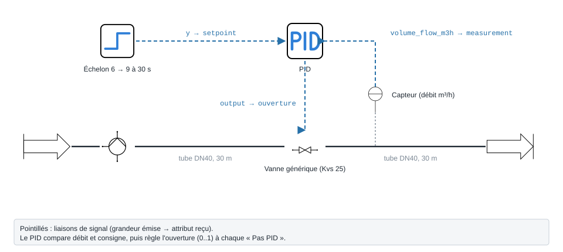
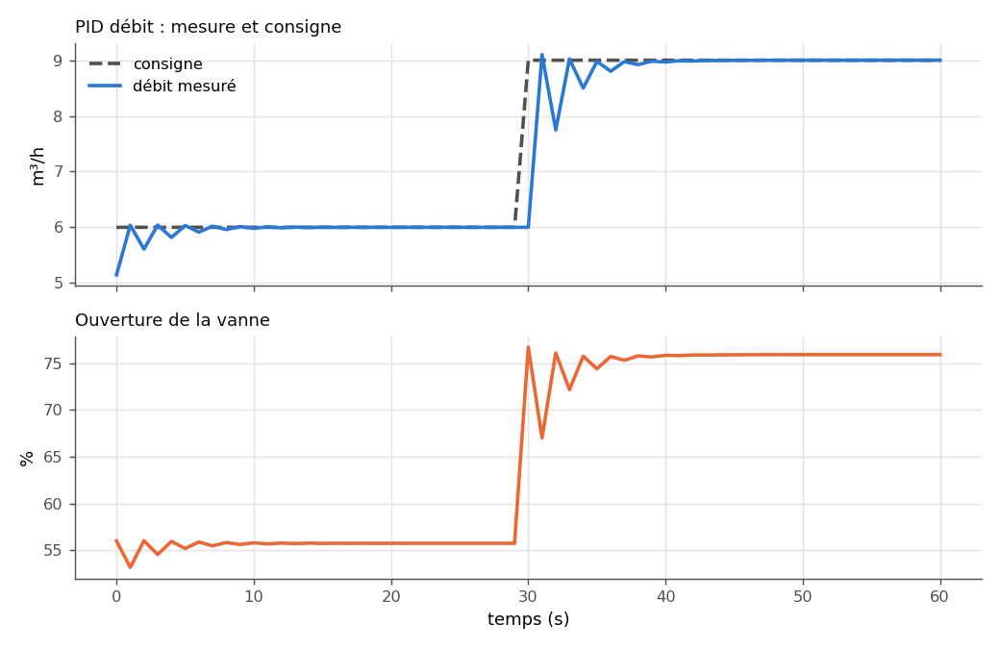

.. _regulation_pid:

Régulation PID
==============

Un régulateur **PID** compare une **consigne** (60 °C, 9 m³/h…) à une
**mesure**, et en déduit une **commande** entre 0 et 1 : l'ouverture d'une
vanne, la fraction de puissance d'une résistance. La bibliothèque en fournit un,
``ThermodynamicCycles.Signals.PIDController``, utilisable de deux façons :

- **en Python**, dans votre propre boucle de temps (ci-dessous, un ballon
  électrique) ;
- **dans PyqtSimulator**, où le nœud « PID » lit un capteur et pilote une vanne
  pendant la :doc:`simulation temporelle <simulation_temporelle>`.

   La boucle de l'exemple « Régulation de débit par PID », avec les icônes de
   la palette : le **capteur** mesure le débit, le **PID** calcule l'ouverture,
   la **vanne** l'applique ; l'**échelon** fournit la consigne.

----

Comment le PID calcule
----------------------

À chaque pas ``dt`` (le « Pas PID ») :

.. math::

   e = \text{consigne} - \text{mesure}, \qquad
   u = \text{bias} + K_p\,e + K_i \sum e\,dt + K_d\,\frac{\Delta e}{dt}

puis ``u`` est borné entre ``out_min`` et ``out_max``. Trois garde-fous, lus
dans le code :

- **anti-emballement** : quand la sortie est en butée, l'intégrale cesse de
  croître dans le sens de la butée ; ``i_min`` / ``i_max`` bornent la
  **contribution** intégrale :math:`K_i \sum e\,dt`, dans l'unité de la sortie
  (corrigé le 24/09/2026 : elles bornaient l'intégrale brute, ce qui laissait un
  écart permanent) ;
- **action inverse** (``reverse_action = True``) : l'erreur devient
  mesure − consigne, pour un actionneur qui fait **baisser** la mesure quand on
  l'ouvre (vanne d'eau glacée sur une température d'air, par exemple) ;
- **démarrage sans à-coup** : ``preset_output(u0)`` règle l'intégrale pour que
  la première commande soit ``u0`` (l'ouverture actuelle de la vanne).

----

Exemple : maintenir un ballon électrique à 60 °C
------------------------------------------------

Un ballon de 100 L, mal isolé (20 W/K), chauffé par une résistance de 6 kW. Le
PID échantillonne toutes les 60 s et règle la fraction de puissance ``u``. Le
procédé (le ballon) est écrit à la main en une ligne : c'est votre modèle, le
PID ne le connaît pas.

.. code-block:: python

   from ThermodynamicCycles.Signals.PIDController import Object as PIDController

   # Procédé : ballon de 100 L, pertes 20 W/K vers 15 °C, résistance 6 kW
   C = 100 * 4186.0        # capacité thermique, J/K
   P_max = 6000.0          # W
   UA = 20.0               # W/K
   T_amb = 15.0            # °C

   pid = PIDController()
   pid.setpoint = 60.0     # consigne, °C
   pid.Kp = 0.1            # 10 K d'écart -> pleine puissance
   pid.Ki = 0.0003         # annule l'écart résiduel
   pid.dt = 60.0           # pas du régulateur, s

   T = 15.0
   for k in range(181):                     # 3 h au pas de 60 s
       pid.Timestamp = k * 60.0             # temps en secondes
       pid.measurement = T
       u = pid.calculate()                  # fraction de puissance 0..1
       if k % 15 == 0:
           print(f"{k:4d} min  T = {T:5.2f} °C  u = {u:5.3f}")
       T += 60.0 * (u * P_max - UA * (T - T_amb)) / C   # bilan du ballon

   print(pid.df.round(3))

Sortie réelle :

.. code-block:: text

      0 min  T = 15.00 °C  u = 1.000
     15 min  T = 27.64 °C  u = 1.000
     30 min  T = 39.76 °C  u = 1.000
     45 min  T = 51.36 °C  u = 1.000
     60 min  T = 61.16 °C  u = 0.590
     75 min  T = 61.88 °C  u = 0.000
     90 min  T = 60.05 °C  u = 0.045
    105 min  T = 59.62 °C  u = 0.180
    120 min  T = 60.07 °C  u = 0.170
    135 min  T = 60.08 °C  u = 0.139
    150 min  T = 59.97 °C  u = 0.147
    165 min  T = 59.99 °C  u = 0.153
    180 min  T = 60.01 °C  u = 0.150
                     PID
   Timestamp    10800.000
   setpoint        60.000
   measurement     60.011
   error           -0.011
   output           0.150
   p               -0.001
   i                0.151
   d               -0.000

Ce qu'il faut lire :

- la résistance tourne à **pleine puissance** tant que l'écart dépasse 10 K
  (``Kp = 0,1`` : 10 K × 0,1 = 1) ;
- le ballon **dépasse** la consigne de 1,9 K, puis se stabilise à 60,0 °C en
  deux heures ;
- à l'équilibre, la commande vaut **0,150**, soit 900 W : exactement les pertes
  du ballon, 20 W/K × 45 K. C'est le **terme intégral** (``i = 0,151``) qui la
  porte ; le terme proportionnel est nul puisque l'écart est nul.

----

Le PID dans PyqtSimulator
-------------------------

L'exemple livré **3 - Hydraulique › Regulation › Regulation de debit par PID**
règle un débit d'eau : pompe → tube DN40 de 30 m → vanne de régulation (Kvs 25)
→ tube DN40 de 30 m. La consigne passe de **6 à 9 m³/h à t = 30 s** (nœud
« Échelon »).

.. figure:: ../images/scene_regulation_debit_pid.svg
   :alt: Scène PyqtSimulator de régulation de débit par PID
   :align: center
   :width: 100%

   La scène telle que l'IHM l'exporte. En bas, le circuit hydraulique ; au
   centre, le capteur de débit posé sur la vanne ; en haut, l'échelon de
   consigne et le PID. Les liaisons pointillées bleues sont des **liaisons de
   signal**.

Le câblage se fait par les **prises de signal** (liaisons pointillées) :

.. list-table::
   :header-rows: 1
   :widths: 28 22 28 22

   * - Émetteur
     - Grandeur émise
     - Récepteur
     - Grandeur reçue
   * - Capteur « Débit branche »
     - ``volume_flow_m3h``
     - PID
     - ``measurement``
   * - Échelon « Consigne débit »
     - ``y``
     - PID
     - ``setpoint``
   * - PID
     - ``output``
     - Vanne de régulation
     - ``ouverture``

Puis **Simulation temporelle** : durée 1 min, pas 1 s. La même simulation se
lance sans IHM, avec la fonction qu'appelle le bouton :

.. code-block:: python

   import json
   from pathlib import Path

   import PyqtSimulator
   from energysystemmodels import adapters      # passerelle scène IHM -> calcul

   legacy_scene_to_model = adapters.legacy_scene_to_model
   simulate_scene = adapters.nodal_network.simulate_scene

   EXEMPLES = Path(PyqtSimulator.__file__).parent / "json"
   fichier = EXEMPLES / "3 - Hydraulique" / "Regulation" / "Regulation de debit par PID.json"
   scene = json.loads(fichier.read_text(encoding="utf-8"))

   model = legacy_scene_to_model(scene).model
   sim, tr = simulate_scene(model, 60.0, 1.0, signal_links=scene["signal_links"])

   boucle = sim.pid_loops[0]
   tr_pid = boucle.trace                   # t, setpoint, measurement, output
   for k in range(0, len(tr_pid["t"]), 5):
       print(f"t = {tr_pid['t'][k]:4.0f} s  consigne {tr_pid['setpoint'][k]:.1f}  "
             f"débit {tr_pid['measurement'][k]:6.3f} m³/h  "
             f"ouverture {100 * tr_pid['output'][k]:5.1f} %")
   print(f"Débit final : {boucle.final_measurement:.3f} m³/h")

Sortie réelle :

.. code-block:: text

   t =    0 s  consigne 6.0  débit  5.146 m³/h  ouverture  56.0 %
   t =    5 s  consigne 6.0  débit  6.031 m³/h  ouverture  55.2 %
   t =   10 s  consigne 6.0  débit  5.980 m³/h  ouverture  55.8 %
   t =   15 s  consigne 6.0  débit  6.002 m³/h  ouverture  55.7 %
   t =   20 s  consigne 6.0  débit  5.999 m³/h  ouverture  55.7 %
   t =   25 s  consigne 6.0  débit  6.000 m³/h  ouverture  55.7 %
   t =   30 s  consigne 9.0  débit  6.000 m³/h  ouverture  76.7 %
   t =   35 s  consigne 9.0  débit  8.978 m³/h  ouverture  74.4 %
   t =   40 s  consigne 9.0  débit  8.968 m³/h  ouverture  75.8 %
   t =   45 s  consigne 9.0  débit  8.997 m³/h  ouverture  75.9 %
   t =   50 s  consigne 9.0  débit  9.000 m³/h  ouverture  75.9 %
   t =   55 s  consigne 9.0  débit  9.000 m³/h  ouverture  75.9 %
   t =   60 s  consigne 9.0  débit  9.000 m³/h  ouverture  75.9 %
   Débit final : 9.000 m³/h

   Les courbes de la fenêtre « Simulation temporelle », retracées depuis
   ``boucle.trace`` : consigne en pointillés, débit mesuré, ouverture de la vanne.

La vanne part de l'ouverture saisie dans son nœud (50 %, soit 5,15 m³/h) : le
PID démarre **sans à-coup** depuis cette position, rejoint 6 m³/h en une dizaine
de secondes, puis 9 m³/h après l'échelon. Pour 50 % de débit en plus, la vanne
s'ouvre de 55,7 à 75,9 % : sa caractéristique est **logarithmique** (égal
pourcentage), pas linéaire.

----

Paramètres à personnaliser
--------------------------

Les attributs du modèle et les champs du nœud « PID » qui les renseignent :

.. list-table::
   :header-rows: 1
   :widths: 18 20 14 48

   * - Modèle
     - Champ du nœud
     - Défaut (modèle / nœud)
     - Effet et réglage
   * - ``setpoint``
     - Consigne défaut (``sp``)
     - 0 / 60
     - Consigne fixe ; ignorée si un générateur est relié à ``setpoint``.
   * - ``measurement``
     - Mesure défaut (``pv``)
     - 0 / 50
     - Valeur de secours ; en simulation, c'est le capteur relié qui la fournit.
   * - ``Kp``
     - Kp
     - 0,02 / 0,015
     - Gain proportionnel : 1/Kp est l'écart (en unité de mesure) qui met la
       sortie en butée. Trop fort : oscillations.
   * - ``Ki``
     - Ki
     - 0 / 0,003
     - Gain intégral (par seconde) : annule l'écart permanent. Trop fort :
       dépassement, pompage.
   * - ``Kd``
     - Kd
     - 0 / 0
     - Gain dérivé : amortit, mais amplifie le bruit de mesure. Rarement utile
       en CVC.
   * - ``dt``
     - Pas PID (s)
     - 1 / 1
     - Période d'échantillonnage. Les gains ne valent que pour ce pas.
   * - ``reverse_action``
     - Sens d'action PID
     - ``False`` / Direct
     - Direct : ouvrir fait monter la mesure (débit, chauffage). Inverse :
       ouvrir la fait baisser (refroidissement).
   * - ``out_min`` / ``out_max``
     - Sortie min / max
     - 0 / 1
     - Bornes de la commande (ouverture minimale d'une vanne, par exemple).
   * - ``i_min`` / ``i_max``
     - Intégrale min / max
     - −2 / 2
     - Bornes de la contribution intégrale, dans l'unité de la sortie.
   * - ``bias``
     - Bias
     - 0 / 0
     - Commande de repos, ajoutée à la sortie.
   * - —
     - PID asynchrone temps réel
     - Oui
     - IHM seulement : le nœud recalcule tout seul toutes les ``dt`` secondes
       (horloge murale), hors simulation temporelle.

Variante : un régulateur sans action intégrale
----------------------------------------------

Même ballon, ``Ki = 0`` : un régulateur **proportionnel seul**.

.. code-block:: python

   # variante : proportionnel seul (Ki = 0), tout le reste identique
   pid_p = PIDController()
   pid_p.setpoint, pid_p.Kp, pid_p.Ki, pid_p.dt = 60.0, 0.1, 0.0, 60.0

   T = 15.0
   for k in range(181):
       pid_p.Timestamp = k * 60.0
       pid_p.measurement = T
       u = pid_p.calculate()
       T += 60.0 * (u * P_max - UA * (T - T_amb)) / C

   print(f"Température au bout de 3 h : {T:.2f} °C (consigne 60 °C)")
   print(f"Écart permanent : {60.0 - T:.2f} K, commande {u:.3f}")

Sortie réelle :

.. code-block:: text

   Température au bout de 3 h : 58.55 °C (consigne 60 °C)
   Écart permanent : 1.45 K, commande 0.145

Sans intégrale, il **reste 1,45 K d'écart** : pour fournir les 870 W de pertes
du ballon à 58,55 °C (``u = 0,145``), un régulateur proportionnel a besoin d'un
écart ``0,145 / Kp = 1,45 K``. Plus le ballon perd, plus l'écart grandit. C'est la raison
d'être du terme ``Ki``.

Variante : un pas de simulation plus long que le pas du PID
-----------------------------------------------------------

Dans la scène, le « Pas PID » vaut 1 s. Simuler au pas de 5 s est **refusé** :

.. code-block:: python

   # variante : pas de simulation 5 s pour un PID réglé à 1 s
   try:
       simulate_scene(model, 60.0, 5.0, signal_links=scene["signal_links"])
   except ValueError as exc:
       print(exc)

Sortie réelle :

.. code-block:: text

   PID 'PID débit' : le pas de simulation (5 s) depasse le pas du regulateur (« Pas PID » = 1 s) ; ses gains n'ont de sens qu'a ce pas. Choisir un pas de simulation <= 1 s.

Le refus est voulu : des gains réglés pour agir chaque seconde, appliqués toutes
les 10 s, font claquer la vanne entre 0 et 100 % et osciller le débit entre 1 et
11 m³/h (mesuré par les tests de la bibliothèque).

----

Pièges
------

.. warning::
   **Choisir le sens d'action.** Le nœud « PID » et le modèle Python partent en
   action **Direct** (``reverse_action = False``) : ouvrir la vanne fait monter
   la mesure (débit, chauffage). Pour un **refroidissement** ou toute boucle où
   ouvrir fait **baisser** la mesure, passez « Sens d'action PID » à
   **Inverse** ; sinon la vanne se ferme quand la mesure est trop haute.
   (Avant le 28/09/2026, le nœud partait en « Inverse » par défaut ; corrigé.)

.. warning::
   **Le PID ne compte pas au-delà de 60 s entre deux appels.** Quand
   ``Timestamp`` est renseigné, l'écart entre deux appels sert de pas, mais il
   est **plafonné à 60 s**, et un horodatage ``datetime`` (celui des autres
   modèles) est ignoré au profit de ``dt``. Pour un régulateur horaire,
   laissez ``Timestamp`` à ``None`` et fixez ``dt`` à la main (défaut consigné
   dans ``BUGS_LIB.md``).

- En simulation temporelle, le PID ne pilote qu'une **vanne générique** (champ
  ``ouverture``) et ne lit qu'une **pression ou un débit** : le réseau nodal est
  isotherme, une mesure de température est refusée avec un message explicite.
- La consigne variable doit venir d'un **générateur** (Constante, Échelon,
  Rampe, Sinus, Créneau) : voir :doc:`signaux_operations`.
- Un PID posé mais relié à rien est ignoré ; relié à moitié (mesure sans
  sortie), il est refusé : « il faut UN lien capteur -> « measurement » et UN
  lien « output » -> vanne ».

Voir aussi
----------

- :doc:`simulation_temporelle` — le bouton, le pas de temps, l'historique ;
- :doc:`signaux_operations` — les générateurs de consigne ;
- :doc:`../002-thermodynamic_cycles/capteur_signaux` — capteur et bus de
  signaux ;
- :doc:`../004-hydraulic/vanne_generique` — la vanne que le PID pilote.
