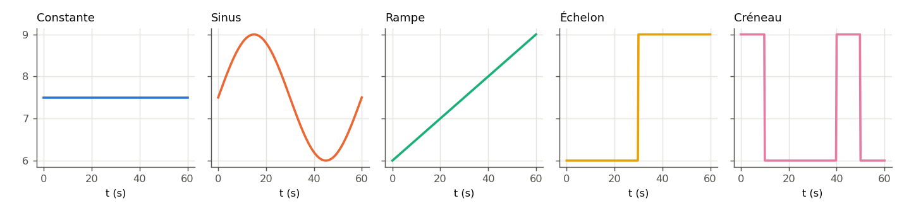

.. _signaux_operations:

Signaux et opérations
=====================

Une régulation a besoin de **consignes qui bougent** : un débit qui passe de 6 à
9 m³/h, une température qui suit un créneau jour/nuit. PyqtSimulator les
fabrique avec cinq **générateurs de signaux** et les combine avec quatre
**opérations** ; un **afficheur** montre une valeur transportée par une liaison
de signal.

Les formules des générateurs sont écrites une seule fois, dans
``ThermodynamicCycles.Signals.generators`` : les nœuds de la palette et la
:doc:`simulation temporelle <simulation_temporelle>` appellent les mêmes
fonctions.

----

Les cinq générateurs
--------------------

.. list-table::
   :header-rows: 1
   :widths: 14 30 56

   * - Nœud
     - Fonction Python
     - Valeur à l'instant ``t`` (champs du nœud entre parenthèses)
   * - Constante
     - ``constant(value)``
     - ``value`` (Valeur)
   * - Sinus
     - ``sine(amp, freq_hz, phase_deg, offset, t)``
     - ``amp·sin(2π·freq·t + phase) + offset`` (Amplitude, Fréquence (Hz),
       Phase (°), Décalage)
   * - Rampe
     - ``ramp(y0, slope, t)``
     - ``y0 + slope·t`` (Valeur initiale, Pente (par s))
   * - Échelon
     - ``step(before, after, t_step, t)``
     - ``before`` avant ``t_step``, ``after`` à partir de ``t_step`` (Valeur
       avant, Valeur après, Instant de bascule (s))
   * - Créneau
     - ``square(high, low, period, duty, t)``
     - ``high`` pendant la fraction ``duty`` de chaque période, ``low`` ensuite
       (Niveau haut, Niveau bas, Période (s), Rapport cyclique)

Chaque nœud porte en plus un champ **Temps t (s)** : hors simulation, le nœud
affiche la valeur du signal à cet instant-là, figée. Pendant une
**simulation temporelle**, un générateur relié à la consigne d'un PID est
évalué au **temps simulé**, pas à ce champ.

Exemple : les cinq signaux sur une minute
-----------------------------------------

.. code-block:: python

   import pandas as pd
   from ThermodynamicCycles.Signals import generators as g

   instants = range(0, 61, 10)                       # s
   table = pd.DataFrame({
       "Constante": [g.constant(7.5) for t in instants],
       "Sinus":     [g.sine(1.5, 1 / 60, 0.0, 7.5, t) for t in instants],  # période 60 s
       "Rampe":     [g.ramp(6.0, 0.05, t) for t in instants],             # +0,05 par s
       "Échelon":   [g.step(6.0, 9.0, 30.0, t) for t in instants],        # 6 -> 9 à 30 s
       "Créneau":   [g.square(9.0, 6.0, 40.0, 0.25, t) for t in instants],  # 10 s haut / 40 s
   }, index=pd.Index(instants, name="t (s)"))
   print(table.round(3))

   # Même calcul à partir des champs d'un nœud, par son code de palette
   noeud_echelon = {"before": 6, "after": 9, "tstep": 30}   # champs du nœud « Échelon »
   print([g.BY_OPCODE[860](noeud_echelon, t) for t in (29.9, 30.0)])

Sortie réelle :

.. code-block:: text

          Constante  Sinus  Rampe  Échelon  Créneau
   t (s)
   0            7.5  7.500    6.0      6.0      9.0
   10           7.5  8.799    6.5      6.0      6.0
   20           7.5  8.799    7.0      6.0      6.0
   30           7.5  7.500    7.5      9.0      6.0
   40           7.5  6.201    8.0      9.0      9.0
   50           7.5  6.201    8.5      9.0      6.0
   60           7.5  7.500    9.0      9.0      6.0
   [6.0, 9.0]

   Les cinq signaux de l'exemple, calculés par ``generators`` sur une minute.

L'échelon bascule **à** l'instant saisi (``t >= t_step``) : à 29,9 s il vaut
encore 6, à 30 s il vaut 9. Les codes de palette sont 830 (Constante), 840
(Sinus), 850 (Rampe), 860 (Échelon) et 870 (Créneau).

----

Les opérations
--------------

Le groupe « Opérations Math. » de la palette compte **Add**, **Substract**,
**Multiply** et **Divide**, plus le **Mélangeur** de fluides. Chaque opération
reçoit deux entrées et accepte deux sortes de valeurs :

- deux **nombres** (la sortie d'un générateur, par exemple) : l'opération est
  l'arithmétique ordinaire ;
- des **courants de fluide** ``[fluide, débit, pression, enthalpie]`` : chaque
  opération n'y fait que ce qui a un sens physique (voir ci-dessous).

.. code-block:: python

   from types import SimpleNamespace

   import PyqtSimulator.calc_conf                    # enregistre les nœuds de la palette
   from PyqtSimulator.nodes.operations import (CalcNode_Add, CalcNode_Sub,
                                               CalcNode_Mul, CalcNode_Div)

   noeud = SimpleNamespace()                         # tient lieu de nœud graphique

   # Nombres : consigne = 7,5 + sinus d'amplitude 1,5
   print("Add      :", CalcNode_Add.evalOperation(noeud, 7.5, g.sine(1.5, 1 / 60, 0, 0, 10)))
   print("Divide   :", CalcNode_Div.evalOperation(noeud, 9.0, 3.6))

   # Courants de fluide [fluide, débit kg/s, pression Pa, enthalpie J/kg]
   depart = ["water", 2.0, 3.0e5, 293_000.0]
   retour = ["water", 1.5, 2.0e5, 126_000.0]
   print("Substract:", CalcNode_Sub.evalOperation(noeud, depart, retour))
   print("Multiply :", CalcNode_Mul.evalOperation(noeud, depart, 2.0))
   print("Add      :", CalcNode_Add.evalOperation(noeud, depart, retour))

Sortie réelle :

.. code-block:: text

   Add      : 8.799038105676658
   Divide   : 2.5
   Substract: ['water', 0.5, 250000.0, 167000.0]
   Multiply : ['water', 4.0, 300000.0, 293000.0]
   Add      : ['water', 3.5, 200000.0, 221428.57142857142]

- **Substract** sur deux courants rend l'écart de débit, la **pression
  moyenne** et l'**écart d'enthalpie** (167 kJ/kg ici, soit 40 K d'eau) ;
- **Multiply** (ou **Divide**) d'un courant par un nombre ne change que le
  **débit** : pression et enthalpie massique sont conservées ;
- **Add** de deux courants du même fluide fait le bilan du **Mélangeur** : débits
  sommés, pression minimale, enthalpie moyenne pondérée par les débits
  ((2 × 293 + 1,5 × 126) / 3,5 = 221,4 kJ/kg ici) ;
- toute autre combinaison (courant + nombre, courant × courant, deux fluides
  différents…) lève ``ValueError`` : dans l'IHM, le nœud passe en erreur avec ce
  message.

L'afficheur
-----------

Le nœud **Afficheur** ne calcule rien : il reçoit une valeur par **liaison de
signal** (prise pointillée) et la montre dans un badge.

Ses champs de mise en forme, lus dans ``nodes/signal_display.py`` :

.. list-table::
   :header-rows: 1
   :widths: 26 20 54

   * - Champ
     - Défaut
     - Effet
   * - Operation
     - Multiplier
     - « Aucune », « Multiplier » ou « Diviser » la valeur reçue par le Facteur.
   * - Facteur
     - 1
     - 3600 pour afficher en kg/h un débit reçu en kg/s ; un facteur nul en
       division est refusé (« Afficheur: facteur de division nul. »).
   * - Unite affichee
     - (vide)
     - Texte ajouté après la valeur.
   * - Nombre de decimales
     - 2
     - Borné entre 0 et 12 ; les zéros de fin sont retirés.

Le badge rappelle la source (« Capteur.volume_flow_m3h | x 3600 »). La liaison
de signal elle-même — quelle grandeur d'un nœud va dans quel attribut d'un
autre — est décrite dans :doc:`../002-thermodynamic_cycles/capteur_signaux`.

----

Paramètres à personnaliser
--------------------------

.. list-table::
   :header-rows: 1
   :widths: 24 20 56

   * - Paramètre
     - Plage utile
     - Ce qu'il change
   * - ``t_step`` (Échelon)
     - dans la durée simulée
     - Instant de la marche de consigne. Laissez le système se stabiliser
       avant (l'exemple PID bascule à 30 s pour une minute simulée).
   * - ``slope`` (Rampe)
     - selon le procédé
     - Vitesse de variation de consigne, par seconde : 0,05 m³/h/s = 3 m³/h en
       une minute.
   * - ``freq_hz`` (Sinus)
     - 1/86 400 pour un cycle journalier
     - La fréquence est en **hertz** : une période de 60 s s'écrit ``1/60``.
   * - ``period``, ``duty`` (Créneau)
     - ``period`` > 0, ``duty`` 0 à 1
     - Période et fraction du temps au niveau haut (0,25 : un quart du temps).
   * - ``offset`` (Sinus), ``y0`` (Rampe)
     - —
     - Valeur moyenne ou de départ.

Variante : un créneau jour/nuit
-------------------------------

Consigne d'eau chaude à 60 °C de 6 h à 22 h, 45 °C la nuit : période 24 h,
rapport cyclique 16/24, décalé pour démarrer à 6 h.

.. code-block:: python

   # variante : créneau journalier, haut 16 h sur 24, début à 6 h
   jour = 24 * 3600.0
   for heure in (0, 5, 6, 12, 21, 22, 23):
       t = heure * 3600.0 - 6 * 3600.0          # l'origine du créneau est à 6 h
       print(f"{heure:2d} h : {g.square(60.0, 45.0, jour, 16 / 24, t):.0f} °C")

   try:
       g.square(60.0, 45.0, 0.0, 0.5, 0.0)       # période nulle
   except ValueError as exc:
       print("Refusé :", exc)

Sortie réelle :

.. code-block:: text

    0 h : 45 °C
    5 h : 45 °C
    6 h : 60 °C
   12 h : 60 °C
   21 h : 60 °C
   22 h : 45 °C
   23 h : 45 °C
   Refusé : Créneau : la période doit être strictement positive

Le créneau accepte un temps négatif (le modulo de Python le ramène dans la
période), ce qui permet de décaler son origine. Le générateur n'a pas de champ
« retard » : le décalage se fait sur ``t``.

----

Pièges
------

.. note::
   Jusqu'au 28/09/2026, **Multiply et Add opéraient terme à terme sur un
   courant** : doubler un courant doublait aussi sa pression et son enthalpie
   massique (``['water', 4.0, 600000.0, 586000.0]`` dans l'exemple ci-dessus),
   additionner deux courants sommait leurs pressions et leurs enthalpies. Une
   scène construite avant cette date sur ce comportement change de résultat.

- En simulation temporelle, la consigne d'un PID doit venir **directement**
  d'un générateur : un générateur passé par Add ou Multiply avant le PID est
  refusé (« la consigne doit venir d'un générateur de signal »).
- La fréquence du Sinus est en Hz, pas en rad/s ni en heures.
- Le rapport cyclique hors de 0 à 1 est ramené dans cet intervalle sans
  message.

Voir aussi
----------

- :doc:`regulation_pid` — la consigne d'échelon en action ;
- :doc:`simulation_temporelle` — quand les signaux sont évalués au temps
  simulé ;
- :doc:`../002-thermodynamic_cycles/capteur_signaux` — liaisons de signal.
