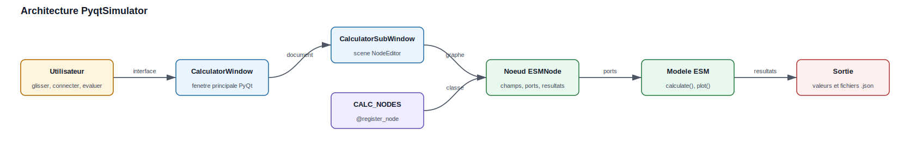
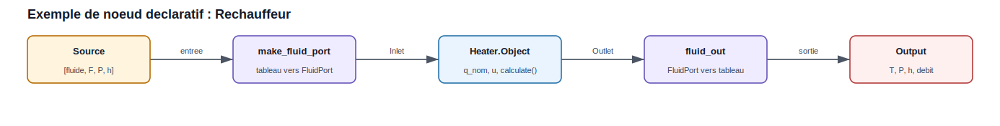
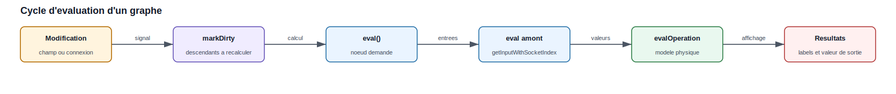

.. _gui_tools:

Interfaces graphiques et outils visuels
=======================================

EnergySystemModels contient plusieurs briques visuelles pour construire,
tester et présenter des modèles énergétiques. Cette page sert de guide de
travail : elle explique comment lancer le simulateur PyQt, comment lire un
graphe, comment ajouter un nouveau nœud et comment documenter les résultats
avec les figures réellement produites par la bibliothèque.

Vue d'ensemble
--------------

Le simulateur graphique principal est ``PyqtSimulator``. Il s'appuie sur le
moteur ``NodeEditor`` pour manipuler des nœuds et des connexions, puis appelle
les modèles physiques de la bibliothèque : compresseur, échangeur, pompe,
batterie, humidificateur, réchauffeur, etc.

   Architecture générale : la fenêtre PyQt héberge une scène NodeEditor, les
   nœuds enregistrés appellent les modèles EnergySystemModels, puis les valeurs
   sont affichées ou sauvegardées.

Le principe d'utilisation est toujours le même :

1. Lancer l'interface.
2. Créer une nouvelle scène.
3. Glisser des nœuds depuis la palette.
4. Relier les sorties aux entrées.
5. Renseigner les paramètres.
6. Évaluer le graphe ou le nœud de sortie.
7. Sauvegarder le projet au format ``.json``.

Installation et lancement
-------------------------

Les interfaces nécessitent ``PyQt5``. Dans un environnement de développement,
installer aussi la bibliothèque en mode éditable ou ajouter le dossier ``src``
au ``PYTHONPATH``.

.. code-block:: console

   pip install -e .
   pip install PyQt5

Depuis le dépôt source :

.. code-block:: powershell

   cd A:\OneDrive\_Github_\EnergySystemModels
   $env:PYTHONPATH = "$PWD\src"
   python -m PyqtSimulator.main

Le script crée une ``QApplication``, applique le style ``Fusion`` puis ouvre
``CalculatorWindow``. La fenêtre contient une zone MDI et une palette de nœuds.
Chaque élément de la palette vient du registre ``CALC_NODES``.

Interface PyqtSimulator
-----------------------

La fenêtre principale regroupe les éléments suivants :

``Nodes``
   Palette latérale. Elle liste les classes enregistrées par
   ``@register_node(...)``. Un glisser-déposer crée un nœud dans la scène.

``Zone de travail``
   Scène NodeEditor. Les nœuds y sont placés, déplacés et connectés.

``Menu fichier``
   Création, ouverture et sauvegarde des graphes. Les projets sont stockés en
   JSON par le moteur NodeEditor.

``Menu contextuel``
   Clic droit sur un nœud pour l'évaluer, le marquer invalide ou forcer le
   recalcul de ses descendants. Clic droit sur une connexion pour choisir le
   type de courbe.

``Nœud Output``
   Nœud d'affichage final. Il déclenche l'évaluation amont et présente le
   fluide, le débit, la pression, l'enthalpie, la température et le débit
   volumique.

Convention des ports
--------------------

Les connexions échangent des listes Python courtes. Cette convention rend les
graphes faciles à sérialiser dans les fichiers ``.json``.

.. list-table::
   :header-rows: 1

   * - Type de flux
     - Format échangé
     - Unités
   * - Fluide thermodynamique
     - ``[fluid, F, P, h]``
     - ``fluid`` en chaîne, ``F`` en kg/s, ``P`` en bar, ``h`` en kJ/kg
   * - Air humide
     - ``[w, F, P, h]``
     - ``w`` en g/kg d'air sec, ``F`` en kg/s, ``P`` en bar, ``h`` en kJ/kg

Les helpers de ``PyqtSimulator.nodes.esm_node_helpers`` assurent la conversion
entre ces listes et les objets de la bibliothèque :

``make_fluid_port(arr)``
   Convertit ``[fluid, F, P, h]`` vers un ``FluidPort``.

``fluid_out(port)``
   Convertit un ``FluidPort`` de sortie vers la liste standard.

``make_air_port(arr)`` et ``air_out(port)``
   Appliquent la même logique aux ports d'air humide.

Lecture d'un graphe
-------------------

Pour un graphe simple ``Source -> Réchauffeur -> Output`` :

   Le nœud source fournit le fluide. Le réchauffeur convertit la liste d'entrée
   en ``FluidPort``, appelle le modèle ``Heater.Object`` puis renvoie une liste
   de sortie compatible avec ``Output``.

Exemple d'utilisation :

1. Ajouter un nœud ``Source``.
2. Choisir le fluide, par exemple ``Water`` ou ``R134a``.
3. Définir le débit, la température et la pression.
4. Ajouter un nœud ``Réchauffeur``.
5. Renseigner ``Puissance nominale`` et ``Taux de charge``.
6. Ajouter un nœud ``Output``.
7. Relier ``Source`` vers ``Réchauffeur``, puis ``Réchauffeur`` vers
   ``Output``.
8. Évaluer ``Output``.

Résultat attendu : ``Output`` affiche l'état de sortie, tandis que le nœud
``Réchauffeur`` affiche directement la puissance transférée et la température
de sortie.

Cycle d'évaluation
------------------

Lorsqu'un paramètre est modifié, le nœud est marqué comme sale et ses
descendants doivent être recalculés. L'évaluation d'un nœud de sortie remonte
le graphe jusqu'aux sources, puis propage les valeurs vers l'aval.

   Les champs Qt déclenchent ``onInputChanged``. Le nœud aval demande ensuite
   l'évaluation des nœuds amont, récupère leurs valeurs et appelle son modèle
   physique.

Les points importants pour l'utilisateur sont :

1. Un nœud sans entrée connectée devient invalide.
2. Une saisie numérique invalide doit être corrigée avant d'obtenir un résultat
   fiable.
3. Le nœud ``Output`` est le meilleur point de contrôle : il force le calcul
   de toute la chaîne amont.
4. Les unités affichées ne sont pas toujours celles utilisées en interne. Par
   exemple, la pression circule en bar dans le graphe mais les modèles peuvent
   utiliser le pascal.

Créer un nouveau nœud
---------------------

Pour exposer un modèle EnergySystemModels dans l'interface, utiliser de
préférence la classe ``ESMNode``. Elle évite de réécrire l'interface Qt, la
sérialisation et les labels de résultats.

Un nœud déclaratif contient :

``op_code``
   Identifiant numérique unique dans ``PyqtSimulator.calc_conf``.

``op_title``
   Nom affiché dans la palette.

``icon``
   Chemin de l'icône affichée dans la liste.

``INPUTS`` et ``OUTPUTS``
   Sockets d'entrée et de sortie.

``FIELDS``
   Champs numériques affichés sous forme de ``QLineEdit``.

``CHOICES``
   Listes déroulantes affichées sous forme de ``QComboBox``.

``RESULTS``
   Labels de sortie mis à jour par le calcul.

``evalOperation(...)``
   Code métier : lecture des entrées, appel du modèle, affichage des résultats,
   retour de la valeur de sortie.

Exemple réel : nœud Réchauffeur
~~~~~~~~~~~~~~~~~~~~~~~~~~~~~~~

Le nœud ``Réchauffeur`` illustre la structure recommandée.

.. code-block:: python

   from ThermodynamicCycles.Components import Heater
   from ThermodynamicCycles.FluidPort.FluidPort import Fluid_connect
   from PyqtSimulator.calc_conf import register_node, OP_NODE_HEATER
   from PyqtSimulator.nodes.esm_node_helpers import ESMNode, make_fluid_port, fluid_out

   @register_node(OP_NODE_HEATER)
   class CalcNode_Heater(ESMNode):
       icon = "icons/heating_coil.png"
       op_code = OP_NODE_HEATER
       op_title = "Réchauffeur"
       content_label_objname = "calc_node_heater"

       INPUTS = [2]
       OUTPUTS = [1]
       HEIGHT = 300

       FIELDS = [
           ("q_nom", "Puissance nominale (kW)", 100.0),
           ("u", "Taux de charge (0-1)", 1.0),
       ]
       RESULTS = [
           ("q", "Puissance transférée (kW)"),
           ("to", "T° sortie (°C)"),
       ]

       def evalOperation(self, input1, input2):
           a = make_fluid_port(input1)
           model = Heater.Object()
           Fluid_connect(model.Inlet, a)
           model.Q_flow_nominal = self.num("q_nom") * 1000.0
           model.u = self.num("u")
           model.calculate()

           self.show_result("q", "%.3f" % (model.Q_flow / 1000.0))
           self.show_result("to", "%.2f" % model.To_degC)

           self.value = fluid_out(model.Outlet)
           return self.value

Ce modèle donne une règle générale : les champs affichés en kW ou en bar sont
convertis dans les unités attendues par le modèle, puis reconvertis pour les
ports ou les labels utilisateur.

Enregistrer le nœud dans la palette
~~~~~~~~~~~~~~~~~~~~~~~~~~~~~~~~~~~

1. Ajouter un code unique dans ``PyqtSimulator.calc_conf``.
2. Décorer la classe avec ``@register_node(OP_NODE_...)``.
3. Placer le fichier dans ``PyqtSimulator/nodes``.
4. Vérifier que le module est importé. Le fichier ``nodes/__init__.py`` importe
   automatiquement les fichiers ``.py`` du dossier.
5. Relancer ``PyqtSimulator``. Le nœud doit apparaître dans la palette.

Exemple de réservation d'opcode :

.. code-block:: python

   OP_NODE_HEATER = 280

Bonnes pratiques de développement
---------------------------------

Utiliser des noms de champs explicites
   Le libellé doit contenir l'unité : ``Puissance nominale (kW)``,
   ``Pression sortie (bar)``, ``Rendement (-)``.

Limiter la logique Qt dans les nœuds
   Pour les nouveaux modèles, préférer ``ESMNode`` et garder le code métier
   dans ``evalOperation``.

Valider les unités à chaque conversion
   Les ports internes des modèles utilisent souvent le pascal et le joule par
   kilogramme. Les graphes utilisent plutôt le bar et le kJ/kg.

Afficher les résultats utiles localement
   Un nœud de composant peut afficher ses indicateurs propres : puissance,
   rendement, température de sortie, humidité relative, COP, perte de charge.

Tester avec un graphe minimal
   Avant d'intégrer un composant complexe, tester ``Source -> composant ->
   Output``. Ajouter ensuite les branches multiples.

Documenter le comportement
   Chaque nouveau nœud important doit avoir un exemple dans la documentation :
   schéma du graphe, paramètres, résultats attendus, limites et figure si une
   méthode ``plot()`` existe.

Résultats et figures dans la documentation
-----------------------------------------

La documentation doit distinguer trois types de visuels :

``Schéma de graphe``
   Figure pédagogique montrant les nœuds et les connexions. Ces schémas sont
   générés depuis ``docs/source/diagrams/*.json`` par
   ``docs/generate_diagrams.py``.

``Table de résultats``
   Valeurs numériques issues d'un exemple reproductible. Les unités doivent
   être visibles dans l'en-tête ou dans la première colonne.

``Plot du modèle``
   Figure produite par une méthode réelle de la bibliothèque : par exemple
   ``ch.plot()``, ``calc.plot()`` ou ``calc.plot_detail()``. Il ne faut pas
   remplacer ces méthodes par un tracé manuel arbitraire lorsque le modèle
   fournit déjà sa propre fonction de visualisation.

Workflow recommandé pour une page d'exemple :

1. Décrire le cas étudié et les hypothèses.
2. Afficher le schéma des nœuds connectés.
3. Donner le code minimal reproductible.
4. Afficher les résultats dans une table.
5. Afficher les plots réellement générés par les fonctions du modèle.
6. Ajouter une courte interprétation métier.

Générer les schémas et plots
----------------------------

Depuis le dépôt ``EnergySystemModels-fr`` :

.. code-block:: powershell

   cd A:\OneDrive\_Github_\EnergySystemModels-fr
   python docs\generate_diagrams.py

Pour les plots réellement exposés par les modèles :

.. code-block:: powershell

   cd A:\OneDrive\_Github_\EnergySystemModels-fr
   $env:PYTHONPATH = "A:\OneDrive\_Github_\EnergySystemModels\src"
   $env:PYTHONIOENCODING = "utf-8"
   python docs\generate_model_plots.py

Le fichier ``generate_model_plots.py`` doit rester strict : il appelle les
méthodes de plot de la bibliothèque et sauvegarde les figures dans
``docs/source/images``. Les figures de remplacement ne sont acceptables que
pour les exemples sans méthode graphique déterministe, et elles doivent être
signalées comme telles dans le script.

Construire la documentation
---------------------------

.. code-block:: powershell

   cd A:\OneDrive\_Github_\EnergySystemModels-fr
   python -m sphinx -b html docs\source docs\_build\html

Ouvrir ensuite ``docs\_build\html\gui_tools.html`` pour vérifier la mise en
forme. Contrôler en particulier :

1. Les chemins ``.. figure:: images/...``.
2. Les unités dans les tableaux.
3. La lisibilité des schémas sur une largeur réduite.
4. La présence des plots lorsque l'exemple appelle une méthode ``plot``.

Dépannage
---------

``ModuleNotFoundError: PyqtSimulator``
   Ajouter ``EnergySystemModels/src`` au ``PYTHONPATH`` ou installer le paquet
   en mode éditable.

``QApplication`` ou ``PyQt5`` introuvable
   Installer ``PyQt5`` dans l'environnement actif.

``CoolProp`` introuvable
   Installer les dépendances scientifiques utilisées par les composants
   thermodynamiques.

Un nœud n'apparaît pas dans la palette
   Vérifier l'opcode, le décorateur ``@register_node``, le nom du fichier dans
   ``PyqtSimulator/nodes`` et les erreurs d'import au démarrage.

Un résultat ne se met pas à jour
   Vérifier que les champs sont connectés à ``onInputChanged``. Avec
   ``ESMNode``, cette connexion est automatique pour ``FIELDS`` et ``CHOICES``.

Une connexion est refusée
   Le moteur empêche de relier deux entrées, deux sorties ou un nœud à lui-même.
   Repartir de la sortie du nœud amont vers l'entrée du nœud aval.

Un plot manque dans ReadTheDocs
   Vérifier que la figure est générée dans ``docs/source/images`` avant le build
   et que le document référence exactement le bon nom de fichier.

Checklist pour finaliser un exemple
-----------------------------------

Avant de considérer une page comme complète :

1. Le scénario est compréhensible sans lire le code source.
2. Les nœuds et connexions sont schématisés.
3. Les paramètres d'entrée sont listés avec unités.
4. Les résultats sont affichés dans une table lisible.
5. Les plots existants du modèle sont affichés.
6. Les limites de validité sont indiquées.
7. Le code est reproductible depuis un environnement propre.
8. Le build Sphinx passe sans erreur liée à la page.
