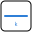
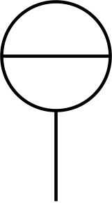
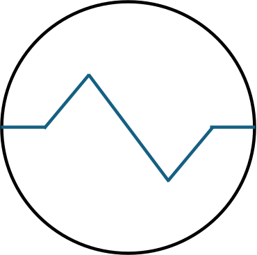
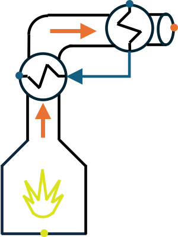

.. _interface_noeuds:

Nœuds de l'interface
====================

.. Page GÉNÉRÉE par tools/catalogue_noeuds.py — ne pas éditer à la main.

Chaque élément de la palette de ``PyqtSimulator`` est un **nœud** : une boîte
qu'on glisse dans la scène, qu'on relie par ses ports et qu'on règle par ses
champs. Derrière presque chaque nœud se trouve un modèle Python de la
bibliothèque, celui qu'on appellerait soi-même dans un script. Cette page les
recense **tous**, famille par famille, dans l'ordre de la palette.

Relevé du 2026-09-28 : **125 nœuds** enregistrés dans
``CALC_NODES``, répartis en **15 familles**.
114 enveloppent un modèle de la bibliothèque ; 11 sont des
outils propres à l'IHM (sources, sorties, capteurs, signaux, annotations).

Comment lire les tableaux
-------------------------

- **Nœud** : icône et titre tels qu'affichés dans la palette, puis le fichier
  ``PyqtSimulator/nodes/<fichier>.py`` qui le définit.
- **Rôle** : première phrase de la docstring du fichier ; en dessous, les
  **réglages** saisis sur le nœud (libellés exacts de l'IHM).
- **Ports** : comptés sur le nœud instancié. *fluide* = liste
  ``[fluide, F (kg/s), P (bar), h (kJ/kg)]`` ; *air humide* = liste
  ``[w (g/kg as), F (kg/s), P (bar), h (kJ/kg as)]`` (voir :doc:`../gui_tools`).
  La **prise de signal** (gris) transporte une grandeur d'un nœud à l'autre,
  sans matière.
- **Modèle enveloppé** : module importé par le fichier de nœud — c'est la
  classe à utiliser pour refaire le calcul en Python.
- **Documenté dans** : page du guide qui explique ce modèle, avec exemple.
  Un tiret signale un modèle encore sans page.

.. note::
   Les familles et leur ordre sont ceux de la palette (``calc_drag_listbox.py``),
   lus en instanciant la palette. Un même modèle peut apparaître sous deux
   nœuds (par exemple une variante de réglage).

Familles de la palette :

.. list-table::
   :header-rows: 1
   :widths: 50 15

   * - Famille
     - Nœuds
   * - Courants et mesures
     - 4
   * - Calculs et signaux
     - 12
   * - Chaîne d'air (CTA)
     - 17
   * - Aéraulique
     - 8
   * - Hydraulique
     - 24
   * - Séparation
     - 8
   * - Échange thermique
     - 13
   * - Réacteurs
     - 5
   * - Production d'utilité
     - 2
   * - Machines tournantes
     - 11
   * - Éjecteur
     - 4
   * - Mélange et division
     - 2
   * - Équipements de transfert
     - 5
   * - Utilitaires et outils
     - 4
   * - Autres modèles
     - 6

Courants et mesures
-------------------

Libellé de la palette : « Courants et Mesures » — 4 nœud(s).

.. list-table::
   :header-rows: 1
   :widths: 22 34 16 16 12

   * - Nœud
     - Rôle et réglages
     - Ports
     - Modèle enveloppé
     - Documenté dans
   * - |ic_10| **Source**

       ``input.py``
     - Nœud Source : source de fluide thermodynamique (fluide, débit, T, P imposés ; l'enthalpie est calculée par CoolProp).

       *Réglages* : débit, Température (°C), Pression (bar), Concentration mélange (%), Composition (espece:fraction, ...), Base de la composition, Type de fluide, Unité de débit, … (9 au total)
     - 0 entrée(s) / 1 sortie(s), fluide ; prise de signal
     - ``ThermodynamicCycles.Source.Source``
     - :doc:`../002-thermodynamic_cycles/fluid_source`, :doc:`../002-thermodynamic_cycles/compressor`
   * - |ic_20| **Source_P_h**

       ``source_P_h.py``
     - Nœud Source_P_h : source de fluide thermodynamique paramétrée en (P, h) (fluide, débit, enthalpie, pression imposés directement).

       *Réglages* : débit (kg/s), enthalpie (kJ/kg-K), Pression (bar), Type de fluide
     - 0 entrée(s) / 1 sortie(s), fluide ; prise de signal
     - outil de l'IHM
     - :doc:`../gui_tools`
   * - |ic_30| **Sortie**

       ``output.py``
     - Nœud Output : puits terminal thermodynamique (affiche l'état du fluide : titre vapeur, débits massique/volumique, T, P, h).

       *Réglages* : Pression imposée (bar, 0 = libre)
     - 1 entrée(s) / 0 sortie(s), fluide ; prise de signal
     - outil de l'IHM
     - :doc:`../gui_tools`
   * - |ic_670| **Capteur**

       ``sensor.py``
     - Nœud capteur terminal configurable, à brancher sur une sortie d'équipement.

       *Réglages* : Température normale (°C), Pression normale (bar abs), Décimales affichées, Grandeur mesurée, Unité affichée
     - 1 entrée(s) / 0 sortie(s), fluide ; prise de signal
     - ``ThermodynamicCycles.Sensor.Sensor``
     - :doc:`../002-thermodynamic_cycles/capteur_signaux`

Calculs et signaux
------------------

Libellé de la palette : « Calculs et signaux » — 12 nœud(s).

.. list-table::
   :header-rows: 1
   :widths: 22 34 16 16 12

   * - Nœud
     - Rôle et réglages
     - Ports
     - Modèle enveloppé
     - Documenté dans
   * - |ic_50| **Add**

       ``operations.py``
     - Additionne deux valeurs : deux scalaires, ou deux listes fluide terme à terme (le nom du fluide est repris du premier opérande).
     - 2 entrée(s) / 1 sortie(s), scalaire ou liste fluide ; prise de signal
     - outil de l'IHM
     - :doc:`../gui_tools`
   * - |ic_60| **Substract**

       ``operations.py``
     - Soustrait deux valeurs ; sur deux courants fluide, rend [fluide, écart de débit, pression moyenne, écart d'enthalpie].
     - 2 entrée(s) / 1 sortie(s), scalaire ou liste fluide ; prise de signal
     - outil de l'IHM
     - :doc:`../gui_tools`
   * - |ic_70| **Multiply**

       ``operations.py``
     - Multiplie deux valeurs (scalaires, ou listes fluide terme à terme).
     - 2 entrée(s) / 1 sortie(s), scalaire ou liste fluide ; prise de signal
     - outil de l'IHM
     - :doc:`../gui_tools`
   * - |ic_80| **Divide**

       ``operations.py``
     - Divise deux valeurs (scalaires, ou listes fluide terme à terme).
     - 2 entrée(s) / 1 sortie(s), scalaire ou liste fluide ; prise de signal
     - outil de l'IHM
     - :doc:`../gui_tools`
   * - |ic_830| **Constante**

       ``signal_generators.py``
     - Source scalaire constante.

       *Réglages* : Valeur (scalaire)
     - signal scalaire
     - ``ThermodynamicCycles.Signals.PIDController``, ``ThermodynamicCycles.Signals.generators``
     - :doc:`../013-simulation-temporelle/regulation_pid`, :doc:`../002-thermodynamic_cycles/capteur_signaux`
   * - |ic_840| **Sinus**

       ``signal_generators.py``
     - Source scalaire sinusoïdale A·sin(2πft + φ) + décalage, évaluée à l'instant t.

       *Réglages* : Amplitude, Fréquence (Hz), Phase (°), Décalage (offset), Temps t (s)
     - signal scalaire
     - ``ThermodynamicCycles.Signals.PIDController``, ``ThermodynamicCycles.Signals.generators``
     - :doc:`../013-simulation-temporelle/regulation_pid`, :doc:`../002-thermodynamic_cycles/capteur_signaux`
   * - |ic_850| **Rampe**

       ``signal_generators.py``
     - Source scalaire en rampe : valeur initiale + pente × t.

       *Réglages* : Pente (par s), Valeur initiale, Temps t (s)
     - signal scalaire
     - ``ThermodynamicCycles.Signals.PIDController``, ``ThermodynamicCycles.Signals.generators``
     - :doc:`../013-simulation-temporelle/regulation_pid`, :doc:`../002-thermodynamic_cycles/capteur_signaux`
   * - |ic_860| **Échelon**

       ``signal_generators.py``
     - Source scalaire en échelon : une valeur avant l'instant de bascule, une autre après.

       *Réglages* : Valeur avant, Valeur après, Instant de bascule (s), Temps t (s)
     - signal scalaire
     - ``ThermodynamicCycles.Signals.PIDController``, ``ThermodynamicCycles.Signals.generators``
     - :doc:`../013-simulation-temporelle/regulation_pid`, :doc:`../002-thermodynamic_cycles/capteur_signaux`
   * - |ic_870| **Créneau**

       ``signal_generators.py``
     - Source scalaire en créneau : niveaux haut et bas, période, rapport cyclique.

       *Réglages* : Niveau haut, Niveau bas, Période (s), Rapport cyclique (0-1), Temps t (s)
     - signal scalaire
     - ``ThermodynamicCycles.Signals.PIDController``, ``ThermodynamicCycles.Signals.generators``
     - :doc:`../013-simulation-temporelle/regulation_pid`, :doc:`../002-thermodynamic_cycles/capteur_signaux`
   * - |ic_910| **PID**

       ``signal_generators.py``
     - Régulateur PID : lit une mesure (et une consigne) par liaison de signal et rend une commande bornée, par exemple l'ouverture d'une vanne.

       *Réglages* : Consigne défaut, Mesure défaut, Kp, Ki, Kd, Pas PID (s), Sortie min, Sortie max, … (13 au total)
     - signal scalaire
     - ``ThermodynamicCycles.Signals.PIDController``, ``ThermodynamicCycles.Signals.generators``
     - :doc:`../013-simulation-temporelle/regulation_pid`, :doc:`../002-thermodynamic_cycles/capteur_signaux`
   * - |ic_920| **Afficheur**

       ``signal_display.py``
     - Nœud Afficheur (signal uniquement).

       *Réglages* : Unite affichee, Facteur, Nombre de decimales, Operation
     - signal scalaire
     - outil de l'IHM
     - :doc:`../gui_tools`
   * - |ic_939| **Libelle**

       ``text_note.py``
     - Annotation : affiche un texte dans la scène, sans calcul ni port.

       *Réglages* : Texte du libelle (utiliser \n pour retour ligne), Taille police (px)
     - aucun port matière
     - outil de l'IHM
     - :doc:`../gui_tools`

Chaîne d'air (CTA)
------------------

Libellé de la palette : « Modeles CTA (chaine d'air) » — 17 nœud(s).

.. list-table::
   :header-rows: 1
   :widths: 22 34 16 16 12

   * - Nœud
     - Rôle et réglages
     - Ports
     - Modèle enveloppé
     - Documenté dans
   * - |ic_170| **Air Supply**

       ``air_input.py``
     - Nœud Air Supply : source d'air humide (débit volumique, T, RH, P imposés).

       *Réglages* : Air humide (m3/h), Température (°C), RH (%), Pression (bar)
     - 0 entrée(s) / 1 sortie(s), fluide ; prise de signal
     - ``AHU.FreshAir``, ``AHU.air_humide.air_humide``
     - :doc:`../003-ahu_modules/batteries`, :doc:`../003-ahu_modules/cta_air_neuf`
   * - |ic_180| **Météo**

       ``random_meteo.py``
     - —
     - 0 entrée(s) / 1 sortie(s), fluide ; prise de signal
     - ``AHU.FreshAir``, ``OpenWeatherMap.OpenWeatherMap_call_location``, ``AHU.air_humide.air_humide``
     - :doc:`../003-ahu_modules/batteries`, :doc:`../003-ahu_modules/cta_air_neuf`
   * - |ic_190| **AirOutput**

       ``air_output.py``
     - Nœud AirOutput : puits terminal d'air humide (affiche l'état du flux).
     - 1 entrée(s) / 0 sortie(s), fluide ; prise de signal
     - ``AHU.air_humide.air_humide``
     - —
   * - |ic_200| **Heating Coil**

       ``heating_coil.py``
     - Nœud Batterie chaude (Heating Coil) : réchauffage sensible d'air humide jusqu'à une température cible.

       *Réglages* : Perte de pression (bar), Temp. cible (°C)
     - 1 entrée(s) / 1 sortie(s), air humide ; prise de signal
     - ``AHU``
     - :doc:`../003-ahu_modules/cta_air_neuf`
   * - |ic_210| **Cooling Coil**

       ``cooling_coil.py``
     - Nœud Batterie froide (Cooling Coil) : refroidissement + déshumidification d'air humide jusqu'à un poids d'eau cible.

       *Réglages* : Perte de pression (bar), Temp Eau glacée ou évap (°C), poid d'eau (g/kgas)
     - 1 entrée(s) / 1 sortie(s), air humide ; prise de signal
     - ``AHU.Coil.CoolingCoil``
     - :doc:`../003-ahu_modules/batteries`
   * - |ic_220| **Humidifier**

       ``humidificateur.py``
     - Nœud Humidificateur (Humidifier) : humidification adiabatique ou vapeur jusqu'à un poids d'eau cible.

       *Réglages* : Perte de pression (bar), w cible (g/kgas), Type d'humidification
     - 1 entrée(s) / 1 sortie(s), air humide ; prise de signal
     - ``AHU.Humidification.Humidifier``
     - :doc:`../003-ahu_modules/composants_cta`, :doc:`../003-ahu_modules/cta_air_neuf`
   * - |ic_230| **Mélangeur d'air**

       ``air_mixer.py``
     - Nœud Mélangeur d'air : mélange adiabatique de deux flux d'air humide (bilan sur l'air sec).
     - 2 entrée(s) / 1 sortie(s), fluide ; prise de signal
     - outil de l'IHM
     - :doc:`../gui_tools`
   * - |ic_240| **Cooling Coil Sensible**

       ``cooling_coil_sensible.py``
     - Nœud Batterie froide sensible (Cooling Coil Sensible) : refroidissement sec (sans condensation) jusqu'à une température cible.

       *Réglages* : Perte de pression (bar), Temp. cible (°C)
     - 1 entrée(s) / 1 sortie(s), air humide ; prise de signal
     - ``AHU``
     - :doc:`../003-ahu_modules/cta_air_neuf`
   * - |ic_250| **Cooling Coil Expert**

       ``cooling_coil_expert.py``
     - Nœud Batterie froide Expert (Cooling Coil Expert) : refroidissement + déshumidification (modèle expert) jusqu'à un poids d'eau cible.

       *Réglages* : Perte de pression (bar), Temp Eau glacée ou évap (°C), poid d'eau (g/kgas)
     - 1 entrée(s) / 1 sortie(s), air humide ; prise de signal
     - ``AHU.Coil.CoolingCoil_Expert``
     - :doc:`../003-ahu_modules/batteries`
   * - |ic_360| **Diviseur**

       ``splitter.py``
     - Nœud Diviseur (Splitter) : un flux -> deux flux (fraction réglable).

       *Réglages* : Fraction vers sortie 1 (0-1)
     - 1 entrée(s) / 2 sortie(s), fluide ; prise de signal
     - ``ThermodynamicCycles.Fittings.Splitter``
     - :doc:`../002-thermodynamic_cycles/raccords_fittings`
   * - |ic_460| **Batterie froide (Tc)**

       ``cooling_coil_tc.py``
     - Nœud Batterie froide (CoolingCoil_Tc) - air humide.

       *Réglages* : Température cible (°C), Humidité cible (g/kg), T° rosée batterie (°C), Facteur de bypass, Efficacité
     - 1 entrée(s) / 1 sortie(s), air humide ; prise de signal
     - ``AHU.Coil.CoolingCoil_Tc``
     - :doc:`../003-ahu_modules/batteries`
   * - |ic_470| **Récupérateur à plaques**

       ``heat_plate_exchanger.py``
     - Nœud Récupérateur à plaques (Heat_plate_exchanger) - air humide, sensible.

       *Réglages* : Efficacité température (%), T° cible air soufflé (°C)
     - 2 entrée(s) / 2 sortie(s), air humide ; prise de signal
     - ``AHU.HeatRecovery.Heat_plate_exchanger``
     - :doc:`../003-ahu_modules/composants_cta`
   * - |ic_480| **Roue enthalpique**

       ``thermal_wheel_exchanger.py``
     - Nœud Roue enthalpique (Thermal_wheel_exchanger) - air humide (chaleur + humidité).

       *Réglages* : Efficacité température (%), T° cible (°C)
     - 2 entrée(s) / 2 sortie(s), air humide ; prise de signal
     - ``AHU.HeatRecovery.Thermal_wheel_exchanger``
     - :doc:`../003-ahu_modules/composants_cta`
   * - |ic_500| **Batterie chaude à eau**

       ``heating_coil_nut.py``
     - Nœud Batterie chaude à eau (HeatingCoilNUT) - échangeur air/eau (ε-NUT).

       *Réglages* : T° consigne air sortie (°C), Surface d'échange (m²), Coeff global U (W/m²K), Perte de charge air (bar)
     - 2 entrée(s) / 2 sortie(s), air + fluide ; prise de signal
     - ``AHU.Coil.HeatingCoilNUT``
     - :doc:`../003-ahu_modules/batteries`
   * - |ic_680| **CTA recyclage air**

       ``air_recycling_ahu.py``
     - CTA composite avec mélange d'air neuf et d'air repris.

       *Réglages* : Consigne soufflage (°C), Consigne soufflage HR (%), Consigne antigivre (°C), Batterie antigivre, Batterie chaude, Batterie froide, Humidificateur, Type humidification, … (9 au total)
     - 2 entrée(s) / 1 sortie(s), air humide ; prise de signal
     - ``AHU.GenericAHU.AirRecyclingAHU``, ``AHU.air_humide.air_humide``
     - :doc:`../003-ahu_modules/generic_ahu`
   * - |ic_690| **CTA récupération air**

       ``air_recovery_ahu.py``
     - CTA composite avec récupération de chaleur sur l'air extrait.

       *Réglages* : Consigne soufflage (°C), Consigne soufflage HR (%), Consigne antigivre (°C), Efficacité récupération (%), Récupérateur, Batterie antigivre, Batterie chaude, Batterie froide, … (11 au total)
     - 2 entrée(s) / 2 sortie(s), air humide ; prise de signal
     - ``AHU.GenericAHU.AirRecoveryAHU``, ``AHU.air_humide.air_humide``
     - :doc:`../003-ahu_modules/generic_ahu`
   * - |ic_700| **Capteur air humide**

       ``air_sensor.py``
     - Capteur terminal dédié aux ports d'air humide.

       *Réglages* : Température normale (°C), Humidité normale (%), Pression normale (bar abs), Décimales affichées, Grandeur mesurée
     - 1 entrée(s) / 0 sortie(s), air humide ; prise de signal
     - ``AHU.Sensor.AirSensor``
     - :doc:`../003-ahu_modules/composants_cta`

Aéraulique
----------

Libellé de la palette : « Aeraulique (reseau air) » — 8 nœud(s).

.. list-table::
   :header-rows: 1
   :widths: 22 34 16 16 12

   * - Nœud
     - Rôle et réglages
     - Ports
     - Modèle enveloppé
     - Documenté dans
   * - |ic_600| **Conduit aeraulique**

       ``aeraulic_straight_pipe.py``
     - Nœud Conduit aéraulique droit.

       *Réglages* : Diamètre hydraulique (mm), Longueur (m), Rugosité absolue (mm)
     - 1 entrée(s) / 1 sortie(s), fluide ; prise de signal
     - ``AHU.air_humide.air_humide``, ``ThermodynamicCycles.Aeraulic.StraightPipe``
     - :doc:`../005-aeraulic/perte_pression_lineaire`
   * - |ic_946| **Coude aéraulique**

       ``aeraulic_bend.py``
     - Nœud Coude aéraulique (Idel'chik ou catalogue ASHRAE ch.34).

       *Réglages* : Diamètre hydraulique (mm), Angle (deg, modèle Idel'chik), r/D ou r/W (modèle ASHRAE, 0 = sans objet), H/W (coude rectangulaire ASHRAE, 0 = sans objet), Modèle, Code ASHRAE ch.34
     - 1 entrée(s) / 1 sortie(s), fluide ; prise de signal
     - ``ThermodynamicCycles.Aeraulic.EdgedBend``, ``ThermodynamicCycles.Aeraulic.ashrae_fittings``
     - :doc:`../005-aeraulic/coude_aeraulique`, :doc:`../005-aeraulic/registre_lames`
   * - |ic_947| **Té aéraulique (une voie)**

       ``aeraulic_tee.py``
     - Nœud Té aéraulique : UNE voie (dérivation ou passage direct).

       *Réglages* : Diamètre hydraulique de la voie (mm), Qb/Qc (modèle ASHRAE), Ab/Ac (modèle ASHRAE), As/Ac (tables à 3 entrées, 0 = sans objet), Modèle, Voie portée par ce nœud, Code ASHRAE ch.34
     - 1 entrée(s) / 1 sortie(s), fluide ; prise de signal
     - ``ThermodynamicCycles.Aeraulic.TeeJunction``, ``ThermodynamicCycles.Aeraulic.ashrae_fittings``
     - :doc:`../005-aeraulic/te_aeraulique`, :doc:`../005-aeraulic/registre_lames`
   * - |ic_948| **Registre à lames**

       ``aeraulic_damper.py``
     - Nœud Registre aéraulique à lames (catalogue ASHRAE ch.34).

       *Réglages* : Diamètre hydraulique (mm), Angle de fermeture (deg, 0 = grand ouvert), D/Do (CD9-1) ou H/W (CR9-1) ou L/R (CR9-3/4), Code ASHRAE ch.34
     - 1 entrée(s) / 1 sortie(s), fluide ; prise de signal
     - ``ThermodynamicCycles.Aeraulic.BladeDamper``, ``ThermodynamicCycles.Aeraulic.ashrae_fittings``
     - :doc:`../005-aeraulic/registre_lames`
   * - |ic_949| **Filtre (CTA)**

       ``aeraulic_filter.py``
     - Nœud Filtre CTA (loi quadratique de perte de charge).

       *Réglages* : Diamètre hydraulique (mm), Perte nominale (Pa), Débit nominal (m³/h), Exposant n (-)
     - 1 entrée(s) / 1 sortie(s), fluide ; prise de signal
     - ``ThermodynamicCycles.Aeraulic.Filter``
     - :doc:`../005-aeraulic/filtre`
   * - |ic_957| **Registre iris**

       ``aeraulic_iris_damper.py``
     - Nœud Registre iris (loi constructeur Kt).

       *Réglages* : Diamètre hydraulique (mm), Kt constructeur (l/s par sqrt(Pa)), Coefficient ζ (mode ζ seulement), Loi
     - 1 entrée(s) / 1 sortie(s), fluide ; prise de signal
     - ``ThermodynamicCycles.Aeraulic.IrisDamper``
     - :doc:`../005-aeraulic/registre_iris`
   * - |ic_958| **Obstruction en gaine**

       ``aeraulic_obstruction.py``
     - Nœud Obstruction en gaine (catalogue ASHRAE ch.34).

       *Réglages* : Diamètre hydraulique (mm), Taux de vide n (-), Rapport A1/Ao (-), Code ASHRAE ch.34
     - 1 entrée(s) / 1 sortie(s), fluide ; prise de signal
     - ``ThermodynamicCycles.Aeraulic.Obstruction``, ``ThermodynamicCycles.Aeraulic.ashrae_fittings``
     - :doc:`../005-aeraulic/obstruction`, :doc:`../005-aeraulic/registre_lames`
   * - |ic_959| **Effet de système (ventilateur)**

       ``fan_system_effect.py``
     - Nœud Effet de système ventilateur (ASHRAE 2001 SI, ch.34, familles 7).

       *Réglages* : Section au ventilateur Ao (m²), Vitesse au ventilateur Vo (m/s), Masse volumique (kg/m³), Longueur réelle du raccordement L (m), l/Do (-, 0 = sans objet), r/Do (-, 0 = sans objet), ab/Ao (-, 0 = sans objet), Rapport de sections A1/Ao (SR7-2) (-, 0 = sans objet), … (11 au total)
     - aucun port matière ; prise de signal
     - ``ThermodynamicCycles.Aeraulic.FanSystemEffect``
     - :doc:`../005-aeraulic/effet_systeme`

Hydraulique
-----------

Libellé de la palette : « Hydraulique (reseau eau) » — 24 nœud(s).

.. list-table::
   :header-rows: 1
   :widths: 22 34 16 16 12

   * - Nœud
     - Rôle et réglages
     - Ports
     - Modèle enveloppé
     - Documenté dans
   * - |ic_420| **Distributeur 3/2**

       ``dcv_3_2.py``
     - Nœud Distributeur 3/2 (DCV_3_2) : sélectionne une source (P ou T) vers A.

       *Réglages* : Source active
     - 2 entrée(s) / 1 sortie(s), fluide ; prise de signal
     - ``ThermodynamicCycles.DirectionalControl.DCV_3_2``
     - :doc:`../002-thermodynamic_cycles/detente_distributeurs`
   * - |ic_430| **Vanne 3 voies**

       ``valve3way.py``
     - Nœud Vanne 3 voies (Valve3Way) — montage configurable.

       *Réglages* : Ouverture (%), Rangeability R (equal-percentage), Débit max (kg/s), Débit min (kg/s), ΔP branche variable (bar), Débit design autorité (kg/s, 0=Fmax), Montage, Caractéristique vanne (loi exacte), … (10 au total)
     - 2 entrée(s) / 1 sortie(s), fluide ; prise de signal
     - ``ThermodynamicCycles.Valve3Way.Valve3Way``
     - :doc:`../004-hydraulic/valve_3_voies`, :doc:`../004-hydraulic/index`
   * - |ic_520| **Vanne TA**

       ``ta_valve.py``
     - Nœud Vanne TA (équilibrage hydraulique) : perte de charge en fonction Kv.

       *Réglages* : Ouverture (tours), Type / DN
     - 1 entrée(s) / 1 sortie(s), fluide ; prise de signal
     - ``ThermodynamicCycles.Hydraulic.TA_Valve``
     - :doc:`../004-hydraulic/TA_valve`
   * - |ic_530| **Tuyau droit**

       ``straight_pipe.py``
     - Nœud Tuyau droit hydraulique : perte de charge linéaire Darcy-Weisbach.

       *Réglages* : Diamètre hydraulique (mm), Longueur (m), Rugosité (mm), Inclinaison (deg), Epaisseur isolant (m), T° ambiante (°C), Humidité ambiante (%), Emissivité (-), … (14 au total)
     - 1 entrée(s) / 1 sortie(s), fluide ; prise de signal
     - ``ThermodynamicCycles.Hydraulic.StraightPipe``, ``HeatTransfer.PipeInsulationAnalysis``
     - :doc:`../004-hydraulic/perte_pression_lineaire`, :doc:`../004-hydraulic/resolution_circuit`
   * - |ic_540| **Coude courbe**

       ``curved_bend.py``
     - Nœud Coude courbe hydraulique.

       *Réglages* : Diamètre hydraulique (mm), Rayon courbure R0 (mm), Angle (deg), Rugosité (mm), Corrélation
     - 1 entrée(s) / 1 sortie(s), fluide ; prise de signal
     - ``ThermodynamicCycles.Hydraulic.CurvedBend``
     - :doc:`../004-hydraulic/coudes_tes_singularites`
   * - |ic_550| **Coude vif**

       ``edged_bend.py``
     - Nœud Coude vif hydraulique.

       *Réglages* : Diamètre hydraulique (mm), Angle (deg)
     - 1 entrée(s) / 1 sortie(s), fluide ; prise de signal
     - ``ThermodynamicCycles.Hydraulic.EdgedBend``
     - :doc:`../004-hydraulic/coudes_tes_singularites`
   * - |ic_560| **Retrecissement**

       ``sudden_contraction.py``
     - Nœud Retrecissement brusque hydraulique.

       *Réglages* : Diamètre aval (mm), Diamètre amont (mm), Rugosité (mm), Corrélation
     - 1 entrée(s) / 1 sortie(s), fluide ; prise de signal
     - ``ThermodynamicCycles.Hydraulic.SuddenContraction``
     - :doc:`../004-hydraulic/reduction_section`
   * - |ic_570| **Elargissement**

       ``sudden_expansion.py``
     - Nœud Elargissement brusque hydraulique.

       *Réglages* : Diamètre amont (mm), Diamètre aval (mm), Rugosité (mm), Corrélation
     - 1 entrée(s) / 1 sortie(s), fluide ; prise de signal
     - ``ThermodynamicCycles.Hydraulic.SuddenExpansion``
     - :doc:`../004-hydraulic/elargissement_section`
   * - |ic_580| **Té convergent**

       ``converging_tee.py``
     - Nœud Té convergent hydraulique (2 entrées, 1 sortie).

       *Réglages* : Diamètre hydraulique (mm), Angle branche (deg), Diamètre branche side (mm, 0 = collecteur), Corrélation
     - 2 entrée(s) / 1 sortie(s), fluide ; prise de signal
     - ``ThermodynamicCycles.Hydraulic.ConvergingTee``
     - :doc:`../004-hydraulic/te_jonction`
   * - |ic_590| **Té divergent**

       ``diverging_tee.py``
     - Nœud Té divergent hydraulique (1 entrée, 2 sorties).

       *Réglages* : Diamètre hydraulique (mm), Angle branche (deg), Débit branche side F_S (kg/s), Diamètre branche side (mm, 0 = collecteur), Corrélation
     - 1 entrée(s) / 2 sortie(s), fluide ; prise de signal
     - ``ThermodynamicCycles.Hydraulic.DivergingTee``
     - :doc:`../004-hydraulic/te_jonction`
   * - |ic_640| **Distributeur 4/2**

       ``dcv_4_2.py``
     - —

       *Réglages* : Position
     - 2 entrée(s) / 2 sortie(s), fluide ; prise de signal
     - ``ThermodynamicCycles.DirectionalControl.DCV_4_2``
     - :doc:`../002-thermodynamic_cycles/detente_distributeurs`
   * - |ic_650| **Distributeur 4/3 B**

       ``dcv_4_3_b.py``
     - —

       *Réglages* : Position
     - 2 entrée(s) / 2 sortie(s), fluide ; prise de signal
     - ``ThermodynamicCycles.DirectionalControl.DCV_4_3_B``
     - :doc:`../002-thermodynamic_cycles/detente_distributeurs`
   * - |ic_943| **Diffuseur conique**

       ``gradual_expansion.py``
     - Nœud Diffuseur conique (élargissement progressif) hydraulique.

       *Réglages* : Diamètre amont (mm), Diamètre aval (mm), Angle total du cône (deg), Rugosité (mm), Corrélation
     - 1 entrée(s) / 1 sortie(s), fluide ; prise de signal
     - ``ThermodynamicCycles.Hydraulic.GradualExpansion``
     - :doc:`../004-hydraulic/elargissement_section`
   * - |ic_944| **Confuseur conique**

       ``gradual_contraction.py``
     - Nœud Confuseur conique (rétrécissement progressif) hydraulique.

       *Réglages* : Diamètre aval (mm), Diamètre amont (mm), Angle total du cône (deg), Rugosité (mm), Corrélation
     - 1 entrée(s) / 1 sortie(s), fluide ; prise de signal
     - ``ThermodynamicCycles.Hydraulic.GradualContraction``
     - :doc:`../004-hydraulic/reduction_section`
   * - |ic_945| **Régulateur de Δp**

       ``dp_regulator.py``
     - Nœud Régulateur de pression différentielle (STAP / STAM IMI TA).

       *Réglages* : Consigne Δp (kPa), P de référence capillaire (bar, 0 = inconnue), Fin du circuit régulé (titre du nœud, nodal), Type (Kv max catalogue)
     - 1 entrée(s) / 1 sortie(s), fluide ; prise de signal
     - ``ThermodynamicCycles.Hydraulic.DpRegulator``
     - :doc:`../004-hydraulic/regulateur_dp`
   * - |ic_950| **Prise d'entrée en puits**

       ``entrance_shaft.py``
     - Nœud Prise d'entrée en puits.

       *Réglages* : Diamètre D0 (mm), Schéma (1 à 6), Enfoncement h/D (-), Corrections handbook (0 = non, 1 = oui), Multiplicateur de rugosité (0 = auto), Rapport de section a/b (0 = sans objet)
     - 1 entrée(s) / 1 sortie(s), fluide ; prise de signal
     - ``ThermodynamicCycles.Hydraulic.EntranceShaft``
     - :doc:`../004-hydraulic/entree_conduite`
   * - |ic_951| **Lit de grains (Ergun)**

       ``ergun_packed_bed.py``
     - Nœud Lit de grains (Ergun).

       *Réglages* : Diamètre de colonne (mm), Porosité (0 à 1), Taille de grain (mm), B prime (1,8 lisse / 4,0 rugueux), Hauteur de lit (m), Facteur de forme des grains phi1 (-)
     - 1 entrée(s) / 1 sortie(s), fluide ; prise de signal
     - ``ThermodynamicCycles.Hydraulic.ErgunPackedBed``
     - :doc:`../004-hydraulic/lit_grains`
   * - |ic_952| **Décharge libre**

       ``free_discharge.py``
     - Nœud Décharge libre.

       *Réglages* : Diamètre (mm), Exposant m du profil (-), Profil de vitesse
     - 1 entrée(s) / 1 sortie(s), fluide ; prise de signal
     - ``ThermodynamicCycles.Hydraulic.FreeDischarge``
     - :doc:`../004-hydraulic/sortie_libre`
   * - |ic_953| **Clapet à volet mobile**

       ``movable_flap.py``
     - Nœud Clapet à volet mobile.

       *Réglages* : Diamètre (mm), Angle d'ouverture (deg, > 0), Rapport l/b (-), Corrections handbook (0 = non, 1 = oui), Multiplicateur de rugosité (0 = auto), Rapport de section a/b (0 = sans objet), Construction
     - 1 entrée(s) / 1 sortie(s), fluide ; prise de signal
     - ``ThermodynamicCycles.Hydraulic.MovableFlap``
     - :doc:`../004-hydraulic/clapet_volet`
   * - |ic_954| **Papillon rectangulaire**

       ``rect_butterfly_valve.py``
     - Nœud Papillon rectangulaire.

       *Réglages* : Diamètre hydraulique (mm), Angle de fermeture (deg, 0 = ouverte)
     - 1 entrée(s) / 1 sortie(s), fluide ; prise de signal
     - ``ThermodynamicCycles.Hydraulic.RectangularButterflyValve``
     - :doc:`../004-hydraulic/vanne_papillon`
   * - |ic_955| **Grille / tamis**

       ``screen_grid.py``
     - Nœud Grille / tamis.

       *Réglages* : Diamètre (mm), Fraction ouverte (0 à 1), Facteur de forme (-), Corrections handbook (0 = non, 1 = oui), Multiplicateur de rugosité (0 = auto), Rapport de section a/b (0 = sans objet), k0 état de surface (1,0 neuf / 1,3 courant / 2,1 soie), Corrélation
     - 1 entrée(s) / 1 sortie(s), fluide ; prise de signal
     - ``ThermodynamicCycles.Hydraulic.ScreenGrid``
     - :doc:`../004-hydraulic/grille_plaque`
   * - |ic_956| **Plaque perforée épaisse**

       ``thick_grid_plate.py``
     - Nœud Plaque perforée épaisse.

       *Réglages* : Diamètre (mm), Taux de vide f = F0/F1 (-), Épaisseur relative l/dh (-), lambda de frottement des perçages (-), Corrections handbook (0 = non, 1 = oui), Multiplicateur de rugosité (0 = auto), Rapport de section a/b (0 = sans objet), tau imposé (0 = calculé par le modèle)
     - 1 entrée(s) / 1 sortie(s), fluide ; prise de signal
     - ``ThermodynamicCycles.Hydraulic.ThickGridPlate``
     - :doc:`../004-hydraulic/grille_plaque`
   * - |ic_962| **Serpentin**

       ``coil.py``
     - Nœud Serpentin (tube lisse enroulé, R0/D0 ≥ 3).

       *Réglages* : Diamètre hydraulique (mm), Rayon d'enroulement R0 (mm), Spires (0 = angle libre), Angle total si 0 spire (deg), Rugosité (mm), Rapport b0/a0 (section rectangulaire), Source lambda_el, Section
     - 1 entrée(s) / 1 sortie(s), fluide ; prise de signal
     - ``ThermodynamicCycles.Hydraulic.Coil``
     - :doc:`../004-hydraulic/serpentin`
   * - |ic_963| **Bâche (niveau variable)**

       ``tank.py``
     - Nœud Bâche / réservoir à niveau variable (2026-09-24).

       *Réglages* : Section de la bâche (m²), Niveau initial (m), Niveau bas d'alarme (m), Niveau haut d'alarme (m), Pression du ciel (bar abs)
     - 1 entrée(s) / 1 sortie(s), fluide ; prise de signal
     - outil de l'IHM
     - :doc:`../gui_tools`

Séparation
----------

Libellé de la palette : « Operations de separation » — 8 nœud(s).

.. list-table::
   :header-rows: 1
   :widths: 22 34 16 16 12

   * - Nœud
     - Rôle et réglages
     - Ports
     - Modèle enveloppé
     - Documenté dans
   * - |ic_370| **Séparateur liq/vap**

       ``separator.py``
     - Nœud Séparateur liquide/vapeur (Separator_Simple).
     - 1 entrée(s) / 2 sortie(s), fluide ; prise de signal
     - ``ThermodynamicCycles.Fittings.Separator_Simple``
     - :doc:`../002-thermodynamic_cycles/raccords_fittings`
   * - |ic_380| **Ballon de flash**

       ``flash_tank.py``
     - Nœud Ballon de flash (FlashTank) : détente vers P_flash -> vapeur + liquide.

       *Réglages* : Pression de flash (bar)
     - 1 entrée(s) / 2 sortie(s), fluide ; prise de signal
     - ``ThermodynamicCycles.FlashTank.FlashTank``
     - :doc:`../002-thermodynamic_cycles/melangeur_flash_stockage`
   * - |ic_790| **Évaporateur multi-effet**

       ``multi_effect_evaporator.py``
     - Nœud Évaporateur multi-effet (MultiEffectEvaporator).

       *Réglages* : Débit alimentation (kg/s), Fraction soluté entrée (0-1), Fraction soluté concentrat (0-1), Nombre d'effets, Pression vapeur vive (bar), Pression évaporation (bar), Chaleur massique produit (kJ/kg·K), T° alimentation (°C)
     - aucun port matière ; prise de signal
     - ``ThermodynamicCycles.MultiEffectEvaporator.MultiEffectEvaporator``
     - :doc:`../002-thermodynamic_cycles/dessalement_evaporation`
   * - |ic_800| **Osmose inverse**

       ``reverse_osmosis.py``
     - Nœud Osmose inverse (ReverseOsmosis) — dessalement.

       *Réglages* : Débit perméat (kg/s), Taux de conversion (0-1), Salinité alimentation (g/L), Salinité perméat (g/L), Température (°C), Coeff. van't Hoff (-), Pression appliquée (bar), Rendement pompe HP (-), … (9 au total)
     - aucun port matière ; prise de signal
     - ``ThermodynamicCycles.ReverseOsmosis.ReverseOsmosis``
     - :doc:`../002-thermodynamic_cycles/dessalement_evaporation`
   * - |ic_810| **Dessalement MSF**

       ``msf.py``
     - Nœud MSF — dessalement flash multi-étagé (Multi-Stage Flash).

       *Réglages* : Distillat visé (kg/s), Nombre d'étages, T° tête de saumure (°C), T° basse (°C), Chaleur massique saumure (kJ/kg·K), Efficacité par étage (-), Pression flash réf. (bar), Latente vapeur vive eff. (kJ/kg)
     - aucun port matière ; prise de signal
     - ``ThermodynamicCycles.MSF.MSF``
     - :doc:`../002-thermodynamic_cycles/dessalement_evaporation`
   * - |ic_880| **Générateur (désorbeur)**

       ``desorber.py``
     - Noeud Desorber (generateur) d'une machine a absorption -- tout couple.

       *Réglages* : T° générateur (°C), Pression condenseur (kPa), Couple
     - 1 entrée(s) / 2 sortie(s), fluide ; prise de signal
     - ``ThermodynamicCycles.AbsorptionChiller.WorkingPairs``, ``ThermodynamicCycles.Desorber.Desorber``
     - :doc:`../002-thermodynamic_cycles/froid_absorption`
   * - |ic_890| **Absorbeur**

       ``absorber.py``
     - Noeud Absorber d'une machine a absorption -- tout couple.

       *Réglages* : T° absorbeur (°C), Pression évaporateur (kPa), Couple
     - 2 entrée(s) / 1 sortie(s), fluide ; prise de signal
     - ``ThermodynamicCycles.AbsorptionChiller.WorkingPairs``, ``ThermodynamicCycles.Absorber.Absorber``
     - :doc:`../002-thermodynamic_cycles/froid_absorption`
   * - |ic_961| **Flash multi-constituants**

       ``multicomponent_flash.py``
     - Nœud Ballon de flash MULTI-CONSTITUANTS (équilibre liquide-vapeur à T et P).

       *Réglages* : Coefficients K (espece:K, ...), Debit molaire d'alimentation (0 = deduit), Masses molaires kg/mol (espece:M, ...)
     - 1 entrée(s) / 2 sortie(s), fluide ; prise de signal
     - ``ThermodynamicCycles.FlashTank.MulticomponentFlash``, ``ThermodynamicCycles.FlashTank.rachford_rice``
     - :doc:`../002-thermodynamic_cycles/melangeur_flash_stockage`

Échange thermique
-----------------

Libellé de la palette : « Echange thermique » — 13 nœud(s).

.. list-table::
   :header-rows: 1
   :widths: 22 34 16 16 12

   * - Nœud
     - Rôle et réglages
     - Ports
     - Modèle enveloppé
     - Documenté dans
   * - |ic_110| **Evaporateur**

       ``evaporator.py``
     - Nœud Évaporateur : évaporation avec surchauffe imposée.

       *Réglages* : surchauffe
     - 1 entrée(s) / 1 sortie(s), fluide ; prise de signal
     - ``ThermodynamicCycles.Evaporator.Evaporator``
     - :doc:`../002-thermodynamic_cycles/condenseur_evaporateur`, :doc:`../002-thermodynamic_cycles/outils_diagrammes`
   * - |ic_120| **Désurchauffeur**

       ``desuperheater.py``
     - Nœud Désurchauffeur : refroidit la vapeur surchauffée jusqu'à saturation.
     - 1 entrée(s) / 1 sortie(s), fluide ; prise de signal
     - ``ThermodynamicCycles.Desuperheater.Desuperheater``
     - :doc:`../002-thermodynamic_cycles/echangeurs`
   * - |ic_130| **Condenseur**

       ``condenser.py``
     - Nœud Condenseur : condensation avec sous-refroidissement imposé.

       *Réglages* : subcooling
     - 1 entrée(s) / 1 sortie(s), fluide ; prise de signal
     - ``ThermodynamicCycles.Condenser.Condenser``
     - :doc:`../002-thermodynamic_cycles/condenseur_evaporateur`, :doc:`../002-thermodynamic_cycles/outils_diagrammes`
   * - |ic_160| **Heater_Cooler**

       ``Simple_HEX.py``
     - Nœud Heater_Cooler (Simple_HEX) : échangeur mono-flux qui amène le fluide à une température cible avec une perte de charge imposée.

       *Réglages* : Perte de pression (bar), Temp. cible (°C), Puissance imposée (kW), Consigne
     - 1 entrée(s) / 1 sortie(s), fluide ; prise de signal
     - ``ThermodynamicCycles.HEX.SingleStreamBalanceSetpointHEX``, ``ThermodynamicCycles.Combustion.NG_Boiler_Efficiency_EN1295X``
     - :doc:`../002-thermodynamic_cycles/echangeurs`, :doc:`../002-thermodynamic_cycles/ng_boiler_efficiency`
   * - |ic_300| **Échangeur mono-canal**

       ``onecanal_hex.py``
     - Nœud Échangeur mono-canal (OneCanal_HEX) contre une paroi à T° imposée.

       *Réglages* : Coeff global U (W/m²K), Surface A (m²), T° paroi (°C), Itérations maximales, Tolérance température (K)
     - 1 entrée(s) / 1 sortie(s), fluide ; prise de signal
     - ``ThermodynamicCycles.HEX.SingleStreamSurfaceDesignHEX``
     - :doc:`../002-thermodynamic_cycles/echangeurs`
   * - |ic_390| **Échangeur ε-NUT**

       ``nut_hex.py``
     - Nœud Échangeur ε-NUT (NUT_HEX) : UA imposé -> températures de sortie.

       *Réglages* : Conductance UA (W/K), Perte de charge côté 1 (bar), Encrassement chaud R_f (K/W), Encrassement froid R_f (K/W), Arrangement (Table 3.3)
     - 2 entrée(s) / 2 sortie(s), fluide ; prise de signal
     - ``ThermodynamicCycles.HEX``
     - :doc:`../002-thermodynamic_cycles/echangeurs`
   * - |ic_400| **Échangeur DTLM**

       ``dtlm_hex.py``
     - Nœud Échangeur DTLM (DTLM_HEX) : températures de sortie imposées -> UA.

       *Réglages* : T° sortie chaud (°C), T° sortie froid (°C), Perte de charge côté 1 (bar)
     - 2 entrée(s) / 2 sortie(s), fluide ; prise de signal
     - ``ThermodynamicCycles.HEX``
     - :doc:`../002-thermodynamic_cycles/echangeurs`
   * - |ic_410| **Échangeur au pincement**

       ``pinch_hex.py``
     - Nœud Échangeur au pincement (Pinch_Monophasic_HEX) : pincement imposé -> surface.

       *Réglages* : Coeff global U (W/m²K), Pincement ΔTmin (K), Localisation pincement
     - 2 entrée(s) / 2 sortie(s), fluide ; prise de signal
     - ``ThermodynamicCycles.HEX``
     - :doc:`../002-thermodynamic_cycles/echangeurs`
   * - |ic_495| **Echangeur discretise**

       ``discretized_hex.py``
     - Noud Echangeur discretise (contre-courant) : UA et N imposes -> sorties.

       *Réglages* : Coeff global U (W/m2K), Surface A (m2), Nombre de noeuds N (-), Iterations max (-), Tolerance (K)
     - 2 entrée(s) / 2 sortie(s), fluide ; prise de signal
     - ``ThermodynamicCycles.HEX.TwoStreamDiscretizedCounterflowHEX``
     - :doc:`../002-thermodynamic_cycles/echangeurs`
   * - |ic_720| **Sonde géothermique**

       ``borehole_hex.py``
     - Nœud Sonde géothermique (BoreholeHeatExchanger) : échange avec le sol par source linéaire infinie (ILS).

       *Réglages* : Longueur sonde (m), T° sol non perturbé (°C), Conductivité sol λ (W/m.K), Résistance de forage Rb (m.K/W), Durée fonctionnement (années), Nombre de sondes (-)
     - 1 entrée(s) / 1 sortie(s), fluide ; prise de signal
     - ``ThermodynamicCycles.BoreholeHeatExchanger.BoreholeHeatExchanger``
     - :doc:`../002-thermodynamic_cycles/geothermie_solaire`
   * - |ic_730| **Tour de refroidissement**

       ``cooling_tower.py``
     - Nœud Tour de refroidissement (CoolingTower) : rejet de chaleur de l'eau vers l'air par évaporation (méthode de Merkel).

       *Réglages* : T° eau froide visée (°C), T° bulbe humide air (°C), Rapport L/G (-)
     - 1 entrée(s) / 1 sortie(s), fluide ; prise de signal
     - ``ThermodynamicCycles.CoolingTower.CoolingTower``
     - :doc:`../002-thermodynamic_cycles/ejecteur_tour_refroidissement`
   * - |ic_770| **Capteur solaire thermique**

       ``solar_collector.py``
     - Nœud Capteur solaire thermique (SolarThermalCollector) : rendement selon la norme EN ISO 9806 (η0, a1, a2).

       *Réglages* : Surface capteur (m²), Rendement optique η0 (-), Coeff. a1 (W/m².K), Coeff. a2 (W/m².K²), Éclairement G (W/m²), T° ambiante (°C)
     - 1 entrée(s) / 1 sortie(s), fluide ; prise de signal
     - ``ThermodynamicCycles.SolarThermalCollector.SolarThermalCollector``
     - :doc:`../002-thermodynamic_cycles/geothermie_solaire`
   * - |ic_900| **Échangeur de solution (SHE)**

       ``solution_hex.py``
     - Noeud SolutionHEX (echangeur de solution SHE) d'une machine a absorption -- tout couple.

       *Réglages* : Efficacité (-), Couple
     - 2 entrée(s) / 2 sortie(s), fluide ; prise de signal
     - ``ThermodynamicCycles.AbsorptionChiller.WorkingPairs``, ``ThermodynamicCycles.SolutionHEX.SolutionHEX``
     - :doc:`../002-thermodynamic_cycles/froid_absorption`, :doc:`../002-thermodynamic_cycles/echangeurs`

Réacteurs
---------

Libellé de la palette : « Reacteurs » — 5 nœud(s).

.. list-table::
   :header-rows: 1
   :widths: 22 34 16 16 12

   * - Nœud
     - Rôle et réglages
     - Ports
     - Modèle enveloppé
     - Documenté dans
   * - |ic_610| **Combusteur**

       ``combustor.py``
     - Nœud Chambre de combustion (Gas Turbine Combustor).

       *Réglages* : Débit combustible (kg/s), PCI combustible (MJ/kg), Rendement combustion (-), Refroidissement (kW)
     - 1 entrée(s) / 1 sortie(s), fluide ; prise de signal
     - ``ThermodynamicCycles.GasTurbine.Combustor``
     - :doc:`../002-thermodynamic_cycles/combustion_moteurs`
   * - |ic_740| **Électrolyseur**

       ``electrolyzer.py``
     - Nœud Électrolyseur (Electrolyzer) : production d'hydrogène à partir d'électricité.

       *Réglages* : Puissance électrique (kW), Rendement HHV (-), T° sortie H2 (°C), Pression sortie H2 (bar)
     - aucun port matière ; prise de signal
     - ``ThermodynamicCycles.Electrolyzer.Electrolyzer``
     - :doc:`../002-thermodynamic_cycles/hydrogene_piles`
   * - |ic_750| **Pile à combustible**

       ``fuel_cell.py``
     - Nœud Pile à combustible (FuelCell) : production d'électricité à partir d'hydrogène.

       *Réglages* : Débit H2 (kg/h), Rendement HHV (-), T° sortie eau (°C), Pression sortie (bar)
     - aucun port matière ; prise de signal
     - ``ThermodynamicCycles.FuelCell.FuelCell``
     - :doc:`../002-thermodynamic_cycles/hydrogene_piles`
   * - |ic_820| **Reformage vapeur (H2)**

       ``reformer.py``
     - Nœud Reformer — reformage vapeur du méthane (SMR), production d'hydrogène.

       *Réglages* : Débit méthane (kg/s), Rapport vapeur/carbone (-), Taux conversion CH4 (0-1), Fraction CO déplacée WGS (0-1), T° réacteur (°C), Équilibre WGS à T
     - aucun port matière ; prise de signal
     - ``ThermodynamicCycles.Reformer.Reformer``
     - :doc:`../002-thermodynamic_cycles/hydrogene_piles`
   * - |ic_941| **Oxy-combustion**

       ``oxy_combustion.py``
     - Nœud Oxy-combustion — combustion sous oxygène pur avec recyclage de fumées.

       *Réglages* : Débit combustible (kg/s), Excès d'O2 (-), CO2 recyclé (kg/s), H2O recyclée (kg/s), T° oxydant/diluant (°C), Pression de combustion (bar)
     - aucun port matière ; prise de signal
     - ``ThermodynamicCycles.OxyCombustion.OxyCombustion``
     - :doc:`../002-thermodynamic_cycles/combustion_moteurs`

Production d'utilité
--------------------

Libellé de la palette : « Production d'utilite » — 2 nœud(s).

.. list-table::
   :header-rows: 1
   :widths: 22 34 16 16 12

   * - Nœud
     - Rôle et réglages
     - Ports
     - Modèle enveloppé
     - Documenté dans
   * - |ic_510| **Chaudière GN**

       ``ng_boiler.py``
     - Nœud Chaudière gaz naturel (EN12952/EN12953).

       *Réglages* : T° sortie eau (°C), T° fumées (°C), O2 mesuré sec (%), CO fumées (ppm), Débit GN (Nm3/h, 0=auto), T° ambiante (°C), Humidité relative (%), Pression atm (mbar), … (12 au total)
     - 1 entrée(s) / 2 sortie(s), fluide ; prise de signal
     - ``ThermodynamicCycles.Combustion.NG_Boiler_Efficiency_EN1295X``
     - :doc:`../002-thermodynamic_cycles/ng_boiler_efficiency`
   * - |ic_710| **Machine à absorption**

       ``absorption_chiller.py``
     - Nœud Machine à absorption (AbsorptionChiller) : froid produit à partir de chaleur motrice (LiBr/H2O).

       *Réglages* : T° évaporateur / froid (°C), T° condenseur (°C), T° absorbeur (°C), T° générateur / moteur (°C), Rendement 2nd principe (-), Puissance frigorifique (kW)
     - aucun port matière ; prise de signal
     - ``ThermodynamicCycles.AbsorptionChiller.AbsorptionChiller``
     - :doc:`../002-thermodynamic_cycles/froid_absorption`

Machines tournantes
-------------------

Libellé de la palette : « Machines tournantes » — 11 nœud(s).

.. list-table::
   :header-rows: 1
   :widths: 22 34 16 16 12

   * - Nœud
     - Rôle et réglages
     - Ports
     - Modèle enveloppé
     - Documenté dans
   * - |ic_90| **Compresseur**

       ``compressor.py``
     - Nœud Compresseur : compression jusqu'à une pression de refoulement cible.

       *Réglages* : pression de ref (bar), refoidissement cible (°C), Rendement isentropique, Compresseur refroidi
     - 1 entrée(s) / 1 sortie(s), fluide ; prise de signal
     - ``ThermodynamicCycles.Compressor.Compressor``
     - :doc:`../002-thermodynamic_cycles/compressor`, :doc:`../002-thermodynamic_cycles/exergie`
   * - |ic_100| **Compresseur volumetrique**

       ``compressor_m.py``
     - Nœud Compresseur (modèle « m ») : rendements isentropique/volumétrique asymptotiques (K1, K2, K3 ou eta_lim/eta_max/t_max) et cylindrée imposée.

       *Réglages* : pression de ref (bar), refoidissement cible (°C), K1, K2, K3, eta_lim, eta_max, t_max, … (14 au total)
     - 1 entrée(s) / 1 sortie(s), fluide ; prise de signal
     - ``ThermodynamicCycles.Compressor.Compressor_m``
     - :doc:`../002-thermodynamic_cycles/compressor`
   * - |ic_140| **Détendeur**

       ``expansion_valve.py``
     - Nœud Détendeur : détente isenthalpique vers une basse pression imposée.

       *Réglages* : basse pression (bar)
     - 1 entrée(s) / 1 sortie(s), fluide ; prise de signal
     - ``ThermodynamicCycles.Expansion_Valve.Expansion_Valve``
     - :doc:`../002-thermodynamic_cycles/detente_distributeurs`, :doc:`../002-thermodynamic_cycles/outils_diagrammes`
   * - |ic_150| **Turbine**

       ``turbine.py``
     - Nœud Turbine : détente jusqu'à une basse pression avec rendement isentropique.

       *Réglages* : pression de ref (bar), Rendement isentropique
     - 1 entrée(s) / 1 sortie(s), fluide ; prise de signal
     - ``ThermodynamicCycles.Turbine.Turbine``
     - :doc:`../002-thermodynamic_cycles/turbine`
   * - |ic_260| **Pompe**

       ``pump.py``
     - Nœud Pompe — modèle UNIQUE (ThermodynamicCycles.Pump.Pump).

       *Réglages* : Pression refoulement (bar), Débits courbe (m³/h), HMT courbe (m), Rendements courbe (-), Débit imposé (kg/s), Rendement isentropique (-), Hauteur aspiration z (m, + en charge), Perte a l'aspiration (m), … (14 au total)
     - 1 entrée(s) / 1 sortie(s), fluide ; prise de signal
     - ``ThermodynamicCycles.Pump.Pump``
     - :doc:`../002-thermodynamic_cycles/pompe`, :doc:`../004-hydraulic/index`
   * - |ic_290| **Compresseur volumétrique**

       ``volumetric_compressor.py``
     - Nœud Compresseur volumétrique (VolumetricCompressor).

       *Réglages* : Pression refoulement (bar), Rendement volumétrique, Rendement isentropique, Cylindrée (m³), Fréquence rotor (Hz), Rapport volumétrique interne (0 = clapets)
     - 1 entrée(s) / 1 sortie(s), fluide ; prise de signal
     - ``ThermodynamicCycles.Compressor.VolumetricCompressor``
     - :doc:`../002-thermodynamic_cycles/compressor`
   * - |ic_440| **Turbine à gaz**

       ``gas_turbine.py``
     - Nœud Turbine à gaz (GasTurbine) : cycle de Brayton (compresseur+combustion+turbine).

       *Réglages* : Pression échappement (bar), Pression combustion (bar), Débit combustible (kg/s), PCI combustible (MJ/kg), Rdt isentr. compresseur, Rdt isentr. turbine, Fréquence rotor (Hz)
     - 1 entrée(s) / 1 sortie(s), fluide ; prise de signal
     - ``ThermodynamicCycles.GasTurbine.GasTurbine``
     - :doc:`../002-thermodynamic_cycles/combustion_moteurs`
   * - |ic_450| **Groupe froid (cycle)**

       ``chiller.py``
     - Nœud Groupe froid (Chiller) : cycle frigorifique complet autonome.

       *Réglages* : T° évaporation (°C), Surchauffe (K), Débit frigorigène (kg/s), T° condensation (°C), Rendement isentropique, Sous-refroidissement (K), Fluide frigorigène
     - aucun port matière ; prise de signal
     - ``ThermodynamicCycles.Chiller``
     - :doc:`../002-thermodynamic_cycles/chiller`
   * - |ic_620| **Turbine à aubes**

       ``turbine_blade.py``
     - Nœud Turbine à aubes (TurbineBlade) : détente reliée au débit par Stodola.

       *Réglages* : Rendement isentropique (-), Détente ΔP (bar) [design], Pression aval (bar) [simulation], Coefficient Stodola K [simulation], Mode
     - 1 entrée(s) / 1 sortie(s), fluide ; prise de signal
     - ``ThermodynamicCycles.Turbine.TurbineBlade``
     - :doc:`../002-thermodynamic_cycles/turbine`
   * - |ic_760| **Moteur alternatif**

       ``recip_engine.py``
     - Nœud Moteur alternatif (ReciprocatingEngine) : cycle Otto ou Diesel idéalisé.

       *Réglages* : Taux de compression r (-), T° max fin combustion (°C), T° admission (°C), Pression admission (bar), Cycle
     - aucun port matière ; prise de signal
     - ``ThermodynamicCycles.ReciprocatingEngine.ReciprocatingEngine``
     - :doc:`../002-thermodynamic_cycles/combustion_moteurs`
   * - |ic_780| **MVR (recompression vapeur)**

       ``mvr.py``
     - Nœud MVR — recompression mécanique de vapeur (Mechanical Vapor Recompression).

       *Réglages* : Débit vapeur (kg/s), Pression aspiration (bar), Élévation T° sat. visée (°C), Rendement isentropique (-)
     - aucun port matière ; prise de signal
     - ``ThermodynamicCycles.MVR.MVR``
     - :doc:`../002-thermodynamic_cycles/dessalement_evaporation`

Éjecteur
--------

Libellé de la palette : « Ejecteur (tuyere, chambre, diffuseur) » — 4 nœud(s).

.. list-table::
   :header-rows: 1
   :widths: 22 34 16 16 12

   * - Nœud
     - Rôle et réglages
     - Ports
     - Modèle enveloppé
     - Documenté dans
   * - |ic_310| **Tuyère**

       ``nozzle.py``
     - Nœud Tuyère (Nozzle) : détente accélérée d'un fluide (composant d'éjecteur).

       *Réglages* : Rendement isentropique, Section sortie (m²), Pression sortie cible (bar)
     - 1 entrée(s) / 1 sortie(s), fluide ; prise de signal
     - ``ThermodynamicCycles.Ejector.Nozzle``
     - :doc:`../002-thermodynamic_cycles/ejecteur_tour_refroidissement`
   * - |ic_320| **Diffuseur**

       ``diffuser.py``
     - Nœud Diffuseur (Diffuser) : recompression par ralentissement (composant d'éjecteur).

       *Réglages* : Rendement diffuseur, Vitesse entrée (m/s)
     - 1 entrée(s) / 1 sortie(s), fluide ; prise de signal
     - ``ThermodynamicCycles.Ejector.Diffuser``
     - :doc:`../002-thermodynamic_cycles/ejecteur_tour_refroidissement`
   * - |ic_340| **Chambre de mélange**

       ``mixing_chamber.py``
     - Nœud Chambre de mélange (Mixing_Chamber) : composant d'éjecteur.

       *Réglages* : Rendement de mélange, Vitesse primaire (m/s)
     - 2 entrée(s) / 1 sortie(s), fluide ; prise de signal
     - ``ThermodynamicCycles.Ejector.Mixing_Chamber``
     - :doc:`../002-thermodynamic_cycles/ejecteur_tour_refroidissement`
   * - |ic_350| **Éjecteur**

       ``ejector.py``
     - Nœud Éjecteur (Ejector) : tuyère + mélange + diffuseur.

       *Réglages* : Rendement tuyère, Rendement mélange, Rendement diffuseur, Section tuyère (m²)
     - 2 entrée(s) / 1 sortie(s), fluide ; prise de signal
     - ``ThermodynamicCycles.Ejector.Ejector``
     - :doc:`../002-thermodynamic_cycles/ejecteur_tour_refroidissement`

Mélange et division
-------------------

Libellé de la palette : « Melange et division » — 2 nœud(s).

.. list-table::
   :header-rows: 1
   :widths: 22 34 16 16 12

   * - Nœud
     - Rôle et réglages
     - Ports
     - Modèle enveloppé
     - Documenté dans
   * - |ic_40| **Mélangeur**

       ``operations.py``
     - Mélange adiabatique de deux courants de même fluide : débits additionnés, pression minimale, enthalpie moyenne pondérée par le débit.
     - 2 entrée(s) / 1 sortie(s), fluide ; prise de signal
     - outil de l'IHM
     - :doc:`../gui_tools`
   * - |ic_330| **Mélangeur fluides**

       ``mixer.py``
     - Nœud Mélangeur (Mixer) : deux flux fluides -> un flux mélangé.
     - 2 entrée(s) / 1 sortie(s), fluide ; prise de signal
     - ``ThermodynamicCycles.Fittings.Mixer``
     - :doc:`../002-thermodynamic_cycles/raccords_fittings`

Équipements de transfert
------------------------

Libellé de la palette : « Equipements de transfert » — 5 nœud(s).

.. list-table::
   :header-rows: 1
   :widths: 22 34 16 16 12

   * - Nœud
     - Rôle et réglages
     - Ports
     - Modèle enveloppé
     - Documenté dans
   * - |ic_933| **Vanne générique (Kv)**

       ``general_valve.py``
     - Nœud Vanne générique avec coefficient Kv.

       *Réglages* : Coefficient Kv max (m³/h), Diamètre nominal (mm), Ouverture (%), Courbe d'ouverture, Modèle du ζ exporté
     - 1 entrée(s) / 1 sortie(s), fluide ; prise de signal
     - ``ThermodynamicCycles.Hydraulic.GeneralValve``
     - :doc:`../004-hydraulic/vanne_generique`
   * - |ic_935| **Vanne Globe (arrêt/régulation)**

       ``globe_valve.py``
     - Nœud Vanne d'arrêt/régulation (Globe Valve) — Droite ou coudée.

       *Réglages* : Diamètre hydraulique (mm), Diamètre nominal (pouces), Ouverture (%), Configuration
     - 1 entrée(s) / 1 sortie(s), fluide ; prise de signal
     - ``ThermodynamicCycles.Hydraulic.GlobeValve``
     - :doc:`../004-hydraulic/vanne_soupape`
   * - |ic_936| **Vanne d'isolement (Gate)**

       ``gate_valve.py``
     - Nœud Vanne d'isolement (Gate Valve) — Standard ou passage intégral.

       *Réglages* : Diamètre hydraulique (mm), Diamètre nominal (pouces), Ouverture (%), Type de passage
     - 1 entrée(s) / 1 sortie(s), fluide ; prise de signal
     - ``ThermodynamicCycles.Hydraulic.GateValve``
     - :doc:`../004-hydraulic/vanne_isolement`
   * - |ic_937| **Vanne à boule (Ball)**

       ``ball_valve.py``
     - Nœud Vanne à boule (Ball Valve) — Standard ou passage intégral.

       *Réglages* : Diamètre hydraulique (mm), Diamètre nominal (pouces), Ouverture (%), Type de passage
     - 1 entrée(s) / 1 sortie(s), fluide ; prise de signal
     - ``ThermodynamicCycles.Hydraulic.BallValve``
     - :doc:`../004-hydraulic/vanne_boule`
   * - |ic_938| **Vanne papillon (Butterfly)**

       ``butterfly_valve.py``
     - Nœud Vanne papillon (Butterfly Valve) — Centée ou excentrée.

       *Réglages* : Diamètre hydraulique (mm), Diamètre nominal (pouces), Ouverture (%), Design de disque
     - 1 entrée(s) / 1 sortie(s), fluide ; prise de signal
     - ``ThermodynamicCycles.Hydraulic.ButterflyValve``
     - :doc:`../004-hydraulic/vanne_papillon`

Utilitaires et outils
---------------------

Libellé de la palette : « Utilitaires et outils » — 4 nœud(s).

.. list-table::
   :header-rows: 1
   :widths: 22 34 16 16 12

   * - Nœud
     - Rôle et réglages
     - Ports
     - Modèle enveloppé
     - Documenté dans
   * - |ic_490| **Ballon de stockage**

       ``mixed_storage.py``
     - Nœud Ballon de stockage mélangé (MixedStorage).

       *Réglages* : Volume (m³), Masse volumique (kg/m³), T° initiale (°C), T° ambiante (°C), Coeff U pertes (W/m²K), Surface pertes (m²), Pas de temps (s)
     - 1 entrée(s) / 1 sortie(s), fluide ; prise de signal
     - ``ThermodynamicCycles.Tank.MixedStorage``
     - :doc:`../002-thermodynamic_cycles/melangeur_flash_stockage`
   * - |ic_630| **Ballon stratifie**

       ``stratified_storage.py``
     - —

       *Réglages* : Hauteur ballon (m), Diametre ballon (m), Nombre de couches, Pertes U (W/m2K), Temperature ambiante (degC), Temperature initiale (degC), Pas initial du modele (s), Sous-pas integration, … (9 au total)
     - 2 entrée(s) / 2 sortie(s), fluide ; prise de signal
     - ``ThermodynamicCycles.Tank.StratifiedStorageTank``
     - :doc:`../002-thermodynamic_cycles/ballon_stratifie`, :doc:`../013-simulation-temporelle/ballon_stratifie_temps`
   * - |ic_660| **Chambre froide bang-bang**

       ``cold_storage_bang_bang.py``
     - Noeud composite chambre froide et regulation frigorifique bang-bang.

       *Réglages* : Volume thermique (m3), Masse volumique (kg/m3), Capacite thermique (J/kgK), Apport thermique (W), Puissance frigorifique ON (W), Temperature demarrage (degC), Temperature arret (degC), Temperature initiale (degC), … (10 au total)
     - aucun port matière ; prise de signal
     - ``ThermodynamicCycles.Refrigeration.ColdStorageTank``, ``ThermodynamicCycles.Refrigeration.RefrigerationBangBang``
     - :doc:`../002-thermodynamic_cycles/refrigeration`, :doc:`../013-simulation-temporelle/chambre_froide`
   * - |ic_960| **Étude de pincement**

       ``pinch_study.py``
     - Nœud Étude de pincement : les flux sont RELEVÉS sur la scène, pas saisis.

       *Réglages* : Delta T min (K), U global pour le reseau d'echangeurs (W/m2K), Temperature d'ambiance (degC), mCp du refroidissement vers l'ambiance (kW/K, 0 = aucun), Depart du refroidissement ambiance (degC, 0 = auto), Flux exclus (noms separes par ;)
     - aucun port matière ; prise de signal
     - ``PinchAnalysis.PinchAnalysis``, ``PinchAnalysis.stream_inventory``
     - :doc:`../006-pinch_analysis/index`

Autres modèles
--------------

Libellé de la palette : « Autres modeles » — 6 nœud(s).

.. list-table::
   :header-rows: 1
   :widths: 22 34 16 16 12

   * - Nœud
     - Rôle et réglages
     - Ports
     - Modèle enveloppé
     - Documenté dans
   * - |ic_930| **Singularité Hooper 2K**

       ``hooper_method_2k.py``
     - Nœud Singularité Hooper 2K — Perte de charge avec formule 2K (Hooper 1981).

       *Réglages* : Diamètre hydraulique (mm), Diamètre nominal (pouces), Coefficient K1 (laminaire), Coefficient K∞ (turbulent)
     - 1 entrée(s) / 1 sortie(s), fluide ; prise de signal
     - ``ThermodynamicCycles.Hydraulic.HooperMethod2K``
     - :doc:`../004-hydraulic/methodes_2k_3k`
   * - |ic_931| **Singularité Darby 3K**

       ``darby_method_3k.py``
     - Nœud Singularité Darby 3K — Perte de charge avec formule 3K (Darby 1999).

       *Réglages* : Diamètre hydraulique (mm), Diamètre nominal (pouces), Coefficient K1 (laminaire), Coefficient K∞ (turbulent), Facteur géométrique Kd (-)
     - 1 entrée(s) / 1 sortie(s), fluide ; prise de signal
     - ``ThermodynamicCycles.Hydraulic.DarbyMethod3K``
     - :doc:`../004-hydraulic/methodes_2k_3k`
   * - |ic_932| **Orifice**

       ``orifice.py``
     - Nœud Orifice — Orifice mince ou épais (mince<1mm ou épais>1mm).

       *Réglages* : Diamètre amont (mm), Diamètre orifice (mm), Épaisseur/longueur (mm), Type d'orifice
     - 1 entrée(s) / 1 sortie(s), fluide ; prise de signal
     - ``ThermodynamicCycles.Hydraulic.Orifice``
     - :doc:`../004-hydraulic/orifice`
   * - |ic_934| **Clapet anti-retour**

       ``check_valve.py``
     - Nœud Clapet anti-retour — Trois types (tilting, swing, lift).

       *Réglages* : Diamètre hydraulique (mm), Perte ouverture (Pa), Type de clapet
     - 1 entrée(s) / 1 sortie(s), fluide ; prise de signal
     - ``ThermodynamicCycles.Hydraulic.CheckValve``
     - :doc:`../004-hydraulic/clapet_anti_retour`
   * - |ic_940| **Gazéifieur biomasse**

       ``gasifier.py``
     - Nœud Gazéifieur — gazéification de biomasse en lit fixe (downdraft).

       *Réglages* : Atomes C (par motif), Atomes H (par motif), Atomes O (par motif), Biomasse sèche (kg/s), Humidité massique (-), Part d'humidité réactive (-), Rapport d'équivalence ER (-), Rendement CH4 (mol/mol C), … (9 au total)
     - aucun port matière ; prise de signal
     - ``ThermodynamicCycles.Gasifier.Gasifier``
     - :doc:`../002-thermodynamic_cycles/hydrogene_piles`
   * - |ic_942| **Séchage par atomisation**

       ``spray_dryer.py``
     - Nœud Séchage par atomisation — tour de séchage air chaud / produit pulvérisé.

       *Réglages* : Produit liquide entrant (kg/s), Matière sèche entrée (-), Matière sèche poudre (-), T° produit entrée (°C), Air sec (kg/s), Humidité absolue entrée (kg/kg), T° air entrée (°C), Pression (bar), … (9 au total)
     - aucun port matière ; prise de signal
     - ``ThermodynamicCycles.SprayDryer.SprayDryer``
     - :doc:`../002-thermodynamic_cycles/dessalement_evaporation`

Voir aussi
----------

- :doc:`../gui_tools` — lancer l'interface, relier des nœuds, écrire un nœud ;
- :doc:`scenes` — les scènes livrées, qui emploient ces nœuds ;
- :doc:`../013-simulation-temporelle/index` — régulation PID et simulation
  temporelle (nœuds de signal, bâche).

.. |ic_10| image:: ../images/icones_ihm/input.svg
   :width: 28px
.. |ic_20| image:: ../images/icones_ihm/source_P_h.svg
   :width: 28px

.. |ic_939| image:: ../images/icones_ihm/text_note.svg
   :width: 28px

.. |ic_190| image:: ../images/icones_ihm/air_output.svg
   :width: 28px

.. |ic_240| image:: ../images/icones_ihm/cooling_coil_sensible.svg
   :width: 28px

.. |ic_460| image:: ../images/icones_ihm/cooling_coil_tc.svg
   :width: 28px

.. |ic_690| image:: ../images/icones_ihm/air_recovery_ahu.svg
   :width: 28px

.. |ic_946| image:: ../images/icones_ihm/aeraulic_bend.svg
   :width: 28px
.. |ic_947| image:: ../images/icones_ihm/aeraulic_tee.svg
   :width: 28px

.. |ic_959| image:: ../images/icones_ihm/fan_system_effect.svg
   :width: 28px

.. |ic_530| image:: ../images/icones_ihm/straight_pipe.svg
   :width: 28px

.. |ic_943| image:: ../images/icones_ihm/gradual_expansion.svg
   :width: 28px

.. |ic_952| image:: ../images/icones_ihm/free_discharge.svg
   :width: 28px

.. |ic_963| image:: ../images/icones_ihm/tank.svg
   :width: 28px
.. |ic_370| image:: ../images/icones_ihm/separator.svg
   :width: 28px

.. |ic_880| image:: ../images/icones_ihm/desorber.svg
   :width: 28px
.. |ic_890| image:: ../images/icones_ihm/absorber.svg
   :width: 28px

.. |ic_120| image:: ../images/icones_ihm/desuperheater.svg
   :width: 28px

.. |ic_260| image:: ../images/icones_ihm/pump.svg
   :width: 28px

.. |ic_490| image:: ../images/icones_ihm/mixed_storage.svg
   :width: 28px

.. |ic_660| image:: ../images/icones_ihm/cold_storage_bang_bang.svg
   :width: 28px

.. |ic_930| image:: ../images/icones_ihm/hooper_method_2k.svg
   :width: 28px

