.. _interface_scenes:

Scènes d'exemple
================

.. Page GÉNÉRÉE par tools/scenes_exemple.py — ne pas éditer à la main.

La bibliothèque livre **35 scènes** prêtes à ouvrir dans ``PyqtSimulator`` :
des cycles, des machines frigorifiques, des réseaux hydrauliques et quelques
chaînes de composants. Elles sont installées avec ``pip install
energysystemmodels`` et se trouvent dans le menu **File > Exemples**, rangées en
quatre dossiers. C'est le moyen le plus rapide de voir un modèle travailler sans
écrire une ligne de Python — et un bon point de départ pour son propre schéma.

Chaque fiche ci-dessous a été produite le 2026-09-28 en ouvrant la scène
**comme le fait l'IHM** : l'export de la scène, les nœuds qu'elle emploie et les
valeurs que ses nœuds affichent sont relevés, pas recopiés. Quand une scène ne
calcule pas ce qu'elle annonce, la fiche le dit.

Ouvrir et lancer une scène
--------------------------

1. Lancer l'interface : ``python -m PyqtSimulator`` (voir :doc:`../gui_tools`).
2. Menu **File > Exemples**, puis le dossier et la scène : le sous-menu reproduit
   l'arborescence ``PyqtSimulator/json/``.
3. **La scène est calculée dès l'ouverture.** Une scène que le solveur nodal sait
   traduire entièrement (réseau hydraulique) est résolue par lui ; toute autre
   scène passe par le moteur historique.
4. Pour relancer après une modification : bouton **Simuler** (F5) ; pour un réseau
   hydraulique, **Simuler (réseau nodal)** (Maj+F5).
5. **Double-cliquer sur un nœud** ouvre sa fenêtre : onglet *Résultats* (ce que le
   nœud a calculé) et onglet *Configuration* (ses réglages).

La barre d'outils affiche un statut après chaque calcul. « Convergé » veut dire que
le point fixe a été **constaté** ; le moteur historique, qui fait une passe unique,
affiche honnêtement « convergence non mesurée » : ses résultats ne sont pas faux
pour autant, mais rien ne les a recoupés.

La simulation dans le temps (niveau d'une bâche, régulation PID) et le coup de
bélier ont leurs propres boutons ; ils sont décrits dans
:doc:`../013-simulation-temporelle/index`.

Ce qu'il faut savoir avant d'exploiter une scène
------------------------------------------------

Relevé en ouvrant les scènes, et consigné dans le suivi des défauts de la
bibliothèque :

- **Le moteur historique ne résout pas une boucle fermée** : sans nœud *Sortie* ni
  *Capteur*, il n'a pas de point de départ, et une boucle sans coupure ne se calcule
  pas. « Absorption a simple effet » ne calcule donc rien ; « Machine frigorifique
  bi-etagee » ouvre sa boucle HP par une **source de coupure** dont les valeurs ont été
  convergées à la main.
- Le nœud *Source* lit l'unité de débit « m³/h » écrite avec exposant comme « m3/h »
  et **refuse** une unité inconnue (le nœud passe en erreur) au lieu de la prendre,
  sans le dire, pour des kg/s (corrigé le 28/09/2026).
- **Sur une scène résolue par le solveur nodal, le nœud Source continue d'afficher
  15 °C et 1,013 bar**, ses valeurs de construction : lire la température et la
  pression réelles sur un capteur. Les tableaux ci-dessous omettent donc ces sources.
- Un **titre de nœud** est un libellé saisi (« Pompe à courbe — point réseau
  25,87 m³/h ») : il ne suit pas le calcul.

Cycles thermodynamiques
-----------------------

Brayton - turbine a gaz
~~~~~~~~~~~~~~~~~~~~~~~

   Export SVG de la scène livrée, par le chemin de l'action « Exporter la scène en
   SVG… » de l'IHM.

**Ce qu'elle montre.** Le cycle de Joule-Brayton d'une turbine à gaz, sous sa forme la plus simple : 1 kg/s d'air à 25 °C et 1 bar est comprimé à 16 bar (rendement 0,85), chauffé à 1065 °C (la combustion est représentée par un réchauffeur), détendu à 1 bar dans la turbine, puis ramené à 25 °C pour fermer le cycle.

**Nœuds employés** (6 nœuds, 5 liaisons) : Heater_Cooler ×2, Source, Compresseur, Turbine, Sortie.

**Ouvrir.** Menu **File > Exemples > 1 - Cycles thermodynamiques > Brayton - turbine a gaz**. À l'ouverture, la scène est calculée par le moteur historique (une passe, de l'amont vers les sorties) ; statut affiché : « convergence non mesurée » (une passe unique ne prouve rien).

**Ce qu'on observe.** Le compresseur absorbe 424,8 kW, la source chaude apporte 719,8 kW, la turbine rend 655,1 kW et le refroidisseur rejette 489,4 kW. Le travail net vaut 230,4 kW, soit un **rendement de cycle de 32,0 %** (travail net / chaleur apportée) ; le bilan se ferme : chaleur apportée − chaleur rejetée = 230,4 kW. C'est l'ordre de grandeur d'une turbine à gaz simple sans récupération.

Valeurs affichées par les nœuds à l'ouverture (relevé automatique) :

.. list-table::
   :header-rows: 1
   :widths: 26 16 58

   * - Nœud
     - Type
     - Valeurs affichées
   * - Air 25C 1bar
     - Source
     - Temp. effective (°C) = 25.000 ; Pression effective (bar) = 1.000
   * - Compresseur 16 bar
     - Compresseur
     - Q_comp(kW) = 424.772 ; Energie dissipée (kW) = 0.000 ; Temp. sortie sans refroid. (°C) = 435.45
   * - Combustion 1065C
     - Heater_Cooler
     - Qth(kW) = 719.761 ; Temp. sortie (°C) = 1065.00
   * - Turbine 1 bar
     - Turbine
     - Q_turb(kW) = 655.134 ; Temp. isentrop. (°C) = 388.09
   * - Refroidisseur -> 25C
     - Heater_Cooler
     - Qth(kW) = -489.399 ; Temp. sortie (°C) = 25.00
   * - Retour etat initial
     - Sortie
     - Température (°C) = 25.0 °C ; Pression (bar) = 1.000 bar ; Débit (kg/h) = 3600.000 kg/h

Brayton helium - nucleaire
~~~~~~~~~~~~~~~~~~~~~~~~~~

   Export SVG de la scène livrée, par le chemin de l'action « Exporter la scène en
   SVG… » de l'IHM.

**Ce qu'elle montre.** Le même cycle de Brayton, fermé, avec de l'hélium comme dans les réacteurs à haute température : 140 kg/s comprimés de 25 à 70 bar, portés à 900 °C dans le cœur, détendus à 25 bar puis refroidis à 28 °C (pré-refroidisseur).

**Nœuds employés** (6 nœuds, 5 liaisons) : Heater_Cooler ×2, Source, Compresseur, Turbine, Sortie.

**Ouvrir.** Menu **File > Exemples > 1 - Cycles thermodynamiques > Brayton helium - nucleaire**. À l'ouverture, la scène est calculée par le moteur historique (une passe, de l'amont vers les sorties) ; statut affiché : « convergence non mesurée » (une passe unique ne prouve rien).

**Ce qu'on observe.** Le compresseur absorbe 144 371,9 kW, la source chaude apporte 491 263,6 kW, la turbine rend 259 373,9 kW et le refroidisseur rejette 376 261,6 kW. Le travail net vaut 115 002,0 kW, soit un **rendement de cycle de 23,4 %** (travail net / chaleur apportée) ; le bilan se ferme : chaleur apportée − chaleur rejetée = 115 002,0 kW. Le compresseur consomme 55,7 % du travail de la turbine : c'est le talon d'Achille des cycles à gaz, que les réacteurs à hélium compensent par un récupérateur, absent de cette scène.

Valeurs affichées par les nœuds à l'ouverture (relevé automatique) :

.. list-table::
   :header-rows: 1
   :widths: 26 16 58

   * - Nœud
     - Type
     - Valeurs affichées
   * - Helium 28C 25bar
     - Source
     - Temp. effective (°C) = 28.000 ; Pression effective (bar) = 25.000
   * - Compresseur 70 bar
     - Compresseur
     - Q_comp(kW) = 144371.896 ; Energie dissipée (kW) = -0.000 ; Temp. sortie sans refroid. (°C) = 223.82
   * - Reacteur 900C
     - Heater_Cooler
     - Qth(kW) = 491263.643 ; Temp. sortie (°C) = 900.00
   * - Turbine
     - Turbine
     - Q_turb(kW) = 259373.913 ; Temp. isentrop. (°C) = 504.21
   * - Precooler -> 28C
     - Heater_Cooler
     - Qth(kW) = -376261.626 ; Temp. sortie (°C) = 28.00
   * - Retour etat initial
     - Sortie
     - Température (°C) = 28.0 °C ; Pression (bar) = 25.000 bar ; Débit (kg/h) = 504000.000 kg/h

CO2 supercritique
~~~~~~~~~~~~~~~~~

   Export SVG de la scène livrée, par le chemin de l'action « Exporter la scène en
   SVG… » de l'IHM.

**Ce qu'elle montre.** Un cycle de Brayton au CO₂ supercritique : 3000 kg/s de CO₂ pris à 32,5 °C et 77 bar, juste au-dessus du point critique, comprimés à 200 bar, chauffés à 650 °C, détendus à 77 bar et refroidis.

**Nœuds employés** (6 nœuds, 5 liaisons) : Heater_Cooler ×2, Source, Compresseur, Turbine, Sortie.

**Ouvrir.** Menu **File > Exemples > 1 - Cycles thermodynamiques > CO2 supercritique**. À l'ouverture, la scène est calculée par le moteur historique (une passe, de l'amont vers les sorties) ; statut affiché : « convergence non mesurée » (une passe unique ne prouve rien).

**Ce qu'on observe.** Le compresseur absorbe 64 276,8 kW, la source chaude apporte 2 466 154,0 kW, la turbine rend 425 145,7 kW et le refroidisseur rejette 2 105 285,2 kW. Le travail net vaut 360 868,9 kW, soit un **rendement de cycle de 14,6 %** (travail net / chaleur apportée) ; le bilan se ferme : chaleur apportée − chaleur rejetée = 360 868,9 kW. Le compresseur, qui travaille près du point critique (31 °C, 73,8 bar), ne prend que 15,1 % du travail de turbine — c'est l'intérêt du CO₂ supercritique. Le rendement reste faible parce que la scène n'a **pas de récupérateur** : la chaleur sortant de la turbine (encore à 528 °C environ) part au refroidisseur.

Valeurs affichées par les nœuds à l'ouverture (relevé automatique) :

.. list-table::
   :header-rows: 1
   :widths: 26 16 58

   * - Nœud
     - Type
     - Valeurs affichées
   * - CO2 32.5C 77bar
     - Source
     - Temp. effective (°C) = 32.500 ; Pression effective (bar) = 77.000
   * - Compresseur 200 bar
     - Compresseur
     - Q_comp(kW) = 64276.842 ; Energie dissipée (kW) = 0.000 ; Temp. sortie sans refroid. (°C) = 65.35
   * - Reacteur 650C
     - Heater_Cooler
     - Qth(kW) = 2466154.047 ; Temp. sortie (°C) = 650.00
   * - Turbine 77 bar
     - Turbine
     - Q_turb(kW) = 425145.695 ; Temp. isentrop. (°C) = 514.69
   * - Refroidisseur -> 32.5C
     - Heater_Cooler
     - Qth(kW) = -2105285.194 ; Temp. sortie (°C) = 32.50
   * - Retour etat initial
     - Sortie
     - Température (°C) = 32.5 °C ; Pression (bar) = 77.000 bar ; Débit (kg/h) = 10800000.000 kg/h

Geothermie
~~~~~~~~~~

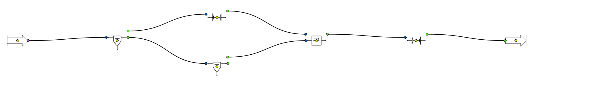

   Export SVG de la scène livrée, par le chemin de l'action « Exporter la scène en
   SVG… » de l'IHM.

**Ce qu'elle montre.** Une centrale géothermique à **double flash** : 760 kg/s d'eau de puits à 230 °C et 28 bar sont détendus dans un premier ballon à 6 bar ; la vapeur alimente une turbine HP, le liquide est de nouveau vaporisé à 0,931 bar ; les deux vapeurs sont mélangées et détendues dans une turbine BP jusqu'au condenseur à 0,123 bar.

**Nœuds employés** (7 nœuds, 7 liaisons) : Ballon de flash ×2, Turbine ×2, Source, Mélangeur fluides, Sortie.

**Ouvrir.** Menu **File > Exemples > 1 - Cycles thermodynamiques > Geothermie**. À l'ouverture, la scène est calculée par le moteur historique (une passe, de l'amont vers les sorties) ; statut affiché : « convergence non mesurée » (une passe unique ne prouve rien).

**Ce qu'on observe.** Le premier flash à 6 bar vaporise 15,3 % de l'eau du puits (158,8 °C) ; le second, à 0,931 bar, en reprend 11,5 %. Les deux turbines produisent 31,3 MW (HP) et 47,1 MW (BP), soit **78,3 MW** pour 760 kg/s d'eau géothermale.

Valeurs affichées par les nœuds à l'ouverture (relevé automatique) :

.. list-table::
   :header-rows: 1
   :widths: 26 16 58

   * - Nœud
     - Type
     - Valeurs affichées
   * - Eau puits 230C
     - Source
     - Temp. effective (°C) = 230.000 ; Pression effective (bar) = 28.000
   * - Flash 1 (6 bar)
     - Ballon de flash
     - Fraction vapeur (-) = 0.153 ; T° flash (°C) = 158.83 ; Chaleur latente (kW) = 243057.847
   * - Turbine HP
     - Turbine
     - Q_turb(kW) = 31257.588 ; Temp. isentrop. (°C) = 97.62
   * - Flash 2 (0.931 bar)
     - Ballon de flash
     - Fraction vapeur (-) = 0.115 ; T° flash (°C) = 97.62 ; Chaleur latente (kW) = 168105.624
   * - Melange vapeurs
     - Mélangeur fluides
     - T° sortie (°C) = 97.62 ; Débit mélangé (kg/s) = 190.8269
   * - Turbine BP
     - Turbine
     - Q_turb(kW) = 47076.773 ; Temp. isentrop. (°C) = 49.92
   * - Condenseur
     - Sortie
     - Température (°C) = 49.9 °C ; Pression (bar) = 0.123 bar ; Débit (kg/h) = 686976.989 kg/h

Rankine - centrale a vapeur
~~~~~~~~~~~~~~~~~~~~~~~~~~~

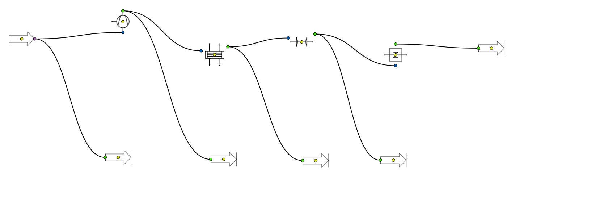

   Export SVG de la scène livrée, par le chemin de l'action « Exporter la scène en
   SVG… » de l'IHM.

**Ce qu'elle montre.** Un cycle de Rankine idéal à vapeur d'eau : 1 kg/s de condensat à 26 °C et 0,0356 bar, pompé à 128 bar (nœud compresseur, rendement 1), vaporisé et surchauffé de 117,4 K, détendu dans une turbine isentropique jusqu'à 0,0356 bar puis condensé, avec des nœuds *Sortie* branchés entre chaque organe pour lire l'état du fluide.

**Nœuds employés** (10 nœuds, 9 liaisons) : Sortie ×5, Evaporateur, Source, Compresseur, Turbine, Condenseur.

**Ouvrir.** Menu **File > Exemples > 1 - Cycles thermodynamiques > Rankine - centrale a vapeur**. À l'ouverture, la scène est calculée par le moteur historique (une passe, de l'amont vers les sorties) ; statut affiché : « convergence non mesurée » (une passe unique ne prouve rien).

**Ce qu'on observe.** Pour 1 kg/s d'eau, la « compression » du condensat à 128 bar (rendement 1) demande 12,8 kW, l'évaporateur apporte 3 065,6 kW et sort la vapeur à 447 °C, la turbine isentropique rend 1 318,3 kW jusqu'à 0,0356 bar et le condenseur rejette 1 756,1 kW. **Rendement du cycle idéal : 42,6 %** (travail net / chaleur apportée). Les nœuds *Sortie* intercalés donnent l'état du fluide entre chaque organe. La scène était enregistrée dans l'ancien format (réglages en liste, que les nœuds ne relisaient pas) : elle a été réécrite le 28/09/2026, source réglée à 26 °C, sous la saturation (26,96 °C à 0,0356 bar), pour que la pompe reçoive bien du liquide.

Valeurs affichées par les nœuds à l'ouverture (relevé automatique) :

.. list-table::
   :header-rows: 1
   :widths: 26 16 58

   * - Nœud
     - Type
     - Valeurs affichées
   * - Output
     - Sortie
     - Température (°C) = 447.0 °C ; Pression (bar) = 128.000 bar ; Débit (kg/h) = 3600.000 kg/h
   * - Evaporateur
     - Evaporateur
     - Q_evap (kW) = 3065.615 ; Tevap(°C) = 329.65
   * - Source
     - Source
     - Temp. effective (°C) = 26.000 ; Pression effective (bar) = 0.036
   * - Compresseur
     - Compresseur
     - Q_comp(kW) = 12.802 ; Energie dissipée (kW) = -0.000 ; Temp. sortie sans refroid. (°C) = 26.25
   * - Output
     - Sortie
     - Température (°C) = 26.3 °C ; Pression (bar) = 128.000 bar ; Débit (kg/h) = 3600.000 kg/h
   * - Output
     - Sortie
     - Température (°C) = 26.0 °C ; Pression (bar) = 0.036 bar ; Débit (kg/h) = 3600.000 kg/h
   * - Turbine
     - Turbine
     - Q_turb(kW) = 1318.319 ; Temp. isentrop. (°C) = 26.96
   * - Condenseur
     - Condenseur
     - Q_cond (kW) = 1756.121 ; Tcond(°C) = 26.96
   * - Output
     - Sortie
     - Température (°C) = 27.0 °C ; Pression (bar) = 0.036 bar ; Débit (kg/h) = 3600.000 kg/h
   * - Output
     - Sortie
     - Température (°C) = 27.0 °C ; Pression (bar) = 0.036 bar ; Débit (kg/h) = 3600.000 kg/h

Rankine - cycle vapeur
~~~~~~~~~~~~~~~~~~~~~~

   Export SVG de la scène livrée, par le chemin de l'action « Exporter la scène en
   SVG… » de l'IHM.

**Ce qu'elle montre.** Le cycle de Rankine d'une centrale à vapeur : 1 kg/s de condensat à 32 °C et 0,05 bar, pompe à 80 bar, chaudière à 450 °C, turbine (rendement 0,85) jusqu'à 0,05 bar, condenseur.

**Nœuds employés** (6 nœuds, 5 liaisons) : Source, Pompe, Heater_Cooler, Turbine, Condenseur, Sortie.

**Ouvrir.** Menu **File > Exemples > 1 - Cycles thermodynamiques > Rankine - cycle vapeur**. À l'ouverture, la scène est calculée par le moteur historique (une passe, de l'amont vers les sorties) ; statut affiché : « convergence non mesurée » (une passe unique ne prouve rien).

**Ce qu'on observe.** Pour 1 kg/s de condensat pris à 32 °C sous 0,050 bar (la saturation est à 32,87 °C : c'est bien du liquide), la pompe demande 11,46 kW pour 819 m de hauteur, la chaudière apporte 3 127,8 kW, la turbine rend 1 083,3 kW et le condenseur rejette 2 052,3 kW. **Rendement du cycle : 34,3 %.** La pompe est réglée en « Débit imposé » : sur sa courbe par défaut (2 à 30 m³/h, 44 m au plus), elle ne pourrait pas refouler à cette pression. Scène corrigée le 28/09/2026 : la source était réglée au-dessus de la saturation et délivrait de la vapeur à la pompe.

Valeurs affichées par les nœuds à l'ouverture (relevé automatique) :

.. list-table::
   :header-rows: 1
   :widths: 26 16 58

   * - Nœud
     - Type
     - Valeurs affichées
   * - Eau condensat
     - Source
     - Temp. effective (°C) = 32.000 ; Pression effective (bar) = 0.050
   * - Pompe -> 80 bar
     - Pompe
     - Débit de fonctionnement (m³/h) = 3.618 ; Puissance hydraulique (kW) = 11.459 ; HMT (m) = 819.09
   * - Chaudiere 450C
     - Heater_Cooler
     - Qth(kW) = 3127.777 ; Temp. sortie (°C) = 450.00
   * - Turbine 0.05 bar
     - Turbine
     - Q_turb(kW) = 1083.281 ; Temp. isentrop. (°C) = 32.87
   * - Condenseur
     - Condenseur
     - Q_cond (kW) = 2052.301 ; Tcond(°C) = 32.87
   * - Sortie
     - Sortie
     - Température (°C) = 32.9 °C ; Pression (bar) = 0.050 bar ; Débit (kg/h) = 3600.000 kg/h

Solaire a concentration (SEGS)
~~~~~~~~~~~~~~~~~~~~~~~~~~~~~~

   Export SVG de la scène livrée, par le chemin de l'action « Exporter la scène en
   SVG… » de l'IHM.

**Ce qu'elle montre.** Le cycle vapeur d'une centrale solaire à concentration de type SEGS : 1 kg/s de condensat à 41 °C sous 0,082 bar, pompe à 100 bar, « chaudière solaire » (champ de capteurs cylindro-paraboliques) à 371 °C, turbine, condenseur à 42 °C.

**Nœuds employés** (6 nœuds, 5 liaisons) : Source, Pompe, Heater_Cooler, Turbine, Condenseur, Sortie.

**Ouvrir.** Menu **File > Exemples > 1 - Cycles thermodynamiques > Solaire a concentration (SEGS)**. À l'ouverture, la scène est calculée par le moteur historique (une passe, de l'amont vers les sorties) ; statut affiché : « convergence non mesurée » (une passe unique ne prouve rien).

**Ce qu'on observe.** Pour 1 kg/s de condensat pris à 41 °C sous 0,082 bar (la saturation est à 41,98 °C : c'est bien du liquide), la pompe demande 14,36 kW pour 1 027 m de hauteur, la chaudière apporte 2 816,3 kW, la turbine rend 937,2 kW et le condenseur rejette 1 889,4 kW. **Rendement du cycle : 32,8 %.** La pompe est réglée en « Débit imposé » : sur sa courbe par défaut (2 à 30 m³/h, 44 m au plus), elle ne pourrait pas refouler à cette pression. Scène corrigée le 28/09/2026 : la source était réglée au-dessus de la saturation et délivrait de la vapeur à la pompe.

Valeurs affichées par les nœuds à l'ouverture (relevé automatique) :

.. list-table::
   :header-rows: 1
   :widths: 26 16 58

   * - Nœud
     - Type
     - Valeurs affichées
   * - Condensat 42C
     - Source
     - Temp. effective (°C) = 41.000 ; Pression effective (bar) = 0.082
   * - Pompe -> 100 bar
     - Pompe
     - Débit de fonctionnement (m³/h) = 3.630 ; Puissance hydraulique (kW) = 14.362 ; HMT (m) = 1026.96
   * - Chaudiere solaire 371C
     - Heater_Cooler
     - Qth(kW) = 2816.329 ; Temp. sortie (°C) = 371.00
   * - Turbine
     - Turbine
     - Q_turb(kW) = 937.165 ; Temp. isentrop. (°C) = 41.98
   * - Condenseur 42C
     - Condenseur
     - Q_cond (kW) = 1889.439 ; Tcond(°C) = 41.98
   * - Sortie
     - Sortie
     - Température (°C) = 42.0 °C ; Pression (bar) = 0.082 bar ; Débit (kg/h) = 3600.000 kg/h

Turbine a gaz - modele detaille
~~~~~~~~~~~~~~~~~~~~~~~~~~~~~~~

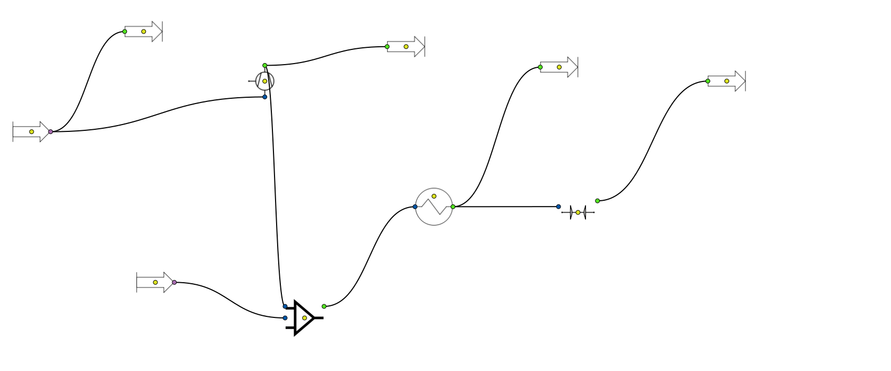

   Export SVG de la scène livrée, par le chemin de l'action « Exporter la scène en
   SVG… » de l'IHM.

**Ce qu'elle montre.** Une turbine à gaz détaillée : air comprimé, injection d'un débit de combustible par un mélangeur, chambre de combustion (réchauffeur à 1065 °C), turbine, avec des nœuds *Sortie* intermédiaires.

**Nœuds employés** (10 nœuds, 9 liaisons) : Sortie ×4, Source ×2, Compresseur, Heater_Cooler, Mélangeur, Turbine.

**Ouvrir.** Menu **File > Exemples > 1 - Cycles thermodynamiques > Turbine a gaz - modele detaille**. À l'ouverture, la scène est calculée par le moteur historique (une passe, de l'amont vers les sorties) ; statut affiché : « convergence non mesurée » (une passe unique ne prouve rien).

**Ce qu'on observe.** 1 kg/s d'air à 15 °C est comprimé à 16 bar (410,8 kW, sortie à 413 °C) ; le mélangeur y ajoute 0,05 kg/s d'un second courant (le « combustible », représenté par de l'air à 20 bar) ; la chambre de combustion (un réchauffeur) apporte 801,7 kW pour atteindre 1065 °C, et la turbine rend 768,8 kW jusqu'à 1 bar. Travail net 358,0 kW, **rendement 44,7 %** — sans modèle de combustion : pour le bilan d'une vraie combustion, voir le nœud « Turbine à gaz ». Scène réécrite le 28/09/2026 depuis l'ancien format (réglages en liste, ignorés) ; la perte de charge de −4 bar du fichier d'origine, qui faisait **monter** la pression dans la chambre, a été ramenée à 0.

Valeurs affichées par les nœuds à l'ouverture (relevé automatique) :

.. list-table::
   :header-rows: 1
   :widths: 26 16 58

   * - Nœud
     - Type
     - Valeurs affichées
   * - Source
     - Source
     - Temp. effective (°C) = 15.000 ; Pression effective (bar) = 1.000
   * - Output
     - Sortie
     - Température (°C) = 15.0 °C ; Pression (bar) = 1.000 bar ; Débit (kg/h) = 3600.000 kg/h
   * - Compresseur
     - Compresseur
     - Q_comp(kW) = 410.810 ; Energie dissipée (kW) = 0.000 ; Temp. sortie sans refroid. (°C) = 413.15
   * - Output
     - Sortie
     - Température (°C) = 413.2 °C ; Pression (bar) = 16.000 bar ; Débit (kg/h) = 3600.000 kg/h
   * - Heater_Cooler
     - Heater_Cooler
     - Qth(kW) = 801.744 ; Temp. sortie (°C) = 1065.00
   * - Source
     - Source
     - Temp. effective (°C) = 15.000 ; Pression effective (bar) = 20.000
   * - Output
     - Sortie
     - Température (°C) = 1065.0 °C ; Pression (bar) = 16.000 bar ; Débit (kg/h) = 3780.000 kg/h
   * - Turbine
     - Turbine
     - Q_turb(kW) = 768.819 ; Temp. isentrop. (°C) = 388.09
   * - Output
     - Sortie
     - Température (°C) = 424.1 °C ; Pression (bar) = 1.000 bar ; Débit (kg/h) = 3780.000 kg/h

Turboreacteur
~~~~~~~~~~~~~

   Export SVG de la scène livrée, par le chemin de l'action « Exporter la scène en
   SVG… » de l'IHM.

**Ce qu'elle montre.** Un turboréacteur simple flux en altitude : 27,8 kg/s d'air à −50 °C et 0,265 bar, diffuseur d'entrée (effet dynamique), compresseur à 16 bar, combustion à 1150 °C, turbine qui entraîne le compresseur (détente à 1,8 bar), tuyère de poussée détendue jusqu'à la pression ambiante.

**Nœuds employés** (7 nœuds, 6 liaisons) : Source, Diffuseur, Compresseur, Heater_Cooler, Turbine, Tuyère, Sortie.

**Ouvrir.** Menu **File > Exemples > 1 - Cycles thermodynamiques > Turboreacteur**. À l'ouverture, la scène est calculée par le moteur historique (une passe, de l'amont vers les sorties) ; statut affiché : « convergence non mesurée » (une passe unique ne prouve rien).

**Ce qu'on observe.** Le diffuseur relève la pression d'arrêt de 0,265 à 0,280 bar ; le compresseur absorbe 16,27 MW, la combustion apporte 20,33 MW et la turbine du générateur de gaz, détendue jusqu'à 1,8 bar, rend 16,37 MW : **elle entraîne le compresseur** (16,37 ≥ 16,27 MW). La tuyère détend le gaz jusqu'à la pression ambiante (0,265 bar) : **jet à 746 m/s** pour 27,8 kg/s, soit un débit de quantité de mouvement de 20,8 kN en sortie (la poussée nette en retranche le débit multiplié par la vitesse de vol, que la scène ne donne pas). Scène corrigée le 28/09/2026 : la tuyère visait 3,0 bar en aval d'une turbine qui sortait à 2,4 bar (débit nul), la turbine ne couvrait pas le compresseur, et la section de tuyère (0,001 m²) ne laissait passer que 0,1 kg/s ; elle vaut désormais 0,2688 m².

Valeurs affichées par les nœuds à l'ouverture (relevé automatique) :

.. list-table::
   :header-rows: 1
   :widths: 26 16 58

   * - Nœud
     - Type
     - Valeurs affichées
   * - Air altitude
     - Source
     - Temp. effective (°C) = -50.000 ; Pression effective (bar) = 0.265
   * - Diffuseur (ram)
     - Diffuseur
     - Pression sortie (bar) = 0.2798 ; Enthalpie isentr. sortie (kJ/kg) = 352.81
   * - Compresseur
     - Compresseur
     - Q_comp(kW) = 16267.190 ; Energie dissipée (kW) = -0.000 ; Temp. sortie sans refroid. (°C) = 518.26
   * - Combustion 1150C
     - Heater_Cooler
     - Qth(kW) = 20333.022 ; Temp. sortie (°C) = 1150.00
   * - Turbine (gen. gaz)
     - Turbine
     - Q_turb(kW) = 16369.091 ; Temp. isentrop. (°C) = 553.81
   * - Tuyere (poussee)
     - Tuyère
     - Vitesse sortie (m/s) = 746.40 ; Débit (kg/s) = 27.8008 ; Titre vapeur (-) = 1.000
   * - Jet
     - Sortie
     - Température (°C) = 393.0 °C ; Pression (bar) = 0.265 bar ; Débit (kg/h) = 100082.711 kg/h

Froid et cryogénie
------------------

Absorption a simple effet
~~~~~~~~~~~~~~~~~~~~~~~~~

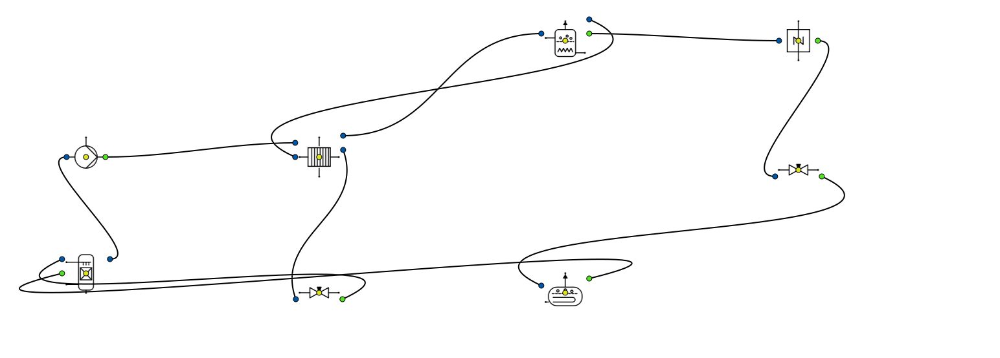

   Export SVG de la scène livrée, par le chemin de l'action « Exporter la scène en
   SVG… » de l'IHM.

**Ce qu'elle montre.** Une machine frigorifique à absorption LiBr-H₂O simple effet, assemblée organe par organe : absorbeur, pompe de solution, échangeur de solution, générateur, détendeur de solution ; condenseur, détendeur de réfrigérant, évaporateur.

**Nœuds employés** (8 nœuds, 10 liaisons) : Détendeur ×2, Absorbeur, Pompe, Échangeur de solution (SHE), Générateur (désorbeur), Condenseur, Evaporateur.

**Ouvrir.** Menu **File > Exemples > 2 - Froid et cryogenie > Absorption a simple effet**. À l'ouverture, la scène est calculée par le moteur historique (une passe, de l'amont vers les sorties) ; statut affiché : « convergence non mesurée » (une passe unique ne prouve rien).

**Ce qu'on observe.** **Rien n'est calculé à l'ouverture** : 8 nœuds sur 8 restent vides. La scène est faite de deux boucles fermées (solution et réfrigérant) sans nœud *Sortie* ni *Capteur* : or le moteur historique n'évalue un graphe qu'en partant de ces nœuds terminaux, et le bouton **Simuler** ne fait pas mieux. La scène sert à voir l'**assemblage** d'une machine à absorption LiBr-H₂O (générateur à 90 °C, condenseur et absorbeur à 35 °C, évaporateur à 5 °C) ; pour les chiffres, calculer la machine en Python (:doc:`../002-thermodynamic_cycles/froid_absorption`). Défaut consigné.

Cryogenie
~~~~~~~~~

   Export SVG de la scène livrée, par le chemin de l'action « Exporter la scène en
   SVG… » de l'IHM.

**Ce qu'elle montre.** La liquéfaction du méthane par le procédé de Linde le plus simple : compression à 100 bar, refroidissement à 210 K (−63 °C), détente de Joule-Thomson à 1 bar, séparation du liquide et de la vapeur (qui serait recyclée).

**Nœuds employés** (7 nœuds, 6 liaisons) : Sortie ×2, Source, Compresseur, Heater_Cooler, Détendeur, Ballon de flash.

**Ouvrir.** Menu **File > Exemples > 2 - Froid et cryogenie > Cryogenie**. À l'ouverture, la scène est calculée par le moteur historique (une passe, de l'amont vers les sorties) ; statut affiché : « convergence non mesurée » (une passe unique ne prouve rien).

**Ce qu'on observe.** Après compression à 100 bar (1 116,5 kW, rendement isentropique réglé à 1), refroidissement à −63 °C et détente de Joule-Thomson à 1 bar, le séparateur reçoit un mélange à 81,8 % de vapeur : **18,2 % du méthane est liquéfié** (655 kg/h à -161,6 °C). Rapporté au liquide produit, le compresseur dépense 1,70 kWh par kg de GNL — sans compter le froid externe du refroidisseur.

Valeurs affichées par les nœuds à l'ouverture (relevé automatique) :

.. list-table::
   :header-rows: 1
   :widths: 26 16 58

   * - Nœud
     - Type
     - Valeurs affichées
   * - Methane 280K 1bar
     - Source
     - Temp. effective (°C) = 6.850 ; Pression effective (bar) = 1.000
   * - Compression 100 bar
     - Compresseur
     - Q_comp(kW) = 1116.533 ; Energie dissipée (kW) = 0.000 ; Temp. sortie sans refroid. (°C) = 405.23
   * - Refroid. 210K
     - Heater_Cooler
     - Qth(kW) = -1568.737 ; Temp. sortie (°C) = -63.00
   * - Detente JT 1 bar
     - Détendeur
     - Q_exp (kW) = 0.000 ; Tcond(°C) = -161.64
   * - Separateur 1 bar
     - Ballon de flash
     - Fraction vapeur (-) = 0.818 ; T° flash (°C) = -161.64 ; Chaleur latente (kW) = 418.170
   * - Vapeur recyclee
     - Sortie
     - Température (°C) = -161.6 °C ; Pression (bar) = 1.000 bar ; Débit (kg/h) = 2945.322 kg/h
   * - Methane liquide
     - Sortie
     - Température (°C) = -161.6 °C ; Pression (bar) = 1.000 bar ; Débit (kg/h) = 654.678 kg/h

Liquefaction simple
~~~~~~~~~~~~~~~~~~~

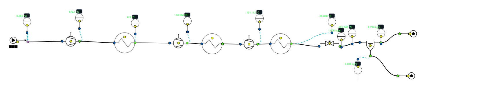

   Export SVG de la scène livrée, par le chemin de l'action « Exporter la scène en
   SVG… » de l'IHM.

**Ce qu'elle montre.** Une liquéfaction de méthane plus réaliste : compression étagée avec refroidissement intermédiaire, pré-refroidissement, détente, séparateur liquide/vapeur, et un capteur après chaque organe.

**Nœuds employés** (21 nœuds, 20 liaisons) : Capteur ×10, Compresseur ×3, Heater_Cooler ×3, Sortie ×2, Source, Détendeur, Séparateur liq/vap.

**Ouvrir.** Menu **File > Exemples > 2 - Froid et cryogenie > Liquefaction simple**. À l'ouverture, la scène est calculée par le moteur historique (une passe, de l'amont vers les sorties) ; statut affiché : « convergence non mesurée » (une passe unique ne prouve rien).

**Ce qu'on observe.** Trois étages de compression (5, 25 puis 100 bar, rendement 0,7) séparés par des refroidisseurs à 6,85 °C, un pré-refroidissement à −65 °C, puis détente à 1 bar et séparation. Les compresseurs absorbent 1 122,3 kW au total ; le séparateur sort **0,206 kg/s de méthane liquide** sur 1 kg/s (20,6 %), soit 1,51 kWh par kg de liquide. Les capteurs de la scène affichent la température après chaque organe : on lit la montée à chaque compression et le retour à 6,85 °C à chaque refroidisseur, jusqu'à -161,6 °C après la détente.

Machine frigorifique bi-etagee
~~~~~~~~~~~~~~~~~~~~~~~~~~~~~~

   Export SVG de la scène livrée, par le chemin de l'action « Exporter la scène en
   SVG… » de l'IHM.

**Ce qu'elle montre.** Une machine frigorifique R134a à deux étages de compression avec bouteille intermédiaire à injection (3,5 bar) : l'étage BP aspire à 1 bar, l'étage HP refoule à 12 bar ; la boucle HP est ouverte par une source de coupure.

**Nœuds employés** (12 nœuds, 11 liaisons) : Compresseur ×2, Détendeur ×2, Sortie ×2, Source, Mélangeur fluides, Ballon de flash, Condenseur, Evaporateur, Source_P_h.

**Ouvrir.** Menu **File > Exemples > 2 - Froid et cryogenie > Machine frigorifique bi-etagee**. À l'ouverture, la scène est calculée par le moteur historique (une passe, de l'amont vers les sorties) ; statut affiché : « convergence non mesurée » (une passe unique ne prouve rien).

**Ce qu'on observe.** 1 kg/s de R134a vaporisé à -26,4 °C absorbe **179,8 kW de froid**. L'étage BP comprime la vapeur de 1 à 3,5 bar (32,6 kW) ; dans la bouteille à 3,5 bar, le liquide détendu de l'étage HP la refroidit et s'y vaporise en partie : le séparateur envoie 58,5 % du débit, en vapeur, à l'étage HP (1,412 kg/s comprimés à 12 bar, 45,2 kW) et le reste, liquide, à l'évaporateur. **COP froid = 2,31.** La boucle HP est **ouverte** à l'entrée de la bouteille : la source « Injection HP (coupure de boucle) » y porte le débit et l'enthalpie que le nœud de contrôle « Retour detente HP » relit en sortie de détente (1,4119 kg/s relus pour 1,4119 kg/s injectés). Le moteur historique ne sait pas résoudre une boucle fermée : les valeurs de coupure ont été convergées par substitution le 28/09/2026 ; **si vous modifiez la scène, recopiez dans la source les valeurs du nœud de contrôle et relancez jusqu'à ce qu'elles coïncident.**

Valeurs affichées par les nœuds à l'ouverture (relevé automatique) :

.. list-table::
   :header-rows: 1
   :widths: 26 16 58

   * - Nœud
     - Type
     - Valeurs affichées
   * - R134a vap BP
     - Source
     - Temp. effective (°C) = -21.000 ; Pression effective (bar) = 1.000
   * - Compresseur BP
     - Compresseur
     - Q_comp(kW) = 32.572 ; Energie dissipée (kW) = 0.000 ; Temp. sortie sans refroid. (°C) = 24.73
   * - Bouteille flash (inj.)
     - Mélangeur fluides
     - T° sortie (°C) = 5.03 ; Débit mélangé (kg/s) = 2.4119
   * - Separateur 3.5 bar
     - Ballon de flash
     - Fraction vapeur (-) = 0.585 ; T° flash (°C) = 5.03 ; Chaleur latente (kW) = 274.926
   * - Compresseur HP
     - Compresseur
     - Q_comp(kW) = 45.159 ; Energie dissipée (kW) = -0.000 ; Temp. sortie sans refroid. (°C) = 56.17
   * - Condenseur 12 bar
     - Condenseur
     - Q_cond (kW) = 257.795 ; Tcond(°C) = 46.31
   * - Detente HP -> 3.5 bar
     - Détendeur
     - Q_exp (kW) = 0.000 ; Tcond(°C) = 5.03
   * - Detente BP -> 1 bar
     - Détendeur
     - Q_exp (kW) = 0.000 ; Tcond(°C) = -26.36
   * - Evaporateur
     - Evaporateur
     - Q_evap (kW) = 179.777 ; Tevap(°C) = -26.36
   * - Retour detente HP (controle de coupure)
     - Sortie
     - Température (°C) = 5.0 °C ; Pression (bar) = 3.500 bar ; Débit (kg/h) = 5082.904 kg/h
   * - Sortie evaporateur
     - Sortie
     - Température (°C) = -21.4 °C ; Pression (bar) = 1.000 bar ; Débit (kg/h) = 3600.000 kg/h

Machine frigorifique
~~~~~~~~~~~~~~~~~~~~

   Export SVG de la scène livrée, par le chemin de l'action « Exporter la scène en
   SVG… » de l'IHM.

**Ce qu'elle montre.** Le cycle frigorifique à compression de vapeur de base, au R134a : compression de 1 à 12 bar, condenseur (sous-refroidissement 5 K), détendeur à 1 bar, évaporateur (surchauffe 5 K).

**Nœuds employés** (6 nœuds, 5 liaisons) : Source, Compresseur, Condenseur, Détendeur, Evaporateur, Sortie.

**Ouvrir.** Menu **File > Exemples > 2 - Froid et cryogenie > Machine frigorifique**. À l'ouverture, la scène est calculée par le moteur historique (une passe, de l'amont vers les sorties) ; statut affiché : « convergence non mesurée » (une passe unique ne prouve rien).

**Ce qu'on observe.** Pour 1 kg/s de R134a, l'évaporateur absorbe 128,2 kW à -26,4 °C, le compresseur consomme 67,1 kW et le condenseur rejette 196,4 kW à 46,3 °C. **COP froid = 1,91**. C'est la scène dont le guide publie l'export (:doc:`../002-thermodynamic_cycles/chiller`).

Valeurs affichées par les nœuds à l'ouverture (relevé automatique) :

.. list-table::
   :header-rows: 1
   :widths: 26 16 58

   * - Nœud
     - Type
     - Valeurs affichées
   * - R134a vap BP
     - Source
     - Temp. effective (°C) = -20.000 ; Pression effective (bar) = 1.000
   * - Compresseur 12 bar
     - Compresseur
     - Q_comp(kW) = 67.146 ; Energie dissipée (kW) = -0.000 ; Temp. sortie sans refroid. (°C) = 75.59
   * - Condenseur
     - Condenseur
     - Q_cond (kW) = 196.449 ; Tcond(°C) = 46.31
   * - Detendeur 1 bar
     - Détendeur
     - Q_exp (kW) = 0.000 ; Tcond(°C) = -26.36
   * - Evaporateur
     - Evaporateur
     - Q_evap (kW) = 128.222 ; Tevap(°C) = -26.36
   * - Sortie
     - Sortie
     - Température (°C) = -21.4 °C ; Pression (bar) = 1.000 bar ; Débit (kg/h) = 3600.000 kg/h

Hydraulique
-----------

Remplissage regule par niveau
~~~~~~~~~~~~~~~~~~~~~~~~~~~~~

   Export SVG de la scène livrée, par le chemin de l'action « Exporter la scène en
   SVG… » de l'IHM.

**Ce qu'elle montre.** Une bâche de stockage remplie par une pompe (avec clapet) et vidée par un usage (vanne Kv 4) : la base d'une régulation de niveau.

**Nœuds employés** (10 nœuds, 9 liaisons) : Tuyau droit ×2, Capteur ×2, Source, Pompe, Clapet anti-retour, Bâche (niveau variable), Vanne générique (Kv), Sortie.

**Ouvrir.** Menu **File > Exemples > 3 - Hydraulique > Baches > Remplissage regule par niveau**. À l'ouverture, la scène est calculée par le solveur nodal des réseaux (Newton sur les pressions) ; statut affiché : **convergé** (point fixe constaté).

**Ce qu'on observe.** La pompe de remplissage débite 8,19 m³/h sous 14,8 m de HMT, l'usage soutire 2,0 m³/h : la bâche reçoit un débit net de **6,22 m³/h**. L'ouverture donne l'instant initial ; l'évolution du niveau, l'arrêt de la pompe au niveau haut et son redémarrage relèvent de la simulation temporelle (:doc:`../013-simulation-temporelle/index`).

Valeurs affichées par les nœuds à l'ouverture (relevé automatique) :

.. list-table::
   :header-rows: 1
   :widths: 26 16 58

   * - Nœud
     - Type
     - Valeurs affichées
   * - Pompe de remplissage
     - Pompe
     - P refoulement (bar) = 2.4674 ; Puissance hydraulique (kW) = 0.331 ; HMT (m) = 14.85
   * - Clapet
     - Clapet anti-retour
     - Perte de charge (Pa) = 1340.55 ; Pression sortie (bar) = 2.4540
   * - Refoulement DN32
     - Tuyau droit
     - Vitesse (m/s) = 2.8293 ; Reynolds (-) = 90230 ; Perte de charge (Pa) = 119601.77
   * - Bâche de stockage
     - Bâche (niveau variable)
     - Débit net entrant (m³/h) = 6.2222 ; Pression au fond (bar) = 1.25798
   * - Départ usage
     - Tuyau droit
     - Vitesse (m/s) = 0.2786 ; Reynolds (-) = 13883 ; Perte de charge (Pa) = 233.72
   * - Usage (Kv 4)
     - Vanne générique (Kv)
     - Perte de charge (Pa) = 24238.95 ; Pression sortie (bar) = 1.0132
   * - Q remplissage
     - Capteur
     - 8.2 m³/h
   * - Q usage
     - Capteur
     - 2.0 m³/h

Batiment 7 - debit variable
~~~~~~~~~~~~~~~~~~~~~~~~~~~

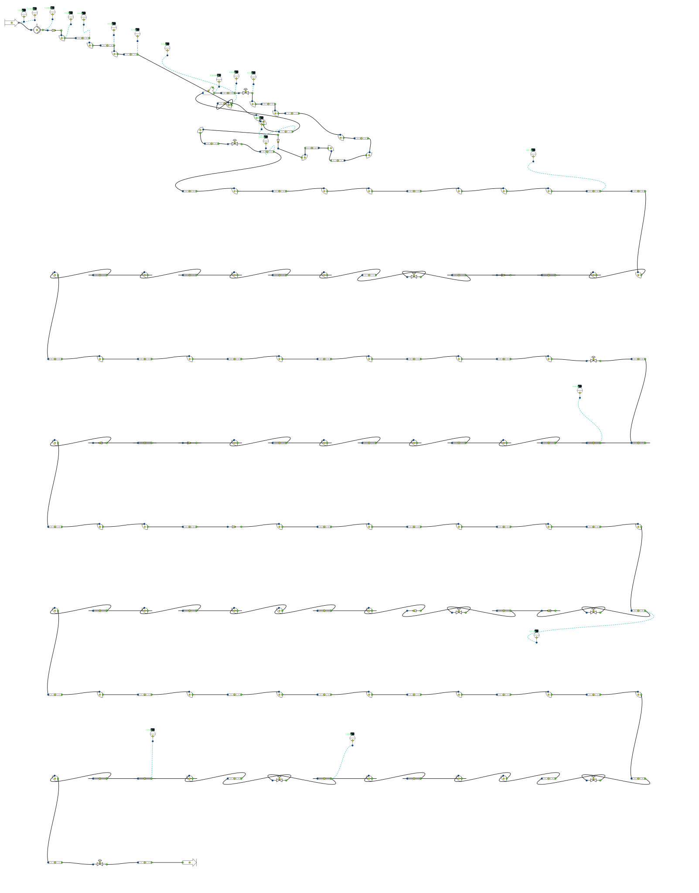

   Export SVG de la scène livrée, par le chemin de l'action « Exporter la scène en
   SVG… » de l'IHM.

**Ce qu'elle montre.** Le réseau de chauffage réel d'un bâtiment : 164 nœuds, dont 65 tronçons droits, 60 coudes, 9 vannes d'équilibrage et 18 capteurs de pression et de débit.

**Nœuds employés** (164 nœuds, 163 liaisons) : Tuyau droit ×65, Coude courbe ×60, Capteur ×18, Vanne TA ×9, Retrecissement ×4, Elargissement ×4, Source, Sortie, Té divergent, Pompe.

**Ouvrir.** Menu **File > Exemples > 3 - Hydraulique > Batiment 7 - debit variable**. À l'ouverture, la scène est calculée par le solveur nodal des réseaux (Newton sur les pressions) ; statut affiché : **convergé** (point fixe constaté).

**Ce qu'on observe.** Une seule pompe alimente tout le bâtiment : 1,16 m³/h sous 44,5 m de HMT. Les capteurs de piquage donnent la pression disponible le long du réseau, de 5,34 bar au départ A à 1,10 bar au retour B : c'est la lecture qui sert à régler les neuf vannes d'équilibrage.

Valeurs affichées par les nœuds à l'ouverture (relevé automatique) :

.. list-table::
   :header-rows: 1
   :widths: 26 16 58

   * - Nœud
     - Type
     - Valeurs affichées
   * - Piquage A départ
     - Capteur
     - 5.34 bar
   * - Piquage B départ
     - Capteur
     - 4.61 bar
   * - Piquage 1 départ
     - Capteur
     - 4.61 bar
   * - Piquage A CTA
     - Capteur
     - 4.24 bar
   * - Piquage A retour
     - Capteur
     - 3.71 bar
   * - Piquage 1 retour
     - Capteur
     - 1.19 bar
   * - Piquage B retour
     - Capteur
     - 1.10 bar
   * - Piquage A départ
     - Capteur
     - 5.34 bar
   * - Piquage A départ
     - Capteur
     - 0.80 Nm³/h
   * - Pompe
     - Pompe
     - P refoulement (bar) = 5.3556 ; Puissance hydraulique (kW) = 0.140 ; HMT (m) = 44.45

Eau glacee glycolee MEG 30
~~~~~~~~~~~~~~~~~~~~~~~~~~

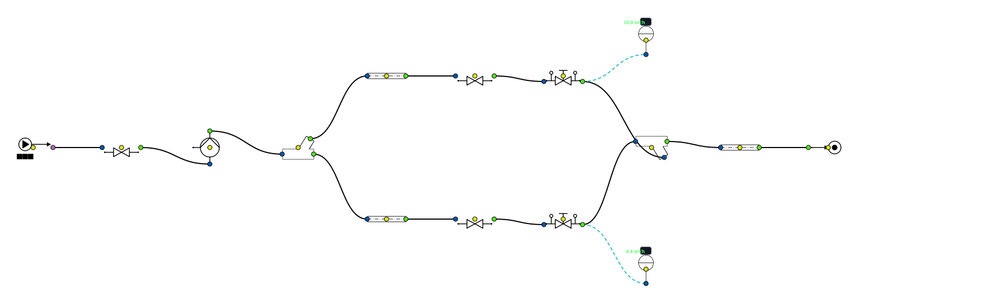

   Export SVG de la scène livrée, par le chemin de l'action « Exporter la scène en
   SVG… » de l'IHM.

**Ce qu'elle montre.** Un réseau d'eau glacée en eau glycolée (éthylène glycol à 30 %) : évaporateur, pompe, deux batteries de CTA avec vanne 2 voies et vanne d'équilibrage.

**Nœuds employés** (15 nœuds, 15 liaisons) : Vanne générique (Kv) ×3, Tuyau droit ×3, Vanne TA ×2, Capteur ×2, Source, Pompe, Té divergent, Té convergent, Sortie.

**Ouvrir.** Menu **File > Exemples > 3 - Hydraulique > Fluides > Eau glacee glycolee MEG 30**. À l'ouverture, la scène est calculée par le solveur nodal des réseaux (Newton sur les pressions) ; statut affiché : **convergé** (point fixe constaté).

**Ce qu'on observe.** En eau glycolée à 30 % (MEG), la pompe débite 14,41 m³/h sous 30,0 m de HMT. La batterie 1 (vanne 2 voies à 80 %) reçoit 10,0 m³/h, la batterie 2 (vanne à 50 %) 4,4 m³/h ; les capteurs lisent 7,0 °C, la température du vase.

Valeurs affichées par les nœuds à l'ouverture (relevé automatique) :

.. list-table::
   :header-rows: 1
   :widths: 26 16 58

   * - Nœud
     - Type
     - Valeurs affichées
   * - Évaporateur (Kv 60)
     - Vanne générique (Kv)
     - Perte de charge (Pa) = 6017.23 ; Pression sortie (bar) = 2.4398
   * - Pompe eau glacée
     - Pompe
     - P refoulement (bar) = 5.5037 ; Puissance hydraulique (kW) = 1.226 ; HMT (m) = 29.96
   * - Départ batteries
     - Té divergent
     - Débit sortie straight (kg/s) = 1.2621
   * - Batterie CTA 1
     - Tuyau droit
     - Vitesse (m/s) = 2.2212 ; Reynolds (-) = 27976 ; Perte de charge (Pa) = 51698.14
   * - V2V batterie 1 (80 %)
     - Vanne générique (Kv)
     - Perte de charge (Pa) = 166960.27 ; Pression sortie (bar) = 3.2838
   * - Équilibrage batterie 1
     - Vanne TA
     - Perte de charge (Pa) = 64331.09 ; Pression sortie (bar) = 2.6405
   * - Batterie CTA 2
     - Tuyau droit
     - Vitesse (m/s) = 0.9631 ; Reynolds (-) = 12131 ; Perte de charge (Pa) = 19041.10
   * - V2V batterie 2 (50 %)
     - Vanne générique (Kv)
     - Perte de charge (Pa) = 256341.28 ; Pression sortie (bar) = 2.7484
   * - Équilibrage batterie 2
     - Vanne TA
     - Perte de charge (Pa) = 12095.06 ; Pression sortie (bar) = 2.6274
   * - Retour eau glacée
     - Tuyau droit
     - Vitesse (m/s) = 1.2059 ; Reynolds (-) = 24681 ; Perte de charge (Pa) = 12292.21
   * - Q batterie 1
     - Capteur
     - 10.0 m³/h
   * - Q batterie 2
     - Capteur
     - 4.4 m³/h

Pompe - deux branches en pression
~~~~~~~~~~~~~~~~~~~~~~~~~~~~~~~~~

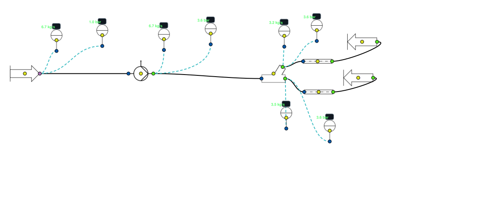

   Export SVG de la scène livrée, par le chemin de l'action « Exporter la scène en
   SVG… » de l'IHM.

**Ce qu'elle montre.** Une pompe qui alimente deux branches débouchant à des pressions différentes : la démonstration de la loi des nœuds.

**Nœuds employés** (15 nœuds, 14 liaisons) : Capteur ×8, Tuyau droit ×2, Sortie ×2, Source, Pompe, Té divergent.

**Ouvrir.** Menu **File > Exemples > 3 - Hydraulique > Loi des noeuds > Pompe - deux branches en pression**. À l'ouverture, la scène est calculée par le solveur nodal des réseaux (Newton sur les pressions) ; statut affiché : **convergé** (point fixe constaté).

**Ce qu'on observe.** La source est en **pression imposée** : c'est le réseau qui fixe le débit. La pompe s'établit à 24,04 m³/h sous 26,6 m de HMT ; le nœud de distribution partage le débit entre les branches A (3,5 kg/s) et B (3,2 kg/s), dont les sorties sont à 1,0 et 1,2 bar. La somme des deux retrouve le débit de la pompe : c'est la loi des nœuds (:doc:`../004-hydraulic/loi_des_noeuds`). Le titre du nœud pompe annonce un autre débit : c'est un libellé saisi, pas un résultat.

Valeurs affichées par les nœuds à l'ouverture (relevé automatique) :

.. list-table::
   :header-rows: 1
   :widths: 26 16 58

   * - Nœud
     - Type
     - Valeurs affichées
   * - Pompe à courbe — point réseau 25,87 m³/h (solveur nodal, tés Idel'chik)
     - Pompe
     - P refoulement (bar) = 3.6019 ; Puissance hydraulique (kW) = 1.737 ; HMT (m) = 26.56
   * - Nœud de distribution — Q = Q₁ + Q₂
     - Té divergent
     - Débit sortie straight (kg/s) = 3.4705
   * - Branche A — DN40 — 150 m
     - Tuyau droit
     - Vitesse (m/s) = 2.7642 ; Reynolds (-) = 97109 ; Perte de charge (Pa) = 260454.55
   * - Branche B — DN40 — 150 m
     - Tuyau droit
     - Vitesse (m/s) = 2.5490 ; Reynolds (-) = 89548 ; Perte de charge (Pa) = 225115.69
   * - Capteur — Source débit massique
     - Capteur
     - 6.7 kg/s
   * - Capteur — Pompe débit massique
     - Capteur
     - 6.7 kg/s
   * - Capteur — Branche B débit massique
     - Capteur
     - 3.2 kg/s
   * - Capteur — Branche A débit massique
     - Capteur
     - 3.5 kg/s
   * - Capteur — Source pression
     - Capteur
     - 1.0 bar
   * - Capteur — Pompe pression
     - Capteur
     - 3.6 bar
   * - Capteur — Branche B pression
     - Capteur
     - 3.6 bar
   * - Capteur — Branche A pression
     - Capteur
     - 3.6 bar

Pompe et vanne d equilibrage
~~~~~~~~~~~~~~~~~~~~~~~~~~~~

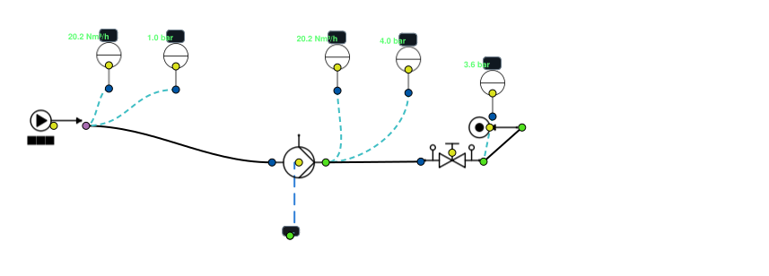

   Export SVG de la scène livrée, par le chemin de l'action « Exporter la scène en
   SVG… » de l'IHM.

**Ce qu'elle montre.** Le montage minimal : une pompe et une vanne d'équilibrage TA, avec capteurs de débit et de pression.

**Nœuds employés** (10 nœuds, 9 liaisons) : Capteur ×5, Source, Sortie, Pompe, Afficheur, Vanne TA.

**Ouvrir.** Menu **File > Exemples > 3 - Hydraulique > Pompe et vanne d equilibrage**. À l'ouverture, la scène est calculée par le solveur nodal des réseaux (Newton sur les pressions) ; statut affiché : **convergé** (point fixe constaté).

**Ce qu'on observe.** Point de fonctionnement : 20,18 m³/h sous 30,4 m de HMT. La vanne d'équilibrage prend 39,0 kPa. La scène est détaillée dans :doc:`../004-hydraulic/TA_valve`.

Valeurs affichées par les nœuds à l'ouverture (relevé automatique) :

.. list-table::
   :header-rows: 1
   :widths: 26 16 58

   * - Nœud
     - Type
     - Valeurs affichées
   * - Pompe
     - Pompe
     - P refoulement (bar) = 3.9902 ; Puissance hydraulique (kW) = 1.668 ; HMT (m) = 30.38
   * - Capteur
     - Capteur
     - 20.2 Nm³/h
   * - Capteur
     - Capteur
     - 20.2 Nm³/h
   * - Capteur
     - Capteur
     - 4.0 bar
   * - Capteur
     - Capteur
     - 1.0 bar
   * - Afficheur de signal
     - Afficheur
     - — ; Source = —
   * - Vanne TA
     - Vanne TA
     - Perte de charge (Pa) = 39015.92 ; Pression sortie (bar) = 3.6000
   * - Capteur
     - Capteur
     - 3.6 bar

Pompes en parallele avec clapets
~~~~~~~~~~~~~~~~~~~~~~~~~~~~~~~~

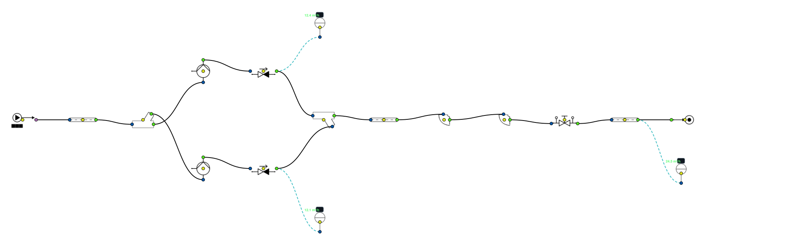

   Export SVG de la scène livrée, par le chemin de l'action « Exporter la scène en
   SVG… » de l'IHM.

**Ce qu'elle montre.** Deux pompes en parallèle, chacune avec son clapet anti-retour.

**Nœuds employés** (17 nœuds, 17 liaisons) : Tuyau droit ×3, Capteur ×3, Pompe ×2, Clapet anti-retour ×2, Coude courbe ×2, Source, Té divergent, Té convergent, Vanne TA, Sortie.

**Ouvrir.** Menu **File > Exemples > 3 - Hydraulique > Pompes > Pompes en parallele avec clapets**. À l'ouverture, la scène est calculée par le solveur nodal des réseaux (Newton sur les pressions) ; statut affiché : **convergé** (point fixe constaté).

**Ce qu'on observe.** Les deux pompes identiques se partagent le débit : P1 12,4 m³/h, P2 12,1 m³/h, total **24,5 m³/h** — moins du double d'une pompe seule, parce que la perte de charge du réseau croît avec le débit.

Valeurs affichées par les nœuds à l'ouverture (relevé automatique) :

.. list-table::
   :header-rows: 1
   :widths: 26 16 58

   * - Nœud
     - Type
     - Valeurs affichées
   * - Aspiration DN80
     - Tuyau droit
     - Vitesse (m/s) = 1.3553 ; Reynolds (-) = 108065 ; Perte de charge (Pa) = 1177.10
   * - Collecteur aspiration
     - Té divergent
     - Débit sortie straight (kg/s) = 3.4448
   * - Pompe P1
     - Pompe
     - P refoulement (bar) = 4.9761 ; Puissance hydraulique (kW) = 1.031 ; HMT (m) = 30.52
   * - Pompe P2
     - Pompe
     - P refoulement (bar) = 4.9744 ; Puissance hydraulique (kW) = 1.007 ; HMT (m) = 30.60
   * - Clapet P1
     - Clapet anti-retour
     - Perte de charge (Pa) = 1079.58 ; Pression sortie (bar) = 4.9653
   * - Clapet P2
     - Clapet anti-retour
     - Perte de charge (Pa) = 1024.50 ; Pression sortie (bar) = 4.9642
   * - Réseau DN80 - 60 m
     - Tuyau droit
     - Vitesse (m/s) = 1.3553 ; Reynolds (-) = 108065 ; Perte de charge (Pa) = 14125.17
   * - Coude
     - Coude courbe
     - Perte de charge (Pa) = 240.42 ; Pression sortie (bar) = 4.8169
   * - Coude
     - Coude courbe
     - Perte de charge (Pa) = 240.42 ; Pression sortie (bar) = 4.8145
   * - Vanne d'équilibrage réseau
     - Vanne TA
     - Perte de charge (Pa) = 267320.64 ; Pression sortie (bar) = 2.1413
   * - Retour DN80 - 60 m
     - Tuyau droit
     - Vitesse (m/s) = 1.3553 ; Reynolds (-) = 108065 ; Perte de charge (Pa) = 14125.17
   * - Q pompe P1
     - Capteur
     - 12.4 m³/h
   * - Q pompe P2
     - Capteur
     - 12.1 m³/h
   * - Q total
     - Capteur
     - 24.5 m³/h

Pompes en serie (surpression)
~~~~~~~~~~~~~~~~~~~~~~~~~~~~~

   Export SVG de la scène livrée, par le chemin de l'action « Exporter la scène en
   SVG… » de l'IHM.

**Ce qu'elle montre.** Deux pompes en série : une pompe de gavage suivie d'une pompe de surpression.

**Nœuds employés** (12 nœuds, 11 liaisons) : Tuyau droit ×4, Pompe ×2, Coude courbe ×2, Source, Vanne TA, Sortie, Capteur.

**Ouvrir.** Menu **File > Exemples > 3 - Hydraulique > Pompes > Pompes en serie (surpression)**. À l'ouverture, la scène est calculée par le solveur nodal des réseaux (Newton sur les pressions) ; statut affiché : **convergé** (point fixe constaté).

**Ce qu'on observe.** Même débit dans les deux pompes (16,6 m³/h), et les hauteurs s'additionnent : la pression passe à 4,85 bar après la pompe de gavage puis à 7,70 bar après la surpression.

Valeurs affichées par les nœuds à l'ouverture (relevé automatique) :

.. list-table::
   :header-rows: 1
   :widths: 26 16 58

   * - Nœud
     - Type
     - Valeurs affichées
   * - Aspiration
     - Tuyau droit
     - Vitesse (m/s) = 1.3871 ; Reynolds (-) = 89862 ; Perte de charge (Pa) = 1590.35
   * - Pompe 1 (gavage)
     - Pompe
     - P refoulement (bar) = 4.8492 ; Puissance hydraulique (kW) = 1.319 ; HMT (m) = 29.27
   * - Liaison
     - Tuyau droit
     - Vitesse (m/s) = 1.3871 ; Reynolds (-) = 89862 ; Perte de charge (Pa) = 954.21
   * - Pompe 2 (surpression)
     - Pompe
     - P refoulement (bar) = 7.7048 ; Puissance hydraulique (kW) = 1.319 ; HMT (m) = 29.27
   * - Réseau DN50 - 150 m
     - Tuyau droit
     - Vitesse (m/s) = 2.3442 ; Reynolds (-) = 116821 ; Perte de charge (Pa) = 178896.71
   * - Coude
     - Coude courbe
     - Perte de charge (Pa) = 710.05 ; Pression sortie (bar) = 5.9088
   * - Coude
     - Coude courbe
     - Perte de charge (Pa) = 710.05 ; Pression sortie (bar) = 5.9017
   * - Vanne d'équilibrage
     - Vanne TA
     - Perte de charge (Pa) = 211269.31 ; Pression sortie (bar) = 3.7890
   * - Retour DN50 - 150 m
     - Tuyau droit
     - Vitesse (m/s) = 2.3442 ; Reynolds (-) = 116821 ; Perte de charge (Pa) = 178896.71
   * - Q réseau
     - Capteur
     - 16.6 m³/h

Regulateur de pression differentielle (STAP)
~~~~~~~~~~~~~~~~~~~~~~~~~~~~~~~~~~~~~~~~~~~~

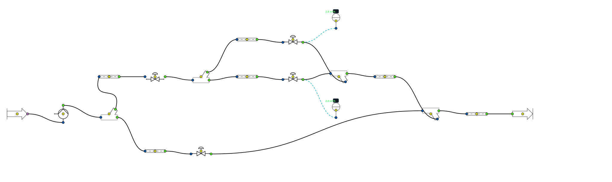

   Export SVG de la scène livrée, par le chemin de l'action « Exporter la scène en
   SVG… » de l'IHM.

**Ce qu'elle montre.** Un réseau à deux étages dont une branche est tenue par un régulateur de pression différentielle (type STAP).

**Nœuds employés** (19 nœuds, 20 liaisons) : Tuyau droit ×6, Vanne TA ×3, Té divergent ×2, Té convergent ×2, Capteur ×2, Source, Pompe, Régulateur de Δp, Sortie.

**Ouvrir.** Menu **File > Exemples > 3 - Hydraulique > Regulation > Regulateur de pression differentielle (STAP)**. À l'ouverture, la scène est calculée par le solveur nodal des réseaux (Newton sur les pressions) ; statut affiché : **convergé** (point fixe constaté).

**Ce qu'on observe.** La pompe réseau débite 28,49 m³/h sous 24,0 m de HMT ; le régulateur de pression différentielle tient la pression de sa branche quelle que soit la demande des autres : étage 1 2,8 m³/h, étage 2 2,0 m³/h. Modèle : :doc:`../004-hydraulic/regulateur_dp`.

Valeurs affichées par les nœuds à l'ouverture (relevé automatique) :

.. list-table::
   :header-rows: 1
   :widths: 26 16 58

   * - Nœud
     - Type
     - Valeurs affichées
   * - Pompe réseau
     - Pompe
     - P refoulement (bar) = 4.3458 ; Puissance hydraulique (kW) = 1.857 ; HMT (m) = 23.96
   * - Départ colonnes
     - Té divergent
     - Débit sortie straight (kg/s) = 6.5701
   * - Aller colonne
     - Tuyau droit
     - Vitesse (m/s) = 0.6788 ; Reynolds (-) = 33827 ; Perte de charge (Pa) = 2337.46
   * - STAP colonne
     - Régulateur de Δp
     - Perte de charge absorbée (Pa) = 189729.17 ; Pression sortie (bar) = 2.3949
   * - Étage 1 / étage 2
     - Té divergent
     - Débit sortie straight (kg/s) = 0.5528
   * - Étage 1
     - Tuyau droit
     - Vitesse (m/s) = 0.9686 ; Reynolds (-) = 30892 ; Perte de charge (Pa) = 5935.62
   * - Équilibrage étage 1
     - Vanne TA
     - Perte de charge (Pa) = 13025.83 ; Pression sortie (bar) = 2.1983
   * - Étage 2
     - Tuyau droit
     - Vitesse (m/s) = 0.6886 ; Reynolds (-) = 21962 ; Perte de charge (Pa) = 5278.99
   * - Équilibrage étage 2
     - Vanne TA
     - Perte de charge (Pa) = 14587.25 ; Pression sortie (bar) = 2.1962
   * - Retour colonne
     - Tuyau droit
     - Vitesse (m/s) = 0.6788 ; Reynolds (-) = 33827 ; Perte de charge (Pa) = 2337.46
   * - Autre circuit
     - Tuyau droit
     - Vitesse (m/s) = 3.3520 ; Reynolds (-) = 167045 ; Perte de charge (Pa) = 94779.42
   * - Équilibrage autre circuit
     - Vanne TA
     - Perte de charge (Pa) = 121448.58 ; Pression sortie (bar) = 2.1846
   * - Retour
     - Tuyau droit
     - Vitesse (m/s) = 2.3851 ; Reynolds (-) = 154516 ; Perte de charge (Pa) = 17797.48
   * - Q étage 1
     - Capteur
     - 2.8 m³/h
   * - …
     - 
     - 1 autres nœuds non reproduits

Regulation de debit par PID
~~~~~~~~~~~~~~~~~~~~~~~~~~~

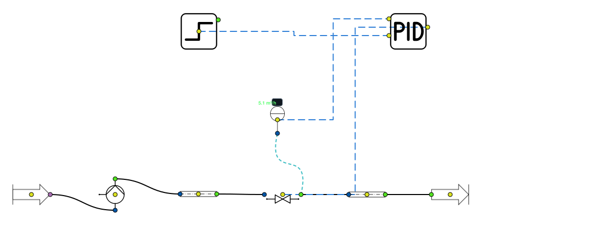

   Export SVG de la scène livrée, par le chemin de l'action « Exporter la scène en
   SVG… » de l'IHM.

**Ce qu'elle montre.** Une boucle de régulation de débit : capteur de débit, régulateur PID, vanne de régulation motorisée, consigne en échelon.

**Nœuds employés** (9 nœuds, 9 liaisons) : Tuyau droit ×2, Source, Pompe, Vanne générique (Kv), Sortie, Capteur, PID, Échelon.

**Ouvrir.** Menu **File > Exemples > 3 - Hydraulique > Regulation > Regulation de debit par PID**. À l'ouverture, la scène est calculée par le solveur nodal des réseaux (Newton sur les pressions) ; statut affiché : **convergé** (point fixe constaté).

**Ce qu'on observe.** À l'ouverture, le calcul stationnaire donne 5,15 m³/h sous 16,8 m de HMT et 5,1 m³/h dans la branche ; la vanne de régulation prend 140 kPa. Le PID n'agit qu'en simulation temporelle : la régulation (consigne en échelon, capteur → PID → vanne) est expliquée dans :doc:`../013-simulation-temporelle/index`.

Valeurs affichées par les nœuds à l'ouverture (relevé automatique) :

.. list-table::
   :header-rows: 1
   :widths: 26 16 58

   * - Nœud
     - Type
     - Valeurs affichées
   * - Pompe
     - Pompe
     - P refoulement (bar) = 3.6447 ; Puissance hydraulique (kW) = 0.235 ; HMT (m) = 16.80
   * - Aller DN40
     - Tuyau droit
     - Vitesse (m/s) = 1.1376 ; Reynolds (-) = 45353 ; Perte de charge (Pa) = 12073.95
   * - Vanne de régulation (Kvs 25)
     - Vanne générique (Kv)
     - Perte de charge (Pa) = 140325.41 ; Pression sortie (bar) = 2.1207
   * - Retour DN40
     - Tuyau droit
     - Vitesse (m/s) = 1.1376 ; Reynolds (-) = 45353 ; Perte de charge (Pa) = 12073.95
   * - Débit branche
     - Capteur
     - 5.1 m³/h
   * - Consigne débit (m³/h)
     - Échelon
     - Valeur de sortie = 0

Vanne d isolement fermee
~~~~~~~~~~~~~~~~~~~~~~~~

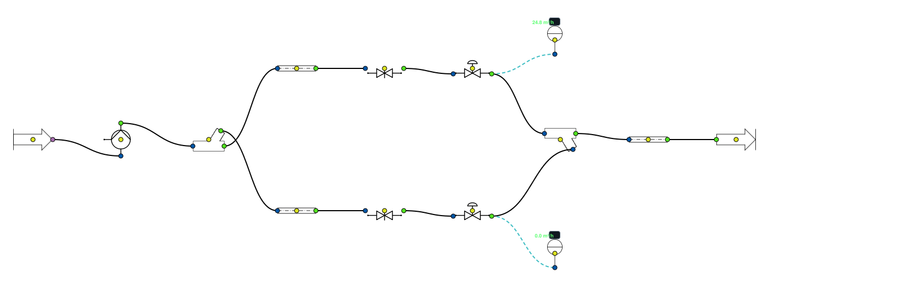

   Export SVG de la scène livrée, par le chemin de l'action « Exporter la scène en
   SVG… » de l'IHM.

**Ce qu'elle montre.** Deux circuits en parallèle, dont l'un est fermé par sa vanne d'isolement.

**Nœuds employés** (14 nœuds, 14 liaisons) : Tuyau droit ×3, Vanne d'isolement (Gate) ×2, Vanne TA ×2, Capteur ×2, Source, Pompe, Té divergent, Té convergent, Sortie.

**Ouvrir.** Menu **File > Exemples > 3 - Hydraulique > Regulation > Vanne d isolement fermee**. À l'ouverture, la scène est calculée par le solveur nodal des réseaux (Newton sur les pressions) ; statut affiché : **convergé** (point fixe constaté).

**Ce qu'on observe.** La vanne B est fermée : le circuit B affiche 0,0 m³/h et tout le débit passe par A (24,8 m³/h). La pompe remonte sur sa courbe : 24,80 m³/h sous 25,9 m de HMT. Modèle : :doc:`../004-hydraulic/vanne_isolement`.

Valeurs affichées par les nœuds à l'ouverture (relevé automatique) :

.. list-table::
   :header-rows: 1
   :widths: 26 16 58

   * - Nœud
     - Type
     - Valeurs affichées
   * - Pompe
     - Pompe
     - P refoulement (bar) = 4.5333 ; Puissance hydraulique (kW) = 1.745 ; HMT (m) = 25.88
   * - Départ
     - Té divergent
     - Débit sortie straight (kg/s) = 6.8754
   * - Circuit A
     - Tuyau droit
     - Vitesse (m/s) = 3.5077 ; Reynolds (-) = 174807 ; Perte de charge (Pa) = 103459.83
   * - Vanne A (ouverte)
     - Vanne d'isolement (Gate)
     - Vitesse (m/s) = 3.5077 ; Reynolds (-) = 174807 ; Perte de charge (Pa) = 3224.24
   * - Équilibrage A
     - Vanne TA
     - Perte de charge (Pa) = 132996.93 ; Pression sortie (bar) = 2.1365
   * - Circuit B
     - Tuyau droit
     - Vitesse (m/s) = 0.0000 ; Reynolds (-) = 0 ; Perte de charge (Pa) = 0.00
   * - Vanne B (FERMÉE)
     - Vanne d'isolement (Gate)
     - Vitesse (m/s) = 0.0000 ; Reynolds (-) = 0 ; Perte de charge (Pa) = 0.00
   * - Équilibrage B
     - Vanne TA
     - Perte de charge (Pa) = 0.00 ; Pression sortie (bar) = 4.5118
   * - Retour
     - Tuyau droit
     - Vitesse (m/s) = 2.0756 ; Reynolds (-) = 134467 ; Perte de charge (Pa) = 13649.64
   * - Q circuit A
     - Capteur
     - 24.8 m³/h
   * - Q circuit B
     - Capteur
     - 0.0 m³/h

Vannes 2 voies - debit variable
~~~~~~~~~~~~~~~~~~~~~~~~~~~~~~~

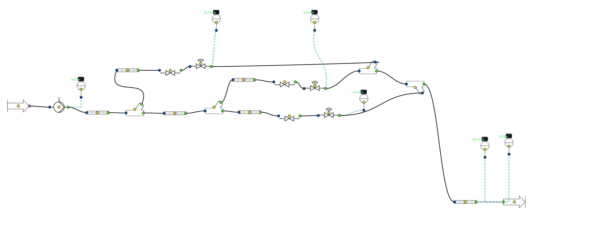

   Export SVG de la scène livrée, par le chemin de l'action « Exporter la scène en
   SVG… » de l'IHM.

**Ce qu'elle montre.** Un réseau à débit variable : trois terminaux régulés par vanne 2 voies, chacun avec sa vanne d'équilibrage.

**Nœuds employés** (25 nœuds, 26 liaisons) : Tuyau droit ×6, Capteur ×6, Vanne générique (Kv) ×3, Vanne TA ×3, Té divergent ×2, Té convergent ×2, Source, Pompe, Sortie.

**Ouvrir.** Menu **File > Exemples > 3 - Hydraulique > Regulation > Vannes 2 voies - debit variable**. À l'ouverture, la scène est calculée par le solveur nodal des réseaux (Newton sur les pressions) ; statut affiché : **convergé** (point fixe constaté).

**Ce qu'on observe.** Trois terminaux à vanne 2 voies ouvertes différemment : 13,4, 4,2 et 1,5 m³/h. La pompe réseau fournit la somme : 19,21 m³/h sous 28,3 m de HMT. En fermant une vanne (double-clic, onglet *Configuration*), on voit le débit total baisser et la pression monter.

Valeurs affichées par les nœuds à l'ouverture (relevé automatique) :

.. list-table::
   :header-rows: 1
   :widths: 26 16 58

   * - Nœud
     - Type
     - Valeurs affichées
   * - Pompe réseau
     - Pompe
     - P refoulement (bar) = 4.7714 ; Puissance hydraulique (kW) = 1.479 ; HMT (m) = 28.31
   * - Q terminal 1
     - Capteur
     - 13.4 m³/h
   * - Q terminal 2
     - Capteur
     - 4.2 m³/h
   * - Q terminal 3
     - Capteur
     - 1.5 m³/h

Reseau de distribution
~~~~~~~~~~~~~~~~~~~~~~

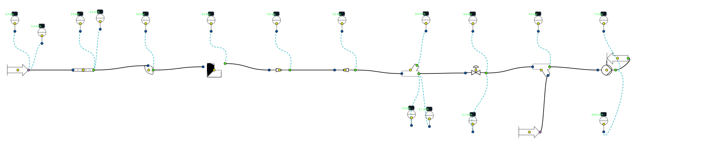

   Export SVG de la scène livrée, par le chemin de l'action « Exporter la scène en
   SVG… » de l'IHM.

**Ce qu'elle montre.** Un réseau de distribution qui rassemble presque toutes les singularités hydrauliques de la bibliothèque, jalonné de capteurs.

**Nœuds employés** (28 nœuds, 27 liaisons) : Capteur ×16, Source ×2, Tuyau droit, Coude courbe, Coude vif, Retrecissement, Elargissement, Té divergent, Vanne TA, Té convergent, Pompe, Sortie.

**Ouvrir.** Menu **File > Exemples > 3 - Hydraulique > Reseau de distribution**. À l'ouverture, la scène est calculée par le solveur nodal des réseaux (Newton sur les pressions) ; statut affiché : **convergé** (point fixe constaté).

**Ce qu'on observe.** La pompe refoule à 7,50 bar pour 23,76 m³/h sous 26,8 m de HMT ; les seize capteurs relèvent pression et débit le long des singularités (coudes, rétrécissement, élargissement, tés, vanne d'équilibrage). C'est la scène qui rassemble le plus de modèles de :doc:`../004-hydraulic/index`.

Valeurs affichées par les nœuds à l'ouverture (relevé automatique) :

.. list-table::
   :header-rows: 1
   :widths: 26 16 58

   * - Nœud
     - Type
     - Valeurs affichées
   * - Pompe
     - Pompe
     - P refoulement (bar) = 7.5000 ; Puissance hydraulique (kW) = 1.736 ; HMT (m) = 26.84

Usine - reseau industriel maille
~~~~~~~~~~~~~~~~~~~~~~~~~~~~~~~~

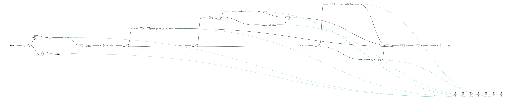

   Export SVG de la scène livrée, par le chemin de l'action « Exporter la scène en
   SVG… » de l'IHM.

**Ce qu'elle montre.** Le réseau d'eau d'une usine, **maillé** : deux pompes, clapets, vanne d'isolement, régulateur de pression différentielle, cinq branches.

**Nœuds employés** (65 nœuds, 69 liaisons) : Tuyau droit ×22, Capteur ×7, Coude courbe ×6, Té divergent ×5, Té convergent ×5, Vanne générique (Kv) ×5, Vanne TA ×5, Pompe ×2, Clapet anti-retour ×2, Confuseur conique ×2, Source, Vanne d'isolement (Gate), Régulateur de Δp, Sortie.

**Ouvrir.** Menu **File > Exemples > 3 - Hydraulique > Reseaux mailles > Usine - reseau industriel maille**. À l'ouverture, la scène est calculée par le solveur nodal des réseaux (Newton sur les pressions) ; statut affiché : **convergé** (point fixe constaté).

**Ce qu'on observe.** Deux pompes en parallèle (P1 47,5 m³/h, P2 46,1 m³/h) alimentent un réseau **maillé** : branches A 14,3, B1 6,5, B2 3,0, C 24,8 et tour 44,9 m³/h. Seul le solveur nodal répartit correctement les débits dans une maille ; l'IHM le choisit d'elle-même pour cette scène.

Valeurs affichées par les nœuds à l'ouverture (relevé automatique) :

.. list-table::
   :header-rows: 1
   :widths: 26 16 58

   * - Nœud
     - Type
     - Valeurs affichées
   * - P1
     - Pompe
     - P refoulement (bar) = 5.6019 ; Puissance hydraulique (kW) = 4.773 ; HMT (m) = 36.92
   * - P2
     - Pompe
     - P refoulement (bar) = 5.5986 ; Puissance hydraulique (kW) = 4.645 ; HMT (m) = 37.01
   * - Q P1
     - Capteur
     - 47.5 m³/h
   * - Q P2
     - Capteur
     - 46.1 m³/h
   * - Q A
     - Capteur
     - 14.3 m³/h
   * - Q B1
     - Capteur
     - 6.5 m³/h
   * - Q B2
     - Capteur
     - 3.0 m³/h
   * - Q C
     - Capteur
     - 24.8 m³/h
   * - Q tour
     - Capteur
     - 44.9 m³/h

Montage en injection
~~~~~~~~~~~~~~~~~~~~

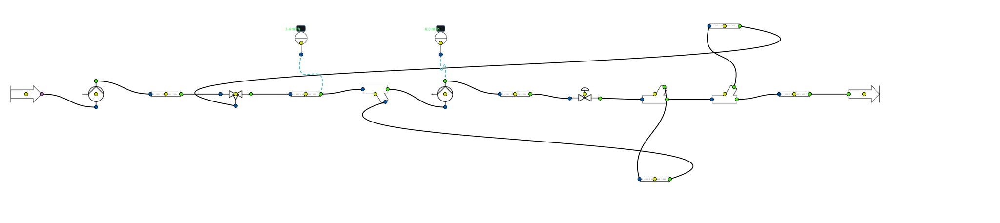

   Export SVG de la scène livrée, par le chemin de l'action « Exporter la scène en
   SVG… » de l'IHM.

**Ce qu'elle montre.** Vanne 3 voies en montage **en injection** : deux pompes, primaire et secondaire.

**Nœuds employés** (17 nœuds, 18 liaisons) : Tuyau droit ×6, Pompe ×2, Té divergent ×2, Capteur ×2, Source, Vanne 3 voies, Té convergent, Vanne TA, Sortie.

**Ouvrir.** Menu **File > Exemples > 3 - Hydraulique > Vanne 3 voies > Montage en injection**. À l'ouverture, la scène est calculée par le solveur nodal des réseaux (Newton sur les pressions) ; statut affiché : **convergé** (point fixe constaté).

**Ce qu'on observe.** La pompe primaire (3,25 m³/h sous 17,6 m de HMT) injecte 3,4 m³/h dans la boucle secondaire, dont la pompe fait circuler 8,3 m³/h. Montage expliqué dans :doc:`../004-hydraulic/valve_3_voies`.

Valeurs affichées par les nœuds à l'ouverture (relevé automatique) :

.. list-table::
   :header-rows: 1
   :widths: 26 16 58

   * - Nœud
     - Type
     - Valeurs affichées
   * - Pompe primaire
     - Pompe
     - P refoulement (bar) = 3.1898 ; Puissance hydraulique (kW) = 0.153 ; HMT (m) = 17.62
   * - Aller primaire
     - Tuyau droit
     - Vitesse (m/s) = 0.7183 ; Reynolds (-) = 69613 ; Perte de charge (Pa) = 1492.47
   * - Injection
     - Tuyau droit
     - Vitesse (m/s) = 0.7482 ; Reynolds (-) = 72511 ; Perte de charge (Pa) = 806.16
   * - Pompe secondaire
     - Pompe
     - P refoulement (bar) = 2.8934 ; Puissance hydraulique (kW) = 0.328 ; HMT (m) = 14.73
   * - Émetteurs
     - Tuyau droit
     - Vitesse (m/s) = 1.8457 ; Reynolds (-) = 178882 ; Perte de charge (Pa) = 54720.79
   * - Équilibrage émetteurs
     - Vanne TA
     - Perte de charge (Pa) = 83095.27 ; Pression sortie (bar) = 1.5153
   * - Retour secondaire
     - Té divergent
     - Débit sortie straight (kg/s) = 0.9193
   * - Découplage
     - Tuyau droit
     - Vitesse (m/s) = 1.0976 ; Reynolds (-) = 106370 ; Perte de charge (Pa) = 669.30
   * - Retour vers primaire
     - Té divergent
     - Débit sortie straight (kg/s) = 0.8826
   * - Bypass vanne
     - Tuyau droit
     - Vitesse (m/s) = 0.0299 ; Reynolds (-) = 2898 ; Perte de charge (Pa) = 1.20
   * - Retour primaire
     - Tuyau droit
     - Vitesse (m/s) = 0.7183 ; Reynolds (-) = 69613 ; Perte de charge (Pa) = 1492.47
   * - Q injecté
     - Capteur
     - 3.4 m³/h
   * - Q secondaire
     - Capteur
     - 8.3 m³/h

Montage en melange
~~~~~~~~~~~~~~~~~~

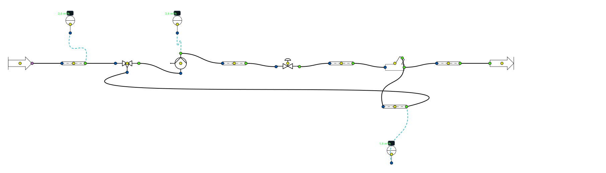

   Export SVG de la scène livrée, par le chemin de l'action « Exporter la scène en
   SVG… » de l'IHM.

**Ce qu'elle montre.** Vanne 3 voies en montage **en mélange** : une pompe secondaire, un bypass de mélange.

**Nœuds employés** (14 nœuds, 14 liaisons) : Tuyau droit ×5, Capteur ×3, Source, Vanne 3 voies, Pompe, Vanne TA, Té divergent, Sortie.

**Ouvrir.** Menu **File > Exemples > 3 - Hydraulique > Vanne 3 voies > Montage en melange**. À l'ouverture, la scène est calculée par le solveur nodal des réseaux (Newton sur les pressions) ; statut affiché : **convergé** (point fixe constaté).

**Ce qu'on observe.** La vanne 3 voies mélange 2,0 m³/h venus du primaire et 1,9 m³/h repris sur le retour : le secondaire circule à 3,9 m³/h. Voir :doc:`../004-hydraulic/valve_3_voies`.

Valeurs affichées par les nœuds à l'ouverture (relevé automatique) :

.. list-table::
   :header-rows: 1
   :widths: 26 16 58

   * - Nœud
     - Type
     - Valeurs affichées
   * - Aller primaire
     - Tuyau droit
     - Vitesse (m/s) = 0.4445 ; Reynolds (-) = 43073 ; Perte de charge (Pa) = 303.02
   * - Pompe secondaire
     - Pompe
     - P refoulement (bar) = 3.2574 ; Puissance hydraulique (kW) = 0.183 ; HMT (m) = 17.35
   * - Émetteurs (aller)
     - Tuyau droit
     - Vitesse (m/s) = 0.8728 ; Reynolds (-) = 84590 ; Perte de charge (Pa) = 12964.12
   * - Équilibrage émetteurs
     - Vanne TA
     - Perte de charge (Pa) = 9516.44 ; Pression sortie (bar) = 3.0326
   * - Émetteurs (retour)
     - Tuyau droit
     - Vitesse (m/s) = 0.8728 ; Reynolds (-) = 84590 ; Perte de charge (Pa) = 12964.12
   * - Té de retour
     - Té divergent
     - Débit sortie straight (kg/s) = 0.5461
   * - Bypass de mélange
     - Tuyau droit
     - Vitesse (m/s) = 0.4284 ; Reynolds (-) = 41516 ; Perte de charge (Pa) = 169.77
   * - Retour primaire
     - Tuyau droit
     - Vitesse (m/s) = 0.4445 ; Reynolds (-) = 43073 ; Perte de charge (Pa) = 303.02
   * - Q primaire (voie directe)
     - Capteur
     - 2.0 m³/h
   * - Q bypass
     - Capteur
     - 1.9 m³/h
   * - Q secondaire
     - Capteur
     - 3.9 m³/h

Montage en repartition-decharge
~~~~~~~~~~~~~~~~~~~~~~~~~~~~~~~

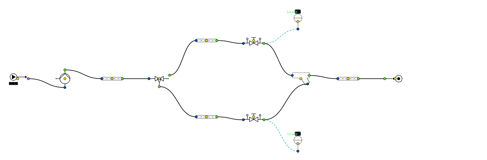

   Export SVG de la scène livrée, par le chemin de l'action « Exporter la scène en
   SVG… » de l'IHM.

**Ce qu'elle montre.** Vanne 3 voies en montage **en répartition** (décharge) : la vanne partage le débit primaire entre l'utilisateur et un circuit de décharge.

**Nœuds employés** (13 nœuds, 13 liaisons) : Tuyau droit ×4, Vanne TA ×2, Capteur ×2, Source, Pompe, Vanne 3 voies, Té convergent, Sortie.

**Ouvrir.** Menu **File > Exemples > 3 - Hydraulique > Vanne 3 voies > Montage en repartition-decharge**. À l'ouverture, la scène est calculée par le solveur nodal des réseaux (Newton sur les pressions) ; statut affiché : **convergé** (point fixe constaté).

**Ce qu'on observe.** La pompe primaire (9,64 m³/h sous 13,7 m de HMT) voit un débit presque constant ; la vanne le répartit entre l'utilisateur (6,4 m³/h) et la décharge (3,2 m³/h). Voir :doc:`../004-hydraulic/valve_3_voies`.

Valeurs affichées par les nœuds à l'ouverture (relevé automatique) :

.. list-table::
   :header-rows: 1
   :widths: 26 16 58

   * - Nœud
     - Type
     - Valeurs affichées
   * - Pompe primaire
     - Pompe
     - P refoulement (bar) = 3.3095 ; Puissance hydraulique (kW) = 0.351 ; HMT (m) = 13.66
   * - Aller
     - Tuyau droit
     - Vitesse (m/s) = 2.1313 ; Reynolds (-) = 206552 ; Perte de charge (Pa) = 12061.84
   * - Circuit utilisateur
     - Tuyau droit
     - Vitesse (m/s) = 1.4220 ; Reynolds (-) = 137811 ; Perte de charge (Pa) = 22023.78
   * - Équilibrage circuit
     - Vanne TA
     - Perte de charge (Pa) = 25257.43 ; Pression sortie (bar) = 2.1296
   * - Décharge (bypass)
     - Tuyau droit
     - Vitesse (m/s) = 0.7093 ; Reynolds (-) = 68742 ; Perte de charge (Pa) = 728.69
   * - Équilibrage décharge
     - Vanne TA
     - Perte de charge (Pa) = 26358.65 ; Pression sortie (bar) = 2.1236
   * - Retour
     - Tuyau droit
     - Vitesse (m/s) = 2.1313 ; Reynolds (-) = 206552 ; Perte de charge (Pa) = 12061.84
   * - Q circuit
     - Capteur
     - 6.4 m³/h
   * - Q décharge
     - Capteur
     - 3.2 m³/h

Vanne grande ouverte
~~~~~~~~~~~~~~~~~~~~

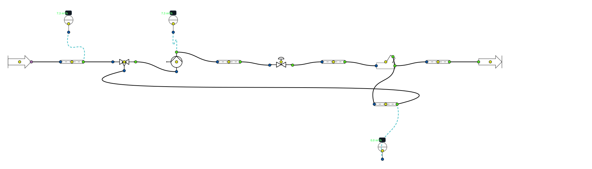

   Export SVG de la scène livrée, par le chemin de l'action « Exporter la scène en
   SVG… » de l'IHM.

**Ce qu'elle montre.** Le montage en mélange, vanne grande ouverte et bypass fermé.

**Nœuds employés** (14 nœuds, 14 liaisons) : Tuyau droit ×5, Capteur ×3, Source, Vanne 3 voies, Pompe, Vanne TA, Té divergent, Sortie.

**Ouvrir.** Menu **File > Exemples > 3 - Hydraulique > Vanne 3 voies > Vanne grande ouverte**. À l'ouverture, la scène est calculée par le solveur nodal des réseaux (Newton sur les pressions) ; statut affiché : **convergé** (point fixe constaté).

**Ce qu'on observe.** Voie directe grande ouverte, bypass fermé : 0,0 m³/h dans le bypass, et le secondaire (7,3 m³/h) prend tout le primaire (7,3 m³/h). C'est le cas limite du montage en mélange.

Valeurs affichées par les nœuds à l'ouverture (relevé automatique) :

.. list-table::
   :header-rows: 1
   :widths: 26 16 58

   * - Nœud
     - Type
     - Valeurs affichées
   * - Aller primaire
     - Tuyau droit
     - Vitesse (m/s) = 1.6037 ; Reynolds (-) = 155419 ; Perte de charge (Pa) = 3473.11
   * - Pompe secondaire
     - Pompe
     - P refoulement (bar) = 4.0895 ; Puissance hydraulique (kW) = 0.300 ; HMT (m) = 15.54
   * - Émetteurs (aller)
     - Tuyau droit
     - Vitesse (m/s) = 1.6037 ; Reynolds (-) = 155419 ; Perte de charge (Pa) = 41677.38
   * - Équilibrage émetteurs
     - Vanne TA
     - Perte de charge (Pa) = 32125.60 ; Pression sortie (bar) = 3.3515
   * - Émetteurs (retour)
     - Tuyau droit
     - Vitesse (m/s) = 1.6037 ; Reynolds (-) = 155419 ; Perte de charge (Pa) = 41677.38
   * - Té de retour
     - Té divergent
     - Débit sortie straight (kg/s) = 1.9706
   * - Bypass de mélange
     - Tuyau droit
     - Vitesse (m/s) = 0.0000 ; Reynolds (-) = 0 ; Perte de charge (Pa) = 0.00
   * - Retour primaire
     - Tuyau droit
     - Vitesse (m/s) = 1.6037 ; Reynolds (-) = 155419 ; Perte de charge (Pa) = 3473.11
   * - Q primaire (voie directe)
     - Capteur
     - 7.3 m³/h
   * - Q bypass
     - Capteur
     - 0.0 m³/h
   * - Q secondaire
     - Capteur
     - 7.3 m³/h

Composants et utilités
----------------------

Ballon stratifie
~~~~~~~~~~~~~~~~

.. figure:: ../images/scene_ballon_stratifie.svg
   :alt: Scène Ballon stratifie
   :align: center
   :width: 100%

   Export SVG de la scène livrée, par le chemin de l'action « Exporter la scène en
   SVG… » de l'IHM.

**Ce qu'elle montre.** Un ballon de stockage d'eau chaude **stratifié** (30 strates), chargé en eau chaude par le haut et en eau froide par le bas, avec capteurs de débit et de température sur chaque piquage.

**Nœuds employés** (11 nœuds, 10 liaisons) : Capteur ×8, Source ×2, Ballon stratifie.

**Ouvrir.** Menu **File > Exemples > 4 - Composants et utilites > Ballon stratifie**. À l'ouverture, la scène est calculée par le moteur historique (une passe, de l'amont vers les sorties) ; statut affiché : « convergence non mesurée » (une passe unique ne prouve rien).

**Ce qu'on observe.** Le ballon de 2,5 m³ en 30 strates, initialement à 50 °C, reçoit en haut 10 m³/h d'eau chaude à 70 °C et en bas 8 m³/h d'eau froide à 12 °C pendant un pas de 3600 s. On lit **69,99 °C en haut et 19,34 °C en bas**, et le ballon stocke 37,91 kWh. Les capteurs d'entrée relisent bien 10,0 et 8,0 m³/h. Scène corrigée le 28/09/2026 : l'unité était écrite « m³/h » avec un exposant, que le nœud Source remplaçait sans le dire par des kg/s (10 « m³/h » valaient 36,8 m³/h) ; le nœud lit désormais l'exposant et refuse toute unité inconnue. Le ballon se simule aussi dans le temps : voir :doc:`../013-simulation-temporelle/index`.

Valeurs affichées par les nœuds à l'ouverture (relevé automatique) :

.. list-table::
   :header-rows: 1
   :widths: 26 16 58

   * - Nœud
     - Type
     - Valeurs affichées
   * - Source
     - Source
     - Temp. effective (°C) = 70.000 ; Pression effective (bar) = 1.013
   * - Source
     - Source
     - Temp. effective (°C) = 12.000 ; Pression effective (bar) = 1.013
   * - Ballon stratifie
     - Ballon stratifie
     - Temperature haute (degC) = 69.99 ; Temperature basse (degC) = 19.34 ; Energie stockee (kWh) = 37.90710
   * - Capteur
     - Capteur
     - 8.2 m³/h
   * - Capteur
     - Capteur
     - 9.8 m³/h
   * - Capteur
     - Capteur
     - 70.0 °C
   * - Capteur
     - Capteur
     - 12.0 °C
   * - Capteur
     - Capteur
     - 70.0 °C
   * - Capteur
     - Capteur
     - 19.3 °C
   * - Capteur
     - Capteur
     - 8.0 m³/h
   * - Capteur
     - Capteur
     - 10.0 m³/h

Chaine de valeur energetique
~~~~~~~~~~~~~~~~~~~~~~~~~~~~

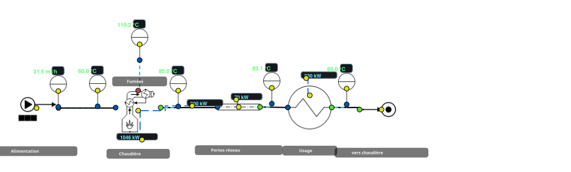

   Export SVG de la scène livrée, par le chemin de l'action « Exporter la scène en
   SVG… » de l'IHM.

**Ce qu'elle montre.** La chaîne complète d'une chaufferie au gaz : chaudière → 500 m de tuyauterie → usage, avec quatre **afficheurs** reliés par des liaisons de signal qui suivent l'énergie maillon par maillon.

**Nœuds employés** (15 nœuds, 14 liaisons) : Capteur ×6, Afficheur ×4, Source, Tuyau droit, Heater_Cooler, Sortie, Chaudière GN.

**Ouvrir.** Menu **File > Exemples > 4 - Composants et utilites > Chaine de valeur energetique**. À l'ouverture, la scène est calculée par le moteur historique (une passe, de l'amont vers les sorties) ; statut affiché : « convergence non mesurée » (une passe unique ne prouve rien).

**Ce qu'on observe.** Le gaz entre avec 1 046 kW sur PCS ; la chaudière en rend 900 kW à l'eau (rendement 95,5 % sur PCI, 85,2 % sur PCS) ; les 500 m de tuyauterie DN100 non isolée en perdent 70 kW ; l'usage reçoit 830 kW. **Du gaz à l'usage, 79,4 % de l'énergie arrive.** Les quatre afficheurs, reliés par des liaisons de signal, montrent chaque maillon ; la chaudière indique aussi 133 kW récupérables dans ses fumées (point de rosée 55,6 °C).

Valeurs affichées par les nœuds à l'ouverture (relevé automatique) :

.. list-table::
   :header-rows: 1
   :widths: 26 16 58

   * - Nœud
     - Type
     - Valeurs affichées
   * - Source
     - Source
     - Temp. effective (°C) = 60.000 ; Pression effective (bar) = 5.000
   * - Afficheur
     - Afficheur
     - 1046 kW ; Source = Chaudière GN.Q_ng_HHV
   * - Tuyau droit
     - Tuyau droit
     - Vitesse (m/s) = 1.1291 ; Reynolds (-) = 328293 ; Perte de charge (Pa) = 44211.41
   * - Capteur
     - Capteur
     - 60.0 °C
   * - Afficheur
     - Afficheur
     - 900 kW ; Source = Chaudière GN.useful_heat_LHV
   * - Afficheur
     - Afficheur
     - 70 kW ; Source = Tuyau droit.heat_loss_W / / 1000
   * - Heater_Cooler
     - Heater_Cooler
     - Qth(kW) = -830.452 ; Temp. sortie (°C) = 60.00
   * - Sortie
     - Sortie
     - Température (°C) = 60.0 °C ; Pression (bar) = 4.557 bar ; Débit (kg/h) = 30926.992 kg/h
   * - Afficheur
     - Afficheur
     - 830 kW ; Source = Heater_Cooler.heat_duty_kW / x -1
   * - Chaudière GN
     - Chaudière GN
     - Rendement sur PCI (%) = 95.45 ; Puissance combustible PCS (kW) = 1045.94 ; Puissance utile calculée, bilan PCI (kW) = 900.13
   * - Capteur
     - Capteur
     - 83.1 °C
   * - Capteur
     - Capteur
     - 85.0 °C
   * - Capteur
     - Capteur
     - 110.2 °C
   * - Capteur
     - Capteur
     - 60.0 °C
   * - …
     - 
     - 1 autres nœuds non reproduits

Chaudiere
~~~~~~~~~

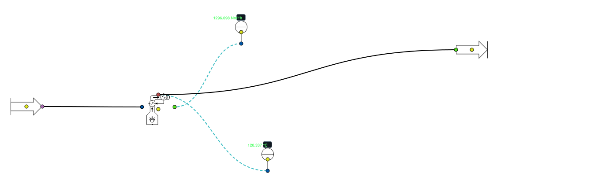

   Export SVG de la scène livrée, par le chemin de l'action « Exporter la scène en
   SVG… » de l'IHM.

**Ce qu'elle montre.** Une chaudière au gaz naturel seule : bilan de combustion (composition du gaz, excès d'air, fumées) et capteurs sur l'eau et les fumées.

**Nœuds employés** (5 nœuds, 4 liaisons) : Capteur ×2, Chaudière GN, Source, Sortie.

**Ouvrir.** Menu **File > Exemples > 4 - Composants et utilites > Chaudiere**. À l'ouverture, la scène est calculée par le moteur historique (une passe, de l'amont vers les sorties) ; statut affiché : « convergence non mesurée » (une passe unique ne prouve rien).

**Ce qu'on observe.** La chaudière affiche un rendement de 94,9 % sur PCI (84,8 % sur PCS), un excès d'air de 20,1 % pour 3,5 % d'O₂ et des fumées à 120,3 °C. L'eau (0,278 kg/s à 15 °C) est portée à 180 °C **sous 1,013 bar** : elle sort en vapeur surchauffée, d'où une puissance demandée de 770,2 kW. Pour de l'eau chaude liquide, relever la pression de la source ou baisser la température de sortie. Scène corrigée le 28/09/2026 : la source avait gardé le fluide par défaut du nœud (ammoniac). Le modèle est documenté dans :doc:`../002-thermodynamic_cycles/ng_boiler_efficiency`.

Valeurs affichées par les nœuds à l'ouverture (relevé automatique) :

.. list-table::
   :header-rows: 1
   :widths: 26 16 58

   * - Nœud
     - Type
     - Valeurs affichées
   * - Chaudière GN
     - Chaudière GN
     - Rendement sur PCI (%) = 94.91 ; Puissance combustible PCS (kW) = 900.06 ; Puissance utile calculée, bilan PCI (kW) = 770.22
   * - Source
     - Source
     - Temp. effective (°C) = 15.000 ; Pression effective (bar) = 1.013
   * - Capteur
     - Capteur
     - 1.000 Nm³/h
   * - Capteur
     - Capteur
     - 120.337 °C
   * - Output
     - Sortie
     - Température (°C) = 120.3 °C ; Pression (bar) = 1.013 bar ; Débit (kg/h) = 1261.669 kg/h

Compresseur
~~~~~~~~~~~

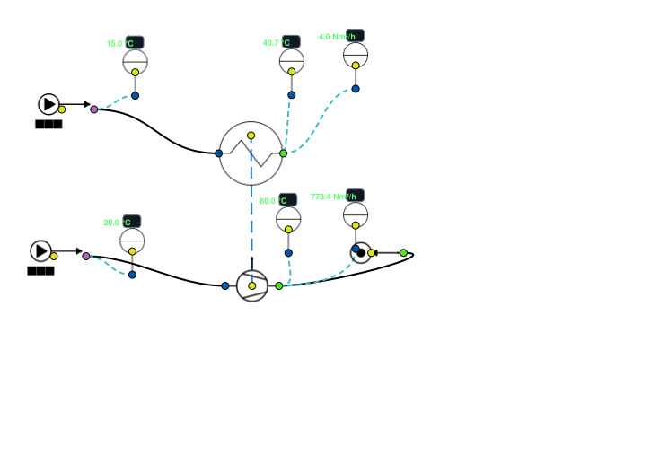

   Export SVG de la scène livrée, par le chemin de l'action « Exporter la scène en
   SVG… » de l'IHM.

**Ce qu'elle montre.** Un compresseur d'air refroidi, dont la chaleur dissipée est transmise par une liaison de signal à un circuit d'eau : la récupération de chaleur sur compresseur.

**Nœuds employés** (11 nœuds, 10 liaisons) : Capteur ×6, Source ×2, Compresseur, Sortie, Heater_Cooler.

**Ouvrir.** Menu **File > Exemples > 4 - Composants et utilites > Compresseur**. À l'ouverture, la scène est calculée par le moteur historique (une passe, de l'amont vers les sorties) ; statut affiché : « convergence non mesurée » (une passe unique ne prouve rien).

**Ce qu'on observe.** 1000 kg/h d'air comprimés de 1 à 15 bar (rendement 0,7) demandent 135,3 kW ; le compresseur est refroidi pour sortir à 80 °C et dissipe 119,1 kW, soit **88 % de sa puissance récupérable** en chaleur. Une liaison de signal transmet cette puissance au réchauffeur d'un circuit d'eau de 4 m³/h (1,11 kg/s), qui passe de 15,0 à 40,7 °C. Scène corrigée le 28/09/2026 : le débit d'eau était saisi en « Nm³/h » avec exposant, pris pour 4 kg/s ; il est désormais en m³/h, l'unité d'un débit de liquide.

Valeurs affichées par les nœuds à l'ouverture (relevé automatique) :

.. list-table::
   :header-rows: 1
   :widths: 26 16 58

   * - Nœud
     - Type
     - Valeurs affichées
   * - Source
     - Source
     - Temp. effective (°C) = 20.000 ; Pression effective (bar) = 1.013
   * - Compresseur
     - Compresseur
     - Q_comp(kW) = 135.299 ; Energie dissipée (kW) = 119.106 ; Temp. sortie sans refroid. (°C) = 488.19
   * - Sortie
     - Sortie
     - Température (°C) = 80.0 °C ; Pression (bar) = 15.000 bar ; Débit (kg/h) = 1000.000 kg/h
   * - Source
     - Source
     - Temp. effective (°C) = 15.000 ; Pression effective (bar) = 1.013
   * - Heater_Cooler
     - Heater_Cooler
     - Qth(kW) = 119.106 ; Temp. sortie (°C) = 40.66
   * - Capteur
     - Capteur
     - 80.0 °C
   * - Capteur
     - Capteur
     - 773.4 Nm³/h
   * - Capteur
     - Capteur
     - 40.7 °C
   * - Capteur
     - Capteur
     - 15.0 °C
   * - Capteur
     - Capteur
     - 4.0 Nm³/h
   * - Capteur
     - Capteur
     - 20.0 °C

Voir aussi
----------

- :doc:`noeuds` — tous les nœuds de la palette, famille par famille ;
- :doc:`../gui_tools` — l'interface, les connexions, l'écriture d'un nœud ;
- :doc:`../004-hydraulic/index` — les modèles des scènes hydrauliques ;
- :doc:`../013-simulation-temporelle/index` — simulation temporelle et régulation.
