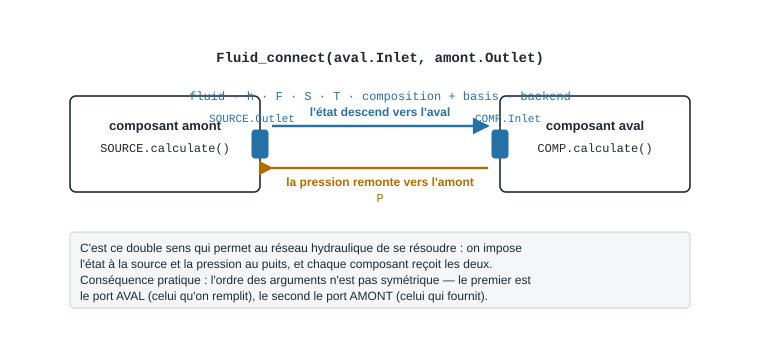
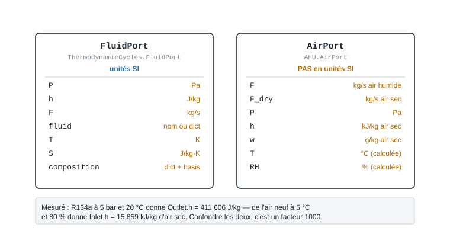

.. _ports_connexions:

=====================
Ports et connexions
=====================

À quoi ça sert
==============

Un modèle seul ne sert à rien : une batterie chaude a besoin de l'air qui arrive,
un compresseur de l'état du fluide aspiré. Cet échange passe par des **ports** —
``Inlet`` et ``Outlet`` — et par une fonction de connexion qui recopie l'état de
l'un vers l'autre.

Deux familles de ports cohabitent, et elles ne transportent ni les mêmes
grandeurs ni les mêmes unités :

* ``FluidPort`` pour les fluides et les gaz — cycles frigorifiques, hydraulique,
  fumées, vapeur ;
* ``AirPort`` pour l'air humide — tout le domaine des centrales de traitement
  d'air.

Cette page décrit ce que chacun transporte **tel que la bibliothèque le code**.
Lisez-la avant les pages de modèles : la plupart des erreurs de débutant viennent
d'ici.

----

La connexion de fluide
======================

Le composant amont calcule un état sur son ``Outlet`` ; la connexion le recopie
dans l'``Inlet`` du composant aval.

.. code-block:: python

   from ThermodynamicCycles.Source import Source
   from ThermodynamicCycles.Compressor import Compressor
   from ThermodynamicCycles.Connect import Fluid_connect

   # Composant amont : il produit un état sur son port de sortie
   SOURCE = Source.Object()
   SOURCE.fluid = "R134a"
   SOURCE.Pi_bar = 2.0      # bar
   SOURCE.Ti_degC = -5      # °C
   SOURCE.F = 0.4           # kg/s
   SOURCE.calculate()

   # Composant aval : son port d'entrée est rempli par la connexion
   COMP = Compressor.Object()
   Fluid_connect(COMP.Inlet, SOURCE.Outlet)   # (aval.Inlet, amont.Outlet)
   COMP.HP_bar = 12.0
   COMP.calculate()

   print("Ce que porte COMP.Inlet après la connexion :")
   print("  fluid :", COMP.Inlet.fluid)
   print("  P     :", COMP.Inlet.P, "Pa")
   print("  h     :", round(COMP.Inlet.h, 1), "J/kg")
   print("  F     :", COMP.Inlet.F, "kg/s")
   print("  T     :", COMP.Inlet.T, "K")
   print("  rho   :", round(COMP.Inlet.rho, 4), "kg/m3")

Sortie réelle :

.. code-block:: text

   Ce que porte COMP.Inlet après la connexion :
     fluid : R134a
     P     : 200000.0 Pa
     h     : 396944.2 J/kg
     F     : 0.4 kg/s
     T     : 268.15000000018097 K
     rho   : 9.7669 kg/m3

Retenez l'ordre des arguments : **le premier port est celui qu'on remplit**
(l'aval), le second celui qui fournit (l'amont). ``Fluid_connect(COMP.Inlet,
SOURCE.Outlet)`` se lit « remplis l'entrée du compresseur depuis la sortie de la
source ».

L'état descend, la pression remonte
-----------------------------------

   Une connexion travaille dans les deux sens : l'état va vers l'aval, la
   pression revient vers l'amont.

C'est le point que rien ne laisse deviner, et il explique la moitié des
surprises : la connexion **ne recopie pas la pression dans le même sens** que le
reste. Le fluide, l'enthalpie, le débit, l'entropie, la température et la
composition descendent vers l'aval ; la pression, elle, remonte de l'aval vers
l'amont.

.. code-block:: python

   from ThermodynamicCycles.FluidPort.FluidPort import FluidPort
   from ThermodynamicCycles.Connect import Fluid_connect

   amont = FluidPort(fluid="water")
   amont.h = 84000.0        # J/kg
   amont.F = 1.5            # kg/s

   aval = FluidPort(fluid="water")
   aval.P = 300000.0        # Pa — la pression est imposée en AVAL

   Fluid_connect(aval, amont)

   print("état descendu vers l'aval  : h =", aval.h, "J/kg, F =", aval.F, "kg/s")
   print("pression remontée en amont : P =", amont.P, "Pa")

Sortie réelle :

.. code-block:: text

   état descendu vers l'aval  : h = 84000.0 J/kg, F = 1.5 kg/s
   pression remontée en amont : P = 300000.0 Pa

C'est ce double sens qui permet à un réseau hydraulique de se résoudre : on impose
l'état à la source et la pression au puits, et chaque composant du milieu reçoit
les deux informations.

----

Ce que transporte chaque port
=============================

   Les deux familles de ports et les unités **réellement employées** par le code.

.. warning::
   ``FluidPort`` est en unités SI, ``AirPort`` **ne l'est pas**. Une enthalpie de
   port vaut 411 606 **J/kg** côté fluide et 15,859 **kJ/kg d'air sec** côté air
   humide. C'est la première cause d'erreur d'un facteur 1000 dans un bilan.

``FluidPort`` — fluides, gaz, fumées
------------------------------------

.. list-table::
   :widths: 24 20 56
   :header-rows: 1

   * - Attribut
     - Unité
     - Rôle
   * - ``P``
     - Pa
     - Pression. Son écriture déclenche le recalcul des propriétés et la
       propagation vers les ports connectés.
   * - ``h``
     - J/kg
     - Enthalpie massique — c'est elle qui porte l'énergie du courant.
   * - ``F``
     - kg/s
     - Débit massique.
   * - ``fluid``
     - texte ou ``dict``
     - Nom CoolProp (``"R134a"``, ``"water"``, ``"INCOMP::MEG[0.3]"``) ou
       description de mélange.
   * - ``T``, ``S``
     - K, J/kg·K
     - Température et entropie.
   * - ``composition``
     - ``dict``
     - Fractions par constituant. Voyage avec le courant à travers la connexion.
   * - ``composition_basis``
     - ``'mole'`` ou ``'mass'``
     - Base de la composition, **explicite et jamais devinée** : mélanger deux
       courants exprimés sur des bases différentes donnerait un résultat faux
       sans le dire.
   * - ``thermo_backend``
     - texte
     - Modèle de propriétés employé (voir ci-dessous).

Le port calcule en plus ``rho``, ``cp``, ``lamda``, ``mu``, ``T_condensation`` et
``F_Nm3h`` quand son état est complet.

``AirPort`` — air humide
------------------------

.. list-table::
   :widths: 24 24 52
   :header-rows: 1

   * - Attribut
     - Unité **telle que codée**
     - Rôle
   * - ``F``
     - kg/s
     - Débit d'air **humide**.
   * - ``F_dry``
     - kg/s
     - Débit d'air **sec** — c'est lui qui se conserve dans une CTA.
   * - ``P``
     - Pa (défaut 101325)
     - Pression totale.
   * - ``h``
     - **kJ/kg d'air sec**
     - Enthalpie spécifique. Pas des J/kg.
   * - ``w``
     - **g/kg d'air sec**
     - Humidité absolue. Pas des kg/kg.
   * - ``T``, ``RH``, ``Pv_sat``
     - °C, %, Pa
     - Calculées à la demande depuis ``h``, ``w`` et ``P``.

----

Les cinq natures de matière
===========================

Un même ``FluidPort`` sait transporter cinq sortes de matière, et **chacune
s'appuie sur un modèle de propriétés différent**. C'est ce qui décide de ce que
vous avez le droit d'attendre du résultat.

.. list-table::
   :widths: 26 34 40
   :header-rows: 1

   * - Nature
     - Comment on la pose
     - Modèle de propriétés
   * - Corps pur
     - ``fluid = "R134a"``, ``"water"``, ``"ammonia"``…
     - **CoolProp** (``thermo_backend = 'coolprop'``)
   * - Eau glycolée, saumure
     - ``fluid = "INCOMP::MEG[0.3]"``
     - CoolProp, solutions incompressibles
   * - Gaz humide, fumées
     - ``set_humid_gas_mixture({...})``
     - **modèle interne**, mélange de gaz parfaits avec un cp par espèce — **pas
       CoolProp**
   * - Mélange réel
     - ``set_mixture(composition_mole)``
     - **Peng-Robinson** interne, fractions **molaires**
   * - Solution aqueuse, aliment
     - ``set_solution(composition)``
     - **Choi-Okos** interne, fractions massiques

À quoi s'ajoute ``set_composition(composition, basis='mass'|'mole')`` : la
composition portée **comme donnée**, sans aucun modèle de propriétés. C'est le
mode des bilans matière, pour des espèces qu'aucune équation d'état détenue ne
connaît — honnête plutôt que faux.

Eau glycolée
------------

.. code-block:: python

   from ThermodynamicCycles.Source import Source

   GLYCOL = Source.Object()
   GLYCOL.fluid = "INCOMP::MEG[0.3]"   # monoéthylène glycol à 30 % massique
   GLYCOL.Pi_bar = 3.0
   GLYCOL.Ti_degC = -10
   GLYCOL.F = 2.0
   GLYCOL.calculate()

   print("eau glycolée 30 % à -10 °C :")
   print("  P   :", GLYCOL.Outlet.P, "Pa")
   print("  h   :", round(GLYCOL.Outlet.h, 1), "J/kg")
   print("  rho :", round(GLYCOL.Outlet.rho, 2), "kg/m3")
   print("  cp  :", round(GLYCOL.Outlet.cp, 1), "J/kg.K")

Sortie réelle :

.. code-block:: text

   eau glycolée 30 % à -10 °C :
     P   : 300000.0 Pa
     h   : -110010.0 J/kg
     rho : 1047.49 kg/m3
     cp  : 3627.1 J/kg.K

L'enthalpie est négative : c'est l'origine des énergies de CoolProp pour ce
fluide, pas une anomalie. Seules les **différences** d'enthalpie ont un sens.

Fumées de combustion
--------------------

Les fumées ne passent pas par CoolProp : le port les traite comme un **mélange de
gaz parfaits**, avec cinq espèces admises — ``CO2``, ``H2O``, ``N2``, ``O2``,
``Ar``. La composition est normalisée, donc se donne indifféremment en pourcents
ou en fractions, et le débit s'exprime au choix en kg/s ou en Nm³/h.

.. code-block:: python

   from ThermodynamicCycles.FluidPort.FluidPort import FluidPort

   # Fumées de chaudière gaz naturel, en fractions volumiques (%)
   fumees = {"N2": 71.0, "H2O": 14.0, "CO2": 9.0, "O2": 3.0, "Ar": 3.0}

   port = FluidPort()
   port.set_humid_gas_mixture(fumees, P=101325.0, T=120 + 273.15, F_Nm3h=5000.0)

   print("backend        :", port.thermo_backend)
   print("cp             :", round(port.cp, 2), "J/kg.K")
   print("rho            :", round(port.rho, 4), "kg/m3")
   print("rho_Nm3        :", round(port.rho_Nm3, 4), "kg/Nm3")
   print("F              :", round(port.F, 4), "kg/s  (depuis 5000 Nm3/h)")
   print("T_condensation :", round(port.T_condensation, 2), "°C")

Sortie réelle :

.. code-block:: text

   backend        : humid_gas_mixture
   cp             : 1067.17 J/kg.K
   rho            : 0.8844 kg/m3
   rho_Nm3        : 1.2729 kg/Nm3
   F              : 1.7679 kg/s  (depuis 5000 Nm3/h)
   T_condensation : 52.84 °C

``T_condensation`` est le **point de rosée** des fumées, calculé depuis la
pression partielle de vapeur d'eau : 52,84 °C ici. C'est lui qui décide d'une
récupération par condensation — refroidir ces fumées sous 52,8 °C fait apparaître
de l'eau liquide, et libère la chaleur latente correspondante.

.. note::
   Les ``cp``, ``lambda`` et ``mu`` de ce modèle sont des moyennes **constantes**,
   sans dépendance à la température : bonnes pour un bilan de fumées entre 100 et
   300 °C, pas pour un calcul fin. L'écart est écrit dans le code plutôt que
   masqué.

Éprouver le modèle : ce qu'il refuse
------------------------------------

Un modèle utile est un modèle dont on connaît les limites. Celui-ci refuse toute
espèce hors de sa table, plutôt que de lui inventer des propriétés :

.. code-block:: python

   from ThermodynamicCycles.FluidPort.FluidPort import FluidPort, UnknownHumidGasSpeciesError

   port = FluidPort()
   try:
       port.set_humid_gas_mixture({"N2": 70.0, "CO": 10.0, "H2O": 20.0}, P=101325.0, T=400.0)
   except UnknownHumidGasSpeciesError as erreur:
       print("refusé :", erreur.args[0])

Sortie réelle :

.. code-block:: text

   refusé : Espèce(s) inconnue(s) du modèle de gaz humide : CO. Espèces admises : CO2, H2O, N2, O2, Ar. Pour transporter une espèce sans modèle de propriétés, utiliser FluidPort.set_composition(composition, basis='mole'|'mass').

Un gaz pauvre ou un syngas, riches en CO et en H₂, sortent donc du domaine de ce
modèle : passez par ``set_mixture`` (Peng-Robinson) ou par ``set_composition``
si vous ne voulez transporter que la composition.

Mélange réel — Peng-Robinson
----------------------------

Les fractions sont **molaires**. Douze constituants sont tabulés : ``N2``, ``O2``,
``Ar``, ``CO2``, ``H2O``, ``CH4``, ``NH3``, ``H2``, ``CO``, ``C2H6``, ``C3H8``,
``n-Butane``.

.. code-block:: python

   from ThermodynamicCycles.FluidPort.FluidPort import FluidPort

   # Gaz naturel simplifié, en fractions MOLAIRES
   gaz = {"CH4": 0.93, "N2": 0.04, "CO2": 0.03}

   port = FluidPort()
   port.set_mixture(gaz, P=20e5, T=20 + 273.15, F=0.5)

   print("backend :", port.thermo_backend)
   print("h       :", round(port.h, 1), "J/kg")
   print("rho     :", round(port.rho, 3), "kg/m3")
   print("cp      :", round(port.cp, 1), "J/kg.K")

Sortie réelle :

.. code-block:: text

   backend : mixture
   h       : -31911.3 J/kg
   rho     : 14.923 kg/m3
   cp      : 2160.7 J/kg.K

.. warning::
   **Limite constatée au 27/09/2026** : un mélange contenant ``C2H6`` (éthane)
   échoue, alors que l'espèce figure dans la table. Le calcul de l'enthalpie de
   gaz parfait passe le symbole tel quel à CoolProp, qui attend ``Ethane`` —
   d'où une ``ValueError``. Les onze autres constituants passent (mesuré, un par un, en mélange avec ``N2``). Un gaz
   naturel réel se modélise donc, pour l'instant, sans sa fraction d'éthane.

Solution aqueuse ou aliment — Choi-Okos
---------------------------------------

Les fractions sont **massiques**, sur six constituants : ``water``, ``protein``,
``fat``, ``carbohydrate``, ``fiber``, ``ash``.

.. code-block:: python

   from ThermodynamicCycles.FluidPort.FluidPort import FluidPort

   # Lait entier, fractions MASSIQUES (modèle Choi-Okos)
   lait = {"water": 0.873, "fat": 0.035, "protein": 0.033, "carbohydrate": 0.052, "ash": 0.007}

   port = FluidPort()
   port.set_solution(lait, P=2e5, T=4 + 273.15, F=1.0)

   print("backend        :", port.thermo_backend)
   print("matière sèche  :", round(port.x_dry_matter, 4))
   print("cp             :", round(port.cp, 1), "J/kg.K")
   print("rho            :", round(port.rho, 2), "kg/m3")

Sortie réelle :

.. code-block:: text

   backend        : solution
   matière sèche  : 0.127
   cp             : 3870.3 J/kg.K
   rho            : 1027.03 kg/m3

----

La connexion d'air humide
=========================

L'air humide a sa propre fonction, ``Air_connect``, qui recopie ``w``, ``P``,
``h``, ``F`` et ``F_dry`` puis rafraîchit les propriétés calculées du port.

.. code-block:: python

   from AHU.FreshAir import FreshAir
   from AHU.Coil import HeatingCoil
   from AHU.Connect import Air_connect

   AIR_NEUF = FreshAir.Object()
   AIR_NEUF.T = 5.0        # °C
   AIR_NEUF.RH = 80.0      # %
   AIR_NEUF.F_m3h = 3000.0 # m3/h
   AIR_NEUF.calculate()

   BATTERIE = HeatingCoil.Object()
   Air_connect(BATTERIE.Inlet, AIR_NEUF.Outlet)
   BATTERIE.To_target = 20.0   # °C
   BATTERIE.calculate()

   print("port d'air à l'entrée de la batterie :")
   print("  F     :", round(BATTERIE.Inlet.F, 4), "kg/s d'air humide")
   print("  F_dry :", round(BATTERIE.Inlet.F_dry, 4), "kg/s d'air sec")
   print("  P     :", BATTERIE.Inlet.P, "Pa")
   print("  h     :", round(BATTERIE.Inlet.h, 3), "kJ/kg d'air sec")
   print("  w     :", round(BATTERIE.Inlet.w, 3), "g/kg d'air sec")
   print("  T     :", round(BATTERIE.Inlet.T, 2), "°C")
   print("  RH    :", round(BATTERIE.Inlet.RH, 1), "%")
   print()
   print(BATTERIE.df)

Sortie réelle :

.. code-block:: text

   port d'air à l'entrée de la batterie :
     F     : 1.0526 kg/s d'air humide
     F_dry : 1.048 kg/s d'air sec
     P     : 101325 Pa
     h     : 15.859 kJ/kg d'air sec
     w     : 4.314 g/kg d'air sec
     T     : 5.0 °C
     RH    : 80.0 %

                        HeatingCoil
   ID                         2.000
   Outlet.T (C)              20.000
   Outlet.RH (%)             29.800
   Outlet.F (kg/s)            1.053
   Outlet.F_dry (kg/s)        1.048
   Outlet.P (Pa)         101325.000
   Outlet.P/10^5 (bar)        1.000
   Outlet.h (kJ/kg)          31.100
   Outlet.w (g/kgdry)         4.314
   Outlet.Pv_sat (Pa)      2338.800
   Q_th (kW)                 15.900

Le chauffage est **sensible** : ``w`` ne bouge pas (4,314 g/kg avant comme après),
l'humidité relative tombe de 80 à 29,8 % parce que l'air chaud peut contenir plus
de vapeur, et la puissance vaut 15,9 kW — soit le débit d'air sec multiplié par
l'écart d'enthalpie. Le ``df`` arrondit l'enthalpie de sortie à 31,1 ; le port
porte 31,070 kJ/kg (voir la variante ci-dessous), d'où
1,048 × (31,070 − 15,859) = 15,94 kW.

----

Ce qu'on personnalise
=====================

.. list-table::
   :widths: 24 34 42
   :header-rows: 1

   * - Ce qu'on change
     - Effet
     - À surveiller
   * - ``fluid``
     - Choisit le corps pur ou la solution CoolProp
     - Un nom inconnu lève une erreur CoolProp ; la syntaxe des solutions est
       ``INCOMP::MEG[0.3]``, la fraction entre crochets
   * - ``P`` sur un port
     - Impose la pression **et** la propage aux ports connectés
     - Chaque écriture déclenche plusieurs appels CoolProp : évitez de l'écrire
       dans une boucle serrée
   * - ``composition`` + ``composition_basis``
     - Décrit un mélange
     - La base doit être **dite** : ``'mole'`` pour un gaz, ``'mass'`` pour un
       liquide
   * - ``F`` ou ``F_Nm3h``
     - Fixe le débit
     - Sur une fumée, l'un se déduit de l'autre par ``rho_Nm3``
   * - ``To_target`` (air)
     - Consigne de température d'une batterie
     - Le chauffage sensible ne change pas ``w``

Variante exécutée : le même air neuf, chauffé à trois consignes de soufflage.

.. code-block:: python

   from AHU.FreshAir import FreshAir
   from AHU.Coil import HeatingCoil
   from AHU.Connect import Air_connect

   # variante : même air neuf, trois consignes de soufflage
   for consigne in (20.0, 24.0, 28.0):      # °C
       AIR_NEUF = FreshAir.Object()
       AIR_NEUF.T = 5.0        # °C
       AIR_NEUF.RH = 80.0      # %
       AIR_NEUF.F_m3h = 3000.0 # m3/h
       AIR_NEUF.calculate()

       BATTERIE = HeatingCoil.Object()
       Air_connect(BATTERIE.Inlet, AIR_NEUF.Outlet)
       BATTERIE.To_target = consigne
       BATTERIE.calculate()

       print(f"To_target = {consigne:4.1f} °C -> h sortie = {BATTERIE.Outlet.h:6.3f} kJ/kg, "
             f"w = {BATTERIE.Outlet.w:.3f} g/kg, RH = {BATTERIE.Outlet.RH:4.1f} %, "
             f"Q_th = {BATTERIE.Q_th:5.2f} kW")

Sortie réelle :

.. code-block:: text

   To_target = 20.0 °C -> h sortie = 31.070 kJ/kg, w = 4.314 g/kg, RH = 29.8 %, Q_th = 15.94 kW
   To_target = 24.0 °C -> h sortie = 35.126 kJ/kg, w = 4.314 g/kg, RH = 23.4 %, Q_th = 20.19 kW
   To_target = 28.0 °C -> h sortie = 39.182 kJ/kg, w = 4.314 g/kg, RH = 18.4 %, Q_th = 24.44 kW

Chaque tranche de 4 °C coûte 4,25 kW de plus : l'enthalpie de sortie monte de
4,056 kJ/kg d'air sec par palier, multipliée par les 1,048 kg/s d'air sec. Le
lien est linéaire parce que le chauffage est sensible (``w`` constant) — dès
qu'une batterie froide condense, ce n'est plus vrai.

----

Pièges connus
=============

.. warning::
   **Les nœuds hydrauliques sont un état global.** ``Fluid_connect`` enregistre
   les connexions dans une variable de module (``Connect._hydraulic_nodes``).
   Deux scènes construites dans le même interpréteur partagent donc cet état :
   utilisez ``reset_network()`` entre deux réseaux, et ne comptez pas sur la
   réentrance en contexte multi-thread.

.. warning::
   **Écrire ``P`` coûte cher.** Le ``setter`` de pression déclenche plusieurs
   appels CoolProp et la construction d'un ``DataFrame``, sans cache. Dans une
   étude paramétrique, construisez l'état une fois et faites varier ce qui doit
   varier, plutôt que de réécrire ``P`` des milliers de fois.

.. note::
   **Un port non connecté n'est pas une erreur** : il reste simplement vide, et
   le composant aval échoue plus loin, souvent sur un ``None``. Si un calcul
   s'arrête sur un ``TypeError`` mêlant ``NoneType``, cherchez d'abord une
   connexion manquante ou une entrée non renseignée.

----

Pour aller plus loin
====================

* :doc:`quickstart` — installer et exécuter un premier calcul.
* :doc:`002-thermodynamic_cycles/index` — les composants qui s'assemblent par
  ``Fluid_connect``.
* :doc:`003-ahu_modules/index` — la chaîne de traitement d'air, qui s'assemble
  par ``Air_connect``.
* :doc:`004-hydraulic/index` — réseaux, pertes de charge et propagation de
  pression.
* :doc:`api` — les chemins d'import réels.
