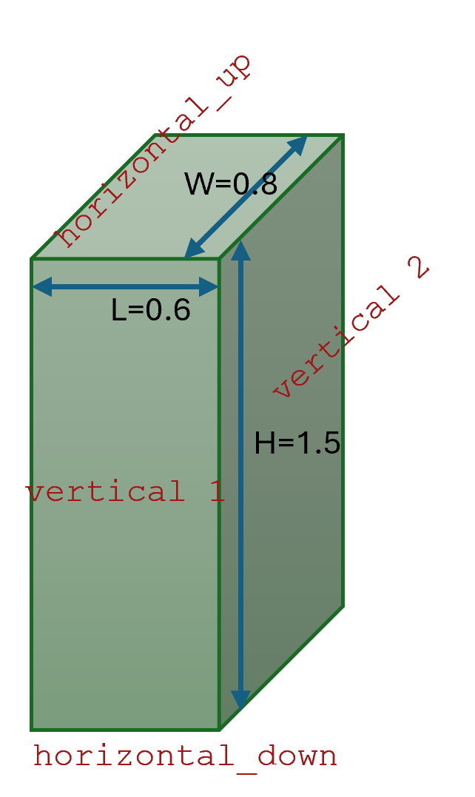

Transfert de Chaleur
====================

L'image ci-dessous montre un exemple de transfert de chaleur à travers un échangeur de chaleur à plaques :



Exemple d'utilisation de la bibliothèque Python pour calculer le transfert de chaleur :

```python
from EnergySystemModels.TransfertChaleur import PlateHeatTransfer

# Température de la paroi en °C
Tp = 60
# Température ambiante en °C
Ta = 25
# Longueur en mètres
L = 0.6
# Largeur en mètres
W = 0.8
# Hauteur en mètres
H = 1.5

# Calcul du transfert de chaleur pour la paroi horizontale supérieure
haut = PlateHeatTransfer.Object(
    orientation='horizontal_up',
    Tp=Tp,  # Température de la paroi en °C
    Ta=Ta,  # Température ambiante en °C
    W=W,    # Largeur en mètres
    L=L     # Longueur en mètres
).calculate()

# Calcul du transfert de chaleur pour la paroi horizontale inférieure
bas = PlateHeatTransfer.Object(
    orientation='horizontal_down',
    Tp=Tp,  # Température de la paroi en °C
    Ta=Ta,  # Température ambiante en °C
    W=W,    # Largeur en mètres
    L=L     # Longueur en mètres
).calculate()

# Calcul du transfert de chaleur pour la première paroi verticale
vertical1 = PlateHeatTransfer.Object(
    orientation='vertical',
    Tp=Tp,  # Température de la paroi en °C
    Ta=Ta,  # Température ambiante en °C
    W=W,    # Largeur en mètres
    H=H     # Hauteur en mètres
).calculate() * 2

# Calcul du transfert de chaleur pour la deuxième paroi verticale
vertical2 = PlateHeatTransfer.Object(
    orientation='vertical',
    Tp=Tp,  # Température de la paroi en °C
    Ta=Ta,  # Température ambiante en °C
    W=L,    # Largeur en mètres
    H=H     # Hauteur en mètres
).calculate() * 2

# Calcul du transfert de chaleur total
total = haut + bas + vertical1 + vertical2
print(total, ':', haut, '+', bas, '+', vertical1, '+', vertical2)