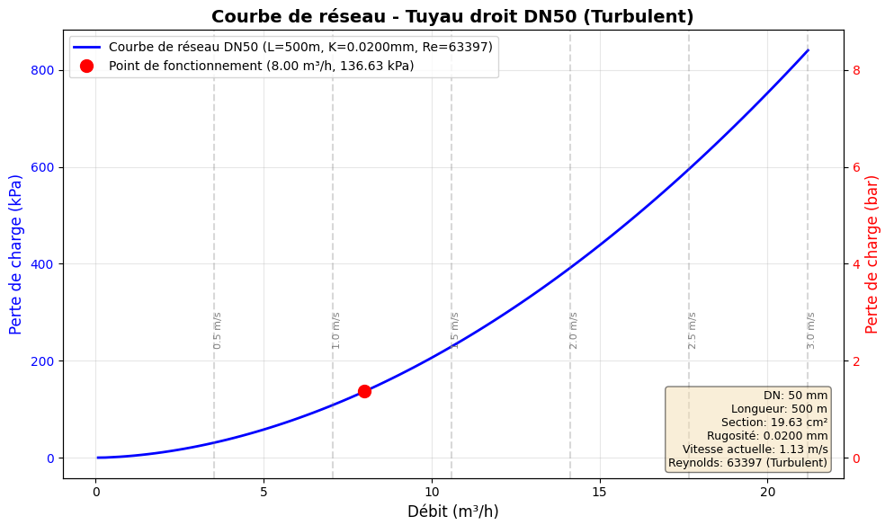
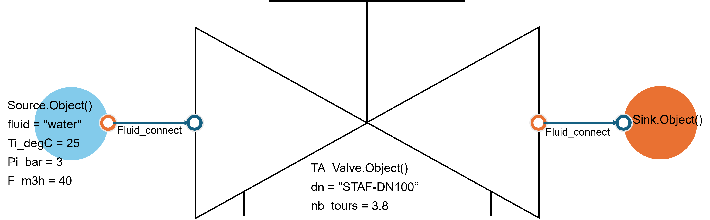
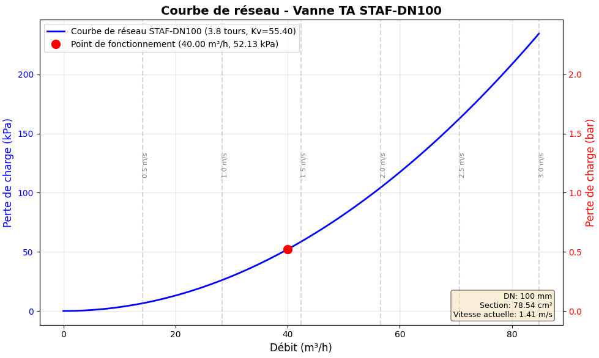

==================
Guide d'utilisation
==================

Ce guide complet présente les fonctionnalités principales d'**EnergySystemModels** avec des exemples détaillés et des illustrations.

.. contents:: Table des matières
   :local:
   :depth: 3

----

.. _installation:

Installation
============

Installation standard
---------------------

Pour utiliser EnergySystemModels, installez-le d'abord via pip :

.. code-block:: console

   pip install energysystemmodels

Installation en environnement virtuel
--------------------------------------

.. code-block:: console

   # Créer un environnement virtuel
   python -m venv .venv
   
   # Activer l'environnement (Windows)
   .venv\Scripts\activate
   
   # Activer l'environnement (Linux/Mac)
   source .venv/bin/activate
   
   # Installer la bibliothèque
   pip install energysystemmodels

Mise à jour
-----------

Pour mettre à jour EnergySystemModels vers la dernière version :

.. code-block:: console

   pip install --upgrade energysystemmodels

----

.. _thermodynamiccycles:

1. Cycles Thermodynamiques
===========================

Le package **ThermodynamicCycles** fournit des composants pour modéliser des cycles thermodynamiques complets : sources, puits, compresseurs, évaporateurs, condenseurs, vannes de détente, pompes, échangeurs de chaleur, etc.

1.1. Source de fluide
----------------------

La classe ``Source`` représente une source de fluide avec des propriétés thermodynamiques définies.

.. code-block:: python
   :linenos:

   from ThermodynamicCycles.Source import Source

   # Créer un objet Source
   SOURCE = Source.Object()
   
   # Données d'entrée
   SOURCE.Ti_degC = 25
   SOURCE.Pi_bar = 1.01325
   SOURCE.fluid = "air"
   SOURCE.F_Sm3h = 3600  # Débit volumique standard [Sm³/h]
   
   # Calculer l'objet
   SOURCE.calculate()
   
   # Affichage des résultats
   print(SOURCE.df)

**Résultats** ::

      F[Sm³/h]  F[kg/s]    T[°C]  P[bar]     h[J/kg]        s[J/(kg·K)]   ρ[kg/m³]
  0   3600.0     1.184     25.0   1.013    298150.0       6870.3          1.184

.. seealso::
   Pour plus de détails, voir :doc:`002-thermodynamic_cycles/fluid_source`

1.2. Puits (Sink)
-----------------

La classe ``Sink`` représente un puits de fluide (sortie du système).

.. code-block:: python
   :linenos:

   from ThermodynamicCycles.Sink import Sink
   from ThermodynamicCycles.Connect import Fluid_connect

   # Créer le puits
   SINK = Sink.Object()
   
   # Connecter au composant précédent
   Fluid_connect(SINK.Inlet, SOURCE.Outlet)
   
   # Calculer
   SINK.calculate()
   print(SINK.df)

.. seealso::
   Pour plus de détails, voir :doc:`002-thermodynamic_cycles/sink`

1.3. Compresseur
----------------

La classe ``Compressor`` modélise un compresseur avec différents modèles (isentropique, volumétrique).

.. code-block:: python
   :linenos:

   from ThermodynamicCycles.Compressor import Compressor
   from ThermodynamicCycles.Connect import Fluid_connect

   # Créer le compresseur
   COMP = Compressor.Object()
   COMP.Po_bar = 8.0  # Pression de sortie [bar]
   COMP.eta_is = 0.75  # Rendement isentropique
   
   # Connecter au composant précédent
   Fluid_connect(COMP.Inlet, SOURCE.Outlet)
   
   # Calculer
   COMP.calculate()
   
   # Résultats
   print(f"Puissance consommée : {COMP.W_kW:.2f} kW")
   print(f"Température de sortie : {COMP.To_degC:.1f} °C")
   print(COMP.df)

.. seealso::
   Pour plus de détails, voir :doc:`002-thermodynamic_cycles/compressor`

----

.. _heattransfer:

2. Transfert de chaleur
========================

Transfert de chaleur convectif et radiatif
-------------------------------------------

L'image ci-dessous montre un exemple de transfert de chaleur convectif et radiatif à travers un échangeur de chaleur à plaques non isolé dont la température de la paroi est de 60°C et la température ambiante est de 25°C :

.. image:: images/PlateHeatTransfer.png
   :alt: Plate Heat Transfer
   :width: 300px
   :align: center

.. code-block:: python
   :linenos:

   from HeatTransfer import PlateHeatTransfer

   # Température de la paroi en °C
   Tp = 60
   # Température ambiante en °C
   Ta = 25
   # Dimensions en mètres
   L = 0.6
   W = 0.8
   H = 1.5

   # Calcul du transfert de chaleur pour la paroi horizontale supérieure
   haut = PlateHeatTransfer.Object(
       orientation='horizontal_up',
       Tp=Tp, Ta=Ta, W=W, L=L
   ).calculate()

   # Calcul du transfert de chaleur pour la paroi horizontale inférieure
   bas = PlateHeatTransfer.Object(
       orientation='horizontal_down',
       Tp=Tp, Ta=Ta, W=W, L=L
   ).calculate()

   # Calcul du transfert de chaleur pour les parois verticales
   vertical1 = PlateHeatTransfer.Object(
       orientation='vertical',
       Tp=Tp, Ta=Ta, W=W, H=H
   ).calculate() * 2

   vertical2 = PlateHeatTransfer.Object(
       orientation='vertical',
       Tp=Tp, Ta=Ta, W=L, H=H
   ).calculate() * 2

   # Calcul du transfert de chaleur total
   total = haut + bas + vertical1 + vertical2
   print(f"{round(total, 0)} W = {round(haut, 0)} W + {round(bas, 0)} W + {round(vertical1, 0)} W + {round(vertical2, 0)} W")

**Résultat** ::

   1957.0 W = 191.0 W + 190.0 W + 900.0 W + 675.0 W

2.1. Mur composite
------------------

Calcul des pertes thermiques à travers un mur composite multicouche :

.. image:: images/001_heat_transfer_composite_wall.png
   :alt: Composite Wall
   :width: 500px
   :align: center

.. code-block:: python
   :linenos:

   from HeatTransfer import CompositeWall

   # Créer un mur composite
   wall = CompositeWall.Object(he=23, hi=8, Ti=20, Te=-10, A=10)
   
   # Calculer le transfert
   wall.calculate()
   
   # Afficher les résultats
   print(f"Résistance totale: {wall.R_total:.3f} m².K/W")
   print(f"Flux thermique: {wall.Q:.2f} W")
   print(wall.df)

.. seealso::
   Pour plus de détails avec illustrations, voir :doc:`001-heat_transfer/composite_wall_heat_transfer`

Deuxième exemple : Cycle thermodynamique
-----------------------------------------

Créer une source de fluide frigorigène :

.. code-block:: python
   :linenos:

   from ThermodynamicCycles.Source import Source

   # Créer un objet Source
   SOURCE = Source.Object()
   
   # Données d'entrée
   SOURCE.Ti_degC = 25
   SOURCE.Pi_bar = 1.01325
   SOURCE.fluid = "air"
   SOURCE.F_Sm3h = 3600  # Débit volumique standard [Sm³/h]
   
   # Calculer l'objet
   SOURCE.calculate()
   
   # Affichage des résultats
   print(SOURCE.df)

Troisième exemple : CTA d'air neuf
-----------------------------------

Simulation complète d'une centrale de traitement d'air :

.. code-block:: python
   :linenos:

   from AHU import FreshAir, HeatingCoil
   from AHU.Humidification import Humidifier
   from AHU.Connect import Air_connect
   from AHU.air_humide import PsychrometricChart

   # Air neuf
   AN = FreshAir.Object()
   AN.F_m3h = 3000
   AN.T = 5
   AN.RH = 80
   AN.calculate()

   # Batterie de chauffage
   BC = HeatingCoil.Object()
   BC.To_target = 20
   Air_connect(BC.Inlet, AN.Outlet)
   BC.calculate()

   # Humidificateur
   HMD = Humidifier.Object()
   HMD.wo_target = 8
   Air_connect(HMD.Inlet, BC.Outlet)
   HMD.HumidType = "vapeur"
   HMD.calculate()

   # Diagramme psychrométrique
   chart = PsychrometricChart.Object(figsize=(12, 4))
   chart.set_title('CTA batterie chaude & Humidificateur vapeur')
   
   custom_points = [
       {'h': BC.Inlet.h, 'w': BC.Inlet.w},
       {'h': BC.Outlet.h, 'w': BC.Outlet.w},
       {'h': HMD.Outlet.h, 'w': HMD.Outlet.w}
   ]
   chart.add_points(custom_points)
   chart.show(draw_arrows=True)

.. seealso::
   Pour plus de détails avec illustrations, voir :doc:`003-ahu_modules/cta_air_neuf`

Quatrième exemple : Analyse Pinch
----------------------------------

Optimisation d'intégration thermique :

.. code-block:: python
   :linenos:

   import pandas as pd
   from PinchAnalysis import PinchAnalysis

   # Définir les flux thermiques
   df = pd.DataFrame({
       'Ti': [200, 125, 50, 45],      # Températures initiales [°C]
       'To': [50, 45, 250, 195],      # Températures finales [°C]
       'mCp': [3.0, 2.5, 2.0, 4.0],   # Débit capacité [kW/K]
       'dTmin2': [5, 5, 5, 5],        # ΔTmin/2 [K]
       'integration': [True, True, True, True]
   })

   # Analyser
   pinch = PinchAnalysis.Object(df)
   
   # Résultats
   print(f"Point Pinch : {pinch.T_pinch}°C")
   print(f"Utilité chaude minimale : {pinch.Qh_min} kW")
   print(f"Utilité froide minimale : {pinch.Qc_min} kW")
   
   # Visualiser
   pinch.plot_composites_curves()
   pinch.plot_GCC()

----

.. _hydraulic:

3. Hydraulique
==============

3.1. Pertes de pression linéaires
----------------------------------

Calcul selon Darcy-Weisbach avec courbe réseau :

.. image:: images/004_hydraulic_straight_pipe.png
   :alt: Straight Pipe
   :width: 500px
   :align: center

.. code-block:: python
   :linenos:

   from Hydraulic import StraightPipe

   # Créer la tuyauterie
   pipe = StraightPipe.Object()
   pipe.L = 100  # Longueur [m]
   pipe.DN = 50  # Diamètre nominal [mm]
   pipe.material = 'Acier'
   pipe.F_m3h = 10  # Débit [m³/h]
   
   # Calculer
   pipe.calculate()
   
   # Résultats
   print(f"Perte de pression : {pipe.dP_Pa:.1f} Pa")
   print(f"Vitesse : {pipe.v:.2f} m/s")
   print(f"Coefficient de friction : {pipe.f:.4f}")
   
   # Tracer la courbe réseau
   pipe.plot_network_curve(F_min=0, F_max=20, points=50)

**Courbe réseau** :

.. seealso::
   Pour plus de détails, voir :doc:`004-hydraulic/perte_pression_lineaire`

3.2. Vannes d'équilibrage IMI TA
---------------------------------

Calcul avec interpolation Kv pour 120+ références :

.. code-block:: python
   :linenos:

   from Hydraulic.TA_Valve import TA_Valve

   # Créer la vanne
   valve = TA_Valve.Object()
   valve.reference = "TA-FUSION-C DN32"
   valve.opening = 3.5  # Tours d'ouverture
   valve.F_m3h = 5  # Débit [m³/h]
   valve.rho = 1000  # Masse volumique [kg/m³]
   
   # Calculer
   valve.calculate()
   
   # Résultats
   print(f"Kv interpolé : {valve.Kv:.2f}")
   print(f"Perte de pression : {valve.dP_kPa:.1f} kPa")
   print(f"Autorité : {valve.authority:.2f}")
   
   # Tracer la courbe réseau
   valve.plot_network_curve()

**Courbe réseau de la vanne** :

.. seealso::
   Pour plus de détails, voir :doc:`004-hydraulic/TA_valve`

----

.. _meteo:

4. Données météorologiques
===========================

4.1. OpenWeatherMap
-------------------

Récupération de données météo en temps réel via API :

.. code-block:: python
   :linenos:

   from OpenWeatherMap.OpenWeatherMap import WeatherData

   # Initialiser avec votre clé API
   weather = WeatherData(api_key="VOTRE_CLE_API")
   
   # Obtenir les données pour une ville
   data = weather.get_current_weather(city="Paris")
   
   print(f"Température : {data['temperature']}°C")
   print(f"Humidité : {data['humidity']}%")
   print(f"Description : {data['description']}")
   print(f"Vitesse du vent : {data['wind_speed']} m/s")
   print(f"Pression : {data['pressure']} hPa")

**Historique météo** :

.. code-block:: python
   :linenos:

   # Données historiques
   hist_data = weather.get_historical_weather(
       city="Paris",
       start_date="2023-01-01",
       end_date="2023-01-31"
   )
   
   # Sauvegarder en DataFrame
   import pandas as pd
   df = pd.DataFrame(hist_data)
   df.to_excel("meteo_historique_paris.xlsx")

.. seealso::
   Pour plus de détails, voir :doc:`008-meteo/openweathermap`

4.2. MeteoCiel
--------------

Scraping de données historiques avec calcul automatique des degrés-jours :

.. code-block:: python
   :linenos:

   from MeteoCiel.MeteoCiel import MeteoCiel_histoScraping
   from datetime import datetime

   # Code station (exemple : Orly 07149001)
   code2 = "07149001"
   
   # Période
   date_debut = datetime(2022, 1, 1)
   date_fin = datetime(2022, 12, 31)
   
   # Scraping avec calcul des DJU
   df_histo, df_day, df_month, df_year = MeteoCiel_histoScraping(
       code2, 
       date_debut, 
       date_fin,
       base_chauffage=18,
       base_refroidissement=23
   )
   
   # Sauvegarder les résultats
   df_histo.to_excel(f"Meteociel_horaire_{date_debut.date()}_to_{date_fin.date()}.xlsx")
   df_day.to_excel(f"Meteociel_journalier_{date_debut.date()}_to_{date_fin.date()}.xlsx")
   df_month.to_excel(f"Meteociel_mensuel_{date_debut.date()}_to_{date_fin.date()}.xlsx")
   df_year.to_excel(f"Meteociel_annuel_{date_debut.date()}_to_{date_fin.date()}.xlsx")
   
   # Afficher les DJU mensuels
   print(df_month[['Mois', 'DJU_chaud', 'DJU_froid', 'T_moy']])

**Résultats** ::

        Mois  DJU_chaud  DJU_froid   T_moy
   0  2022-01     385.2        0.0     5.2
   1  2022-02     320.5        0.0     7.1
   2  2022-03     245.8        0.0    10.5
   ...

.. seealso::
   Pour plus de détails, voir :doc:`008-meteo/meteociel`

----

.. _ipmvp:

5. IPMVP (Mesure et Vérification)
==================================

Protocole International de Mesure et Vérification de la Performance
--------------------------------------------------------------------

L'IPMVP permet de quantifier les économies d'énergie réalisées par des projets d'efficacité énergétique.

.. code-block:: python
   :linenos:

   from IPMVP.IPMVP import Mathematical_Models
   import pandas as pd
   from datetime import datetime

   # Charger les données
   df = pd.read_excel("Input-Data.xlsx")
   df['Timestamp'] = pd.to_datetime(df['Timestamp'])
   df = df.set_index('Timestamp')
   
   # Définir les périodes
   start_baseline_period = datetime(2018, 1, 1)
   end_baseline_period = datetime(2021, 12, 31)
   start_reporting_period = datetime(2022, 1, 1)
   end_reporting_period = datetime(2023, 3, 1)
   
   # Agréger par jour
   df_daily = df.resample('D').sum()
   X = df_daily[["x1", "x2", "x3", "x4", "x5", "x6"]]  # Variables indépendantes
   y = df_daily["y"]  # Consommation d'énergie
   
   # Modèle IPMVP journalier avec régression polynomiale
   day_model = Mathematical_Models(
       y, X,
       start_baseline_period, end_baseline_period,
       start_reporting_period, end_reporting_period,
       degree=3,  # Degré du polynôme
       print_report=True,
       seuil_z_scores=3  # Détection d'outliers
   )
   
   # Résultats
   print(f"Économies d'énergie : {day_model.savings_kWh:.0f} kWh")
   print(f"Économies relatives : {day_model.savings_percent:.1f}%")
   print(f"R² du modèle : {day_model.r2:.3f}")
   print(f"RMSE : {day_model.rmse:.2f}")
   print(f"Incertitude (95%) : {day_model.uncertainty_percent:.1f}%")

**Modèle hebdomadaire** :

.. code-block:: python
   :linenos:

   # Agréger par semaine
   weekly_X = X.resample('W').sum()
   weekly_y = y.resample('W').sum()
   
   week_model = Mathematical_Models(
       weekly_y, weekly_X,
       start_baseline_period, end_baseline_period,
       start_reporting_period, end_reporting_period
   )
   
   print(f"Économies hebdomadaires : {week_model.savings_kWh:.0f} kWh")

**Modèle mensuel** :

.. code-block:: python
   :linenos:

   # Agréger par mois
   monthly_X = X.resample('M').sum()
   monthly_y = y.resample('M').sum()
   
   month_model = Mathematical_Models(
       monthly_y, monthly_X,
       start_baseline_period, end_baseline_period,
       start_reporting_period, end_reporting_period
   )
   
   print(f"Économies mensuelles : {month_model.savings_kWh:.0f} kWh")

.. seealso::
   Pour plus de détails, voir :doc:`007-ipmvp/index`

----

.. _pv:

6. Production solaire photovoltaïque
=====================================

Simulation de production PV avec pvlib
---------------------------------------

.. code-block:: python
   :linenos:

   from PV.ProductionElectriquePV import SolarSystem

   # Créer le système solaire
   system = SolarSystem(
       latitude=48.8566,
       longitude=2.3522,
       location_name='Paris',
       tilt=34,  # Inclinaison [°]
       timezone='Etc/GMT-1',
       azimuth=180.0,  # Orientation plein Sud
       system_capacity=48.9  # Puissance crête [kWp]
   )
   
   # Récupérer les données de modules et onduleurs
   system.retrieve_module_inverter_data()
   
   # Récupérer les données météo (PVGIS ou fichier local)
   system.retrieve_weather_data()
   
   # Calculer les paramètres solaires
   system.calculate_solar_parameters()
   
   # Visualiser la production annuelle
   system.plot_annual_energy()
   
   # Résultats
   print(f"Production annuelle : {system.annual_energy:.0f} kWh")
   print(f"Productible spécifique : {system.specific_yield:.0f} kWh/kWp")
   print(f"Facteur de performance : {system.performance_ratio:.2f}")
   print(f"Taux d'utilisation : {system.capacity_factor:.2f}%")

**Production mensuelle** :

.. code-block:: python
   :linenos:

   # Production par mois
   monthly_production = system.get_monthly_production()
   print(monthly_production)
   
   # Graphique de production mensuelle
   system.plot_monthly_production()

**Production horaire** :

.. code-block:: python
   :linenos:

   # Profil de production horaire pour une journée type
   system.plot_daily_profile(month=6, day=21)  # 21 juin (solstice d'été)

.. seealso::
   Pour plus de détails, voir :doc:`009-pv-solaire/index`

----

.. _turpe:

7. Calcul du TURPE
==================

Tarif d'Utilisation des Réseaux Publics d'Électricité
------------------------------------------------------

Le TURPE couvre les coûts d'acheminement de l'électricité sur les réseaux publics de transport et de distribution.

.. code-block:: python
   :linenos:

   from Facture.TURPE import input_Contrat, TurpeCalculator, input_Facture, input_Tarif

   # Données de facture (période et consommations)
   facture = input_Facture(
       start="2022-09-01",
       end="2022-09-30",
       heures_depassement=0,
       depassement_PS_HPB=64,
       kWh_pointe=0,
       kWh_HPH=0,
       kWh_HCH=0,
       kWh_HPB=26635,  # Heures Pleines Basses
       kWh_HCB=12846   # Heures Creuses Basses
   )
   
   # Données de contrat
   contrat = input_Contrat(
       domaine_tension="BT > 36 kVA",  # Basse Tension
       PS_pointe=129,   # Puissance souscrite Pointe [kVA]
       PS_HPH=129,      # Puissance souscrite HPH [kVA]
       PS_HCH=129,      # Puissance souscrite HCH [kVA]
       PS_HPB=129,      # Puissance souscrite HPB [kVA]
       PS_HCB=250,      # Puissance souscrite HCB [kVA]
       version_utilisation="LU",  # Longue Utilisation
       pourcentage_ENR=100  # % énergies renouvelables
   )
   
   # Données tarifaires (prix de l'énergie)
   tarif = input_Tarif(
       c_euro_kWh_pointe=0.2,
       c_euro_kWh_HPH=0.18,
       c_euro_kWh_HCH=0.12,
       c_euro_kWh_HPB=0.15,
       c_euro_kWh_HCB=0.10
   )
   
   # Calculer le TURPE
   calculator = TurpeCalculator(facture, contrat, tarif)
   results = calculator.calculate()
   
   # Résultats détaillés
   print(f"Composante de gestion annuelle : {results['CG_annuelle']:.2f} €")
   print(f"Composante de comptage annuelle : {results['CC_annuelle']:.2f} €")
   print(f"Composante de soutirage : {results['CS_totale']:.2f} €")
   print(f"Total TURPE mensuel : {results['TURPE_mensuel']:.2f} €")
   print(f"Total TURPE annuel : {results['TURPE_annuel']:.2f} €")

**Calcul pour HTA (Haute Tension)** :

.. code-block:: python
   :linenos:

   # Contrat HTA
   contrat_hta = input_Contrat(
       domaine_tension="HTA",
       PS_pointe=500,
       PS_HPH=500,
       PS_HCH=500,
       PS_HPB=500,
       PS_HCB=800,
       version_utilisation="MU"  # Moyenne Utilisation
   )
   
   calculator_hta = TurpeCalculator(facture, contrat_hta, tarif)
   results_hta = calculator_hta.calculate()

.. seealso::
   Pour plus de détails, voir :doc:`010-achat-energie/index`

----

.. _cee:

8. Certificats d'Économies d'Énergie (CEE)
===========================================

Calcul des CEE pour différentes fiches standardisées
-----------------------------------------------------

Les CEE sont un dispositif qui oblige les fournisseurs d'énergie à réaliser des économies d'énergie.

.. code-block:: python
   :linenos:

   from CEE import CEECertificate

   # Créer un certificat CEE
   cee = CEECertificate()
   
   # Fiche BAT-TH-116 : Isolation de combles ou de toitures
   cee.fiche = "BAT-TH-116"
   cee.surface = 150  # Surface isolée [m²]
   cee.zone_climatique = "H1"  # Zone climatique
   cee.resistance_thermique = 7.0  # Résistance thermique [m².K/W]
   cee.type_batiment = "Maison individuelle"
   
   # Calculer
   cee.calculate()
   
   # Résultats
   print(f"Économies d'énergie : {cee.economie_kWh_an:.0f} kWh/an")
   print(f"Montant CEE : {cee.montant_cee:.0f} kWh cumac")
   print(f"Durée de vie : {cee.duree_vie} ans")
   print(f"Valeur financière estimée : {cee.valeur_euro:.2f} €")

**Fiche BAT-TH-104 : Chaudière à condensation** :

.. code-block:: python
   :linenos:

   cee_chaudiere = CEECertificate()
   cee_chaudiere.fiche = "BAT-TH-104"
   cee_chaudiere.puissance_nominale = 24  # Puissance [kW]
   cee_chaudiere.zone_climatique = "H1"
   cee_chaudiere.type_batiment = "Résidentiel collectif"
   cee_chaudiere.efficacite_energetique_saisonniere = 92  # ETAS [%]
   
   cee_chaudiere.calculate()
   
   print(f"CEE chaudière : {cee_chaudiere.montant_cee:.0f} kWh cumac")

**Fiche IND-UT-117 : Système de variation électronique de vitesse** :

.. code-block:: python
   :linenos:

   cee_variateur = CEECertificate()
   cee_variateur.fiche = "IND-UT-117"
   cee_variateur.puissance_moteur = 15  # Puissance [kW]
   cee_variateur.duree_fonctionnement = 4000  # Heures/an
   cee_variateur.taux_charge_moyen = 75  # %
   
   cee_variateur.calculate()
   
   print(f"CEE variateur : {cee_variateur.montant_cee:.0f} kWh cumac")

**Prix du marché CEE** :

.. code-block:: python
   :linenos:

   # Valorisation financière
   prix_cee_classique = 0.006  # €/kWh cumac (variable selon marché)
   prix_cee_precarite = 0.012  # €/kWh cumac (précarité énergétique)
   
   valorisation_classique = cee.montant_cee * prix_cee_classique
   valorisation_precarite = cee.montant_cee * prix_cee_precarite
   
   print(f"Valorisation classique : {valorisation_classique:.2f} €")
   print(f"Valorisation précarité : {valorisation_precarite:.2f} €")

.. seealso::
   Pour plus de détails, voir :doc:`011-cee/index`

----

Modules détaillés avec illustrations
=====================================

Transfert de chaleur
--------------------

**Articles complets avec schémas et exemples** :

.. toctree::
   :maxdepth: 1

   001-heat_transfer/composite_wall_heat_transfer
   001-heat_transfer/pipe_insulation_analysis
   001-heat_transfer/corps_parallelepipedique

Cycles thermodynamiques
-----------------------

**Articles complets avec diagrammes** :

.. toctree::
   :maxdepth: 1

   002-thermodynamic_cycles/index

Centrales de traitement d'air (CTA)
------------------------------------

**Articles complets avec illustrations** :

.. toctree::
   :maxdepth: 1

   003-ahu_modules/cta_air_neuf
   003-ahu_modules/generic_ahu

Hydraulique
-----------

**Articles complets avec courbes réseaux** :

.. toctree::
   :maxdepth: 1

   004-hydraulic/perte_pression_lineaire
   004-hydraulic/TA_valve

Analyse Pinch
-------------

**Articles complets avec diagrammes** :

.. toctree::
   :maxdepth: 1

   006-pinch_analysis/index

----

Concepts avancés
================

Gestion des erreurs
-------------------

EnergySystemModels gère automatiquement les erreurs de calcul :

.. code-block:: python
   :linenos:

   from HeatTransfer import CompositeWall

   try:
       wall = CompositeWall.Object(he=23, hi=8, Ti=20, Te=-10, A=10)
       wall.add_layer(thickness=0.20, material='Parpaings creux')
       wall.calculate()
   except ValueError as e:
       print(f"Erreur de valeur : {e}")
   except Exception as e:
       print(f"Erreur générale : {e}")

Connexion de composants
------------------------

Pour les systèmes complexes, utilisez les connecteurs :

.. code-block:: python
   :linenos:

   from AHU import FreshAir, HeatingCoil
   from AHU.Connect import Air_connect

   # Composant 1
   FA = FreshAir.Object()
   FA.RH = 50
   FA.T = 20
   FA.F_m3h = 3000
   FA.calculate()
   
   # Composant 2 connecté au premier
   BC = HeatingCoil.Object()
   Air_connect(BC.Inlet, FA.Outlet)  # Connexion
   BC.To_target = 25
   BC.calculate()

.. important::
   La connexion automatique transfère température, humidité, débit et enthalpie

Accès aux résultats
-------------------

**Méthode 1 : Attributs directs**

.. code-block:: python

   print(wall.R_total)  # Résistance totale
   print(wall.Q)        # Flux thermique
   print(wall.layers)   # Liste des couches

**Méthode 2 : DataFrame pandas**

.. code-block:: python

   # Afficher tout
   print(wall.df)
   
   # Accès spécifique
   print(wall.df['Résistance (m².°C/W)'])
   
   # Export Excel
   wall.df.to_excel('resultats.xlsx', index=False)
   
   # Export CSV
   wall.df.to_csv('resultats.csv', index=False)

Visualisation de résultats
---------------------------

**Diagrammes psychrométriques**

.. code-block:: python
   :linenos:

   from AHU.air_humide import PsychrometricChart

   chart = PsychrometricChart.Object(figsize=(12, 8))
   chart.set_title('Évolution de l\'air dans la CTA')
   
   # Ajouter des points
   points = [
       {'h': 15.8, 'w': 4.3},
       {'h': 20.5, 'w': 4.3},
       {'h': 22.1, 'w': 8.0}
   ]
   chart.add_points(points)
   chart.show(draw_arrows=True)

**Courbes de pinch**

.. code-block:: python
   :linenos:

   from PinchAnalysis import PinchAnalysis

   pinch = PinchAnalysis.Object(dataframe)
   
   # Courbes composites
   pinch.plot_composites_curves()
   
   # Grande courbe composite
   pinch.plot_GCC()
   
   # Sauvegarder les figures
   pinch.plot_composites_curves(save_path='courbes_composites.png')

**Courbes hydrauliques**

.. code-block:: python
   :linenos:

   from Hydraulic import StraightPipe

   pipe = StraightPipe.Object()
   pipe.L = 100
   pipe.DN = 50
   pipe.material = 'Acier'
   
   # Générer la courbe réseau
   pipe.plot_network_curve(F_min=0, F_max=10, points=50)

----

Imports et dépendances
======================

Imports principaux
------------------

Voici les imports les plus couramment utilisés :

.. code-block:: python

   # Transfert de chaleur
   from HeatTransfer import CompositeWall, PipeInsulation

   # Cycles thermodynamiques
   from ThermodynamicCycles.Source import Source
   from ThermodynamicCycles.Sink import Sink
   from ThermodynamicCycles.Compressor import Compressor
   from ThermodynamicCycles.HEX import HEX

   # Hydraulique
   from Hydraulic import StraightPipe
   from Hydraulic.TA_Valve import TA_Valve

   # CTA
   from AHU import FreshAir, HeatingCoil, CoolingCoil
   from AHU.Humidification import Humidifier
   from AHU.Connect import Air_connect

   # Analyse énergétique
   from PinchAnalysis import PinchAnalysis
   from IPMVP.IPMVP import IPMVP

   # Données météo
   from OpenWeatherMap.OpenWeatherMap import WeatherData
   from MeteoCiel.MeteoCiel import MeteoCiel
   
   # Production solaire
   from PV import PVSystem
   
   # Facturation
   from Facture import TURPECalculator
   from CEE import CEECertificate

Dépendances
-----------

EnergySystemModels nécessite les bibliothèques suivantes :

.. code-block:: text

   numpy>=1.20.0
   pandas>=1.3.0
   matplotlib>=3.4.0
   CoolProp>=6.4.0
   scipy>=1.7.0

Ces dépendances sont automatiquement installées avec pip.

Configuration
-------------

**Variables d'environnement pour les API météo** :

.. code-block:: bash

   # Windows
   set OPENWEATHERMAP_API_KEY=votre_cle_api
   
   # Linux/Mac
   export OPENWEATHERMAP_API_KEY=votre_cle_api

**Configuration Python** :

.. code-block:: python

   import os
   os.environ['OPENWEATHERMAP_API_KEY'] = 'votre_cle_api'

----

Unités et conventions
=====================

Système d'unités
----------------

Toutes les entrées et sorties utilisent le Système International (SI) avec ces unités par défaut :

.. list-table::
   :widths: 40 30 30
   :header-rows: 1

   * - Grandeur physique
     - Unité
     - Symbole
   * - Température
     - Degré Celsius
     - °C
   * - Pression
     - Bar
     - bar
   * - Débit massique
     - Kilogramme par seconde
     - kg/s
   * - Débit volumique
     - Mètre cube par heure
     - m³/h
   * - Puissance
     - Kilowatt
     - kW
   * - Énergie
     - Kilowatt-heure
     - kWh
   * - Longueur
     - Mètre
     - m
   * - Surface
     - Mètre carré
     - m²
   * - Conductivité thermique
     - Watt par mètre-kelvin
     - W/(m·K)
   * - Résistance thermique
     - Mètre carré-kelvin par watt
     - m²·K/W

.. warning::
   Ne pas mélanger les unités (ex: °C et K, ou bar et Pa) dans les calculs

Conventions de nommage
----------------------

**Attributs des objets** :

- ``T`` ou ``Ti`` : Température en °C
- ``P`` ou ``Pi`` : Pression en bar
- ``F`` : Débit (préciser ``F_kg_s`` ou ``F_m3h``)
- ``RH`` : Humidité relative en %
- ``w`` : Humidité absolue en g/kg_air_sec
- ``h`` : Enthalpie en kJ/kg
- ``Q`` : Puissance thermique en kW
- ``df`` : DataFrame pandas avec tous les résultats

----

Ressources complémentaires
===========================

Documentation complète
----------------------

.. hlist::
   :columns: 2

   * :doc:`quickstart` - Guide de démarrage rapide
   * :doc:`api` - Référence API détaillée
   * :doc:`001-heat_transfer/index` - Transfert de chaleur
   * :doc:`002-thermodynamic_cycles/index` - Cycles thermodynamiques
   * :doc:`003-ahu_modules/index` - Centrales de traitement d'air
   * :doc:`004-hydraulic/index` - Hydraulique
   * :doc:`006-pinch_analysis/index` - Analyse Pinch
   * :doc:`gui_tools` - Outils graphiques

Liens utiles
------------

.. list-table::
   :widths: 30 70
   :header-rows: 1

   * - Ressource
     - Lien
   * - 📚 Documentation en ligne
     - https://energysystemmodels-fr.readthedocs.io/
   * - 💻 Code source
     - https://github.com/ZoheirHADID/EnergySystemModels
   * - 📦 PyPI
     - https://pypi.org/project/energysystemmodels/
   * - 🐛 Issues et support
     - https://github.com/ZoheirHADID/EnergySystemModels/issues
   * - 📖 Handbook PDF
     - https://github.com/ZoheirHADID/EnergySystemModels-handbook

   # Production solaire
   from PV.PV import PVSystem

   # Facturation
   from Facture.TURPE import TURPE
   from CEE.CEE import CEE

Structure des données
---------------------

La plupart des modules retournent des résultats sous forme de :

- **DataFrames pandas** : Pour les séries temporelles et tableaux de résultats
- **Attributs d'objets** : Pour les valeurs individuelles
- **Dictionnaires** : Pour les données structurées

Exemple d'accès aux résultats :

.. code-block:: python

   from ThermodynamicCycles.Source import Source

   source = Source.Object()
   source.Pi_bar = 5.0
   source.fluid = "R134a"
   source.F = 0.5
   source.calculate()

   # Accès via attributs
   print(source.h_outlet)
   print(source.T_outlet)
   
   # Accès via DataFrame
   print(source.df)
   print(source.df['h[J/kg]'])

Gestion des erreurs
-------------------

Les modules EnergySystemModels lèvent des exceptions explicites :

.. code-block:: python

   from ThermodynamicCycles.Source import Source

   try:
       source = Source.Object()
       source.Pi_bar = 5.0
       source.fluid = "FluidInvalide"  # Fluide non supporté
       source.calculate()
   except ValueError as e:
       print(f"Erreur : {e}")
   except Exception as e:
       print(f"Erreur inattendue : {e}")

Dépendances requises
--------------------

EnergySystemModels nécessite les bibliothèques suivantes (installées automatiquement) :

- **CoolProp** : Propriétés thermodynamiques des fluides
- **pandas** : Manipulation de données tabulaires
- **numpy** : Calculs numériques
- **matplotlib** : Visualisations graphiques
- **scipy** : Calculs scientifiques
- **requests** : Requêtes API (pour OpenWeatherMap)
- **pvlib** : Calculs photovoltaïques (optionnel)
- **PyQt5** : Interfaces graphiques (optionnel)

Configuration avancée
---------------------

Pour les utilisateurs avancés, vous pouvez configurer :

**Précision des calculs**

.. code-block:: python

   import numpy as np
   np.set_printoptions(precision=4, suppress=True)

**Options de visualisation**

.. code-block:: python

   import matplotlib.pyplot as plt
   
   plt.rcParams['figure.figsize'] = (12, 6)
   plt.rcParams['font.size'] = 12
   plt.rcParams['axes.grid'] = True

**Gestion des unités**

Les unités par défaut sont :

- Température : °C
- Pression : bar
- Débit massique : kg/s
- Puissance : kW
- Énergie : kWh

Prochaines étapes
-----------------

Consultez les sections suivantes pour des explications détaillées :

- :ref:`heat_transfer` - Calculs de transfert thermique
- :ref:`thermodynamic_cycles` - Modélisation de cycles frigorifiques
- :ref:`ahu_modules` - Simulation de centrales de traitement d'air
- :ref:`pinch_analysis` - Optimisation d'intégration énergétique

Pour la référence complète de l'API, voir :doc:`api`
